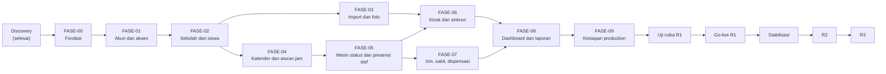

# Spensada

Spensada adalah aplikasi web presensi siswa untuk SMP 1 Dawe, Kudus. Siswa memindai QR code di kartu OSIS (berisi NISN) ke webcam laptop yang menjadi stasiun scan. Stasiun bekerja *local-first*: setiap scan langsung mendapat umpan balik, lalu data dikirim ke server secara otomatis. Dari data scan, sistem menentukan status kehadiran harian dan menyajikan dashboard, rekap, dan riwayat.

**Status saat ini:** dokumen discovery (`docs/00`–`docs/15`) selesai. Kode aplikasi belum dibuat; tahap berikutnya adalah FASE-00 (Fondasi). Progres terbaru ada di [`.claude/memory/progress.md`](.claude/memory/progress.md).

## Dokumen

Spesifikasi lengkap ada di [`docs/`](docs/) dan menjadi acuan utama. Mulai dari [`docs/00-project-overview.md`](docs/00-project-overview.md).

| Dokumen | Isi |
|---|---|
| [00](docs/00-project-overview.md) | Ringkasan proyek, ruang lingkup, glosarium, aturan untuk AI implementer (§11) |
| [01](docs/01-product-requirements.md) | Kebutuhan produk dan kriteria keberhasilan |
| [02](docs/02-user-roles-and-permissions.md) | Role dan hak akses |
| [03](docs/03-user-flow.md) | Alur pengguna |
| [04](docs/04-feature-specification.md) | Spesifikasi fitur (`FS-*`) dan acceptance criteria (`AC-*`) |
| [05](docs/05-business-rules.md) | Aturan bisnis |
| [06](docs/06-database-design.md) | Desain database |
| [07](docs/07-system-architecture.md) | Arsitektur, panduan lokal (§15), langkah production (§16) |
| [08](docs/08-ui-ux-design-system.md) | Desain UI/UX ([contoh tampilan](docs/08-contoh-tampilan.html)) |
| [09](docs/09-page-and-route-specification.md) | Halaman dan route |
| [10](docs/10-api-specification.md) | API |
| [11](docs/11-validation-and-error-handling.md) | Validasi dan penanganan galat |
| [12](docs/12-security.md) | Keamanan |
| [13](docs/13-reporting-import-export.md) | Laporan, import, export |
| [14](docs/14-development-roadmap.md) | Roadmap: fase, uji coba, go-live, R2/R3 |
| [15](docs/15-implementation-phases.md) | Langkah implementasi per fase (`L<NN>-<MM>`) |

## Teknologi

CodeIgniter 4.7 (PHP 8.3+), MySQL 8.4, Bootstrap 5.3 (disajikan lokal, tanpa CDN), JavaScript tanpa framework, PhpSpreadsheet, dan mPDF. Lingkungan lokal dan production: Windows + Laragon + Nginx. Zona waktu `Asia/Jakarta` (WIB).

## Tahapan implementasi dari awal sampai akhir

Pembangunan dibagi menjadi tiga rilis (`docs/00` §6.1):

- **R1 — Presensi inti:** master data, import dan foto, login per role, kiosk local-first, kalender dan aturan jam, presensi manual, koreksi, mode darurat, izin, Alpa otomatis, dashboard, rekap, dan riwayat.
- **R2 — Komunikasi dan laporan:** notifikasi WhatsApp, export rekap (XLSX, CSV, PDF), flyer kehadiran.
- **R3 — Pelengkap:** jadwal pelajaran, pengumuman, halaman publik, cetak kartu siswa baru.

R1 dikerjakan dalam 10 fase berurutan, lalu uji coba dan go-live. Perkiraan total sekitar 17–27 minggu sejak FASE-00 sampai hari H (`docs/14` §5).

| # | Tahap | Isi singkat | Perkiraan | Status |
|---|---|---|---|---|
| 0 | Discovery | Dokumen `docs/00`–`docs/15` | — | Selesai |
| 1 | FASE-00 Fondasi | Composer appstarter, konfigurasi, filter, tampilan dasar, alat uji | 1–2 minggu | Berikutnya |
| 2 | FASE-01 Akun dan akses | Login, password, akun staf, log aktivitas, pemeriksaan sistem, prototipe kiosk | 1–2 minggu | Belum mulai |
| 3 | FASE-02 Sekolah dan siswa | Identitas sekolah, tahun ajaran, kelas, siswa, penempatan, atribut, akun siswa | 2–3 minggu | Belum mulai |
| 4 | FASE-03 Import dan foto | Import siswa, import penempatan, foto | 1–2 minggu | Belum mulai |
| 5 | FASE-04 Kalender dan aturan jam | Pola mingguan, jadwal khusus, libur, batas mundur | 1–2 minggu | Belum mulai |
| 6 | FASE-05 Mesin status dan presensi staf | Status harian, hitung ulang, presensi manual, koreksi, mode darurat | 2–3 minggu | Belum mulai |
| 7 | FASE-06 Kiosk dan sinkron | Akun stasiun, kiosk offline, sinkron, status stasiun, scan bertanda | 3–4 minggu | Belum mulai |
| 8 | FASE-07 Izin, sakit, dan dispensasi | Pengajuan, input, verifikasi, ubah keputusan, dispensasi massal | 2 minggu | Belum mulai |
| 9 | FASE-08 Dashboard dan laporan | Dashboard hari ini, daftar presensi kelas, rekap, riwayat | 1–2 minggu | Belum mulai |
| 10 | FASE-09 Kesiapan production | Uji keamanan, uji beban, panduan pengguna, server Windows | 1–2 minggu | Belum mulai |
| 11 | Uji coba R1 | Uji teknis di server production dengan data buatan | 1–2 minggu | Belum mulai |
| 12 | Go-live R1 | Pembangunan ulang database, data asli, hari H | ±1 minggu | Belum mulai |
| 13 | Stabilisasi | Dua minggu pertama setelah hari H | 2 minggu | Belum mulai |
| 14 | R2 dan R3 | Komunikasi, laporan, dan fitur pelengkap | Ditentukan nanti | Belum mulai |

Rincian setiap langkah (file utama, uji, dan syarat selesai) ada di [`docs/15`](docs/15-implementation-phases.md). Uji coba, go-live, dan R2/R3 ada di [`docs/14`](docs/14-development-roadmap.md) §11–§14.

### FASE-00 — Fondasi

Branch `fase-00-fondasi`. Tidak ada masukan yang ditunggu.

- L00-01 Pindah ke Composer appstarter; `LICENSE` diganti MIT atas nama Arumi Studios
- L00-02 Konfigurasi dasar: zona waktu, database, sesi, cookie, CSRF, route per area
- L00-03 Service dasar: `Jam`, kunci bernama, pola transaksi
- L00-04 Filter dan hak akses (`area`, `hak`, `csrf`, `keamanan`, peta `HakAkses`)
- L00-05 Halaman galat, log aplikasi, dan bahasa validasi
- L00-06 Aset dan tampilan dasar: Bootstrap, font, ikon, layout, komponen, modul format JavaScript
- L00-07 Tabel `pengaturan`, seeder, dan perintah `aplikasi:cek`
- L00-08 Alat uji: PHPUnit, `node --test`, uji akses route
- L00-09 Panduan lokal dicoba ulang di Laragon

**Selesai bila** `https://spensada.test/login` tampil, `php spark aplikasi:cek` lulus, dan `composer test` serta `node --test` berjalan.

### FASE-01 — Akun dan akses

Branch `fase-01-akun-akses`. Masukan: contoh kartu OSIS dan satu laptop stasiun (dengan webcam dan scanner USB bila ada).

- L01-01 Migration akun, role, log aktivitas, percobaan login
- L01-02 Login dan logout dengan pembatasan percobaan
- L01-03 Ganti password
- L01-04 Perintah `admin:pertama` dan `admin:pulihkan`
- L01-05 Akun staf
- L01-06 Log aktivitas
- L01-07 Pemeriksaan sistem
- L01-08 Kerangka panel: menu sesuai hak dan halaman sementara `/panel`
- L01-09 Prototipe kiosk di branch sementara (tidak digabung)

**Selesai bila** admin pertama dapat dibuat lewat CLI, login berjalan, akun staf dapat dikelola, dan hasil prototipe kiosk tercatat.

### FASE-02 — Sekolah dan siswa

Branch `fase-02-sekolah-siswa`.

- L02-01 Migration master data
- L02-02 Berkas dan identitas sekolah
- L02-03 Tahun ajaran dan semester
- L02-04 Kelas dan wali kelas
- L02-05 Atribut tambahan
- L02-06 Data siswa
- L02-07 Penempatan kelas
- L02-08 Log data siswa
- L02-09 Akun siswa dan slip akun

**Selesai bila** admin dapat menyiapkan satu tahun ajaran lengkap (kelas, wali kelas, siswa) dan mencetak slip akun, lalu siswa dapat login ke portal.

### FASE-03 — Import dan foto

Branch `fase-03-import-foto`.

- L03-01 PhpSpreadsheet dan file sementara
- L03-02 Import siswa
- L03-03 Import penempatan
- L03-04 Foto satu per satu
- L03-05 Foto massal
- L03-06 Uji volume

**Selesai bila** import 1.000 siswa fiktif beserta foto massalnya berhasil, dengan laporan baris gagal.

### FASE-04 — Kalender dan aturan jam

Branch `fase-04-kalender`.

- L04-01 Migration kalender, log presensi, dan antrean hitung ulang
- L04-02 Log dan antrean disambungkan ke perubahan data
- L04-03 Service `AturanJam` dan `Kalender`
- L04-04 Pola mingguan
- L04-05 Jadwal khusus
- L04-06 Libur
- L04-07 Batas mundur

**Selesai bila** aturan jam dan hari sekolah setiap siswa dapat dihitung untuk tanggal mana pun, dan setiap perubahan kalender menulis antrean dan log.

### FASE-05 — Mesin status dan presensi staf

Branch `fase-05-status-presensi`.

- L05-01 Migration status harian, presensi, scan, dan izin
- L05-02 `PenentuStatus`
- L05-03 `HitungUlang`, pemrosesan antrean, dan `PembacaStatus`
- L05-04 Perintah CLI: `status:bangun`, `status:mulai`, tugas terjadwal
- L05-05 Data contoh
- L05-06 Presensi manual
- L05-07 Koreksi status
- L05-08 Jadwal hari ini
- L05-09 Mode darurat
- L05-10 Presensi per kelas saat darurat
- L05-11 Log perubahan presensi
- L05-12 Pemeriksaan sistem lengkap

**Selesai bila** kasus uji penentuan status lulus, hitung ulang berjalan untuk semua pemicu, dan `status:bangun --periksa` tidak menemukan perbedaan.

### FASE-06 — Kiosk dan sinkron

Branch `fase-06-kiosk`.

- L06-01 Akun stasiun dan PIN petugas
- L06-02 API data kiosk
- L06-03 Kerangka kiosk (Service Worker, IndexedDB)
- L06-04 `aturan.js` dan `jam.js`
- L06-05 Scan dan umpan balik, bagian input
- L06-06 Scan dan umpan balik, bagian layar
- L06-07 Penerimaan sinkron di server
- L06-08 Sinkron dari kiosk
- L06-09 Status stasiun
- L06-10 Tinjauan scan bertanda
- L06-11 Uji manual kiosk

**Selesai bila** kiosk tetap mencatat saat offline dan sinkron tanpa scan hilang atau ganda (AC-01, AC-02 di `docs/01` §7), diuji di laptop sekolah.

### FASE-07 — Izin, sakit, dan dispensasi

Branch `fase-07-izin`.

- L07-01 Service izin
- L07-02 Input izin oleh staf
- L07-03 Daftar izin dan detail dengan verifikasi
- L07-04 Izin di portal siswa
- L07-05 Pengajuan menunggu
- L07-06 Ubah keputusan
- L07-07 Dispensasi massal
- L07-08 Uji ulang

**Selesai bila** izin yang disetujui atau diubah keputusannya langsung tercermin di status harian.

### FASE-08 — Dashboard dan laporan

Branch `fase-08-dashboard-laporan`.

- L08-01 Dashboard hari ini
- L08-02 Siswa per status
- L08-03 Kelas saya
- L08-04 Daftar presensi kelas
- L08-05 Rekap per kelas
- L08-06 Riwayat siswa
- L08-07 Riwayat di portal siswa
- L08-08 Uji ulang dan peragaan

**Selesai bila** semua fitur R1 memenuhi definisi selesai dan kriteria keberhasilan v1 (`docs/01` §6) dapat diperagakan di Laragon dengan data contoh.

### FASE-09 — Kesiapan production

Branch `fase-09-production`. Masukan: server Windows, nama domain, dan jawaban OQ-20 (lokasi server, klien ACME, cara menjalankan layanan).

- L09-01 Uji keamanan menyeluruh
- L09-02 Uji beban lokal
- L09-03 Panduan pengguna
- L09-04 Skrip production Windows (`deploy/windows/`)
- L09-05 Penyiapan server

**Selesai bila** production terpasang dengan `CI_ENVIRONMENT = production`, `aplikasi:cek` lulus di server, dan belum ada data asli.

### Uji coba R1

Uji teknis di server production dengan data buatan (1.000 siswa fiktif, sekitar 50 kartu uji), sebelum data asli diisi (`docs/14` §11):

- UC-01 Pemeriksaan server
- UC-02 Penyiapan dengan data uji
- UC-03 Pemasangan stasiun
- UC-04 Kiosk di gerbang
- UC-05 Kecepatan antrean
- UC-06 Gangguan jaringan dan restart laptop
- UC-07 Uji beban singkat
- UC-08 Satu hari penuh
- UC-09 Pemulihan backup
- UC-10 Daftar periksa keamanan
- UC-11 Gladi mode darurat
- UC-12 Rilis ulang

**Lulus bila** semua butir lulus, masukan sekolah lengkap, dan kepala sekolah menyetujui hari H.

### Go-live R1

Urutan dari pembangunan ulang database sampai hari H (`docs/14` §12):

- GL-01 Pembangunan ulang database dari tag `r1.0.0`
- GL-02 Tag go-live dicatat
- GL-03 Admin sekolah login dan mengisi identitas sekolah
- GL-04 Backup diperiksa ulang
- GL-05 Akun staf (H−7 s.d. H−3)
- GL-06 Kalender (H−7 s.d. H−3)
- GL-07 Kelas, siswa, dan foto (H−7 s.d. H−3)
- GL-08 Awal status dengan `php spark status:mulai --tanggal=<H>`
- GL-09 Slip akun dibagikan wali kelas
- GL-10 Stasiun dipasang di gerbang
- GL-11 Gladi bersih
- GL-12 Pelatihan (H−5 s.d. H−1)
- GL-13 Pengumuman ke siswa dan orang tua/wali (H−5 s.d. H−1)
- GL-14 Hari H dan pemeriksaan harian (H s.d. H+13)

### Setelah go-live

- **Stabilisasi** dua minggu: perbaikan penting dipasang sebagai `r1.0.<n>`.
- **Ukuran keberhasilan** diperiksa dengan data nyata, lalu menjadi dasar memulai R2.
- **Rutin:** uji pemulihan backup setiap semester, `composer audit` sebelum setiap rilis.

### R2 dan R3

Rincian fitur ditulis menjelang rilisnya, lalu dibagi menjadi fase dengan pola yang sama (`docs/14` §14). Go-live R2 dan R3 tidak membangun ulang database.

- **R2** (setelah stabilisasi R1): export rekap dan rekap rapor, lalu flyer kehadiran, lalu notifikasi WhatsApp.
- **R3** (setelah R2): halaman publik dan pengumuman, jadwal pelajaran, lalu cetak kartu.

## Persiapan sekolah

Berjalan sejajar dengan fase implementasi (`docs/14` §4 dan §10):

| Kapan | Yang disiapkan sekolah |
|---|---|
| FASE-01 | Contoh kartu OSIS, contoh data siswa, contoh foto, satu laptop stasiun |
| Mulai FASE-03 | Data siswa dirapikan ke template import; foto dengan nama file diawali NISN |
| Sebelum uji coba | Jumlah stasiun dan perangkatnya (OQ-08), kebijakan data dan pemberitahuan privasi (OQ-18), tempat backup dan dua pemegang kunci (OQ-19) |
| Sebelum hari H | Daftar akun staf, wali kelas, kalender sampai akhir semester, pelatihan, pengumuman |

## Cara kerja setiap fase

- Satu fase = satu branch `fase-<NN>-<slug>` dari `main` terbaru, dengan commit kecil per langkah berformat `type(scope): ringkasan`.
- Setiap commit meninggalkan `composer test` dan `node --test "tests/js/**/*.test.js"` lulus.
- Akhir fase: laporan fase diisi (`docs/15` §12), PR berjudul `FASE-<NN> <nama fase>` dibuka, lalu setelah digabung `main` diberi tag `r1-fase-<NN>`.
- Aturan lengkap untuk implementer ada di [`CLAUDE.md`](CLAUDE.md) dan [`.claude/memory/`](.claude/memory/).

## Menjalankan di lokal

Panduan lengkap ada di [`docs/07` §15](docs/07-system-architecture.md#15-panduan-lokal-windows-laragon-nginx) (Windows, Laragon, Nginx) dan berlaku setelah FASE-00 L00-01 (Composer appstarter). Ringkasnya:

1. Clone ke `C:\laragon\www\spensada`, aktifkan SSL Nginx di Laragon, lalu percayai sertifikatnya.
2. `composer install`, salin `env` menjadi `.env`, lalu isi `app.baseURL`, koneksi database, dan kunci enkripsi (`php spark key:generate`).
3. Buat database `spensada` dan `spensada_test` (`utf8mb4`).
4. `php spark migrate`, `php spark db:seed PengaturanAwal`, `php spark admin:pertama`, lalu `php spark aplikasi:cek`.
5. Buka `https://spensada.test/login`.

Uji: `composer test` dan `node --test "tests/js/**/*.test.js"`.

## Lisensi

MIT, hak cipta Arumi Studios (`docs/07` §2.7). Teks lengkapnya ada di [`LICENSE`](LICENSE). Lisensi framework dan library tetap mengikuti paketnya masing-masing di `vendor/` dan `public/aset/vendor/`.
