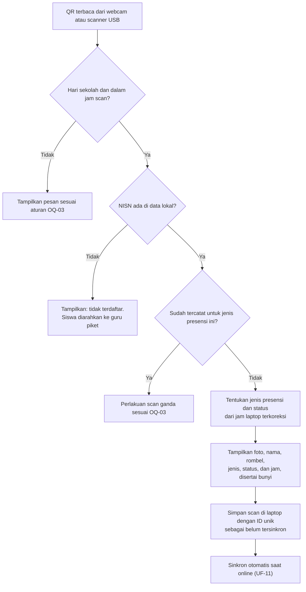
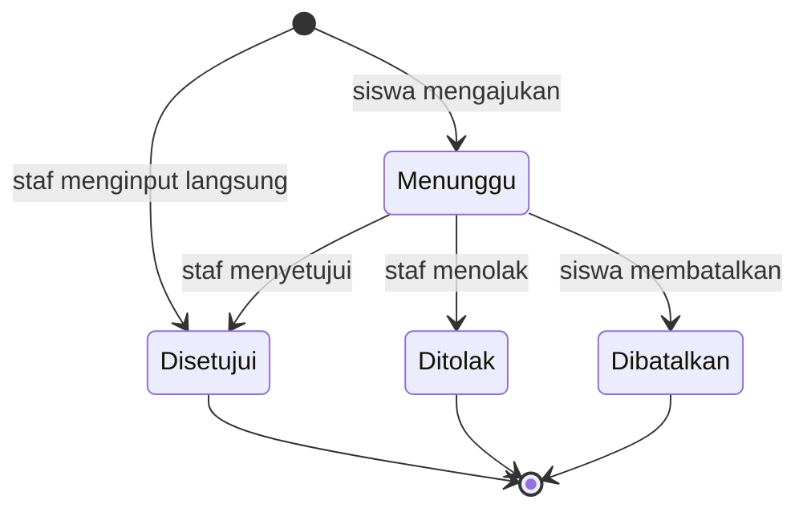

# Spensada — User Flow

| Item | Nilai |
|---|---|
| Versi | 0.1 (draft, menunggu review) |
| Tanggal | 2026-10-03 |
| Sumber | Discovery Session 3 (User Roles & User Flow) |
| Bergantung pada | [00-project-overview.md](00-project-overview.md), [01-product-requirements.md](01-product-requirements.md), [02-user-roles-and-permissions.md](02-user-roles-and-permissions.md) |

## 1. Cara membaca dokumen ini

- **ID.** Setiap alur memakai ID `UF-<NN>`. Pengecualian di dalam satu alur memakai `E<n>`. ID tidak pernah dinomori ulang.
- **Isi alur.** Setiap alur berisi aktor, prasyarat, rujukan, alur utama, pengecualian, dan hasil.
- **Rujukan.** Requirement dirujuk dengan ID `FR-*`/`NFR-*` dari `01`. Hak akses dirujuk dengan ID `HA-*` dari `02`. Pengguna hanya dapat menjalankan langkah yang sesuai hak dan cakupannya.
- **Status.** Label status mengikuti `00`. Bila sebuah langkah bergantung pada aturan yang belum diputuskan, langkah itu menyebut OQ-nya. Contohnya jam masuk (OQ-03) dan cara menutup sesi (OQ-07). Aturan tersebut ditetapkan di Session 4 (`05-business-rules.md`).
- **Tingkat rincian.** Dokumen ini menjelaskan urutan kerja dan keputusan pengguna. Tampilan layar ditetapkan di Session 7, dan route di Session 8.

## 2. Daftar alur

| ID | Alur | Aktor utama | Rilis |
|---|---|---|---|
| UF-01 | Penyiapan awal sistem | Admin | R1 |
| UF-02 | Import siswa | Admin | R1 |
| UF-03 | Foto siswa | Admin, wali kelas | R1 |
| UF-04 | Akun staf dan role | Admin | R1 |
| UF-05 | Pembagian akun siswa (slip akun) | Wali kelas, admin | R1 |
| UF-06 | Pemasangan dan pencabutan stasiun scan | Admin | R1 |
| UF-07 | Siswa baru, pindah rombel, atau keluar di tengah tahun | Admin, wali kelas | R1 |
| UF-08 | Pergantian tahun ajaran dan kenaikan kelas | Admin | R1 |
| UF-09 | Persiapan stasiun scan di pagi hari | Petugas | R1 |
| UF-10 | Scan masuk | Siswa, petugas | R1 |
| UF-11 | Sinkron dan gangguan koneksi | Akun stasiun, petugas | R1 |
| UF-12 | Presensi manual | Guru piket, wali kelas, guru BK, admin | R1 |
| UF-13 | Menutup sesi masuk | Guru piket, admin, sistem | R1 |
| UF-14 | Scan pulang dan menutup sesi pulang | Siswa, petugas, guru piket | R1 |
| UF-15 | Pantau dashboard hari ini | Semua akun staf | R1 |
| UF-16 | Koreksi status presensi | Guru piket, wali kelas, guru BK, admin | R1 |
| UF-17 | Pengajuan izin/sakit oleh siswa | Siswa | R1 |
| UF-18 | Verifikasi pengajuan izin/sakit | Wali kelas, guru piket, guru BK, admin | R1 |
| UF-19 | Input izin/sakit oleh staf | Wali kelas, guru piket, guru BK, admin | R1 |
| UF-20 | Login pertama dan ganti password | Staf, siswa | R1 |
| UF-21 | Lupa password | Staf, siswa, wali kelas, admin | R1 |
| UF-22 | Rekap rombel dan riwayat siswa | Staf sesuai cakupan, siswa | R1 (export R2) |
| UF-23 | Notifikasi WhatsApp | Sistem, admin | R2 |
| UF-24 | Flyer kehadiran | Staf sesuai hak | R2 |
| UF-25 | Pengumuman dan halaman publik | Admin, siswa, publik | R3 |
| UF-26 | Cetak kartu | Admin | R3 |

## 3. Garis waktu satu hari sekolah

Jam setiap tahap mengikuti aturan jam (OQ-03), dan cara menutup sesi mengikuti OQ-07.

| Tahap | Yang terjadi | Pelaku | Alur |
|---|---|---|---|
| Sebelum sesi masuk | Laptop dinyalakan; kiosk memuat data terbaru dan menyesuaikan jam | Petugas | UF-09 |
| Sesi masuk | Siswa scan masuk; kiosk menampilkan hasil dan menyinkronkan data | Siswa, petugas | UF-10, UF-11 |
| Sesi masuk | Siswa yang lupa kartu atau kartunya rusak dicatat manual | Guru piket | UF-12 |
| Lewat batas terlambat | Scan masuk berstatus Terlambat | Sistem | UF-10 |
| Tutup sesi masuk | Siswa yang belum hadir menjadi Alpa | Guru piket atau sistem | UF-13 |
| Jam pelajaran | Pengajuan, input, dan verifikasi izin/sakit; koreksi; pantauan | Siswa, staf | UF-15 s.d. UF-19 |
| Sesi pulang | Siswa scan pulang | Siswa, petugas | UF-14 |
| Tutup sesi pulang | Siswa tanpa scan pulang tercatat "tidak scan pulang" | Guru piket atau sistem | UF-14 |
| Akhir hari | Petugas memastikan semua stasiun tersinkron, lalu laptop dimatikan | Petugas | UF-11 |

## 4. Penyiapan dan administrasi

### UF-01 — Penyiapan awal sistem

- **Aktor:** admin.
- **Prasyarat:** aplikasi terpasang dan akun admin pertama tersedia (Session 6).
- **Rujukan:** FR-MD-01 s.d. FR-MD-08, FR-PRS-02, FR-PRS-03, FR-AKN-02, FR-AKN-03.

Alur utama:

1. Admin mengisi identitas sekolah: nama resmi, alamat, dan logo (`HA-MD-09`).
2. Admin membuat tahun ajaran beserta semesternya, lalu menandainya sebagai aktif (`HA-MD-01`).
3. Admin mengatur aturan jam (OQ-03) dan kalender sekolah (`HA-PRS-01`, `HA-PRS-02`).
4. Admin membuat rombel untuk tahun ajaran aktif (`HA-MD-02`).
5. Admin membuat akun staf untuk semua guru dan staf, lalu memberi role (UF-04).
6. Admin menetapkan wali kelas setiap rombel (`HA-MD-02`).
7. Admin mengimpor siswa (UF-02). Akun siswa terbentuk otomatis.
8. Admin mengunggah foto siswa secara massal (UF-03).
9. Admin membuat akun stasiun dan memasang laptop stasiun scan (UF-06).
10. Wali kelas mencetak dan membagikan slip akun siswa (UF-05).
11. Sekolah melakukan uji coba scan sebelum dipakai penuh. Rencana uji coba ditetapkan di Session 10.

Hasil: sistem siap dipakai untuk presensi harian.

Catatan: rombel dibuat sebelum import. Import mencocokkan nama rombel di file dengan rombel yang sudah ada, dan baris dengan rombel yang tidak dikenal dinyatakan gagal. (RECOMMENDATION)

### UF-02 — Import siswa

- **Aktor:** admin.
- **Prasyarat:** tahun ajaran aktif dan rombelnya sudah ada.
- **Rujukan:** FR-MD-05, FR-AKN-05, `HA-MD-04`, R-12. Format kolom ditetapkan di Session 5 (`13-reporting-import-export.md`).

Alur utama:

1. Admin mengunduh template file import (RECOMMENDATION), lalu mengisinya.
2. Admin mengunggah file .xlsx atau .csv.
3. Sistem memvalidasi setiap baris:
   - NISN 10 digit dan dibaca sebagai teks;
   - NISN tidak ganda, baik di dalam file maupun dengan data yang sudah ada;
   - kolom wajib terisi;
   - rombel dikenal;
   - format nomor WA benar.
4. Sistem menampilkan pratinjau: jumlah baris valid, dan baris gagal beserta alasannya. Daftar baris gagal dapat diunduh.
5. Admin mengonfirmasi. Sistem menyimpan baris valid dan membuat akun siswa dengan status belum aktif.
6. Sistem menampilkan ringkasan hasil.

Pengecualian:

- **E1** — Semua baris gagal: tidak ada data yang disimpan, dan admin memperbaiki file lalu mengunggah ulang.
- **E2** — NISN sudah ada di database: perlakuannya (lewati atau perbarui data) ditetapkan di Session 5.

Hasil: data siswa dan akun siswa tersedia. Kiosk mendapat data baru saat memuat ulang data (UF-09).

### UF-03 — Foto siswa

- **Aktor:** admin; wali kelas untuk rombelnya.
- **Rujukan:** FR-MD-06, FR-MD-07, FR-MD-09, `HA-MD-07`, `HA-MD-08`.

Alur satu per satu:

1. Admin atau wali kelas membuka data siswa, lalu mengunggah atau mengganti foto.
2. Sistem memperkecil ukuran foto, lalu menyimpannya.
3. Sistem mencatat penggantian foto: siapa dan kapan (FR-MD-09).

Alur massal (admin):

1. Admin mengunggah banyak file foto sekaligus.
2. Sistem mencocokkan nama file dengan NISN. Format nama file mengikuti OQ-12.
3. Sistem melaporkan file yang cocok dan file yang tidak cocok.
4. Sistem memperkecil dan menyimpan foto yang cocok.

Hasil: kiosk menampilkan foto baru setelah memuat ulang data (UF-09).

### UF-04 — Akun staf dan role

- **Aktor:** admin.
- **Rujukan:** FR-AKN-02, FR-AKN-06, FR-AKN-08, `HA-AKN-02`, `02` §7.1.

Alur utama:

1. Admin menambah akun staf: nama, username, dan role.
   - Role yang dapat dipilih: Admin, Guru piket, Guru BK, Pimpinan.
   - Role Staf melekat otomatis.
   - Role Wali kelas tidak dipilih di sini, tetapi berasal dari penetapan wali kelas di menu rombel.
2. Sistem membuat password awal acak dan menampilkannya sekali.
3. Admin menyerahkan password awal ke staf yang bersangkutan.
4. Staf login pertama kali dan wajib mengganti password (UF-20).

Pengecualian:

- **E1** — Username sudah dipakai, atau hanya berisi angka: sistem menolak (`02` §2 butir 4).
- **E2** — Staf berhenti: admin menonaktifkan akunnya. Nama staf tetap tampil di log.
- **E3** — Admin mencoba mencabut role admin terakhir yang aktif: sistem menolak (`02` §4 butir 6).

### UF-05 — Pembagian akun siswa (slip akun)

- **Aktor:** wali kelas untuk rombelnya; admin untuk semua rombel.
- **Prasyarat:** siswa sudah ada di rombel.
- **Rujukan:** FR-AKN-05, FR-AKN-06, `HA-AKN-05`, `HA-AKN-06`, `02` §7.2.
- **Status:** DECISION (slip per rombel); RECOMMENDATION (mekanisme).

Alur utama:

1. Wali kelas membuka daftar akun siswa di rombelnya. Daftar itu menampilkan status setiap akun: belum aktif, aktif, atau nonaktif.
2. Wali kelas memilih "cetak slip akun". Sistem memberi peringatan bahwa slip lama untuk akun yang belum aktif tidak akan berlaku lagi.
3. Wali kelas mengonfirmasi. Sistem lalu:
   - membuat password acak untuk setiap akun belum aktif;
   - menampilkan halaman slip siap cetak, beberapa slip per halaman A4.
4. Wali kelas mencetak halaman slip lewat browser, lalu membagikan slip ke siswa di kelas.
5. Siswa login pertama kali dan mengganti password (UF-20). Status akunnya berubah menjadi aktif.
6. Wali kelas memantau siswa yang belum aktif dan mengulangi langkah 2–4 untuk mereka.

Pengecualian:

- **E1** — Slip hilang sebelum dipakai: wali kelas mencetak ulang. Password lama otomatis tidak berlaku.

Catatan: sistem tidak menyimpan slip. Slip yang sudah dicetak adalah tanggung jawab wali kelas sampai dibagikan.

### UF-06 — Pemasangan dan pencabutan stasiun scan

- **Aktor:** admin.
- **Rujukan:** FR-AKN-03, FR-KIO-01, FR-KIO-12, `HA-AKN-03`, `HA-KIO-02`, R-01, R-05, R-07.

Alur pemasangan:

1. Admin membuat akun stasiun, misalnya "Gerbang 1".
2. Admin menyiapkan laptop:
   - akun Windows non-admin (R-05);
   - profil browser khusus kiosk (R-07).
3. Admin membuka alamat kiosk lewat HTTPS (R-01), lalu login dengan akun stasiun.
4. Admin mengizinkan akses kamera dan penyimpanan permanen di browser (NFR-03).
5. Kiosk memuat data siswa aktif beserta fotonya, lalu siap dipakai.
6. Laptop ditempatkan di gerbang utama.

Alur pencabutan, misalnya karena laptop diganti atau rusak:

1. Admin membuka status stasiun dan memastikan jumlah scan belum tersinkron nol.
2. Admin menonaktifkan akun stasiun.
3. Data kiosk di laptop dihapus (R-07).

Pengecualian:

- **E1** — Laptop hilang: admin langsung menonaktifkan akun stasiunnya. Scan yang belum tersinkron di laptop tersebut hilang. Siswa yang terdampak dicatat lewat presensi manual atau koreksi (UF-12, UF-16).

### UF-07 — Siswa baru, pindah rombel, atau keluar di tengah tahun

- **Aktor:** admin; wali kelas untuk slip dan foto.
- **Rujukan:** FR-MD-03, FR-MD-04, FR-AKN-05, `HA-MD-03`.

Siswa baru:

1. Admin menambah siswa (atau mengimpornya), lalu menempatkannya ke rombel. Akun siswa terbentuk otomatis.
2. Wali kelas mengunggah foto (UF-03) dan mencetak slip akun untuk siswa tersebut (UF-05).
3. Siswa dapat scan setelah kiosk memuat ulang data (UF-09).
4. Siswa memerlukan kartu dengan QR berisi NISN polos (C-04):
   - sebelum R3, kartu dicetak dengan cara yang dipakai sekolah saat ini;
   - mulai R3, kartu dicetak dari sistem (UF-26).

   Selama kartu belum ada, siswa dicatat lewat presensi manual (UF-12).

Pindah rombel: admin mengubah penempatan siswa. Riwayat di rombel lama tetap utuh. Aturan rincinya ditetapkan di Session 5.

Keluar, pindah sekolah, atau lulus:

1. Admin menonaktifkan siswa. Akun siswa ikut nonaktif.
2. Siswa tidak lagi muncul di kiosk setelah data dimuat ulang.
3. Riwayat kehadirannya tetap tersimpan.

### UF-08 — Pergantian tahun ajaran dan kenaikan kelas

- **Aktor:** admin.
- **Rujukan:** FR-MD-01, FR-MD-02, FR-MD-04, R-14.

Alur utama:

1. Admin membuat tahun ajaran baru beserta semester dan rombelnya.
2. Admin menempatkan siswa lama ke rombel baru (kenaikan kelas). Cara penempatan massal ditetapkan di Session 5.
3. Admin menonaktifkan siswa kelas 9 yang lulus.
4. Admin mengimpor siswa baru kelas 7 (UF-02), lalu wali kelas membagikan slip akun (UF-05).
5. Admin menetapkan wali kelas setiap rombel baru.
6. Pada tanggal mulai, admin mengaktifkan tahun ajaran baru. Akibatnya:
   - hak wali kelas berpindah ke penugasan baru;
   - kiosk memuat data rombel baru saat memuat ulang data.

Hasil: rekap dan riwayat tahun ajaran lalu tetap dapat dibuka oleh pihak yang berhak.

## 5. Hari sekolah

### UF-09 — Persiapan stasiun scan di pagi hari

- **Aktor:** petugas (guru piket atau satpam/staf TU).
- **Prasyarat:** laptop sudah terpasang (UF-06), dan akun stasiun masih login.
- **Rujukan:** FR-KIO-01, FR-KIO-06, FR-KIO-08, FR-KIO-09.

Alur utama:

1. Petugas menyalakan laptop dan membuka kiosk.
2. Bila online, kiosk:
   - memuat ulang data siswa aktif, foto yang berubah, aturan jam, dan kalender;
   - mengukur selisih jam laptop terhadap jam server.
3. Kiosk menampilkan status siap: koneksi, waktu data terakhir dimuat, jumlah siswa, jumlah scan belum tersinkron, dan jam.
4. Petugas memastikan pratinjau kamera tampil, dan scanner USB terpasang bila dipakai.

Pengecualian:

- **E1** — Tidak ada internet: kiosk tetap dapat dipakai dengan data terakhir dimuat (FR-KIO-09), dan menampilkan kapan data itu dimuat. Batas umur data yang masih dianggap aman ditetapkan di Session 6.
- **E2** — Kiosk belum pernah memuat data: scan belum dapat dilakukan. Laptop harus online sekali.
- **E3** — Akun stasiun dinonaktifkan atau sesinya berakhir: kiosk meminta login ulang, dan petugas menghubungi admin.
- **E4** — Hari ini bukan hari sekolah menurut kalender: kiosk menampilkan keterangannya. Perlakuan scan pada hari tersebut mengikuti OQ-03.

### UF-10 — Scan masuk

- **Aktor:** siswa; petugas mengawasi.
- **Prasyarat:** kiosk siap (UF-09).
- **Rujukan:** FR-KIO-02 s.d. FR-KIO-06, NFR-01, AC-01, R-02.

Alur utama:

1. Siswa mendekatkan QR kartu OSIS ke webcam, atau ke scanner USB.
2. Kiosk membaca NISN, lalu mencarinya di data lokal.
3. Kiosk menentukan jenis presensi (masuk) dan status (Hadir atau Terlambat). Dasarnya adalah jam laptop yang sudah dikoreksi dan aturan jam (OQ-03).
4. Dalam paling lama 1 detik, layar menampilkan foto, nama, rombel, jenis presensi, status, dan jam, disertai bunyi (NFR-01). Siswa tidak perlu menekan apa pun.
5. Kiosk menyimpan scan di laptop dengan ID unik, dan penghitung scan belum tersinkron bertambah satu.
6. Petugas mencocokkan foto di layar dengan wajah siswa (R-02).
7. Layar kembali siap untuk siswa berikutnya. Durasi tampilan ditetapkan di Session 7.

Pengecualian:

- **E1** — NISN tidak ada di data lokal: kiosk menampilkan pesan yang jelas dengan bunyi berbeda, dan scan tidak dicatat sebagai presensi (RECOMMENDATION). Siswa diarahkan ke guru piket. Bila siswa ternyata baru ditambahkan, petugas memuat ulang data di kiosk.
- **E2** — Siswa sudah tercatat (scan ganda): perlakuannya mengikuti OQ-03. Kiosk menampilkan bahwa siswa sudah tercatat beserta jamnya (RECOMMENDATION).
- **E3** — QR tidak terbaca, kartu rusak, atau siswa lupa kartu: siswa menemui guru piket untuk presensi manual (UF-12).
- **E4** — Foto di layar tidak cocok dengan wajah siswa (dugaan kartu titipan atau palsu):
  1. Petugas menahan siswa dan melapor ke guru piket.
  2. Guru piket mengoreksi presensi pemilik kartu (UF-16) dengan alasan yang jelas.
  3. Tindak lanjut disiplin berada di luar sistem.

  Penerimaan risiko ini mengikuti OQ-06.
- **E5** — Siswa nonaktif: data lokal hanya berisi siswa aktif, sehingga perlakuannya sama dengan E1.

Hasil: scan tersimpan di laptop dan siap disinkronkan.

### UF-11 — Sinkron dan gangguan koneksi

- **Aktor:** akun stasiun (otomatis), petugas.
- **Rujukan:** FR-KIO-07 s.d. FR-KIO-12, NFR-03, NFR-04, AC-02, R-06, R-08, R-09.

Alur utama:

1. Selama online, kiosk mengirim scan yang belum tersinkron ke server setiap beberapa detik.
2. Server menyimpan scan secara idempotent. Scan yang dikirim ulang tidak menggandakan data.
3. Server membalas daftar scan yang sudah diterima. Kiosk menandainya tersinkron, dan penghitung berkurang.
4. Server mencatat waktu sinkron terakhir dan jumlah scan belum tersinkron yang dilaporkan stasiun. Data ini tampil di status stasiun (`HA-KIO-02`).

Pengecualian:

- **E1** — Internet putus:
  - indikator koneksi berubah;
  - scan tetap berjalan, dan penghitung scan belum tersinkron terus bertambah;
  - sinkron berjalan otomatis saat koneksi kembali.
- **E2** — Petugas ingin memastikan data terkirim: petugas menekan tombol sinkron manual.
- **E3** — Laptop atau browser dibuka ulang tanpa internet: kiosk tetap terbuka dari cache. Scan yang belum tersinkron tetap ada (NFR-03).
- **E4** — Server menandai scan karena jam tidak wajar, misalnya tanggal tidak sesuai atau jam di masa depan (FR-KIO-11): scan tersebut masuk daftar tinjauan (`HA-KIO-03`). Aturan penerimaannya ditetapkan di Session 4.
- **E5** — Akhir hari dengan penghitung lebih dari nol dan tanpa internet:
  - laptop boleh dimatikan, karena data tetap tersimpan;
  - petugas melapor ke guru piket;
  - sinkron berjalan saat laptop online kembali.

  Selama itu, status siswa yang terdampak dapat keliru sementara, dan notifikasi "tidak hadir" (R2) tertunda (FR-WA-07).

Hasil: semua scan tersimpan di server tepat satu kali.

### UF-12 — Presensi manual

- **Aktor:** guru piket untuk hari berjalan; wali kelas untuk rombelnya; guru BK; admin.
- **Rujukan:** FR-PRS-06, `HA-PRS-03`, `HA-MD-05`.

Alur utama:

1. Siswa menemui guru piket, misalnya karena lupa kartu, kartunya rusak, QR tidak terbaca, atau kiosk terganggu.
2. Guru piket membuka presensi manual di panel, lalu mencari siswa berdasarkan nama, NISN, atau rombel.
3. Panel menampilkan foto siswa untuk dicocokkan.
4. Guru piket memilih jenis presensi (masuk atau pulang). Jamnya default jam sekarang dan dapat diubah dalam hari yang sama, misalnya bila kiosk sempat mati.
5. Guru piket memilih alasan dan dapat menambah catatan. Alasan wajib diisi.
6. Sistem menghitung status dari jam yang diisi (OQ-03), lalu menyimpan presensi dengan penanda "manual" dan nama penginput.
7. Sistem mencatat perubahan ini di log perubahan presensi.

Pengecualian:

- **E1** — Siswa sudah memiliki presensi masuk hari itu: sistem menampilkan presensi yang ada. Perubahannya dilakukan lewat koreksi (UF-16).
- **E2** — Tanggal lampau: hanya wali kelas (rombelnya), guru BK, dan admin yang dapat menginput, dalam batas mundur OQ-15.
- **E3** — Semua stasiun tidak dapat dipakai: presensi manual satu per satu tidak cukup untuk ratusan siswa. Prosedur daruratnya ditetapkan di Session 4 (OQ-16).

### UF-13 — Menutup sesi masuk

- **Aktor:** guru piket atau admin bila penutupan manual; sistem bila otomatis (OQ-07).
- **Rujukan:** FR-PRS-05, FR-PRS-08, FR-KIO-12, FR-WA-07, `HA-PRS-05`, `HA-KIO-02`, AC-03, R-13.

Alur utama, bila penutupan manual:

1. Setelah sesi masuk berakhir (OQ-03), guru piket membuka status stasiun.
2. Guru piket memastikan semua stasiun sudah tersinkron: penghitung nol dan sinkron terakhir baru saja terjadi.
3. Guru piket menekan "tutup sesi masuk".
4. Siswa tanpa scan masuk dan tanpa izin/sakit yang disetujui berubah dari "belum hadir" menjadi Alpa. Dashboard ikut diperbarui.
5. Di R2, notifikasi "tidak hadir" dibuat bila jenis notifikasi itu aktif (FR-WA-07).

Bila penutupan otomatis, sistem menutup sesi pada jam yang diatur admin. Hasilnya sama dengan langkah 4–5.

Pengecualian:

- **E1** — Ada stasiun yang belum tersinkron:
  - guru piket menunda penutupan, atau meminta petugas menekan sinkron manual;
  - status Alpa dihitung saat data ditampilkan (FR-PRS-05), sehingga scan yang tersinkron setelah sesi ditutup tetap mengoreksi status;
  - dampaknya ke notifikasi yang sudah terkirim dibahas di Session 4.

### UF-14 — Scan pulang dan menutup sesi pulang

- **Aktor:** siswa dan petugas; guru piket atau sistem untuk penutupan sesi.
- **Rujukan:** FR-PRS-01, FR-PRS-08, `HA-PRS-05`.

Alur utama:

1. Pada sesi pulang, siswa scan di stasiun yang sama di gerbang utama. Alurnya sama dengan UF-10, dengan jenis presensi "pulang".
2. Kiosk menentukan jenis presensi dari jam scan dan aturan jam (OQ-03).
3. Sesi pulang ditutup dengan cara yang sama seperti UF-13. Siswa yang hadir tetapi tidak scan pulang tercatat dengan kejadian "tidak scan pulang".

Pengecualian:

- **E1** — Scan sebelum jam pulang tercatat dengan kejadian "pulang lebih awal". Apakah kejadian ini memerlukan izin, dan bagaimana dampaknya ke status harian, mengikuti OQ-03.
- **E2** — Siswa pulang lebih awal karena sakit atau izin yang diketahui sekolah: dicatat lewat UF-19 atau UF-12. Aturannya ditetapkan di Session 4.

### UF-15 — Pantau dashboard hari ini

- **Aktor:** semua akun staf.
- **Rujukan:** FR-LAP-01, `HA-LAP-01`, `HA-LAP-02`.

Alur utama:

1. Staf login. Halaman awalnya adalah dashboard hari ini.
2. Dashboard menampilkan jumlah hadir, terlambat, izin, sakit, dan belum hadir/Alpa per rombel.
3. Bila hak dan cakupannya mengizinkan, staf membuka satu rombel untuk melihat daftar nama siswa per status:
   - guru piket, guru BK, pimpinan, dan admin: semua rombel;
   - wali kelas: rombelnya sendiri;
   - staf tanpa tugas khusus: hanya angka.
4. Data diperbarui seiring sinkron dari stasiun. Cara penyegarannya ditetapkan di Session 6 dan 7.

### UF-16 — Koreksi status presensi

- **Aktor:** guru piket untuk hari berjalan; wali kelas untuk rombelnya; guru BK; admin.
- **Rujukan:** FR-PRS-07, `HA-PRS-04`, `HA-PRS-06`.

Alur utama:

1. Staf membuka daftar presensi rombel pada satu tanggal, atau riwayat satu siswa.
2. Staf memilih tanggal dan status baru, lalu mengisi alasan. Alasan wajib diisi.
3. Sistem menyimpan perubahan dan mencatatnya di log perubahan presensi: siapa, kapan, nilai lama, nilai baru, dan alasan.
4. Dashboard dan rekap langsung mengikuti status baru.

Pengecualian:

- **E1** — Tanggal di luar cakupan staf, misalnya guru piket mengoreksi tanggal kemarin, atau tanggal melewati batas mundur (OQ-15): sistem menolak.
- **E2** — Koreksi menjadi Izin atau Sakit: dilakukan lewat input izin/sakit (UF-19), bukan lewat koreksi status. Dengan begitu data izin/sakit tetap satu sumber. (RECOMMENDATION; prioritas data mengikuti OQ-04)

## 6. Izin dan sakit

Status pengajuan izin/sakit:

Hanya izin/sakit yang disetujui yang memengaruhi status presensi (FR-IZN-03). Perubahan keputusan setelah verifikasi dibahas di Session 4.

### UF-17 — Pengajuan izin/sakit oleh siswa

- **Aktor:** siswa.
- **Rujukan:** FR-IZN-01, FR-IZN-04, `HA-IZN-01`.

Alur utama:

1. Siswa login ke portal, lalu memilih "ajukan izin/sakit".
2. Siswa mengisi pengajuan:
   - jenis: Izin atau Sakit;
   - tanggal, atau rentang tanggal;
   - keterangan;
   - lampiran surat, bila ada (opsional).

   Format dan ukuran lampiran ditetapkan di Session 9.
3. Sistem menyimpan pengajuan dengan status "menunggu". Pengajuan itu muncul di daftar verifikasi wali kelas, guru piket, guru BK, dan admin.
4. Siswa memantau status pengajuannya.
5. Selama status masih "menunggu", siswa dapat membatalkan pengajuan (RECOMMENDATION).

Pengecualian:

- **E1** — Rentang tanggal mencakup hari libur: hanya hari sekolah yang terdampak.
- **E2** — Tanggal yang diajukan sudah lewat: apakah boleh, dan sampai berapa hari ke belakang, mengikuti OQ-15.
- **E3** — Tanggal yang diajukan tumpang tindih dengan pengajuan lain yang masih menunggu atau sudah disetujui: sistem menolak (RECOMMENDATION; detail di Session 9).
- **E4** — Siswa sudah scan masuk pada tanggal tersebut: prioritasnya mengikuti OQ-04.

Catatan: bila siswa tidak dapat mengakses portal, orang tua menghubungi sekolah, lalu staf mencatatnya lewat UF-19.

### UF-18 — Verifikasi pengajuan izin/sakit

- **Aktor:** wali kelas untuk rombelnya; guru piket; guru BK; admin.
- **Rujukan:** FR-IZN-03, FR-IZN-05, FR-PRS-05, `HA-IZN-03`, `HA-IZN-05`, AC-03.

Alur utama:

1. Staf membuka daftar pengajuan yang menunggu, sesuai cakupannya.
2. Staf membuka detail pengajuan dan lampirannya.
3. Staf menyetujui atau menolak dengan catatan. Catatan wajib diisi saat menolak (RECOMMENDATION).
4. Bila disetujui, status presensi siswa pada tanggal tersebut otomatis menjadi Izin atau Sakit, tanpa langkah tambahan. Ini juga berlaku bila status sebelumnya sudah Alpa.
5. Bila ditolak, status presensi tetap mengikuti scan. Tanpa scan, statusnya Alpa.
6. Siswa melihat hasil verifikasi beserta catatannya.

Pengecualian:

- **E1** — Dua staf memverifikasi pengajuan yang sama pada waktu bersamaan: keputusan yang tersimpan lebih dulu berlaku. Staf kedua mendapat pesan bahwa pengajuan sudah diverifikasi, beserta nama verifikatornya. (RECOMMENDATION)

### UF-19 — Input izin/sakit oleh staf

- **Aktor:** wali kelas untuk rombelnya; guru piket; guru BK; admin.
- **Rujukan:** FR-IZN-02, `HA-IZN-02`.

Alur utama:

1. Sekolah menerima kabar izin atau sakit dari orang tua, misalnya lewat telepon, surat, atau pesan ke wali kelas. Kabar itu juga bisa datang dari surat yang dibawa siswa.
2. Staf mencari siswa, lalu mengisi:
   - jenis;
   - tanggal atau rentang tanggal;
   - keterangan, termasuk sumber kabar;
   - foto surat, bila ada (opsional).
3. Sistem menyimpan izin/sakit dengan status "disetujui" dan nama penginput (RECOMMENDATION).
4. Status presensi mengikuti secara otomatis.

Pengecualian:

- **E1** — Tanggal lampau: diperbolehkan untuk staf yang berhak, sesuai cakupannya, dalam batas mundur OQ-15. Contohnya siswa yang membawa surat sakit untuk hari kemarin.

## 7. Akun

### UF-20 — Login pertama dan ganti password

- **Aktor:** staf dan siswa.
- **Rujukan:** FR-AKN-04, FR-AKN-06, NFR-08, `HA-AKN-01`.

Alur utama:

1. Pengguna menerima password awal. Siswa menerimanya lewat slip akun (UF-05), dan staf langsung dari admin (UF-04).
2. Pengguna membuka alamat aplikasi, lalu login. Siswa memakai NISN, dan staf memakai username.
3. Sistem mewajibkan penggantian password sebelum pengguna dapat membuka halaman lain. Aturan password ditetapkan di Session 9.
4. Setelah password diganti, sistem mengarahkan pengguna ke areanya (`02` §8). Status akun siswa berubah menjadi aktif.

Pengecualian:

- **E1** — Password salah berkali-kali: percobaan login dibatasi (NFR-08).
- **E2** — Akun nonaktif: login ditolak dengan pesan umum.

### UF-21 — Lupa password

- **Aktor:** siswa dan wali kelas; staf dan admin.
- **Rujukan:** FR-AKN-07, `HA-AKN-02`, `HA-AKN-04`.

Siswa:

1. Siswa melapor ke wali kelasnya, atau ke admin.
2. Wali kelas membuka data siswa, lalu memilih "reset password".
3. Sistem membuat password acak baru dan menampilkan slip untuk satu siswa.
4. Siswa login dan wajib mengganti password (UF-20).

Staf:

1. Staf melapor ke admin.
2. Admin mereset password. Sistem menampilkan password acak baru sekali.
3. Staf login dan wajib mengganti password.

Pengecualian:

- **E1** — Satu-satunya admin lupa password: password dipulihkan lewat perintah di server (CLI CodeIgniter `spark`). Perintah ini dirancang di Session 6 (RECOMMENDATION).

## 8. Laporan

### UF-22 — Rekap rombel dan riwayat siswa

- **Aktor:** staf sesuai cakupan; siswa untuk dirinya sendiri.
- **Rujukan:** FR-LAP-02, FR-LAP-03, FR-LAP-04, `HA-LAP-03`, `HA-LAP-04`, `HA-LAP-05`.

Alur staf:

1. Staf memilih rombel dan rentang tanggal. Contoh rentang: satu hari, satu bulan, atau satu semester.
2. Sistem menampilkan tabel per siswa berisi jumlah hari Hadir, Terlambat, Izin, Sakit, dan Alpa.
3. Staf membuka satu siswa untuk melihat riwayat hariannya.
4. Di R2, staf mengekspor rekap ke XLSX, CSV, atau PDF. Pembagian format per laporan mengikuti OQ-11.

Alur siswa:

1. Siswa membuka portal.
2. Siswa melihat riwayat kehadirannya per bulan atau semester, beserta status pengajuan izin/sakitnya.

## 9. Alur R2 dan R3 (ringkas)

Alur di bagian ini dirinci lagi menjelang rilisnya.

### UF-23 — Notifikasi WhatsApp (R2)

Rujukan: FR-WA-01 s.d. FR-WA-07, NFR-05, NFR-13.

1. Scan masuk tersinkron ke server.
2. Bila jenis notifikasi tersebut aktif dan nomor WA orang tua valid, sistem membuat satu pesan di outbox WA.
3. Proses terjadwal (cron) mengirim pesan secara bertahap lewat gateway. Status pesan menjadi terkirim atau gagal.
4. Admin memantau outbox dan mengirim ulang pesan yang gagal (`HA-WA-02`).

Notifikasi "tidak hadir" dan "tidak scan pulang" dibuat setelah sesi terkait ditutup dan semua stasiun tersinkron (UF-13, UF-14).

### UF-24 — Flyer kehadiran (R2)

Rujukan: FR-LAP-05, `HA-LAP-06`.

1. Staf yang berhak memilih cakupan flyer (satu rombel atau total) dan tanggalnya.
2. Sistem menampilkan pratinjau dari template.
3. Staf mengunduh flyer sebagai PNG, lalu membagikannya secara manual.

Isi flyer mengikuti OQ-11.

### UF-25 — Pengumuman dan halaman publik (R3)

Rujukan: FR-INF-03 s.d. FR-INF-05, AC-05.

1. Admin membuat pengumuman dengan sasaran publik atau khusus siswa.
2. Pengumuman bersasaran siswa tampil di portal siswa. Pengumuman bersasaran publik tampil di halaman publik.
3. Pengunjung tanpa login membuka halaman publik. Halaman itu berisi info sekolah, pengumuman, dan rekap agregat hari ini tanpa data individu.

### UF-26 — Cetak kartu (R3)

Rujukan: FR-KRT-01, FR-KRT-02, R-02.

1. Admin memilih siswa baru, atau siswa yang kehilangan kartu.
2. Sistem menampilkan pratinjau kartu. Desain kartu mengikuti OQ-13.
3. Admin mencetak kartu.

Kartu pengganti memakai QR yang sama, sehingga kartu lama tidak dapat diblokir.

## 10. Pertanyaan terbuka yang memengaruhi alur

| OQ | Pertanyaan singkat | Alur terdampak |
|---|---|---|
| OQ-03 | Aturan jam, scan ganda, scan di luar jam, pulang lebih awal | UF-09, UF-10, UF-12, UF-14 |
| OQ-04 | Prioritas antara scan, presensi manual, dan izin/sakit | UF-16, UF-17 |
| OQ-06 | Penerimaan risiko QR palsu dan kartu hilang | UF-10, UF-26 |
| OQ-07 | Cara menutup sesi masuk/pulang | UF-13, UF-14 |
| OQ-11 | Format laporan dan isi flyer | UF-22, UF-24 |
| OQ-12 | Format nama file foto | UF-03 |
| OQ-15 | Batas mundur koreksi presensi dan input izin/sakit | UF-12, UF-16, UF-17, UF-19 |
| OQ-16 | Prosedur darurat bila semua stasiun tidak dapat dipakai | UF-12 |

## Riwayat perubahan

| Versi | Tanggal | Perubahan |
|---|---|---|
| 0.1 | 2026-10-03 | Draft awal dari Session 3. |
