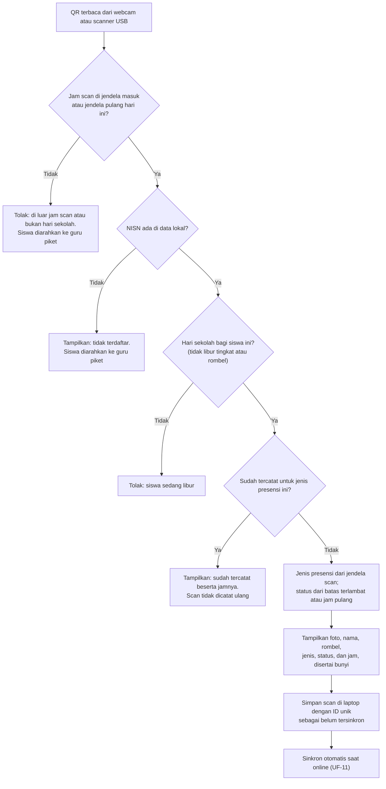
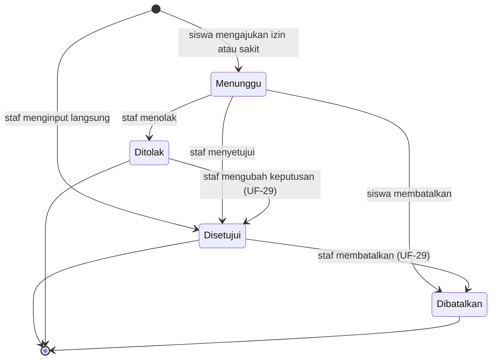

# Spensada — User Flow

| Item | Nilai |
|---|---|
| Versi | 0.5 (draft) |
| Tanggal | 2026-10-04 |
| Sumber | Discovery Session 3 (User Roles & User Flow). Diperbarui dengan keputusan Session 4 (Business Rules), Session 4b (Feature Specification), Session 5 (Database Architecture), dan Session 6 (System Architecture). |
| Bergantung pada | [00-project-overview.md](00-project-overview.md), [01-product-requirements.md](01-product-requirements.md), [02-user-roles-and-permissions.md](02-user-roles-and-permissions.md), [04-feature-specification.md](04-feature-specification.md), [05-business-rules.md](05-business-rules.md), [07-system-architecture.md](07-system-architecture.md) |

## 1. Cara membaca dokumen ini

- **ID.** Setiap alur memakai ID `UF-<NN>`. Pengecualian di dalam satu alur memakai `E<n>`. ID tidak pernah dinomori ulang.
- **Isi alur.** Setiap alur berisi aktor, prasyarat, rujukan, alur utama, pengecualian, dan hasil.
- **Rujukan.** Requirement dirujuk dengan ID `FR-*`/`NFR-*` dari `01`. Hak akses dirujuk dengan ID `HA-*` dari `02`. Pengguna hanya dapat menjalankan langkah yang sesuai hak dan cakupannya.
- **Status.** Label status mengikuti `00`. Aturan bisnis yang dipakai alur, seperti aturan jam, status harian, batas mundur, dan mode darurat, ditetapkan di `05` dan dirujuk dengan ID `BR-*`. Bila sebuah langkah masih bergantung pada pertanyaan terbuka, langkah itu menyebut OQ-nya.
- **Tingkat rincian.** Dokumen ini menjelaskan urutan kerja dan keputusan pengguna. Rincian setiap fitur, termasuk validasi dan acceptance criteria, ada di `04`; `04` §12.2 memetakan setiap alur ke fiturnya. Tampilan layar ditetapkan di Session 7, dan route di Session 8.

## 2. Daftar alur

| ID | Alur | Aktor utama | Rilis |
|---|---|---|---|
| UF-01 | Penyiapan awal sistem | Admin | R1 |
| UF-02 | Import siswa | Admin | R1 |
| UF-03 | Foto siswa | Admin, wali kelas | R1 |
| UF-04 | Akun staf dan role | Admin | R1 |
| UF-05 | Pembagian akun siswa (slip akun) | Wali kelas, admin | R1 |
| UF-06 | Pemasangan dan pencabutan stasiun scan | Admin | R1 |
| UF-07 | Siswa baru, pindah rombel, atau keluar di tengah tahun | Admin, wali kelas | R1 |
| UF-08 | Pergantian tahun ajaran dan kenaikan kelas | Admin | R1 |
| UF-09 | Persiapan stasiun scan di pagi hari | Petugas | R1 |
| UF-10 | Scan masuk | Siswa, petugas | R1 |
| UF-11 | Sinkron dan gangguan koneksi | Akun stasiun, petugas | R1 |
| UF-12 | Presensi manual | Guru piket, wali kelas, guru BK, admin | R1 |
| UF-13 | Menutup sesi masuk | Sistem | R1 |
| UF-14 | Scan pulang dan menutup sesi pulang | Siswa, petugas, guru piket | R1 |
| UF-15 | Pantau dashboard hari ini | Semua akun staf | R1 |
| UF-16 | Koreksi status presensi | Guru piket, wali kelas, guru BK, admin | R1 |
| UF-17 | Pengajuan izin/sakit oleh siswa | Siswa | R1 |
| UF-18 | Verifikasi pengajuan izin/sakit | Wali kelas, guru piket, guru BK, admin | R1 |
| UF-19 | Input izin/sakit/dispensasi oleh staf | Wali kelas, guru piket, guru BK, admin | R1 |
| UF-20 | Login pertama dan ganti password | Staf, siswa | R1 |
| UF-21 | Lupa password | Staf, siswa, wali kelas, admin | R1 |
| UF-22 | Rekap rombel dan riwayat siswa | Staf sesuai cakupan, siswa | R1 (export R2) |
| UF-23 | Notifikasi WhatsApp | Sistem, admin | R2 |
| UF-24 | Flyer kehadiran | Staf sesuai hak | R2 |
| UF-25 | Pengumuman dan halaman publik | Admin, siswa, publik | R3 |
| UF-26 | Cetak kartu | Admin | R3 |
| UF-27 | Mode darurat | Guru piket, admin, wali kelas, guru BK | R1 |
| UF-28 | Ubah jadwal hari ini | Guru piket, admin | R1 |
| UF-29 | Ubah keputusan izin/sakit/dispensasi | Wali kelas, guru piket, guru BK, admin | R1 |

## 3. Garis waktu satu hari sekolah

Jam di bawah adalah contoh hari Selasa di `05` §4.1. Semua jam memakai WIB, dan sesi ditutup otomatis (`05` BR-JAM-07).

| Tahap | Yang terjadi | Pelaku | Alur |
|---|---|---|---|
| Sebelum 06.00 (buka scan masuk) | Laptop dinyalakan; kiosk memuat data terbaru dan menyesuaikan jam | Petugas | UF-09 |
| 06.00–07.59 (jendela masuk) | Siswa scan masuk; kiosk menampilkan hasil dan menyinkronkan data | Siswa, petugas | UF-10, UF-11 |
| 06.00–07.59 (jendela masuk) | Siswa yang lupa kartu atau kartunya rusak dicatat manual | Guru piket | UF-12 |
| Mulai 07.01 (lewat batas terlambat) | Scan masuk berstatus Terlambat | Sistem | UF-10 |
| 08.00 (tutup sesi masuk) | Kiosk menolak scan masuk. Siswa yang belum hadir menjadi Alpa. Siswa yang tiba setelahnya dicatat manual oleh guru piket. | Sistem, guru piket | UF-13, UF-12 |
| 09.00 (tutup sesi masuk + waktu tunda) | Di R2, pesan "tidak hadir" dibuat bila syaratnya terpenuhi | Sistem | UF-23 |
| Jam pelajaran | Pengajuan, input, dan verifikasi izin/sakit/dispensasi; koreksi; pantauan; perubahan jadwal hari ini bila perlu | Siswa, staf | UF-15 s.d. UF-19, UF-28 |
| 12.00–16.59 (jendela pulang) | Siswa scan pulang. Scan sebelum 13.00 tercatat pulang lebih awal. | Siswa, petugas | UF-14 |
| 17.00 (tutup sesi pulang) | Siswa Hadir/Terlambat tanpa presensi pulang mendapat kejadian "tidak scan pulang" | Sistem | UF-14 |
| Akhir hari | Petugas memastikan semua stasiun tersinkron, lalu laptop dimatikan | Petugas | UF-11 |

Bila semua stasiun tidak dapat dipakai, guru piket mengaktifkan mode darurat (UF-27).

## 4. Penyiapan dan administrasi

### UF-01 — Penyiapan awal sistem

- **Aktor:** admin.
- **Prasyarat:** aplikasi terpasang, dan akun admin pertama sudah dibuat lewat perintah CLI (`07` ARS-49).
- **Rujukan:** FR-MD-01 s.d. FR-MD-08, FR-PRS-02, FR-PRS-03, FR-PRS-11, FR-AKN-02, FR-AKN-03.

Alur utama:

1. Admin mengisi identitas sekolah: nama resmi, alamat, dan logo (`HA-MD-09`).
2. Admin membuat tahun ajaran beserta semesternya, lalu menandainya sebagai aktif (`HA-MD-01`).
3. Admin mengatur pola mingguan, jadwal khusus yang sudah diketahui, kalender sekolah, dan batas mundur (`HA-PRS-01`, `HA-PRS-02`, `HA-PRS-09`, `05` §3, §4, dan §9).
4. Admin membuat rombel untuk tahun ajaran aktif (`HA-MD-02`).
5. Admin membuat akun staf untuk semua guru dan staf, lalu memberi role (UF-04).
6. Admin menetapkan wali kelas setiap rombel (`HA-MD-02`).
7. Admin mengimpor siswa (UF-02). Akun siswa terbentuk otomatis.
8. Admin mengunggah foto siswa secara massal (UF-03).
9. Admin membuat akun stasiun dan memasang laptop stasiun scan (UF-06).
10. Wali kelas mencetak dan membagikan slip akun siswa (UF-05).
11. Sekolah melakukan uji coba scan sebelum dipakai penuh. Rencana uji coba ditetapkan di Session 10.

Hasil: sistem siap dipakai untuk presensi harian.

Catatan: rombel dibuat sebelum import. Import mencocokkan nama rombel di file dengan rombel yang sudah ada, dan baris dengan rombel yang tidak dikenal dinyatakan gagal. (RECOMMENDATION)

### UF-02 — Import siswa

- **Aktor:** admin.
- **Prasyarat:** tahun ajaran aktif dan rombelnya sudah ada.
- **Rujukan:** FR-MD-05, FR-AKN-05, `HA-MD-04`, R-12. Kolom template ada di `13` §6.1.

Alur utama:

1. Admin mengunduh template file import (RECOMMENDATION), lalu mengisinya.
2. Admin mengunggah file .xlsx atau .csv.
3. Sistem memvalidasi setiap baris:
   - NISN 10 digit dan dibaca sebagai teks;
   - NISN tidak ganda, baik di dalam file maupun dengan data yang sudah ada;
   - kolom wajib terisi;
   - rombel dikenal;
   - format nomor WA benar, bila diisi. Nomor WA bersifat opsional (DECISION, Session 4b).
4. Sistem menampilkan pratinjau: jumlah baris valid, dan baris gagal beserta alasannya. Daftar baris gagal dapat diunduh.
5. Admin mengonfirmasi. Sistem menyimpan baris valid dan membuat akun siswa dengan status belum aktif.
6. Sistem menampilkan ringkasan hasil.

Pengecualian:

- **E1** — Semua baris gagal: tidak ada data yang disimpan, dan admin memperbaiki file lalu mengunggah ulang.
- **E2** — NISN sudah ada di database, aktif maupun nonaktif: baris itu dilewati dan dilaporkan sebagai baris gagal beserta nama pemilik NISN. Data siswa yang sudah ada tidak berubah (DECISION, Session 5).

Hasil: data siswa dan akun siswa tersedia. Kiosk mendapat data baru saat memuat ulang data (UF-09).

### UF-03 — Foto siswa

- **Aktor:** admin; wali kelas untuk rombelnya.
- **Rujukan:** FR-MD-06, FR-MD-07, FR-MD-09, `HA-MD-07`, `HA-MD-08`.

Alur satu per satu:

1. Admin atau wali kelas membuka data siswa, lalu mengunggah atau mengganti foto.
2. Sistem memperkecil ukuran foto, lalu menyimpannya.
3. Sistem mencatat penggantian foto: siapa dan kapan (FR-MD-09).

Alur massal (admin):

1. Admin mengunggah banyak file foto sekaligus.
2. Sistem mencocokkan nama file dengan NISN. Nama file diawali 10 digit NISN, misalnya `0012345678.jpg` atau `0012345678_Budi Santoso.jpg` (DECISION, Session 5, `13` IM-03).
3. Sistem melaporkan file yang cocok dan file yang tidak cocok.
4. Sistem memperkecil dan menyimpan foto yang cocok.

Hasil: kiosk menampilkan foto baru setelah memuat ulang data (UF-09).

### UF-04 — Akun staf dan role

- **Aktor:** admin.
- **Rujukan:** FR-AKN-02, FR-AKN-06, FR-AKN-08, `HA-AKN-02`, `02` §7.1.

Alur utama:

1. Admin menambah akun staf: nama, username, dan role.
   - Role yang dapat dipilih: Admin, Guru piket, Guru BK, Pimpinan.
   - Role Staf melekat otomatis.
   - Role Wali kelas tidak dipilih di sini, tetapi berasal dari penetapan wali kelas di menu rombel.
2. Sistem membuat password awal acak dan menampilkannya sekali.
3. Admin menyerahkan password awal ke staf yang bersangkutan.
4. Staf login pertama kali dan wajib mengganti password (UF-20).

Pengecualian:

- **E1** — Username sudah dipakai, atau hanya berisi angka: sistem menolak (`02` §2 butir 4).
- **E2** — Staf berhenti: admin menonaktifkan akunnya. Nama staf tetap tampil di log.
- **E3** — Admin mencoba mencabut role admin terakhir yang aktif: sistem menolak (`02` §4 butir 6).

### UF-05 — Pembagian akun siswa (slip akun)

- **Aktor:** wali kelas untuk rombelnya; admin untuk semua rombel.
- **Prasyarat:** siswa sudah ada di rombel.
- **Rujukan:** FR-AKN-05, FR-AKN-06, `HA-AKN-05`, `HA-AKN-06`, `02` §7.2.
- **Status:** DECISION (slip per rombel; mekanisme, Session 4).

Alur utama:

1. Wali kelas membuka daftar akun siswa di rombelnya. Daftar itu menampilkan status setiap akun: belum aktif, aktif, atau nonaktif.
2. Wali kelas memilih "cetak slip akun". Sistem memberi peringatan bahwa slip lama untuk akun yang belum aktif tidak akan berlaku lagi.
3. Wali kelas mengonfirmasi. Sistem lalu:
   - membuat password acak untuk setiap akun belum aktif;
   - menampilkan halaman slip siap cetak, beberapa slip per halaman A4.
4. Wali kelas mencetak halaman slip lewat browser, lalu membagikan slip ke siswa di kelas.
5. Siswa login pertama kali dan mengganti password (UF-20). Status akunnya berubah menjadi aktif.
6. Wali kelas memantau siswa yang belum aktif dan mengulangi langkah 2–4 untuk mereka.

Pengecualian:

- **E1** — Slip hilang sebelum dipakai: wali kelas mencetak ulang. Password lama otomatis tidak berlaku.

Catatan: sistem tidak menyimpan slip. Slip yang sudah dicetak adalah tanggung jawab wali kelas sampai dibagikan.

### UF-06 — Pemasangan dan pencabutan stasiun scan

- **Aktor:** admin.
- **Rujukan:** FR-AKN-03, FR-KIO-01, FR-KIO-12, `HA-AKN-03`, `HA-KIO-02`, R-01, R-05, R-07.

Alur pemasangan:

1. Admin membuat akun stasiun, misalnya "Gerbang 1".
2. Admin menyiapkan laptop:
   - akun Windows non-admin (R-05);
   - profil browser khusus kiosk (R-07);
   - sinkron waktu otomatis Windows aktif, dan laptop tidak tidur selama jam sekolah (`07` ARS-32).
3. Admin membuka alamat kiosk lewat HTTPS (R-01), lalu login dengan akun stasiun.
4. Admin memasang kiosk sebagai aplikasi di browser, lalu mengizinkan akses kamera. Kiosk memastikan penyimpanan permanen aktif (NFR-03, `07` ARS-21).
5. Kiosk memuat data siswa aktif beserta fotonya, lalu siap dipakai.
6. Laptop ditempatkan di gerbang utama.

Alur pencabutan, misalnya karena laptop diganti atau rusak:

1. Admin membuka status stasiun dan memastikan jumlah scan belum tersinkron nol.
2. Admin menonaktifkan akun stasiun.
3. Data kiosk di laptop dihapus (R-07).

Pengecualian:

- **E1** — Laptop hilang: admin langsung menonaktifkan akun stasiunnya. Scan yang belum tersinkron di laptop tersebut hilang. Siswa yang terdampak dicatat lewat presensi manual atau koreksi (UF-12, UF-16).

### UF-07 — Siswa baru, pindah rombel, atau keluar di tengah tahun

- **Aktor:** admin; wali kelas untuk slip dan foto.
- **Rujukan:** FR-MD-03, FR-MD-04, FR-AKN-05, `HA-MD-03`.

Siswa baru:

1. Admin menambah siswa (atau mengimpornya), lalu menempatkannya ke rombel. Akun siswa terbentuk otomatis.
2. Wali kelas mengunggah foto (UF-03) dan mencetak slip akun untuk siswa tersebut (UF-05).
3. Siswa dapat scan setelah kiosk memuat ulang data (UF-09).
4. Siswa memerlukan kartu dengan QR berisi NISN polos (C-04):
   - sebelum R3, kartu dicetak dengan cara yang dipakai sekolah saat ini;
   - mulai R3, kartu dicetak dari sistem (UF-26).

   Selama kartu belum ada, siswa dicatat lewat presensi manual (UF-12).

Pindah rombel: admin mengubah penempatan siswa. Riwayat di rombel lama tetap utuh. Aturan rincinya ada di `04` FS-MD-05 dan `06` §6.7.

Keluar, pindah sekolah, atau lulus:

1. Admin menonaktifkan siswa. Akun siswa ikut nonaktif.
2. Siswa tidak lagi muncul di kiosk setelah data dimuat ulang.
3. Riwayat kehadirannya tetap tersimpan.

### UF-08 — Pergantian tahun ajaran dan kenaikan kelas

- **Aktor:** admin.
- **Rujukan:** FR-MD-01, FR-MD-02, FR-MD-04, R-14.

Alur utama:

1. Admin membuat tahun ajaran baru beserta semester dan rombelnya.
2. Admin menempatkan siswa lama ke rombel baru (kenaikan kelas), per rombel asal ke rombel tujuan, atau lewat file import penempatan bila rombel diacak ulang (DECISION, Session 5, `04` FS-MD-05, `13` IM-02).
3. Admin menonaktifkan siswa kelas 9 yang lulus.
4. Admin mengimpor siswa baru kelas 7 (UF-02), lalu wali kelas membagikan slip akun (UF-05).
5. Admin menetapkan wali kelas setiap rombel baru.
6. Pada tanggal mulai, admin mengaktifkan tahun ajaran baru. Akibatnya:
   - hak wali kelas berpindah ke penugasan baru;
   - kiosk memuat data rombel baru saat memuat ulang data.

Hasil: rekap dan riwayat tahun ajaran lalu tetap dapat dibuka oleh pihak yang berhak.

## 5. Hari sekolah

### UF-09 — Persiapan stasiun scan di pagi hari

- **Aktor:** petugas (guru piket atau satpam/staf TU).
- **Prasyarat:** laptop sudah terpasang (UF-06), dan akun stasiun masih login.
- **Rujukan:** FR-KIO-01, FR-KIO-06, FR-KIO-08, FR-KIO-09.

Alur utama:

1. Petugas menyalakan laptop dan membuka kiosk.
2. Bila online, kiosk:
   - memuat ulang data siswa aktif, foto yang berubah, aturan jam, dan kalender, termasuk libur per tingkat atau rombel;
   - mengukur selisih jam laptop terhadap jam server (`05` BR-SCN-07).
3. Kiosk menampilkan status siap: koneksi, waktu data terakhir dimuat, jumlah siswa, jumlah scan belum tersinkron, dan jam.
4. Petugas memastikan pratinjau kamera tampil, dan scanner USB terpasang bila dipakai.

Pengecualian:

- **E1** — Tidak ada internet: kiosk tetap dapat dipakai dengan data terakhir dimuat (FR-KIO-09), dan menampilkan kapan data itu dimuat. Bila data lebih tua dari 3 hari, kiosk menampilkan peringatan untuk memuat ulang data saat online (DECISION, Session 6, `04` FS-KIO-01).
- **E2** — Kiosk belum pernah memuat data: scan belum dapat dilakukan. Laptop harus online sekali.
- **E3** — Akun stasiun dinonaktifkan atau sesinya berakhir: kiosk meminta login ulang, dan petugas menghubungi admin.
- **E4** — Hari ini bukan hari sekolah menurut kalender: kiosk menampilkan keterangannya dan menolak semua scan (`05` BR-JAM-06).

### UF-10 — Scan masuk

- **Aktor:** siswa; petugas mengawasi.
- **Prasyarat:** kiosk siap (UF-09).
- **Rujukan:** FR-KIO-02 s.d. FR-KIO-06, NFR-01, AC-01, R-02, `05` BR-JAM-03 s.d. BR-JAM-06, BR-SCN-01 s.d. BR-SCN-03.

Alur utama:

1. Siswa mendekatkan QR kartu OSIS ke webcam, atau ke scanner USB.
2. Kiosk membaca NISN, lalu mencarinya di data lokal.
3. Kiosk menentukan jenis presensi (masuk) dari jendela scan, dan status (Hadir atau Terlambat) dari batas terlambat. Dasarnya adalah jam laptop yang sudah dikoreksi dan aturan jam hari itu (`05` BR-JAM-03, BR-JAM-04).
4. Dalam paling lama 1 detik, layar menampilkan foto, nama, rombel, jenis presensi, status, dan jam, disertai bunyi (NFR-01). Siswa tidak perlu menekan apa pun.
5. Kiosk menyimpan scan di laptop dengan ID unik, dan penghitung scan belum tersinkron bertambah satu.
6. Petugas mencocokkan foto di layar dengan wajah siswa (R-02).
7. Layar kembali siap untuk siswa berikutnya. Durasi tampilan ditetapkan di Session 7.

Pengecualian:

- **E1** — NISN tidak ada di data lokal: kiosk menampilkan pesan yang jelas dengan bunyi berbeda, dan scan tidak dicatat sebagai presensi (RECOMMENDATION). Siswa diarahkan ke guru piket. Bila siswa ternyata baru ditambahkan, petugas memuat ulang data di kiosk.
- **E2** — Siswa sudah tercatat (scan ganda): scan pertama yang berlaku. Kiosk menampilkan bahwa siswa sudah tercatat beserta jamnya dengan bunyi berbeda, dan scan tidak dicatat ulang (DECISION, `05` BR-SCN-03).
- **E3** — QR tidak terbaca, kartu rusak, atau siswa lupa kartu: siswa menemui guru piket untuk presensi manual (UF-12).
- **E4** — Foto di layar tidak cocok dengan wajah siswa (dugaan kartu titipan atau palsu):
  1. Petugas menahan siswa dan melapor ke guru piket.
  2. Guru piket mengoreksi status pemilik kartu menjadi Tidak hadir (UF-16) dengan alasan yang jelas.
  3. Tindak lanjut disiplin berada di luar sistem.

  Risiko ini diterima. Pengamannya adalah pengawasan petugas, tanpa pemblokiran kartu (DECISION, OQ-06, `05` BR-SCN-09).
- **E5** — Siswa nonaktif: data lokal hanya berisi siswa aktif, sehingga perlakuannya sama dengan E1.
- **E6** — Scan setelah jam tutup sesi masuk ("gerbang ditutup"): kiosk menolak dengan pesan "sesi masuk sudah ditutup, temui guru piket". Siswa sudah berstatus Alpa, dan guru piket menggantinya lewat presensi manual (UF-12). (DECISION, `05` BR-JAM-08)
- **E7** — Scan di luar jendela lain, misalnya sebelum jam buka scan masuk atau di antara jendela masuk dan jendela pulang: kiosk menolak dan mengarahkan siswa ke guru piket (DECISION, `05` BR-JAM-06).
- **E8** — Siswa sedang libur (libur tingkat atau rombel): kiosk menolak scan (DECISION, `05` BR-JAM-06).

Hasil: scan tersimpan di laptop dan siap disinkronkan.

### UF-11 — Sinkron dan gangguan koneksi

- **Aktor:** akun stasiun (otomatis), petugas.
- **Rujukan:** FR-KIO-07 s.d. FR-KIO-12, NFR-03, NFR-04, AC-02, R-06, R-08, R-09.

Alur utama:

1. Selama online, kiosk mengirim scan yang belum tersinkron ke server setiap beberapa detik.
2. Server menyimpan scan secara idempotent. Scan yang dikirim ulang tidak menggandakan data.
3. Server membalas daftar scan yang sudah diterima. Kiosk menandainya tersinkron, dan penghitung berkurang.
4. Server mencatat waktu sinkron terakhir dan jumlah scan belum tersinkron yang dilaporkan stasiun. Data ini tampil di status stasiun (`HA-KIO-02`).

Pengecualian:

- **E1** — Internet putus:
  - indikator koneksi berubah;
  - scan tetap berjalan, dan penghitung scan belum tersinkron terus bertambah;
  - sinkron berjalan otomatis saat koneksi kembali.
- **E2** — Petugas ingin memastikan data terkirim: petugas menekan tombol sinkron manual.
- **E3** — Laptop atau browser dibuka ulang tanpa internet: kiosk tetap terbuka dari cache. Scan yang belum tersinkron tetap ada (NFR-03).
- **E4** — Server menandai scan karena jam tidak wajar, misalnya jam di masa depan atau jam laptop berubah (FR-KIO-11): scan tersebut masuk daftar tinjauan (`HA-KIO-03`), dan peninjau menerima atau menolaknya. Keadaan yang ditandai, dan apakah scan dipakai selama belum ditinjau, ada di `05` BR-SCN-08.
- **E5** — Akhir hari dengan penghitung lebih dari nol dan tanpa internet:
  - laptop boleh dimatikan, karena data tetap tersimpan;
  - petugas melapor ke guru piket;
  - sinkron berjalan saat laptop online kembali.

  Selama itu, status siswa yang terdampak dapat keliru sementara. Notifikasi "tidak hadir" (R2) tertunda selama stasiun melaporkan scan belum tersinkron, dan ditahan bila jumlah siswa tercatat masuk di bawah ambang pengaman (FR-WA-07, FR-WA-08).
- **E6** — Scan tersinkron setelah tanggal berganti: status tanggal itu tetap dikoreksi, tetapi tidak menghasilkan notifikasi (`05` BR-WA-01).

Hasil: semua scan tersimpan di server tepat satu kali.

### UF-12 — Presensi manual

- **Aktor:** guru piket untuk hari berjalan; wali kelas untuk rombelnya; guru BK; admin.
- **Rujukan:** FR-PRS-06, `HA-PRS-03`, `HA-MD-05`, `05` §7.

Alur utama:

1. Siswa menemui guru piket, misalnya karena lupa kartu, kartunya rusak, QR tidak terbaca, kiosk terganggu, atau tiba setelah sesi masuk ditutup.
2. Guru piket membuka presensi manual di panel, lalu mencari siswa berdasarkan nama, NISN, atau rombel.
3. Panel menampilkan foto siswa untuk dicocokkan.
4. Guru piket memilih jenis presensi (masuk atau pulang). Jamnya default jam sekarang dan dapat diubah dalam hari yang sama, misalnya bila kiosk sempat mati. Jam boleh berada di luar jendela scan (`05` BR-KOR-02).
5. Guru piket memilih alasan dan dapat menambah catatan. Alasan wajib diisi (`05` BR-KOR-04).
6. Sistem menghitung status dari jam yang diisi, lalu menyimpan presensi dengan penanda "manual" dan nama penginput. Contohnya siswa yang tiba pukul 08.10 setelah sesi masuk ditutup berstatus Terlambat, dan Alpa-nya terganti.
7. Sistem mencatat perubahan ini di log perubahan presensi.

Pengecualian:

- **E1** — Siswa sudah memiliki presensi masuk hari itu: sistem menampilkan presensi yang ada. Perubahannya dilakukan lewat koreksi (UF-16).
- **E2** — Tanggal lampau: hanya wali kelas (rombelnya), guru BK, dan admin yang dapat menginput, dalam batas mundur (hari ini dan 7 hari kalender sebelumnya). Admin tidak dibatasi (`05` §9).
- **E3** — Semua stasiun tidak dapat dipakai: guru piket mengaktifkan mode darurat, dan presensi dicatat per rombel (UF-27). Di luar mode darurat, presensi manual dicatat satu per satu (`05` BR-KOR-05).
- **E4** — Siswa sudah memiliki koreksi status pada tanggal itu: presensi manual tidak mengubah status, karena koreksi menang (`05` BR-STS-04). Perubahannya dilakukan lewat koreksi (UF-16).
- **E5** — Siswa memiliki izin/sakit/dispensasi yang disetujui pada tanggal itu: presensi tetap tersimpan, tetapi status mengikuti izin (`05` BR-STS-03). Bila siswa memang hadir, staf membatalkan izinnya (UF-29).
- **E6** — Presensi manual salah input, misalnya tercatat untuk siswa yang salah: staf yang berhak membatalkannya dengan alasan. Datanya tetap tersimpan dengan tanda dibatalkan, tetapi tidak dipakai, lalu presensi yang benar dapat dicatat ulang (DECISION, Session 4b, `05` BR-KOR-11).

### UF-13 — Menutup sesi masuk

- **Aktor:** sistem.
- **Rujukan:** FR-PRS-05, FR-PRS-08, FR-KIO-12, FR-WA-07, FR-WA-08, `HA-KIO-02`, AC-03, R-13, R-21, `05` BR-JAM-07, BR-JAM-08.
- **Status:** DECISION (penutupan otomatis, OQ-07).

Alur utama:

1. Pada jam tutup sesi masuk, sesi masuk tertutup otomatis. Tidak ada tombol tutup sesi.
2. Kiosk menolak scan masuk dengan pesan "sesi masuk sudah ditutup, temui guru piket", termasuk saat offline.
3. Siswa tanpa presensi masuk dan tanpa izin/sakit/dispensasi yang disetujui berubah dari "belum hadir" menjadi Alpa. Dashboard ikut diperbarui.
4. Siswa yang tiba setelahnya menemui guru piket, yang mencatat presensi manual beserta alasan (UF-12). Statusnya menjadi Terlambat.
5. Di R2, pesan "tidak hadir" dibuat setelah waktu tunda (default 60 menit) bila semua syaratnya terpenuhi (`05` BR-WA-02).

Pengecualian:

- **E1** — Ada stasiun yang belum tersinkron:
  - petugas menekan sinkron manual bila stasiun online;
  - status selalu dapat dihitung ulang (`05` BR-STS-06), sehingga scan yang tersinkron setelah sesi ditutup tetap mengoreksi Alpa;
  - pesan "tidak hadir" menunggu sampai tidak ada stasiun yang melaporkan scan belum tersinkron (FR-WA-07);
  - pesan yang sudah terkirim tidak dikoreksi (`05` BR-WA-04).
- **E2** — Mode darurat aktif: Alpa tidak terbentuk sampai mode darurat diakhiri (UF-27).
- **E3** — Jumlah siswa yang tercatat masuk di bawah ambang pengaman, misalnya karena internet sekolah mati sepanjang pagi: pesan "tidak hadir" ditahan, dan panel admin serta guru piket menampilkan peringatan. Guru piket atau admin melepas atau membatalkan pesan setelah memeriksa (FR-WA-08).
- **E4** — Jam tutup hari ini perlu diundur, misalnya karena hujan deras: guru piket mengubah jadwal hari ini (UF-28).

### UF-14 — Scan pulang dan menutup sesi pulang

- **Aktor:** siswa dan petugas; sistem untuk penutupan sesi.
- **Rujukan:** FR-PRS-01, FR-PRS-08, `05` BR-JAM-05, BR-JAM-09, BR-STS-05.

Alur utama:

1. Pada jendela pulang, siswa scan di stasiun yang sama di gerbang utama. Alurnya sama dengan UF-10, dengan jenis presensi "pulang".
2. Kiosk menentukan jenis presensi dari jendela scan. Scan sebelum jam pulang tercatat dengan kejadian "pulang lebih awal".
3. Pada jam tutup sesi pulang, sesi pulang tertutup otomatis. Siswa berstatus Hadir atau Terlambat yang tidak memiliki presensi pulang mendapat kejadian "tidak scan pulang".

Pengecualian:

- **E1** — Pulang lebih awal tidak memerlukan izin di kiosk, dan tidak mengubah status harian (DECISION, `05` BR-JAM-05). Kejadian ini tampil di riwayat dan rekap.
- **E2** — Siswa pulang lebih awal di luar jendela pulang, misalnya pukul 10.00 karena sakit: guru piket mencatat presensi manual pulang dengan alasan (UF-12). Bila sekolah menetapkan hari itu sebagai Sakit atau Izin, staf menginput izin/sakit (UF-19). Karena izin/sakit yang disetujui menang, status hari itu menjadi Sakit atau Izin (`05` BR-STS-03).
- **E3** — Scan pulang tanpa presensi masuk: kiosk menampilkan umpan balik pulang seperti biasa, dan scan tetap dicatat, tetapi siswa tidak menjadi Hadir. Daftar nama staf menandai keadaan ini untuk ditindaklanjuti (DECISION, Session 4b, `05` BR-SCN-10, BR-STS-07).
- **E4** — Hari yang memakai mode darurat: kejadian "tidak scan pulang" tidak dibuat (DECISION, Session 4b, `05` BR-DRT-07).

### UF-15 — Pantau dashboard hari ini

- **Aktor:** semua akun staf.
- **Rujukan:** FR-LAP-01, `HA-LAP-01`, `HA-LAP-02`.

Alur utama:

1. Staf login. Halaman awalnya adalah dashboard hari ini.
2. Dashboard menampilkan jumlah hadir, terlambat, izin, sakit, dispensasi, dan belum hadir/Alpa per rombel. Bila mode darurat aktif, dashboard menampilkan tandanya.
3. Bila hak dan cakupannya mengizinkan, staf membuka satu rombel untuk melihat daftar nama siswa per status:
   - guru piket, guru BK, pimpinan, dan admin: semua rombel;
   - wali kelas: rombelnya sendiri;
   - staf tanpa tugas khusus: hanya angka.
4. Daftar nama menandai siswa berstatus Izin, Sakit, atau Dispensasi yang ternyata memiliki presensi masuk, dan siswa yang memiliki presensi pulang tanpa presensi masuk. Penanda yang sama tampil di daftar presensi rombel per tanggal dan di riwayat siswa, termasuk untuk tanggal lampau (DECISION, Session 4b, `05` BR-STS-07).
5. Data diperbarui seiring sinkron dari stasiun. Dashboard memperbarui dirinya setiap 30 detik tanpa memuat ulang halaman (DECISION, Session 6, `07` ARS-50).

### UF-16 — Koreksi status presensi

- **Aktor:** guru piket untuk hari berjalan; wali kelas untuk rombelnya; guru BK; admin.
- **Rujukan:** FR-PRS-07, `HA-PRS-04`, `HA-PRS-06`, `05` §6 dan §7.

Alur utama:

1. Staf membuka daftar presensi rombel pada satu tanggal, atau riwayat satu siswa.
2. Staf memilih tanggal dan kehadiran baru (Hadir, Terlambat, atau Tidak hadir), lalu mengisi alasan. Alasan wajib diisi. Contohnya Tidak hadir karena kartu dititipkan, atau Hadir karena terlambat dengan surat dokter.
3. Sistem menyimpan koreksi dan mencatatnya di log perubahan presensi: siapa, kapan, nilai lama, nilai baru, dan alasan.
4. Dashboard dan rekap langsung mengikuti status baru. Koreksi Tidak hadir menghasilkan Alpa, kecuali ada izin/sakit/dispensasi yang disetujui.
5. Koreksi tidak berubah oleh scan atau presensi manual yang datang belakangan, termasuk scan dari stasiun yang terlambat sinkron (DECISION, `05` BR-STS-04).

Pengecualian:

- **E1** — Tanggal di luar cakupan staf, misalnya guru piket mengoreksi tanggal kemarin, atau tanggal melewati batas mundur (hari ini dan 7 hari kalender sebelumnya): sistem menolak. Admin tidak dibatasi batas mundur.
- **E2** — Koreksi menjadi Izin, Sakit, atau Dispensasi: dilakukan lewat input izin/sakit/dispensasi (UF-19), bukan lewat koreksi status. Dengan begitu datanya tetap satu sumber. (DECISION, `05` BR-KOR-07)
- **E3** — Siswa memiliki izin/sakit/dispensasi yang disetujui pada tanggal itu: koreksi tetap dapat disimpan, tetapi status mengikuti izin. Sistem memberi peringatan sebelum menyimpan. (DECISION, Session 4b, `05` BR-KOR-09)
- **E4** — Koreksi perlu dibatalkan: staf menghapus koreksi dengan alasan, dan status dihitung lagi dari presensi (DECISION, Session 4b, `05` BR-KOR-08).

### UF-27 — Mode darurat

- **Aktor:** guru piket atau admin untuk mengaktifkan dan mengakhiri; wali kelas, guru piket, guru BK, dan admin untuk presensi per rombel.
- **Prasyarat:** hari ini hari sekolah, dan semua stasiun scan tidak dapat dipakai.
- **Rujukan:** FR-PRS-06, FR-PRS-10, `HA-PRS-03`, `HA-PRS-08`, R-21, `05` §10.
- **Status:** DECISION (OQ-16).

Alur utama:

1. Guru piket memastikan semua stasiun memang tidak dapat dipakai, misalnya listrik padam lama atau laptop rusak. Internet putus bukan alasan, karena kiosk tetap bekerja offline.
2. Guru piket mengaktifkan mode darurat untuk hari ini dan mengisi alasan.
3. Dashboard menampilkan tanda mode darurat. Siswa tanpa presensi tetap "belum hadir" walaupun sesi masuk sudah ditutup, dan pesan "tidak hadir" (R2) ditahan.
4. Wali kelas atau guru piket membuka presensi per rombel, yang berisi siswa rombel itu yang belum memiliki presensi masuk.
5. Staf mencentang siswa yang hadir dan menandai siswa yang terlambat, lalu menyimpan. Sistem mencatat presensi manual masuk dengan alasan "darurat", berstatus Hadir atau Terlambat sesuai pilihan staf.
6. Setelah semua rombel tercatat, guru piket mengakhiri mode darurat. Siswa tanpa presensi dan tanpa izin/sakit/dispensasi menjadi Alpa.
7. Di R2, waktu tunda pesan "tidak hadir" dihitung sejak mode darurat diakhiri (DECISION, Session 4b, `05` BR-DRT-06).

Pengecualian:

- **E1** — Stasiun kembali berfungsi: scan berjalan normal sesuai jendela scan. Presensi per rombel tetap tersedia sampai mode darurat diakhiri.
- **E2** — Mode darurat tidak diakhiri: mode berakhir otomatis pukul 23.59 WIB, dan pesan "tidak hadir" hari itu tidak dikirim.
- **E3** — Ada rombel yang belum tercatat sampai hari berganti: wali kelas mencatat presensi manual satu per satu dalam batas mundur (UF-12).
- **E4** — Pada hari yang memakai mode darurat, kejadian "tidak scan pulang" tidak dibuat (DECISION, Session 4b, `05` BR-DRT-07).
- **E5** — Presensi per rombel salah centang: staf membatalkan presensi manual siswa itu (UF-12 E6).

Hasil: kehadiran hari itu tetap tercatat, tanpa Alpa dan pesan "tidak hadir" yang keliru secara massal.

### UF-28 — Ubah jadwal hari ini

- **Aktor:** guru piket, admin.
- **Rujukan:** FR-PRS-09, `HA-PRS-07`, `05` BR-JAM-02, BR-JAM-10, BR-JAM-11.
- **Status:** DECISION.

Alur utama:

1. Terjadi keadaan yang mengubah jam hari ini, misalnya hujan deras di pagi hari atau rapat guru di siang hari.
2. Guru piket membuka jadwal hari ini, lalu mengubah jamnya. Contohnya batas terlambat menjadi 07.30, atau jam pulang menjadi 11.00. Alasan wajib diisi.
3. Sistem menyimpan perubahan sebagai jadwal hari ini, yang mengalahkan jadwal khusus dan pola mingguan untuk hari ini (`04` FS-PRS-04), mencatatnya di log, dan menghitung ulang status hari ini.
4. Stasiun yang online memuat aturan baru. Stasiun yang offline memakai aturan lama sampai online kembali, tetapi server tetap menghitung status dengan aturan baru.

Pengecualian:

- **E1** — Guru piket ingin mengubah tanggal lain, mengubah pola mingguan, atau menjadikan hari ini libur: tidak bisa. Hal tersebut dilakukan admin (`HA-PRS-01`, `HA-PRS-02`).
- **E2** — Perubahan membuat urutan jam tidak valid, misalnya batas terlambat melewati jam tutup sesi masuk: sistem menolak (`05` BR-JAM-02).

## 6. Izin, sakit, dan dispensasi

Status data izin/sakit/dispensasi:

Hanya data yang disetujui yang memengaruhi status presensi, dan data yang disetujui menang atas presensi masuk (FR-IZN-03, `05` BR-STS-03). Dispensasi hanya diinput staf, sehingga selalu dimulai dari status disetujui. Perubahan keputusan setelah verifikasi mengikuti UF-29.

### UF-17 — Pengajuan izin/sakit oleh siswa

- **Aktor:** siswa.
- **Rujukan:** FR-IZN-01, FR-IZN-04, `HA-IZN-01`, `05` BR-IZN-03.

Alur utama:

1. Siswa login ke portal, lalu memilih "ajukan izin/sakit".
2. Siswa mengisi pengajuan:
   - jenis: Izin atau Sakit (siswa tidak dapat mengajukan Dispensasi);
   - tanggal, atau rentang tanggal;
   - keterangan;
   - lampiran surat, bila ada (opsional).

   Format dan ukuran lampiran ditetapkan di Session 9.
3. Sistem menyimpan pengajuan dengan status "menunggu". Pengajuan itu muncul di daftar verifikasi wali kelas, guru piket, guru BK, dan admin.
4. Siswa memantau status pengajuannya.
5. Selama status masih "menunggu", siswa dapat membatalkan pengajuan (RECOMMENDATION).

Pengecualian:

- **E1** — Rentang tanggal mencakup hari libur: hanya hari sekolah yang terdampak.
- **E2** — Tanggal yang diajukan sudah lewat: boleh, selama masih dalam batas mundur (hari ini dan 7 hari kalender sebelumnya). Lebih dari itu, sistem menolak, dan tanggal tersebut hanya dapat diubah admin. (DECISION, OQ-15)
- **E3** — Tanggal yang diajukan tumpang tindih dengan data izin/sakit/dispensasi lain yang masih menunggu atau sudah disetujui: sistem menolak dan menunjukkan data yang sudah ada (DECISION, Session 4b, `05` BR-IZN-07).
- **E4** — Siswa sudah memiliki presensi masuk pada tanggal tersebut: bila pengajuan disetujui, status menjadi Izin atau Sakit, karena izin/sakit yang disetujui menang (DECISION, `05` BR-STS-03).

Catatan: bila siswa tidak dapat mengakses portal, orang tua menghubungi sekolah, lalu staf mencatatnya lewat UF-19.

### UF-18 — Verifikasi pengajuan izin/sakit

- **Aktor:** wali kelas untuk rombelnya; guru piket; guru BK; admin.
- **Rujukan:** FR-IZN-03, FR-IZN-05, FR-PRS-05, `HA-IZN-03`, `HA-IZN-05`, AC-03.

Alur utama:

1. Staf membuka daftar pengajuan yang menunggu, sesuai cakupannya.
2. Staf membuka detail pengajuan dan lampirannya.
3. Staf menyetujui atau menolak dengan catatan. Catatan wajib diisi saat menolak (RECOMMENDATION).
4. Bila disetujui, status presensi siswa pada tanggal tersebut otomatis menjadi Izin atau Sakit, tanpa langkah tambahan. Ini juga berlaku bila status sebelumnya Alpa, Hadir, atau Terlambat (`05` BR-STS-03).
5. Bila ditolak, status presensi tetap mengikuti koreksi atau presensi masuk. Tanpa keduanya, statusnya Alpa.
6. Siswa melihat hasil verifikasi beserta catatannya.

Pengecualian:

- **E1** — Dua staf memverifikasi pengajuan yang sama pada waktu bersamaan: keputusan yang tersimpan lebih dulu berlaku. Staf kedua mendapat pesan bahwa pengajuan sudah diverifikasi, beserta nama verifikatornya. (RECOMMENDATION)
- **E2** — Tanggal pengajuan sudah melewati batas mundur saat diverifikasi: pengajuan tetap dapat diverifikasi, karena diajukan saat masih dalam batas (DECISION, Session 4b, `05` BR-IZN-10).
- **E3** — Keputusan perlu diubah setelah diverifikasi: lihat UF-29.

### UF-19 — Input izin/sakit/dispensasi oleh staf

- **Aktor:** wali kelas untuk rombelnya; guru piket; guru BK; admin.
- **Rujukan:** FR-IZN-02, FR-IZN-07, `HA-IZN-02`, `05` BR-IZN-04, BR-IZN-05.

Alur utama:

1. Sekolah menerima kabar izin atau sakit dari orang tua, misalnya lewat telepon, surat, atau pesan ke wali kelas. Kabar itu juga bisa datang dari surat yang dibawa siswa. Untuk dispensasi, sumbernya adalah tugas atau kegiatan resmi sekolah, misalnya lomba atau study tour.
2. Staf mencari siswa, lalu mengisi:
   - jenis: Izin, Sakit, atau Dispensasi;
   - tanggal atau rentang tanggal;
   - keterangan, termasuk sumber kabar;
   - foto surat atau surat tugas, bila ada (opsional).
3. Sistem menyimpan data dengan status "disetujui" dan nama penginput sebagai verifikator (DECISION).
4. Status presensi mengikuti secara otomatis, walaupun siswa sudah memiliki presensi masuk (`05` BR-STS-03).

Pengecualian:

- **E1** — Tanggal lampau: diperbolehkan untuk staf yang berhak, sesuai cakupannya, dalam batas mundur (hari ini dan 7 hari kalender sebelumnya). Contohnya siswa yang membawa surat sakit untuk hari kemarin. Admin tidak dibatasi.
- **E2** — Dispensasi untuk banyak siswa: staf memilih beberapa siswa, satu rombel, atau satu tingkat, sesuai cakupannya. Sistem membuat satu data dispensasi per siswa (`05` BR-IZN-05). Siswa yang sudah memiliki data izin/sakit/dispensasi pada tanggal yang sama dilewati dan dilaporkan, sedangkan siswa lain tetap tersimpan (DECISION, Session 4b).
- **E3** — Siswa sudah memiliki data izin/sakit/dispensasi yang menunggu atau disetujui pada tanggal yang sama: sistem menolak dan menunjukkan data yang ada. Pengajuan siswa yang menunggu cukup diverifikasi (UF-18). (DECISION, Session 4b, `05` BR-IZN-07)

### UF-29 — Ubah keputusan izin/sakit/dispensasi

- **Aktor:** wali kelas untuk rombelnya; guru piket; guru BK; admin.
- **Rujukan:** FR-IZN-06, `HA-IZN-06`, `05` BR-IZN-09, BR-IZN-10.
- **Status:** DECISION.

Alur utama:

1. Staf membuka data izin/sakit/dispensasi seorang siswa.
2. Staf memilih salah satu tindakan:
   - membatalkan data yang disetujui, misalnya karena surat ternyata palsu atau siswa berizin ternyata datang;
   - memendekkan rentang, misalnya karena siswa yang sakit kembali lebih cepat;
   - mengubah penolakan menjadi persetujuan.
3. Staf mengisi alasan. Alasan wajib diisi.
4. Sistem menyimpan keputusan baru, mencatatnya di log perubahan presensi, dan menghitung ulang status tanggal yang terdampak.
5. Siswa melihat keputusan terbaru di portal.

Pengecualian:

- **E1** — Tanggal yang terdampak melewati batas mundur: hanya admin yang dapat mengubahnya.
- **E2** — Rentang perlu diperpanjang atau jenisnya perlu diganti: staf membatalkan data lama, lalu membuat data baru (UF-19). (RECOMMENDATION)
- **E3** — Dispensasi massal dibatalkan atau dipersingkat, misalnya study tour ditunda: staf menerapkan perubahan ke seluruh kelompok dengan satu alasan, bila semua siswanya berada dalam cakupan staf. Setiap data tetap tercatat di log (DECISION, Session 4b).

## 7. Akun

### UF-20 — Login pertama dan ganti password

- **Aktor:** staf dan siswa.
- **Rujukan:** FR-AKN-04, FR-AKN-06, NFR-08, `HA-AKN-01`.

Alur utama:

1. Pengguna menerima password awal. Siswa menerimanya lewat slip akun (UF-05), dan staf langsung dari admin (UF-04).
2. Pengguna membuka alamat aplikasi, lalu login. Siswa memakai NISN, dan staf memakai username.
3. Sistem mewajibkan penggantian password sebelum pengguna dapat membuka halaman lain. Aturan password ditetapkan di Session 9.
4. Setelah password diganti, sistem mengarahkan pengguna ke areanya (`02` §8). Status akun siswa berubah menjadi aktif.

Pengecualian:

- **E1** — Password salah berkali-kali: percobaan login dibatasi (NFR-08).
- **E2** — Akun nonaktif: login ditolak dengan pesan umum.

### UF-21 — Lupa password

- **Aktor:** siswa dan wali kelas; staf dan admin.
- **Rujukan:** FR-AKN-07, `HA-AKN-02`, `HA-AKN-04`.

Siswa:

1. Siswa melapor ke wali kelasnya, atau ke admin.
2. Wali kelas membuka data siswa, lalu memilih "reset password".
3. Sistem membuat password acak baru dan menampilkan slip untuk satu siswa.
4. Siswa login dan wajib mengganti password (UF-20).

Staf:

1. Staf melapor ke admin.
2. Admin mereset password. Sistem menampilkan password acak baru sekali.
3. Staf login dan wajib mengganti password.

Pengecualian:

- **E1** — Satu-satunya admin lupa password: password dipulihkan lewat perintah `php spark admin:pulihkan` di server (DECISION, Session 6, `07` ARS-49).

## 8. Laporan

### UF-22 — Rekap rombel dan riwayat siswa

- **Aktor:** staf sesuai cakupan; siswa untuk dirinya sendiri.
- **Rujukan:** FR-LAP-02, FR-LAP-03, FR-LAP-04, `HA-LAP-03`, `HA-LAP-04`, `HA-LAP-05`.

Alur staf:

1. Staf memilih rombel dan rentang tanggal. Contoh rentang: satu hari, satu bulan, atau satu semester.
2. Sistem menampilkan tabel per siswa berisi jumlah hari Hadir, Terlambat, Izin, Sakit, dan Alpa.
3. Staf membuka satu siswa untuk melihat riwayat hariannya.
4. Di R2, staf mengekspor rekap ke XLSX, CSV, atau PDF. Pembagian format per laporan mengikuti matriks di `13` §4.

Alur siswa:

1. Siswa membuka portal.
2. Siswa melihat riwayat kehadirannya per bulan atau semester: status, jam masuk dan pulang, kejadian pulang, izin/sakit/dispensasi beserta catatan verifikasi, dan tanda "dikoreksi" beserta alasannya. Nama staf tidak ditampilkan (DECISION, Session 4b).

## 9. Alur R2 dan R3 (ringkas)

Alur di bagian ini dirinci lagi menjelang rilisnya.

### UF-23 — Notifikasi WhatsApp (R2)

Rujukan: FR-WA-01 s.d. FR-WA-07, NFR-05, NFR-13.

1. Scan masuk tersinkron ke server.
2. Bila jenis notifikasi tersebut aktif dan nomor WA orang tua valid, sistem membuat satu pesan di outbox WA.
3. Proses terjadwal (cron) mengirim pesan secara bertahap lewat gateway. Status pesan menjadi terkirim atau gagal.
4. Admin memantau outbox dan mengirim ulang pesan yang gagal (`HA-WA-02`).

Notifikasi "tidak hadir" dan "tidak scan pulang" dibuat setelah sesi terkait ditutup ditambah waktu tunda, bila mode darurat tidak aktif, semua stasiun tersinkron, dan jumlah siswa tercatat masuk mencapai ambang pengaman. Bila di bawah ambang, pesan ditahan sampai guru piket atau admin melepas atau membatalkannya. Tidak ada pesan koreksi bila status berubah setelah pesan terkirim. (UF-13, UF-14, `05` §11)

### UF-24 — Flyer kehadiran (R2)

Rujukan: FR-LAP-05, `HA-LAP-06`.

1. Staf yang berhak memilih cakupan flyer (satu rombel atau total) dan tanggalnya.
2. Sistem menampilkan pratinjau dari template.
3. Staf mengunduh flyer sebagai PNG, lalu membagikannya secara manual.

Flyer berisi angka saja, tanpa nama siswa (DECISION, Session 5, `13` LP-08).

### UF-25 — Pengumuman dan halaman publik (R3)

Rujukan: FR-INF-03 s.d. FR-INF-05, AC-05.

1. Admin membuat pengumuman dengan sasaran publik atau khusus siswa.
2. Pengumuman bersasaran siswa tampil di portal siswa. Pengumuman bersasaran publik tampil di halaman publik.
3. Pengunjung tanpa login membuka halaman publik. Halaman itu berisi info sekolah, pengumuman, dan rekap agregat hari ini tanpa data individu.

### UF-26 — Cetak kartu (R3)

Rujukan: FR-KRT-01, FR-KRT-02, R-02.

1. Admin memilih siswa baru, atau siswa yang kehilangan kartu.
2. Sistem menampilkan pratinjau kartu. Desain kartu mengikuti OQ-13.
3. Admin mencetak kartu.

Kartu pengganti memakai QR yang sama, sehingga kartu lama tidak dapat diblokir.

## 10. Pertanyaan terbuka yang memengaruhi alur

OQ-03 s.d. OQ-07, OQ-15, dan OQ-16 terjawab di Session 4. Alur yang terdampak sudah diperbarui dengan rujukan ke `05`. OQ-11 dan OQ-12 terjawab di Session 5 (`13`).

| OQ | Pertanyaan singkat | Alur terdampak |
|---|---|---|
| OQ-17 | Pencatatan pembukaan lampiran surat | UF-18 |

## Riwayat perubahan

| Versi | Tanggal | Perubahan |
|---|---|---|
| 0.1 | 2026-10-03 | Draft awal dari Session 3. |
| 0.2 | 2026-10-03 | Keputusan Session 4 (`05`). Status mekanisme slip di UF-05 menjadi DECISION. Garis waktu, UF-01, UF-09 s.d. UF-19, dan UF-23 disesuaikan: jendela scan, penutupan sesi otomatis, scan ganda, prioritas status, koreksi, batas mundur, dan dispensasi. UF-27 (mode darurat), UF-28 (ubah jadwal hari ini), dan UF-29 (ubah keputusan izin/sakit/dispensasi) ditambahkan. |
| 0.3 | 2026-10-03 | Keputusan Session 4b (`04` §2). UF-02 (nomor WA opsional), UF-12 E6 (pembatalan presensi manual), UF-14 E3–E4, UF-15 (penanda), UF-16 E3–E4, UF-17 E3, UF-18 E2, UF-19 E2–E3, UF-22 (isi riwayat di portal siswa), UF-27 (langkah 7, E4, E5), UF-28 langkah 3 (jadwal hari ini), dan UF-29 E3 (perubahan per kelompok) diperbarui. §1 merujuk `04`. |
| 0.4 | 2026-10-04 | Keputusan Session 5 (`06` §2, `13` §2). UF-02 (kolom template, E2 NISN yang sudah ada dilewati), UF-03 (format nama file foto), UF-07 (pindah rombel), UF-08 langkah 2 (penempatan massal), UF-22 (matriks laporan), dan UF-24 (isi flyer) diperbarui. OQ-11 dan OQ-12 dihapus dari §10 karena terjawab. |
| 0.5 | 2026-10-04 | Keputusan Session 6 (`07`). UF-01 (admin pertama), UF-06 langkah 2 dan 4 (penyiapan laptop dan pemasangan kiosk), UF-09 E1 (batas umur data), UF-15 langkah 5 (pembaruan dashboard), dan UF-21 E1 (pemulihan admin) diperbarui. |
