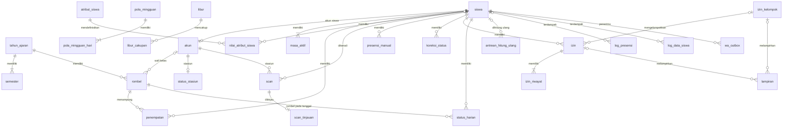

# Spensada — Database Design

| Item | Nilai |
|---|---|
| Versi | 0.2 (draft, menunggu review) |
| Tanggal | 2026-10-04 |
| Sumber | Discovery Session 5 (Database Architecture). Diperbarui dengan keputusan Session 6 (System Architecture, §2.4). |
| Bergantung pada | [00-project-overview.md](00-project-overview.md): label status, glosarium, risiko (`R-xx`), dan pertanyaan terbuka (`OQ-xx`). [01-product-requirements.md](01-product-requirements.md): requirement (`FR-*`, `NFR-*`). [02-user-roles-and-permissions.md](02-user-roles-and-permissions.md): hak akses (`HA-*`). [04-feature-specification.md](04-feature-specification.md): fitur (`FS-*`), bagian "Data dan log", dan ketentuan umum (§4). [05-business-rules.md](05-business-rules.md): aturan bisnis (`BR-*`) dan kebutuhan data (§14). |
| Dokumen terkait | [13-reporting-import-export.md](13-reporting-import-export.md): laporan, import, dan export yang membaca dan menulis tabel di dokumen ini. [07-system-architecture.md](07-system-architecture.md): mekanisme hitung ulang, penguncian, sesi, dan kiosk yang memakai tabel di dokumen ini. |

Dokumen ini menetapkan desain database Spensada: konvensi, daftar tabel, kolom, tipe, relasi, kunci unik, dan index. Dokumen ini juga memutuskan cara menyimpan status harian (BR-STS-06), dan mencatat keputusan Session 5 atas usulan di `05` yang berdampak ke data.

Tabel R1 dirinci penuh. Tabel R2 (notifikasi WhatsApp) juga dirinci, agar R2 tidak memerlukan perubahan skema besar. Kebutuhan R3 hanya dicatat.

## 1. Cara membaca dokumen ini

- **ID.** Aturan desain data memakai ID `DB-<NN>`. ID tidak pernah dinomori ulang. Aturan yang batal ditandai `DEPRECATED`.
- **Status.** Label status mengikuti `00`. Rincian teknis yang tidak dibahas di ronde diskusi Session 5 berstatus RECOMMENDATION. Rincian itu menjadi arah kerja Session 6–8 dan implementasi sampai dikonfirmasi atau diganti.
- **Nama tabel dan kolom.** Nama di dokumen ini adalah nama final untuk migration (DB-01). Nama yang diawali tanda pagar, misalnya `#AJ`, adalah singkatan kelompok kolom di dokumen ini, bukan nama kolom.
- **Tipe.** Tipe ditulis dalam tipe MySQL 8.4. `INT` berarti `INT UNSIGNED`, dan `BIGINT` berarti `BIGINT UNSIGNED`, kecuali disebut lain.
- **Kolom tabel.** Kolom "Null" berisi "Ya" bila kolom boleh kosong. Kolom "Keterangan" memuat isi, kode nilai, dan aturan.
- **Kode nilai.** Kolom berkode memakai kata huruf kecil dengan garis bawah, misalnya `tidak_hadir`. Daftar kodenya ada di keterangan kolom. Label di antarmuka ditetapkan di Session 7.
- **Mekanisme.** Cara teknis seperti antrean hitung ulang, cron, dan penguncian ditetapkan di `07` (Session 6). Dokumen ini hanya menetapkan data yang dibutuhkan dan aturan integritasnya.

## 2. Keputusan Session 5

### 2.1 Keputusan desain data

| Topik | Keputusan | Rujukan | Status |
|---|---|---|---|
| Bahasa nama | Nama tabel dan kolom memakai istilah domain berbahasa Indonesia sesuai glosarium, bentuk tunggal, `snake_case`. Kolom waktu bawaan CodeIgniter 4 tetap `created_at` dan `updated_at`. | DB-01, DB-02 | DECISION |
| Status harian | Disimpan sebagai salinan di tabel `status_harian`, satu baris per siswa per hari sekolah. Salinan diperbarui setiap kali sumbernya berubah. Bagian yang bergantung pada jam sekarang (belum hadir atau Alpa pada hari ini, dan kejadian tidak scan pulang pada hari ini) diturunkan saat dibaca, sehingga tidak perlu cron untuk menutup sesi. | BR-STS-06, DB-12, §11 | DECISION |
| Atribut siswa | Selain NISN, nama, nomor WA, foto, dan status, siswa memiliki jenis kelamin, NIS, nama orang tua/wali, tanggal lahir, dan alamat rumah. Semuanya opsional. | FR-MD-03, §6.5 | DECISION |
| Atribut tambahan | Admin dapat menambah atribut siswa sendiri: label, tipe (teks, angka, tanggal, pilihan), wajib atau tidak, dan urutan. Nilainya disimpan per siswa, tampil di profil, dan dapat diisi lewat import. Atribut tambahan tidak dipakai logika presensi, rekap, atau filter laporan. | FR-MD-10, §6.8 | DECISION |
| Masa aktif | Disimpan sebagai periode aktif di tabel tersendiri, sehingga siswa yang dinonaktifkan lalu diaktifkan kembali tetap memiliki riwayat yang benar. | BR-KAL-06, §6.6 | DECISION |
| Alasan penonaktifan | Lulus, pindah sekolah, keluar, meninggal dunia, salah input, dan lainnya. | FS-MD-04, §6.6 | DECISION |
| Lampiran izin | Paling banyak 3 file per data izin/sakit/dispensasi. | BR-IZN-12, §10.4 | DECISION |
| Retensi | R1 tidak menghapus data presensi, scan, maupun log. Kebijakan retensi menurut UU 27/2022 diputuskan di Session 9. | DB-13 | DECISION |

### 2.2 Tinjauan RECOMMENDATION di `05`

| Aturan | Usulan sebelumnya | Hasil Session 5 |
|---|---|---|
| BR-KAL-06 | Sistem mengetahui masa aktif siswa dan rombelnya pada setiap tanggal. | Disetujui. Masa aktif disimpan sebagai periode (`masa_aktif`), dan rombel per tanggal sebagai penempatan (`penempatan`). (DECISION) |
| BR-SCN-03 | Scan ganda dari stasiun lain disimpan dengan tanda "ganda" dan tidak dipakai. | Disetujui. (DECISION) |
| BR-REK-04 | Hari berjalan yang belum final tidak dihitung sebagai hari sekolah siswa yang masih "belum hadir". | Disetujui. (DECISION) |
| BR-REK-05 | Rekap per rombel memakai rombel siswa pada setiap tanggal. | Disetujui. Rombel pada tanggal itu disalin ke `status_harian`. (DECISION) |
| BR-KOR-10 | Cakupan log diperluas ke tinjauan scan, kalender, semester, dan batas mundur. | Disetujui. Daftar jenis entri ada di §12.1. (DECISION) |

### 2.3 Keputusan laporan, import, dan export

Keputusan OQ-11, OQ-12, kolom template import, perlakuan NISN yang sudah ada, penempatan massal, dan pembulatan persentase ditulis di `13` §2.

### 2.4 Keputusan Session 6

Keputusan Session 6 yang berdampak ke desain data. Rinciannya ada di `07` §2.

| Topik | Keputusan | Rujukan | Status |
|---|---|---|---|
| Hitung ulang | Setiap perubahan sumber menulis antrean di tabel `antrean_hitung_ulang` dalam transaksi yang sama, lalu antrean diproses. | §11.5, `07` ARS-35 | DECISION |
| Perubahan bersamaan | `updated_at` dipakai sebagai token versi. | DB-11, `07` ARS-40 | DECISION |
| Sesi login | Sesi disimpan sebagai file, sehingga tidak ada tabel sesi. | §5.4, `07` ARS-47 | DECISION |
| Usulan Session 5 | Periode aktif yang dibatalkan tidak dihitung (§6.6 aturan 4), tingkat rombel dikunci setelah ada penempatan (§6.4), lampiran bersama satu kelompok paling banyak 3 file (§10.4), serta nama tabel `nilai_atribut_siswa` dan `wa_outbox` (§4.1) disetujui. | `07` §2.2 | DECISION |
| Format versi data dan ID scan | `versi_data` berupa hash SHA-1 sepanjang 40 karakter heksadesimal, dan `uuid` scan berupa UUID versi 4. | §8.1, §8.2, `07` ARS-23, ARS-24 | RECOMMENDATION |

## 3. Konvensi

| ID | Aturan | Status |
|---|---|---|
| DB-01 | **Bahasa dan bentuk nama.** Nama tabel dan kolom memakai istilah domain berbahasa Indonesia sesuai glosarium (`00` §9), bentuk tunggal, huruf kecil, `snake_case`, tanpa singkatan yang tidak umum. Contohnya `siswa`, `rombel`, `penempatan`, `presensi_manual`, dan `koreksi_status`. Kolom teknis umum tetap `id` dan `<tabel>_id`. | DECISION |
| DB-02 | **Kolom waktu CI4.** Tabel yang barisnya dapat diubah memiliki `created_at` dan `updated_at` (DATETIME), diisi otomatis oleh Model CI4 (`$useTimestamps`). Pengecualiannya: tabel yang barisnya hanya ditambah atau dihapus, seperti `scan`, `akun_role`, dan log, cukup memiliki `created_at` atau kolom waktu bernama sesuai isinya; tabel keadaan dan pengaturan (`pengaturan`, `status_stasiun`, `wa_template`) cukup memiliki `updated_at`; tabel anak yang selalu ditulis bersama induknya (`pola_mingguan_hari`, `libur_cakupan`) tidak memiliki kolom waktu sendiri; dan salinan `status_harian` memakai `dihitung_at`. Fitur soft delete CI4 (`deleted_at`) tidak dipakai, karena pembatalan dan penghapusan membutuhkan alasan dan pelaku (DB-09). | DECISION (nama kolom waktu); RECOMMENDATION (pengecualian dan tanpa soft delete) |
| DB-03 | **Primary key.** Setiap tabel memiliki primary key satu kolom, agar dapat dipakai Model CI4. Tabel entitas memakai `id` `INT UNSIGNED AUTO_INCREMENT`, dan tabel bervolume tinggi memakai `BIGINT UNSIGNED`: `scan`, `status_harian`, `antrean_hitung_ulang`, `log_presensi`, `log_data_siswa`, `log_aktivitas`, dan `wa_outbox`. Pengecualiannya tiga tabel yang primary key-nya kunci alami: `pengaturan` (`kunci`), `status_stasiun` (`akun_id`), dan `wa_template` (`jenis_kejadian`). Pasangan yang harus unik, seperti akun dan role, memakai kunci unik di samping `id`. NISN bukan primary key. NISN disimpan sebagai teks dengan kunci unik, sehingga koreksi NISN tidak mengubah relasi (R-12). | RECOMMENDATION |
| DB-04 | **Engine dan charset.** InnoDB, `utf8mb4`, dan `utf8mb4_general_ci`, sesuai `app/Config/Database.php`. | CONFIRMED (charset di konfigurasi); RECOMMENDATION (InnoDB) |
| DB-05 | **Waktu.** Kolom tanggal-waktu memakai `DATETIME` berisi jam WIB, bukan `TIMESTAMP`. Zona waktu sesi MySQL diset `+07:00`, dan `appTimezone` diset `Asia/Jakarta` (`05` §14, R-11). Tanggal presensi memakai `DATE` menurut WIB. Jam pada aturan jam memakai `TIME`. Ketelitian sampai detik. | DECISION (WIB, OQ-05); RECOMMENDATION (tipe) |
| DB-06 | **Kode nilai.** Kolom berkode memakai `VARCHAR` berisi kode huruf kecil, bukan tipe `ENUM` MySQL, agar penambahan kode tidak mengubah struktur kolom. Server memvalidasi kode dari daftar di dokumen ini. Kolom ya/tidak memakai `TINYINT(1)`. | RECOMMENDATION |
| DB-07 | **Pelaku.** Kolom pelaku diberi akhiran `_oleh`, misalnya `dibuat_oleh` dan `dibatalkan_oleh`, dan merujuk `akun.id`. Nilai kosong berarti tindakan oleh sistem, misalnya mode darurat yang berakhir otomatis. | RECOMMENDATION |
| DB-08 | **Foreign key.** Semua relasi memakai foreign key dengan `ON DELETE RESTRICT` dan `ON UPDATE RESTRICT`. Data yang sudah dirujuk tidak dapat dihapus. Akun dan siswa dinonaktifkan, bukan dihapus (`02` §2 butir 5, FS-MD-04). | RECOMMENDATION |
| DB-09 | **Pembatalan dan penghapusan.** Data transaksi tidak pernah dihapus. Contohnya scan, presensi manual, koreksi, izin, mode darurat, dan log. Pembatalan disimpan di kolom data itu sendiri: waktu, pelaku, dan alasan. Data pengaturan kalender boleh dihapus secara fisik, yaitu versi pola mingguan yang belum berlaku, jadwal khusus, jadwal hari ini, dan libur, karena log perubahan presensi menyimpan data lamanya secara lengkap. | RECOMMENDATION |
| DB-10 | **Satu data aktif.** Aturan "paling banyak satu data aktif" ditegakkan database dengan kolom turunan (generated column) yang bernilai 1 saat data aktif dan `NULL` saat tidak aktif, ditambah kunci unik. Contoh di bawah tabel ini. Kolom ini ditulis dengan SQL langsung di migration, karena Forge CI4 belum mendukung generated column. | RECOMMENDATION |
| DB-11 | **Perubahan bersamaan.** Pemeriksaan "data belum diubah orang lain" (`04` §4.6) memakai `updated_at` sebagai token versi. Formulir membawa nilai `updated_at` saat dibuka. Penyimpanan memakai `UPDATE ... WHERE id = ? AND updated_at = ?`, sehingga ditolak bila nilainya sudah berbeda. Rinciannya di `07` ARS-40 dan ARS-41. | DECISION (Session 6) |
| DB-12 | **Salinan status harian.** Status harian disimpan sebagai salinan yang selalu dapat dibangun ulang dari sumbernya (§11). Salinan tidak pernah diubah langsung oleh pengguna. | DECISION |
| DB-13 | **Retensi.** R1 tidak menghapus data presensi, scan, izin, maupun log. Penghapusan data pengaturan mengikuti DB-09. Kolom `tanggal` di tabel bervolume tinggi memungkinkan pengarsipan per tahun ajaran bila Session 9 memutuskannya. | DECISION |
| DB-14 | **Isi log.** Data lama dan data baru di log disimpan sebagai `JSON`, berisi kolom yang berubah beserta konteks yang dibutuhkan untuk dibaca tanpa tabel lain, misalnya nama siswa dan tanggal. | RECOMMENDATION |
| DB-15 | **File.** Foto, lampiran, dan logo disimpan sebagai file di `writable/uploads/`, di luar `public/` (`04` §4.9). Database menyimpan path relatif. Untuk lampiran, database juga menyimpan nama asli, tipe, dan ukuran file (§10.4). Nama file di disk dibuat acak, tidak memuat NISN atau nama siswa. | RECOMMENDATION |
| DB-16 | **Kunci unik dari kiosk.** Setiap scan disimpan dengan ID unik dari kiosk sebagai kunci unik. Kiriman ulang dengan ID yang sama tidak membuat baris baru (BR-SCN-05, NFR-04). | RECOMMENDATION |

Contoh DB-10 untuk presensi manual:

```sql
aktif_kunci TINYINT AS (IF(dibatalkan_at IS NULL, 1, NULL)) STORED,
UNIQUE KEY uq_presensi_manual_aktif (siswa_id, tanggal, jenis, aktif_kunci)
```

MySQL mengizinkan banyak baris dengan `aktif_kunci` `NULL`, sehingga presensi yang dibatalkan tidak bentrok dengan presensi pengganti.

## 4. Gambaran umum

### 4.1 Daftar tabel

| Kelompok | Tabel | Isi | Rilis | Fitur | Status |
|---|---|---|---|---|---|
| Akun | `akun` | Akun staf, siswa, dan stasiun | R1 | FS-AKN-01 s.d. FS-AKN-05 | RECOMMENDATION |
| Akun | `akun_role` | Role yang diberikan admin ke akun staf | R1 | FS-AKN-03 | RECOMMENDATION |
| Akun | `log_aktivitas` | Kerangka log aktivitas akun, pengaturan, dan import | R1 | FS-AKN-01 s.d. FS-AKN-05, FS-MD-01, FS-MD-03, FS-MD-06 | RECOMMENDATION (rincian di Session 9) |
| Pengaturan | `pengaturan` | Identitas sekolah dan nilai yang diatur admin | R1 | FS-MD-01, FS-PRS-10, FS-WA-01 | RECOMMENDATION |
| Master data | `tahun_ajaran` | Tahun ajaran dan tanda aktif | R1 | FS-MD-02 | RECOMMENDATION |
| Master data | `semester` | Dua semester per tahun ajaran | R1 | FS-MD-02 | RECOMMENDATION |
| Master data | `rombel` | Rombel per tahun ajaran dan wali kelasnya | R1 | FS-MD-03 | RECOMMENDATION |
| Master data | `siswa` | Data siswa | R1 | FS-MD-04, FS-MD-07, FS-MD-08 | DECISION (atribut); RECOMMENDATION (kolom) |
| Master data | `masa_aktif` | Periode aktif siswa | R1 | FS-MD-04 | DECISION (periode aktif); RECOMMENDATION (kolom) |
| Master data | `penempatan` | Rombel siswa dengan tanggal mulai dan selesai | R1 | FS-MD-05 | DECISION (per tanggal, BR-REK-05); RECOMMENDATION (kolom) |
| Master data | `atribut_siswa` | Definisi atribut tambahan siswa | R1 | FS-MD-09 | DECISION (atribut tambahan); RECOMMENDATION (kolom) |
| Master data | `nilai_atribut_siswa` | Nilai atribut tambahan per siswa | R1 | FS-MD-09 | DECISION (atribut tambahan; nama tabel, Session 6); RECOMMENDATION (kolom) |
| Kalender | `pola_mingguan` | Versi pola mingguan | R1 | FS-PRS-01 | RECOMMENDATION |
| Kalender | `pola_mingguan_hari` | Hari sekolah dan aturan jam per hari dalam satu versi | R1 | FS-PRS-01 | RECOMMENDATION |
| Kalender | `jadwal_khusus` | Aturan jam untuk tanggal atau rentang tanggal | R1 | FS-PRS-02 | RECOMMENDATION |
| Kalender | `jadwal_hari_ini` | Aturan jam hari berjalan yang diubah admin atau guru piket | R1 | FS-PRS-04 | RECOMMENDATION |
| Kalender | `libur` | Libur dengan rentang tanggal dan keterangan | R1 | FS-PRS-03 | RECOMMENDATION |
| Kalender | `libur_cakupan` | Tingkat atau rombel yang diliburkan | R1 | FS-PRS-03 | RECOMMENDATION |
| Kiosk | `status_stasiun` | Keadaan terakhir setiap stasiun | R1 | FS-KIO-04, FS-KIO-05 | RECOMMENDATION |
| Kiosk | `scan` | Catatan scan yang diterima server | R1 | FS-KIO-04 | RECOMMENDATION |
| Kiosk | `scan_tinjauan` | Hasil tinjauan scan bertanda | R1 | FS-KIO-06 | RECOMMENDATION |
| Presensi | `presensi_manual` | Presensi manual, termasuk presensi per rombel saat darurat | R1 | FS-PRS-06, FS-PRS-09 | RECOMMENDATION |
| Presensi | `koreksi_status` | Koreksi status dan penggantian atau penghapusannya | R1 | FS-PRS-07 | RECOMMENDATION |
| Presensi | `mode_darurat` | Periode mode darurat | R1 | FS-PRS-08 | RECOMMENDATION |
| Presensi | `status_harian` | Salinan status harian, presensi masuk dan pulang, kejadian, dan penanda | R1 | FS-PRS-05 | DECISION (salinan); RECOMMENDATION (kolom) |
| Presensi | `antrean_hitung_ulang` | Antrean hitung ulang status | R1 | FS-PRS-05 | DECISION (antrean, Session 6); RECOMMENDATION (kolom) |
| Izin | `izin` | Data izin, sakit, dan dispensasi | R1 | FS-IZN-01 s.d. FS-IZN-05 | RECOMMENDATION |
| Izin | `izin_riwayat` | Riwayat keputusan setiap data izin | R1 | FS-IZN-01, FS-IZN-04, FS-IZN-05 | RECOMMENDATION |
| Izin | `izin_kelompok` | Kelompok dispensasi massal | R1 | FS-IZN-03 | RECOMMENDATION |
| Izin | `lampiran` | File lampiran surat | R1 | FS-IZN-01 s.d. FS-IZN-03, FS-IZN-06 | DECISION (maks. 3 file); RECOMMENDATION (kolom) |
| Log | `log_presensi` | Log perubahan presensi | R1 | FS-PRS-11 | DECISION (cakupan, BR-KOR-10); RECOMMENDATION (kolom) |
| Log | `log_data_siswa` | Log data siswa | R1 | FS-MD-04, FS-MD-05, FS-MD-07, FS-MD-08 | RECOMMENDATION |
| Notifikasi | `wa_template` | Jenis kejadian aktif dan template pesan | R2 | FS-WA-01 | RECOMMENDATION |
| Notifikasi | `wa_outbox` | Antrean pesan WhatsApp | R2 | FS-WA-02, FS-WA-03 | DECISION (nama tabel, Session 6); RECOMMENDATION (kolom) |
| Notifikasi | `wa_penahanan` | Penahanan pesan per tanggal dan jenis | R2 | FS-WA-03 | RECOMMENDATION |

Total 32 tabel R1 dan 3 tabel R2. Kebutuhan R3 ada di §14.2. Sesi login disimpan sebagai file, sehingga tidak ada tabel sesi. Pembatasan percobaan login ditetapkan di Session 9 (§5.4).

### 4.2 Relasi utama



Kolom pelaku (`*_oleh`) merujuk `akun` dan tidak digambar di diagram.

### 4.3 Kelompok kolom aturan jam (`#AJ`)

Tujuh isian aturan jam (`05` §4.1) dipakai di `pola_mingguan_hari`, `jadwal_khusus`, dan `jadwal_hari_ini` dengan nama kolom yang sama:

| Kolom | Tipe | Isi |
|---|---|---|
| `jam_buka_masuk` | TIME | Jam buka scan masuk. |
| `jam_masuk` | TIME | Jam masuk resmi. |
| `toleransi_menit` | SMALLINT | Toleransi terlambat dalam menit, ≥ 0. |
| `jam_tutup_masuk` | TIME | Jam tutup sesi masuk. |
| `jam_buka_pulang` | TIME | Jam buka scan pulang. |
| `jam_pulang` | TIME | Jam pulang resmi. |
| `jam_tutup_pulang` | TIME | Jam tutup sesi pulang. |

Batas terlambat tidak disimpan. Nilainya dihitung sebagai `jam_masuk + toleransi_menit`. Urutan jam divalidasi server sesuai BR-JAM-02. Detik selalu `00`.

## 5. Akun

### 5.1 `akun`

Satu tabel untuk tiga jenis akun (`02` §2). Role Staf, Siswa, dan Stasiun didapat dari jenis akun. Role Wali kelas didapat dari `rombel.wali_kelas_id` pada tahun ajaran aktif (`02` §3). Role lain disimpan di `akun_role`.

| Kolom | Tipe | Null | Keterangan |
|---|---|---|---|
| `id` | INT | | Primary key. |
| `jenis` | VARCHAR(10) | | `staf`, `siswa`, atau `stasiun`. |
| `username` | VARCHAR(50) | | Identitas login. Unik. Akun siswa memakai NISN, dan ikut berubah saat NISN dikoreksi (FS-MD-04). Username staf dan stasiun tidak boleh hanya berisi angka (`02` §2 butir 4). |
| `nama` | VARCHAR(100) | Ya | Nama staf atau nama stasiun, misalnya "Gerbang 1". Kosong untuk akun siswa; namanya diambil dari `siswa`. |
| `siswa_id` | INT | Ya | Wajib untuk akun siswa, kosong untuk jenis lain. Unik. |
| `password_hash` | VARCHAR(255) | Ya | Hash password (`02` §2 butir 6). Kosong untuk akun siswa yang belum pernah dibuatkan password. |
| `status` | VARCHAR(12) | | `belum_aktif` (hanya akun siswa), `aktif`, atau `nonaktif`. |
| `wajib_ganti_password` | TINYINT(1) | | 1 selama akun memakai password awal atau password hasil reset. |
| `password_diganti_at` | DATETIME | Ya | Waktu penggantian password terakhir. |
| `slip_dibuat_at` | DATETIME | Ya | Waktu slip akun terakhir dibuat (akun siswa). |
| `login_terakhir_at` | DATETIME | Ya | Waktu login terakhir yang berhasil. |
| `created_at`, `updated_at` | DATETIME | | DB-02. |

Kunci dan index: unik (`username`); unik (`siswa_id`); index (`jenis`, `status`).

### 5.2 `akun_role`

| Kolom | Tipe | Null | Keterangan |
|---|---|---|---|
| `id` | INT | | Primary key. |
| `akun_id` | INT | | Akun staf. |
| `role` | VARCHAR(20) | | `admin`, `guru_piket`, `guru_bk`, atau `pimpinan`. |
| `diberikan_oleh` | INT | Ya | Admin yang memberi role. Kosong untuk admin pertama yang dibuat saat instalasi. |
| `created_at` | DATETIME | | Waktu role diberikan. |

Kunci dan index: unik (`akun_id`, `role`). Pencabutan role menghapus baris ini dan dicatat di log aktivitas (FS-AKN-03).

### 5.3 `log_aktivitas`

Kerangka untuk log aktivitas akun (`04` §4.4 butir 5), log aktivitas pengaturan (FS-MD-01), dan log import (FS-MD-06). Daftar jenis dan isinya dirinci di Session 9.

| Kolom | Tipe | Null | Keterangan |
|---|---|---|---|
| `id` | BIGINT | | Primary key. |
| `jenis` | VARCHAR(40) | | Contoh: `login_gagal`, `password_diganti`, `password_direset`, `role_diubah`, `akun_dinonaktifkan`, `slip_dicetak`, `wali_kelas_diubah`, `pengaturan_diubah`, `import_siswa`, `import_penempatan`, `foto_massal`. |
| `pelaku_id` | INT | Ya | Akun pelaku. Kosong untuk sistem atau untuk login gagal tanpa akun yang dikenali. |
| `akun_id` | INT | Ya | Akun yang terdampak. |
| `rombel_id` | INT | Ya | Rombel yang terdampak, misalnya pada cetak slip. |
| `data` | JSON | Ya | Rincian, misalnya nama file import dan jumlah baris. Tidak pernah memuat password. |
| `ip` | VARCHAR(45) | Ya | Alamat IP. |
| `created_at` | DATETIME | | Waktu kejadian. |

Kunci dan index: index (`jenis`, `created_at`); index (`akun_id`, `created_at`); index (`pelaku_id`, `created_at`).

### 5.4 Sesi dan percobaan login

Sesi CI4 disimpan sebagai file di `writable/session`, sehingga tidak ada tabel sesi (DECISION, Session 6, `07` ARS-47). Pembatasan percobaan login (NFR-08) ditetapkan di Session 9, termasuk apakah memakai cache CI4 atau tabel tersendiri. Keduanya tidak memengaruhi tabel lain.

## 6. Pengaturan dan master data

### 6.1 `pengaturan`

Pasangan kunci dan nilai untuk nilai yang diatur admin, ditambah satu penanda keadaan yang diatur sistem. Nilai teknis lain yang tidak diatur admin, seperti toleransi selisih jam, disimpan di konfigurasi aplikasi (`07` ARS-17).

| Kolom | Tipe | Null | Keterangan |
|---|---|---|---|
| `kunci` | VARCHAR(60) | | Primary key. |
| `nilai` | TEXT | Ya | Nilai sebagai teks. Tipe dan validasinya mengikuti daftar kunci. |
| `updated_at` | DATETIME | | Waktu perubahan terakhir. |
| `diubah_oleh` | INT | Ya | Akun pengubah. |

Daftar kunci:

| Kunci | Default | Diatur oleh | Rilis | Rujukan |
|---|---|---|---|---|
| `sekolah_nama` | Kosong | Admin | R1 | FS-MD-01 |
| `sekolah_alamat` | Kosong | Admin | R1 | FS-MD-01 |
| `sekolah_logo` | Kosong (path file, DB-15) | Admin | R1 | FS-MD-01 |
| `batas_mundur_hari` | 7 | Admin | R1 | BR-MUN-01, FS-PRS-10 |
| `wa_tunda_menit` | 60 | Admin | R2 | BR-WA-02 |
| `wa_ambang_persen` | 50 | Admin | R2 | BR-WA-03 |
| `status_dibangun_sampai` | Kosong | Sistem | R1 | §11.4 |

Kredensial gateway WhatsApp tidak disimpan di tabel ini. Tempatnya ditetapkan di Session 9, sebelum R2 (OQ-10).

### 6.2 `tahun_ajaran`

| Kolom | Tipe | Null | Keterangan |
|---|---|---|---|
| `id` | INT | | Primary key. |
| `nama` | VARCHAR(20) | | Misalnya "2026/2027". Unik. |
| `tanggal_mulai` | DATE | | |
| `tanggal_selesai` | DATE | | Setelah tanggal mulai. Rentang tidak tumpang tindih dengan tahun ajaran lain (diperiksa server). |
| `aktif` | TINYINT(1) | | 1 untuk tahun ajaran aktif. |
| `aktif_kunci` | TINYINT | Ya | Kolom turunan DB-10: `IF(aktif = 1, 1, NULL)`. |
| `created_at`, `updated_at` | DATETIME | | |

Kunci dan index: unik (`nama`); unik (`aktif_kunci`), sehingga paling banyak satu tahun ajaran aktif. Server menjaga agar tepat satu tahun ajaran aktif, dengan menonaktifkan tahun ajaran lama dan mengaktifkan yang baru dalam satu transaksi (FS-MD-02).

### 6.3 `semester`

| Kolom | Tipe | Null | Keterangan |
|---|---|---|---|
| `id` | INT | | Primary key. |
| `tahun_ajaran_id` | INT | | |
| `jenis` | VARCHAR(6) | | `ganjil` atau `genap`. |
| `tanggal_mulai`, `tanggal_selesai` | DATE | | Di dalam tahun ajaran, tidak tumpang tindih. |
| `created_at`, `updated_at` | DATETIME | | |

Kunci dan index: unik (`tahun_ajaran_id`, `jenis`); index (`tanggal_mulai`, `tanggal_selesai`).

### 6.4 `rombel`

| Kolom | Tipe | Null | Keterangan |
|---|---|---|---|
| `id` | INT | | Primary key. |
| `tahun_ajaran_id` | INT | | |
| `nama` | VARCHAR(20) | | Misalnya "7A". Unik di dalam tahun ajaran. |
| `tingkat` | TINYINT | | 7, 8, atau 9 (FS-MD-03). |
| `wali_kelas_id` | INT | Ya | Akun staf wali kelas. Satu rombel paling banyak satu wali kelas. |
| `created_at`, `updated_at` | DATETIME | | |

Kunci dan index: unik (`tahun_ajaran_id`, `nama`); index (`wali_kelas_id`); index (`tahun_ajaran_id`, `tingkat`).

Riwayat pergantian wali kelas dicatat di `log_aktivitas` (FS-MD-03).

Tingkat rombel tidak dapat diubah setelah rombel memiliki penempatan siswa, karena libur per tingkat dan `status_harian.tingkat` bergantung padanya (FS-MD-03). (DECISION, Session 6)

### 6.5 `siswa`

| Kolom | Tipe | Null | Keterangan |
|---|---|---|---|
| `id` | INT | | Primary key. |
| `nisn` | CHAR(10) | | Tepat 10 digit angka, disimpan sebagai teks (R-12). Unik di antara semua siswa, aktif maupun nonaktif. |
| `nis` | VARCHAR(20) | Ya | Nomor induk sekolah. Informasi saja; login dan QR tetap memakai NISN. Unik bila diisi. |
| `nama` | VARCHAR(100) | | Nama lengkap. |
| `jenis_kelamin` | CHAR(1) | Ya | `L` atau `P`. |
| `tanggal_lahir` | DATE | Ya | |
| `alamat` | VARCHAR(255) | Ya | Alamat rumah. |
| `nama_ortu` | VARCHAR(100) | Ya | Nama orang tua/wali. Dapat dipakai di template pesan WA (R2). |
| `wa_ortu` | VARCHAR(15) | Ya | Nomor WA orang tua/wali dalam format baku yang diawali 62, 10–15 digit (FS-MD-04). |
| `foto_file` | VARCHAR(255) | Ya | Path relatif file foto (DB-15). Kosong berarti siswa tanpa foto. |
| `foto_diganti_at` | DATETIME | Ya | Waktu penggantian foto terakhir. Dipakai juga kiosk untuk mengetahui foto yang perlu dimuat ulang. |
| `created_at`, `updated_at` | DATETIME | | |

Kunci dan index: unik (`nisn`); unik (`nis`); index (`nama`); index (`wa_ortu`), untuk filter "tanpa nomor WA".

Tabel ini tidak memiliki kolom status siswa. Status siswa pada suatu tanggal diturunkan dari `masa_aktif` (§6.6). Semua atribut selain NISN dan nama bersifat opsional (DECISION, Session 5). Atribut lain ditambahkan admin lewat `atribut_siswa` (§6.8).

### 6.6 `masa_aktif`

Satu baris per periode aktif (BR-KAL-06, DECISION Session 5). Siswa baru memiliki satu periode terbuka. Penonaktifan menutup periode itu. Pengaktifan kembali membuat periode baru (FS-MD-04 butir 5).

| Kolom | Tipe | Null | Keterangan |
|---|---|---|---|
| `id` | INT | | Primary key. |
| `siswa_id` | INT | | |
| `tanggal_mulai` | DATE | | Tanggal mulai aktif. |
| `tanggal_selesai` | DATE | Ya | Tanggal terakhir aktif. Kosong berarti masih aktif. Tidak boleh tanggal ke depan (FS-MD-04 E4). |
| `alasan_nonaktif` | VARCHAR(20) | Ya | Diisi saat periode ditutup: `lulus`, `pindah_sekolah`, `keluar`, `meninggal_dunia`, `salah_input`, atau `lainnya` (DECISION, Session 5). |
| `keterangan_nonaktif` | VARCHAR(255) | Ya | Wajib bila alasan `lainnya`. |
| `dibatalkan` | TINYINT(1) | | 1 bila periode dibatalkan (aturan 4). Periode yang dibatalkan tidak dihitung sebagai masa aktif. |
| `dibuat_oleh` | INT | Ya | Pembuat periode. |
| `dinonaktifkan_oleh` | INT | Ya | Pelaku penonaktifan. |
| `terbuka_kunci` | TINYINT | Ya | Kolom turunan DB-10: `IF(tanggal_selesai IS NULL, 1, NULL)`. |
| `created_at`, `updated_at` | DATETIME | | |

Kunci dan index: unik (`siswa_id`, `terbuka_kunci`), sehingga paling banyak satu periode terbuka; index (`siswa_id`, `tanggal_mulai`).

Aturan:

1. Periode yang dihitung adalah periode dengan `dibatalkan = 0`. Periode yang dihitung milik seorang siswa tidak boleh tumpang tindih. Server memeriksanya di dalam transaksi (§16).
2. Siswa S aktif pada tanggal T bila ada periode yang dihitung dengan `tanggal_mulai ≤ T` dan (`tanggal_selesai` kosong atau `tanggal_selesai ≥ T`) (BR-KAL-05 syarat 4).
3. Penonaktifan biasa mengisi `tanggal_selesai` dengan tanggal antara `tanggal_mulai` dan hari ini.
4. Periode dibatalkan bila ditutup dengan alasan `salah_input`, atau bila periode itu belum dimulai saat siswa dinonaktifkan, misalnya siswa hasil import sebelum tahun ajaran dimulai. Admin tidak mengisi tanggal terakhir aktif; `tanggal_selesai` diisi sama dengan `tanggal_mulai`, dan `dibatalkan` bernilai 1. Siswa tidak memiliki status pada tanggal mana pun dalam periode itu, dan status tanggal tersebut dihitung ulang. (DECISION, Session 6)
5. Status siswa yang ditampilkan di daftar siswa adalah "aktif" bila siswa aktif pada hari ini. Siswa dengan periode yang baru dimulai di tanggal ke depan ditampilkan "akan aktif". (RECOMMENDATION)

### 6.7 `penempatan`

Rombel siswa pada setiap tanggal (R-14, BR-REK-05).

| Kolom | Tipe | Null | Keterangan |
|---|---|---|---|
| `id` | INT | | Primary key. |
| `siswa_id` | INT | | |
| `rombel_id` | INT | | |
| `tanggal_mulai` | DATE | | Di dalam rentang tahun ajaran rombel itu. |
| `tanggal_selesai` | DATE | Ya | Kosong berarti sampai tanggal selesai tahun ajaran rombel itu. |
| `dibuat_oleh` | INT | Ya | |
| `created_at`, `updated_at` | DATETIME | | |

Kunci dan index: index (`siswa_id`, `tanggal_mulai`); index (`rombel_id`, `tanggal_mulai`).

Aturan:

1. Tanggal selesai efektif adalah `tanggal_selesai`, atau tanggal selesai tahun ajaran rombel bila kosong. Penempatan seorang siswa tidak boleh tumpang tindih menurut tanggal selesai efektif (FS-MD-05 butir 1). Server memeriksanya di dalam transaksi (§16).
2. Pindah rombel mengisi `tanggal_selesai` penempatan lama dengan sehari sebelum tanggal mulai yang baru (FS-MD-05 butir 2).
3. Kenaikan kelas membuat penempatan baru di rombel tahun ajaran baru. Penempatan tahun ajaran lama berakhir sendiri pada tanggal selesai tahun ajarannya, sehingga tidak perlu diubah.
4. Rombel S pada tanggal T adalah rombel dari penempatan yang mencakup T. Bila tidak ada, T bukan hari sekolah bagi S (BR-KAL-05 syarat 4).

### 6.8 `atribut_siswa`

Definisi atribut tambahan yang dibuat admin (FR-MD-10, DECISION Session 5). Pengelolaannya dirinci di `04` FS-MD-09.

| Kolom | Tipe | Null | Keterangan |
|---|---|---|---|
| `id` | INT | | Primary key. |
| `kode` | VARCHAR(30) | | Huruf kecil, angka, dan garis bawah, diawali huruf. Dipakai sebagai judul kolom di template import (`13` IM-01). Unik, tidak boleh sama dengan judul kolom bawaan template import tanpa membedakan huruf besar dan kecil (`13` §6.1), dan tidak dapat diubah setelah dibuat. |
| `label` | VARCHAR(60) | | Label di formulir dan profil. |
| `tipe` | VARCHAR(10) | | `teks`, `angka`, `tanggal`, atau `pilihan`. Tidak dapat diubah setelah ada nilai. |
| `pilihan` | JSON | Ya | Daftar pilihan untuk tipe `pilihan`. |
| `wajib` | TINYINT(1) | | 1 bila wajib diisi saat siswa ditambah atau diubah. |
| `urutan` | SMALLINT | | Urutan tampil. |
| `aktif` | TINYINT(1) | | 0 untuk atribut yang disembunyikan. Nilainya tetap tersimpan. |
| `created_at`, `updated_at` | DATETIME | | |

Kunci dan index: unik (`kode`).

### 6.9 `nilai_atribut_siswa`

| Kolom | Tipe | Null | Keterangan |
|---|---|---|---|
| `id` | INT | | Primary key. |
| `siswa_id` | INT | | |
| `atribut_id` | INT | | Definisi di `atribut_siswa`. |
| `nilai` | VARCHAR(255) | | Nilai dalam bentuk baku: tanggal `YYYY-MM-DD`, angka dengan titik desimal, dan pilihan berisi teks pilihan. Nilai kosong tidak disimpan. |
| `created_at`, `updated_at` | DATETIME | | |

Kunci dan index: unik (`siswa_id`, `atribut_id`); index (`atribut_id`).

## 7. Kalender dan aturan jam

Aturan jam untuk tanggal T diambil dengan urutan: `jadwal_hari_ini`, lalu `jadwal_khusus`, lalu versi `pola_mingguan` yang berlaku pada T (BR-JAM-10, FS-PRS-02 butir 5).

### 7.1 `pola_mingguan`

Satu baris per versi (BR-KAL-07).

| Kolom | Tipe | Null | Keterangan |
|---|---|---|---|
| `id` | INT | | Primary key. |
| `berlaku_mulai` | DATE | | Hari ini atau tanggal ke depan saat dibuat (FS-PRS-01 E2). Unik. |
| `keterangan` | VARCHAR(100) | Ya | |
| `dibuat_oleh`, `diubah_oleh` | INT | Ya | |
| `created_at`, `updated_at` | DATETIME | | |

Kunci dan index: unik (`berlaku_mulai`).

Versi yang berlaku pada T adalah versi dengan `berlaku_mulai` terbesar yang ≤ T. Versi yang sudah berlaku tidak dapat diubah atau dihapus (FS-PRS-01 butir 2).

### 7.2 `pola_mingguan_hari`

| Kolom | Tipe | Null | Keterangan |
|---|---|---|---|
| `id` | INT | | Primary key. |
| `pola_mingguan_id` | INT | | |
| `hari` | TINYINT | | 1 = Senin sampai 7 = Minggu (ISO-8601). |
| `hari_sekolah` | TINYINT(1) | | 1 bila hari sekolah. |
| `#AJ` | | Ya | Tujuh kolom aturan jam (§4.3). Wajib diisi bila hari sekolah, dan kosong bila bukan. |

Kunci dan index: unik (`pola_mingguan_id`, `hari`). Setiap versi memiliki tepat tujuh baris.

### 7.3 `jadwal_khusus`

| Kolom | Tipe | Null | Keterangan |
|---|---|---|---|
| `id` | INT | | Primary key. |
| `tanggal_mulai`, `tanggal_selesai` | DATE | | Boleh tanggal lampau. Tidak tumpang tindih dengan jadwal khusus lain (FS-PRS-02 E1). |
| `keterangan` | VARCHAR(100) | | Misalnya "Ramadan". |
| `#AJ` | | | Tujuh kolom aturan jam (§4.3). |
| `dibuat_oleh`, `diubah_oleh` | INT | Ya | |
| `created_at`, `updated_at` | DATETIME | | |

Kunci dan index: index (`tanggal_mulai`, `tanggal_selesai`).

### 7.4 `jadwal_hari_ini`

Lapisan tersendiri di atas jadwal khusus dan pola mingguan (BR-JAM-10).

| Kolom | Tipe | Null | Keterangan |
|---|---|---|---|
| `id` | INT | | Primary key. |
| `tanggal` | DATE | | Tanggal hari berjalan saat dibuat. Unik. |
| `#AJ` | | | Tujuh kolom aturan jam (§4.3). |
| `alasan` | VARCHAR(255) | | Alasan perubahan terakhir. |
| `dibuat_oleh`, `diubah_oleh` | INT | Ya | |
| `created_at`, `updated_at` | DATETIME | | |

Kunci dan index: unik (`tanggal`).

Perubahan berikutnya pada hari yang sama memperbarui baris ini. "Kembalikan jadwal semula" menghapus baris ini (DB-09). Setiap perubahan dan pengembalian dicatat di `log_presensi` dengan nilai lama, nilai baru, dan alasan (FS-PRS-04).

### 7.5 `libur`

| Kolom | Tipe | Null | Keterangan |
|---|---|---|---|
| `id` | INT | | Primary key. |
| `tanggal_mulai`, `tanggal_selesai` | DATE | | Boleh tanggal lampau. Boleh tumpang tindih dengan libur lain (FS-PRS-03 butir 3). |
| `keterangan` | VARCHAR(100) | | Tampil di kiosk. |
| `cakupan` | VARCHAR(10) | | `semua`, `tingkat`, atau `rombel`. |
| `dibuat_oleh`, `diubah_oleh` | INT | Ya | |
| `created_at`, `updated_at` | DATETIME | | |

Kunci dan index: index (`tanggal_mulai`, `tanggal_selesai`).

### 7.6 `libur_cakupan`

Diisi bila cakupan libur `tingkat` atau `rombel`.

| Kolom | Tipe | Null | Keterangan |
|---|---|---|---|
| `id` | INT | | Primary key. |
| `libur_id` | INT | | |
| `tingkat` | TINYINT | Ya | Diisi bila cakupan `tingkat`. |
| `rombel_id` | INT | Ya | Diisi bila cakupan `rombel`. |
| `cakupan_kunci` | VARCHAR(12) | | Kolom turunan: `CONCAT('t', tingkat)` atau `CONCAT('r', rombel_id)`. Dipakai untuk kunci unik, karena kunci unik biasa tidak menolak baris ganda yang berisi `NULL` (DB-10). |

Kunci dan index: unik (`libur_id`, `cakupan_kunci`); index (`rombel_id`). Tepat satu dari `tingkat` dan `rombel_id` terisi (`CHECK`).

Siswa S libur pada T bila ada libur yang mencakup T dengan cakupan `semua`, atau dengan tingkat atau rombel S pada T (BR-KAL-05 syarat 3).

### 7.7 Semester dan hari sekolah

Tanggal di luar semua semester bukan hari sekolah (BR-KAL-05 syarat 1). Hari sekolah tidak disimpan sebagai tabel tersendiri. Hari sekolah bagi siswa diturunkan dari `semester`, aturan jam (§7), `libur`, `masa_aktif`, dan `penempatan`, lalu tercermin pada keberadaan baris `status_harian` (§11).

## 8. Kiosk dan scan

### 8.1 `status_stasiun`

Satu baris per akun stasiun, diperbarui setiap kontak (FS-KIO-04 butir 7, FS-KIO-05).

| Kolom | Tipe | Null | Keterangan |
|---|---|---|---|
| `akun_id` | INT | | Primary key. Akun berjenis `stasiun`. |
| `kontak_terakhir_at` | DATETIME | Ya | Waktu permintaan terakhir dari stasiun. |
| `sinkron_terakhir_at` | DATETIME | Ya | Waktu kiriman scan terakhir yang diterima. |
| `belum_sinkron` | INT | Ya | Jumlah scan belum tersinkron yang terakhir dilaporkan. |
| `belum_sinkron_dilaporkan_at` | DATETIME | Ya | Waktu laporan itu. Dipakai untuk definisi tersinkron di BR-WA-02 syarat 3. |
| `selisih_jam_detik` | INT (bertanda) | Ya | Selisih jam laptop terhadap jam server pada pengukuran terakhir. Diukur server dari jam laptop yang dikirim kiosk di setiap kontak (`07` ARS-27). |
| `selisih_diukur_at` | DATETIME | Ya | |
| `data_dimuat_at` | DATETIME | Ya | Waktu data kiosk terakhir dimuat (FS-KIO-01). |
| `versi_data` | VARCHAR(40) | Ya | Versi data yang terakhir dimuat: 40 karakter heksadesimal, yaitu hash SHA-1 data kiosk (`07` ARS-23). |
| `updated_at` | DATETIME | | |

Jumlah scan hari ini dihitung dari `scan` dengan index (`stasiun_id`, `tanggal`).

### 8.2 `scan`

Catatan setiap scan yang diterima server. Baris hanya ditambah, tidak pernah dihapus (BR-SCN-06). Kolomnya dibagi tiga kelompok:

- **Isi scan** berasal dari kiosk dan tidak pernah diubah.
- **Penilaian saat diterima** diisi sekali saat baris dibuat, lalu tidak diubah. Kelompok ini memuat tanda yang hanya bermakna pada saat diterima.
- **Hasil** adalah kolom turunan yang diisi saat scan diterima, lalu dihitung ulang setiap kali sumbernya berubah (§11.4), termasuk tanda yang bergantung pada aturan jam dan kalender. Kolom ini bukan isi scan, sehingga perubahannya tidak melanggar BR-SCN-06.

| Kolom | Tipe | Null | Kelompok | Keterangan |
|---|---|---|---|---|
| `id` | BIGINT | | — | Primary key. |
| `uuid` | CHAR(36) | | Isi | ID unik dari kiosk (BR-SCN-05): UUID versi 4, 36 karakter huruf kecil (`07` ARS-24). Unik. |
| `stasiun_id` | INT | | Isi | Akun stasiun pengirim. |
| `nisn` | CHAR(10) | | Isi | NISN seperti yang dibaca kiosk. |
| `jenis_kiosk` | VARCHAR(6) | | Isi | `masuk` atau `pulang` menurut kiosk. |
| `status_kiosk` | VARCHAR(12) | | Isi | `hadir`, `terlambat`, `pulang`, atau `pulang_awal` menurut kiosk. |
| `jam_scan` | DATETIME | | Isi | Jam laptop ditambah selisih, dalam WIB (BR-SCN-07). |
| `jam_laptop` | DATETIME | | Isi | Jam laptop asli. |
| `selisih_detik` | INT (bertanda) | | Isi | Selisih jam yang dipakai kiosk. |
| `tanggal` | DATE | | Penilaian | Tanggal WIB dari `jam_scan`. |
| `siswa_id` | INT | Ya | Penilaian | Siswa pemilik NISN saat diterima. Kosong bila NISN tidak dikenal. |
| `diterima_at` | DATETIME | | Penilaian | Waktu server menerima scan. |
| `tanda_jam_maju` | TINYINT(1) | | Penilaian | Jam scan lebih dari toleransi di depan jam server saat diterima. |
| `tanda_selisih_berubah` | TINYINT(1) | | Penilaian | `selisih_detik` berbeda lebih dari toleransi dari selisih yang diukur server saat kiriman diterima (`07` ARS-27). |
| `tanda_sinkron_terlambat` | TINYINT(1) | | Penilaian | Diterima lebih lambat dari batas mundur setelah tanggal scan. |
| `tanda_luar_aturan` | TINYINT(1) | | Hasil | Menurut aturan jam dan kalender yang berlaku sekarang, scan berada di luar jendela atau tanggalnya bukan hari sekolah bagi siswa. Dinilai pertama kali saat diterima (BR-SCN-08), lalu dinilai ulang setiap kali aturan tanggal itu berubah (BR-JAM-11). |
| `perlu_tinjauan` | TINYINT(1) | | Hasil | 1 bila salah satu tanda bernilai 1 (BR-SCN-08). |
| `jenis` | VARCHAR(6) | Ya | Hasil | Jenis menurut aturan jam di server yang berlaku sekarang. Bila scan berada di luar kedua jendela, dipakai `jenis_kiosk`. |
| `hasil` | VARCHAR(14) | | Hasil | Lihat tabel di bawah. |
| `hasil_dihitung_at` | DATETIME | | Hasil | Waktu hasil terakhir dihitung. |

Kunci dan index: unik (`uuid`); index (`siswa_id`, `tanggal`, `jenis`, `jam_scan`) untuk penggabungan; index (`stasiun_id`, `tanggal`); index (`perlu_tinjauan`, `tanggal`); index (`tanggal`).

Kode `hasil` (BR-SCN-03, BR-SCN-08):

| Kode | Arti |
|---|---|
| `dipakai` | Scan paling awal yang dapat dipakai untuk siswa, tanggal, dan jenis itu. Scan ini menjadi kandidat presensi; presensi manual yang lebih awal tetap menang (BR-SCN-04). |
| `ganda` | Dapat dipakai, tetapi ada scan lain yang lebih awal untuk siswa, tanggal, dan jenis yang sama. |
| `tidak_dipakai` | Bertanda `tanda_luar_aturan` dan belum diterima lewat tinjauan. |
| `ditolak` | NISN tidak dikenal saat diterima, atau ditolak lewat tinjauan. |

Scan dengan tanda selain `tanda_luar_aturan` tetap dipakai selama belum ditinjau (BR-SCN-08). Karena `tanda_luar_aturan` dinilai ulang, scan yang menjadi di luar jendela setelah aturan berubah, misalnya setelah jadwal hari ini dikembalikan, masuk ke daftar tinjauan dan dapat diterima peninjau (FS-KIO-06). Sebaliknya, scan yang kembali berada di dalam jendela tidak lagi bertanda dan langsung dipakai. Keadaan "ditandai" di antarmuka berarti `perlu_tinjauan = 1` dan belum ada `scan_tinjauan`. Keputusan tinjauan berlaku untuk scan itu secara utuh. (RECOMMENDATION)

Scan yang ditolak kiosk tidak dikirim ke server (FS-KIO-02). Scan rusak dalam satu kiriman, misalnya NISN bukan 10 digit, tidak disimpan dan dibalas dengan alasan (FS-KIO-04 E3).

### 8.3 `scan_tinjauan`

| Kolom | Tipe | Null | Keterangan |
|---|---|---|---|
| `id` | INT | | Primary key. |
| `scan_id` | BIGINT | | Unik. Satu scan paling banyak satu tinjauan, karena keputusan tinjauan final (FS-KIO-06 butir 7). |
| `keputusan` | VARCHAR(6) | | `terima` atau `tolak`. |
| `catatan` | VARCHAR(255) | Ya | Wajib saat menolak. |
| `ditinjau_oleh` | INT | | |
| `kelompok` | CHAR(36) | Ya | Penanda bila beberapa scan ditinjau sekaligus. |
| `created_at` | DATETIME | | Waktu tinjauan. |

Kunci dan index: unik (`scan_id`). Kunci unik ini juga mencegah dua peninjau memutuskan scan yang sama (FS-KIO-06 E2).

## 9. Presensi manual, koreksi, dan mode darurat

### 9.1 `presensi_manual`

| Kolom | Tipe | Null | Keterangan |
|---|---|---|---|
| `id` | INT | | Primary key. |
| `siswa_id` | INT | | |
| `tanggal` | DATE | | |
| `jenis` | VARCHAR(6) | | `masuk` atau `pulang`. |
| `jam` | TIME | | Jam presensi pada tanggal itu (BR-KOR-01). |
| `alasan` | VARCHAR(30) | | `lupa_kartu`, `kartu_rusak`, `qr_tidak_terbaca`, `kiosk_terganggu`, `tiba_setelah_tutup`, `pulang_sakit`, `pulang_izin`, `darurat`, atau `lainnya` (BR-KOR-04). |
| `catatan` | VARCHAR(255) | Ya | Wajib bila alasan `lainnya`. |
| `per_rombel` | TINYINT(1) | | 1 bila dicatat lewat presensi per rombel saat darurat (FS-PRS-09). |
| `status_pilihan` | VARCHAR(10) | Ya | `hadir` atau `terlambat`, diisi bila `per_rombel = 1` (BR-DRT-04). |
| `mode_darurat_id` | INT | Ya | Periode mode darurat saat presensi per rombel dicatat. |
| `kelompok` | CHAR(36) | Ya | Penanda satu kali simpan presensi per rombel. Sama dengan `kelompok` di `log_presensi`. |
| `dibuat_oleh` | INT | | Penginput. |
| `created_at` | DATETIME | | Waktu input. |
| `dibatalkan_at` | DATETIME | Ya | BR-KOR-11. |
| `dibatalkan_oleh` | INT | Ya | |
| `alasan_batal` | VARCHAR(255) | Ya | Wajib saat membatalkan. |
| `aktif_kunci` | TINYINT | Ya | Kolom turunan DB-10: `IF(dibatalkan_at IS NULL, 1, NULL)`. |
| `updated_at` | DATETIME | | |

Kunci dan index: unik (`siswa_id`, `tanggal`, `jenis`, `aktif_kunci`), sehingga paling banyak satu presensi manual aktif per jenis (BR-KOR-03); index (`tanggal`); index (`kelompok`).

### 9.2 `koreksi_status`

| Kolom | Tipe | Null | Keterangan |
|---|---|---|---|
| `id` | INT | | Primary key. |
| `siswa_id` | INT | | |
| `tanggal` | DATE | | |
| `kehadiran` | VARCHAR(12) | | `hadir`, `terlambat`, atau `tidak_hadir` (BR-KOR-06). |
| `alasan` | VARCHAR(255) | | Dapat dibaca siswa (`04` §4.3 butir 4). |
| `dibuat_oleh` | INT | | |
| `created_at` | DATETIME | | |
| `berakhir_at` | DATETIME | Ya | Waktu koreksi ini diganti atau dihapus. |
| `berakhir_oleh` | INT | Ya | |
| `berakhir_karena` | VARCHAR(8) | Ya | `diganti` atau `dihapus`. |
| `alasan_hapus` | VARCHAR(255) | Ya | Wajib bila `dihapus` (BR-KOR-08). Penggantian memakai alasan koreksi baru. |
| `aktif_kunci` | TINYINT | Ya | Kolom turunan DB-10: `IF(berakhir_at IS NULL, 1, NULL)`. |
| `updated_at` | DATETIME | | |

Kunci dan index: unik (`siswa_id`, `tanggal`, `aktif_kunci`), sehingga paling banyak satu koreksi aktif per siswa per tanggal (FS-PRS-07 butir 4); index (`tanggal`).

Koreksi baru menutup koreksi aktif dengan `berakhir_karena = diganti`, lalu membuat baris baru, dalam satu transaksi. Penghapusan koreksi tidak mengaktifkan kembali koreksi sebelumnya; status dihitung dari presensi (BR-KOR-08).

### 9.3 `mode_darurat`

Satu baris per periode. Mode darurat dapat diaktifkan lagi pada hari yang sama (`05` §14).

| Kolom | Tipe | Null | Keterangan |
|---|---|---|---|
| `id` | INT | | Primary key. |
| `tanggal` | DATE | | Tanggal hari berjalan saat diaktifkan (BR-DRT-02). |
| `mulai_at` | DATETIME | | |
| `dimulai_oleh` | INT | | |
| `alasan_mulai` | VARCHAR(255) | | |
| `selesai_at` | DATETIME | Ya | Kosong selama aktif. |
| `diakhiri_oleh` | INT | Ya | Kosong bila berakhir otomatis. |
| `alasan_selesai` | VARCHAR(255) | Ya | Wajib bila diakhiri staf. |
| `berakhir_otomatis` | TINYINT(1) | | 1 bila berakhir otomatis pukul 23.59 WIB (BR-DRT-05). |
| `aktif_kunci` | TINYINT | Ya | Kolom turunan DB-10: `IF(selesai_at IS NULL, 1, NULL)`. |
| `created_at`, `updated_at` | DATETIME | | |

Kunci dan index: unik (`aktif_kunci`), sehingga paling banyak satu periode aktif; index (`tanggal`).

Periode yang masih terbuka setelah pukul 23.59 pada tanggalnya dianggap berakhir pukul 23.59.00, dan ditutup dengan `berakhir_otomatis = 1` serta pelaku sistem. Penutupan ini ditulis oleh cron atau saat status pertama kali dibaca (`07` ARS-38). Data ini dipakai BR-DRT-06 dan BR-DRT-07.

## 10. Izin, sakit, dan dispensasi

### 10.1 `izin`

Satu baris per data izin, sakit, atau dispensasi untuk satu siswa.

| Kolom | Tipe | Null | Keterangan |
|---|---|---|---|
| `id` | INT | | Primary key. |
| `siswa_id` | INT | | |
| `jenis` | VARCHAR(10) | | `izin`, `sakit`, atau `dispensasi` (BR-IZN-01). |
| `tanggal_mulai`, `tanggal_selesai` | DATE | | Rentang data (BR-IZN-02). Berubah bila dipersingkat (BR-IZN-09). |
| `keterangan` | VARCHAR(500) | | Keterangan dari pengaju. |
| `sumber` | VARCHAR(6) | | `siswa` atau `staf`. |
| `status` | VARCHAR(10) | | `menunggu`, `disetujui`, `ditolak`, atau `dibatalkan` (`05` §14). |
| `diajukan_oleh` | INT | | Akun siswa atau staf penginput. |
| `diverifikasi_oleh` | INT | Ya | Verifikator terakhir. Untuk input staf, sama dengan penginput (BR-IZN-04). |
| `diverifikasi_at` | DATETIME | Ya | |
| `catatan_verifikasi` | VARCHAR(500) | Ya | Wajib saat menolak (BR-IZN-08). Dapat dibaca siswa. |
| `izin_kelompok_id` | INT | Ya | Diisi untuk data dari dispensasi massal. |
| `created_at`, `updated_at` | DATETIME | | |

Kunci dan index: index (`siswa_id`, `tanggal_mulai`, `tanggal_selesai`); index (`status`, `created_at`) untuk daftar pengajuan menunggu; index (`izin_kelompok_id`); index (`tanggal_mulai`, `tanggal_selesai`).

Aturan tidak tumpang tindih (BR-IZN-07) diperiksa server di dalam transaksi (§16), karena tidak dapat ditegakkan dengan kunci unik. Data `menunggu` dan `disetujui` ikut diperiksa.

### 10.2 `izin_riwayat`

Riwayat keputusan setiap data izin. Siswa melihat keputusan terbaru (BR-IZN-09). Riwayat ini juga menyimpan pengajuan dan pembatalan oleh siswa, yang tidak ditulis ke log perubahan presensi (FS-IZN-01).

| Kolom | Tipe | Null | Keterangan |
|---|---|---|---|
| `id` | INT | | Primary key. |
| `izin_id` | INT | | |
| `tindakan` | VARCHAR(30) | | `diajukan`, `dibatalkan_siswa`, `diinput_staf`, `disetujui`, `ditolak`, `dibatalkan`, `dipersingkat`, atau `diubah_menjadi_disetujui`. |
| `status_lama`, `status_baru` | VARCHAR(10) | Ya | |
| `tanggal_mulai_lama`, `tanggal_selesai_lama` | DATE | Ya | Diisi bila rentang berubah. |
| `tanggal_mulai_baru`, `tanggal_selesai_baru` | DATE | Ya | |
| `alasan` | VARCHAR(500) | Ya | Alasan perubahan keputusan atau catatan verifikasi. |
| `dilakukan_oleh` | INT | | |
| `kelompok` | CHAR(36) | Ya | Penanda perubahan per kelompok dispensasi (BR-IZN-09). |
| `created_at` | DATETIME | | |

Kunci dan index: index (`izin_id`, `created_at`); index (`kelompok`).

### 10.3 `izin_kelompok`

Satu baris per input dispensasi massal (BR-IZN-05).

| Kolom | Tipe | Null | Keterangan |
|---|---|---|---|
| `id` | INT | | Primary key. |
| `jenis` | VARCHAR(10) | | `dispensasi`. Kolom ini disiapkan bila input massal kelak berlaku untuk jenis lain. |
| `tanggal_mulai`, `tanggal_selesai` | DATE | | |
| `keterangan` | VARCHAR(500) | | |
| `jumlah_dibuat` | SMALLINT | | Jumlah data yang dibuat. |
| `dilewati` | JSON | Ya | Siswa yang dilewati beserta alasannya: bentrok, dengan data yang bentrok (BR-IZN-07), atau tidak memiliki hari sekolah dalam rentang itu (FS-IZN-03). |
| `dibuat_oleh` | INT | | |
| `created_at` | DATETIME | | |

### 10.4 `lampiran`

| Kolom | Tipe | Null | Keterangan |
|---|---|---|---|
| `id` | INT | | Primary key. |
| `izin_id` | INT | Ya | Diisi untuk lampiran satu data. |
| `izin_kelompok_id` | INT | Ya | Diisi untuk lampiran bersama dispensasi massal. |
| `nama_asli` | VARCHAR(255) | | Nama file saat diunggah. |
| `path` | VARCHAR(255) | | Path relatif di `writable/uploads/` dengan nama acak (DB-15). |
| `mime` | VARCHAR(100) | | |
| `ukuran` | INT | | Byte. |
| `diunggah_oleh` | INT | | |
| `created_at` | DATETIME | | |

Kunci dan index: index (`izin_id`); index (`izin_kelompok_id`). Tepat satu dari `izin_id` dan `izin_kelompok_id` terisi (`CHECK`).

Aturan:

1. Paling banyak 3 lampiran per data izin (DECISION, Session 5), dan 3 lampiran bersama per kelompok (DECISION, Session 6). Server memeriksanya saat unggah.
2. Lampiran sebuah data izin adalah lampiran miliknya sendiri, ditambah lampiran kelompoknya bila ada. Hak membuka mengikuti BR-IZN-12.
3. Format dan ukuran file ditetapkan di Session 9 (`04` §4.9). Pencatatan pembukaan lampiran mengikuti OQ-17.

## 11. Status harian

### 11.1 Prinsip

1. `status_harian` adalah salinan hasil FS-PRS-05 (DB-12, DECISION Session 5). Isinya selalu dapat dibangun ulang dari sumber di FS-PRS-05.
2. Satu baris ada untuk siswa S dan tanggal T bila T ≤ hari ini dan T adalah hari sekolah bagi S (BR-KAL-05). Tanggal ke depan tidak memiliki baris (BR-STS-08).
3. Kolom yang disimpan tidak bergantung pada jam sekarang. Bagian yang bergantung pada jam sekarang diturunkan saat dibaca dengan aturan di §11.3. Karena itu penutupan sesi masuk dan pulang tidak membutuhkan proses terjadwal.
4. Baris diperbarui setiap kali sumbernya berubah (§11.4). Perubahan status karena hitung ulang tidak ditulis ke log (FS-PRS-05).

### 11.2 `status_harian`

| Kolom | Tipe | Null | Keterangan |
|---|---|---|---|
| `id` | BIGINT | | Primary key. |
| `siswa_id` | INT | | |
| `tanggal` | DATE | | |
| `rombel_id` | INT | | Rombel siswa pada tanggal itu (BR-REK-05). |
| `tingkat` | TINYINT | | Tingkat rombel itu, disalin untuk rekap per tingkat. |
| `status` | VARCHAR(10) | Ya | `hadir`, `terlambat`, `izin`, `sakit`, `dispensasi`, atau `alpa`. Kosong berarti tanpa data; artinya ditentukan saat dibaca (§11.3). Nilai `alpa` hanya disimpan untuk koreksi Tidak hadir. |
| `sumber_status` | VARCHAR(10) | | `izin`, `koreksi`, `presensi`, atau `tanpa_data` (BR-STS-02). |
| `izin_id` | INT | Ya | Data izin yang menentukan status. |
| `koreksi_id` | INT | Ya | Koreksi aktif pada tanggal itu, juga saat status mengikuti izin (BR-KOR-09). |
| `masuk_jam` | TIME | Ya | Jam presensi masuk (BR-SCN-04). |
| `masuk_sumber` | VARCHAR(8) | Ya | `scan`, `manual`, atau `darurat` (presensi per rombel). |
| `masuk_scan_id` | BIGINT | Ya | |
| `masuk_manual_id` | INT | Ya | |
| `pulang_jam` | TIME | Ya | Jam presensi pulang. |
| `pulang_sumber` | VARCHAR(8) | Ya | `scan` atau `manual`. |
| `pulang_scan_id` | BIGINT | Ya | |
| `pulang_manual_id` | INT | Ya | |
| `pulang_awal` | TINYINT(1) | | Kejadian pulang lebih awal: status Hadir atau Terlambat, dan jam pulang sebelum jam pulang T (BR-JAM-05, BR-STS-05). |
| `tanpa_pulang` | TINYINT(1) | | Status Hadir atau Terlambat, tanpa presensi pulang, dan T tidak pernah memakai mode darurat (BR-DRT-07). Menjadi kejadian "tidak scan pulang" setelah sesi pulang ditutup (§11.3). |
| `penanda_izin_masuk` | TINYINT(1) | | Penanda "izin dengan presensi masuk" (BR-STS-07). |
| `penanda_pulang_tanpa_masuk` | TINYINT(1) | | Penanda "pulang tanpa presensi masuk" (BR-STS-07, BR-SCN-10). |
| `dihitung_at` | DATETIME | | Waktu baris terakhir dihitung. |

Kunci dan index: unik (`siswa_id`, `tanggal`); index (`tanggal`, `rombel_id`); index (`rombel_id`, `tanggal`).

### 11.3 Aturan baca

Aturan ini dipakai oleh semua halaman dan laporan, sehingga hasilnya sama di mana pun (FS-PRS-05). "Sesi masuk T sudah ditutup" berarti jam sekarang ≥ `jam_tutup_masuk` aturan jam T. "Darurat aktif" berarti ada baris `mode_darurat` yang aktif untuk T.

| Keadaan baris | T sebelum hari ini | T hari ini |
|---|---|---|
| `status` terisi | Status itu. | Status itu. |
| `status` kosong | Alpa. | Alpa bila sesi masuk T sudah ditutup dan darurat tidak aktif. Selain itu, belum hadir (BR-STS-02 butir 4). |
| `tanpa_pulang = 1` | Kejadian tidak scan pulang. | Kejadian tidak scan pulang bila jam sekarang ≥ `jam_tutup_pulang` aturan jam T. |

Tanda final (BR-REK-04, DECISION Session 5):

- T sebelum hari ini selalu final.
- Untuk T hari ini, baris dengan `status` terisi dihitung di rekap. Baris dengan `status` kosong baru dihitung, sebagai hari sekolah dan sebagai Alpa, setelah sesi masuk ditutup dan darurat tidak aktif.
- Rekap yang mencakup hari ini diberi tanda "data hari ini belum final" selama ada baris yang belum dihitung.

Contoh query rekap per rombel ada di `13` §3.

### 11.4 Pemicu hitung ulang

Tabel ini memetakan pemicu di `04` §4.5 ke baris yang dihitung ulang. Setiap perubahan sumber menulis antrean (§11.5) dalam transaksi yang sama, lalu antrean diproses (DECISION, Session 6). Mekanismenya dirinci di `07` §7.

| Perubahan sumber | Baris yang dihitung ulang |
|---|---|
| Scan diterima, atau scan bertanda ditinjau | (siswa, tanggal). |
| Presensi manual dicatat atau dibatalkan | (siswa, tanggal). |
| Koreksi disimpan, diganti, atau dihapus | (siswa, tanggal). |
| Izin disetujui (termasuk penolakan yang diubah menjadi persetujuan), dibatalkan, atau dipersingkat | (siswa, setiap tanggal ≤ hari ini dalam rentang lama dan baru). |
| Versi pola mingguan mulai berlaku hari ini | Semua siswa pada hari ini. |
| Jadwal khusus dibuat, diubah, atau dihapus | Semua siswa pada setiap tanggal ≤ hari ini dalam rentang lama dan baru. Baris dibuat atau dihapus bila hari sekolah berubah (BR-KAL-04). |
| Jadwal hari ini diubah atau dikembalikan | Semua siswa pada hari ini, termasuk hasil scan. |
| Libur dibuat, diubah, atau dihapus | Siswa dalam cakupan lama dan baru, pada setiap tanggal ≤ hari ini dalam rentang. Baris dihapus atau dibuat. Antrean boleh mencakup semua siswa (`07` ARS-35). |
| Tanggal semester diubah | Semua siswa pada tanggal yang masuk atau keluar dari semester. |
| Masa aktif atau penempatan berubah | Siswa itu pada tanggal yang terdampak. Baris dibuat, dihapus, atau `rombel_id`-nya diubah. |
| Mode darurat diaktifkan atau diakhiri | Kolom `tanpa_pulang` semua siswa pada tanggal itu. |
| Tanggal berganti | Lihat pembuatan baris per tanggal di bawah tabel. |
| NISN siswa dikoreksi | Tidak ada. Scan lama tetap tertaut lewat `siswa_id`. |

Setiap hitung ulang baris (siswa, tanggal) lebih dulu menghitung ulang kolom hasil semua scan siswa itu pada tanggal itu (`tanda_luar_aturan`, `perlu_tinjauan`, `jenis`, dan `hasil`, §8.2), karena kolom itu bergantung pada aturan jam, kalender, dan tinjauan.

Pembuatan baris per tanggal:

1. `pengaturan.status_dibangun_sampai` menyimpan tanggal terakhir yang barisnya sudah dibuat untuk semua siswa. Bila kosong, pembuatan dimulai dari hari ini, sehingga aplikasi yang mulai dipakai di tengah tahun ajaran tidak membuat Alpa untuk tanggal sebelumnya (`07` ARS-37).
2. Sebelum status dibaca, dan juga oleh cron setiap menit (`07` ARS-37, ARS-56), sistem membuat baris untuk setiap tanggal setelah `status_dibangun_sampai` sampai hari ini, untuk semua siswa yang hari sekolahnya tanggal itu. Setelah itu `status_dibangun_sampai` diperbarui.
3. Dengan cara ini, tanggal yang tidak dibuka siapa pun tetap memiliki baris lengkap, sehingga siswa yang tidak hadir tetap menjadi Alpa.
4. Hitung ulang untuk satu siswa, misalnya karena scan masuk, hanya membuat atau memperbarui baris siswa itu. Hitung ulang itu tidak dihitung sebagai pembuatan tanggal.
5. Kunci unik (`siswa_id`, `tanggal`) mencegah baris ganda bila dua proses membuat baris yang sama bersamaan.

Perintah CLI `status:bangun` membangun ulang `status_harian` per rentang tanggal untuk pemulihan dan pengujian, dan dapat memeriksa salinan tanpa menulis (`07` ARS-39).

### 11.5 `antrean_hitung_ulang`

Antrean hitung ulang status (DECISION, Session 6). Satu baris ditulis untuk setiap perubahan sumber di §11.4, dalam transaksi yang sama dengan perubahan itu. Cara pemrosesannya ada di `07` ARS-35 s.d. ARS-37.

| Kolom | Tipe | Null | Keterangan |
|---|---|---|---|
| `id` | BIGINT | | Primary key. |
| `siswa_id` | INT | Ya | Siswa yang dihitung ulang. Kosong berarti semua siswa. |
| `tanggal_mulai` | DATE | | Awal rentang. |
| `tanggal_selesai` | DATE | | Akhir rentang. Sama dengan `tanggal_mulai` untuk satu tanggal. Tanggal setelah hari ini tidak diproses (BR-STS-08). |
| `sumber` | VARCHAR(40) | | Asal perubahan untuk penelusuran, berupa nama tabel dan ID, misalnya `koreksi_status:12`. |
| `percobaan` | TINYINT | | Jumlah pemrosesan yang gagal. |
| `galat` | VARCHAR(255) | Ya | Galat terakhir. |
| `gagal_at` | DATETIME | Ya | Diisi setelah 5 kali gagal. Antrean ini tidak diproses lagi sampai dicoba ulang lewat perintah CLI. |
| `selesai_at` | DATETIME | Ya | Kosong berarti belum selesai. |
| `created_at`, `updated_at` | DATETIME | | DB-02. |

Kunci dan index: index (`selesai_at`, `gagal_at`, `id`) untuk mengambil antrean yang menunggu; index (`created_at`).

Tabel ini berisi data teknis, bukan data transaksi atau log (DB-09, DB-13). Baris yang sudah selesai dihapus setelah 7 hari (`07` ARS-36).

## 12. Log

### 12.1 `log_presensi`

Log perubahan presensi (BR-KOR-10, `04` §4.4). Baris hanya ditambah. Aplikasi tidak menyediakan pengubahan atau penghapusan log (`04` §4.4 butir 4).

| Kolom | Tipe | Null | Keterangan |
|---|---|---|---|
| `id` | BIGINT | | Primary key. |
| `jenis` | VARCHAR(40) | | Kode di tabel bawah. |
| `siswa_id` | INT | Ya | Siswa terdampak. Kosong untuk perubahan kalender dan pengaturan. |
| `tanggal_mulai` | DATE | Ya | Tanggal presensi terdampak, atau awal rentang. |
| `tanggal_selesai` | DATE | Ya | Akhir rentang. Sama dengan `tanggal_mulai` untuk satu tanggal. |
| `entitas` | VARCHAR(30) | | Nama tabel sumber, misalnya `koreksi_status`. |
| `entitas_id` | BIGINT | Ya | ID baris sumber. |
| `data_lama` | JSON | Ya | DB-14. |
| `data_baru` | JSON | Ya | DB-14. |
| `alasan` | TEXT | Ya | Alasan atau catatan tindakan. |
| `pelaku_id` | INT | Ya | Kosong berarti sistem. |
| `kelompok` | CHAR(36) | Ya | Penanda tindakan massal (`04` §4.4 butir 3). |
| `created_at` | DATETIME | | |

Kunci dan index: index (`siswa_id`, `tanggal_mulai`); index (`tanggal_mulai`, `tanggal_selesai`); index (`created_at`); index (`jenis`, `created_at`); index (`kelompok`); index (`entitas`, `entitas_id`).

Jenis entri (DECISION cakupan, Session 5):

| Kode | Tindakan | Fitur |
|---|---|---|
| `presensi_manual_dicatat` | Presensi manual dicatat, termasuk per rombel saat darurat | FS-PRS-06, FS-PRS-09 |
| `presensi_manual_dibatalkan` | Presensi manual dibatalkan | FS-PRS-06 |
| `koreksi_disimpan` | Koreksi baru tanpa koreksi aktif sebelumnya | FS-PRS-07 |
| `koreksi_diganti` | Koreksi aktif diganti | FS-PRS-07 |
| `koreksi_dihapus` | Koreksi dihapus | FS-PRS-07 |
| `izin_diinput_staf` | Izin/sakit/dispensasi diinput staf, termasuk dispensasi massal | FS-IZN-02, FS-IZN-03 |
| `izin_disetujui` | Pengajuan disetujui | FS-IZN-04 |
| `izin_ditolak` | Pengajuan ditolak | FS-IZN-04 |
| `izin_diubah` | Keputusan diubah: dibatalkan, dipersingkat, atau penolakan disetujui | FS-IZN-05 |
| `scan_ditinjau` | Scan bertanda diterima atau ditolak | FS-KIO-06 |
| `jadwal_hari_ini_diubah` | Jadwal hari ini dibuat atau diubah | FS-PRS-04 |
| `jadwal_hari_ini_dikembalikan` | Jadwal hari ini dihapus | FS-PRS-04 |
| `darurat_diaktifkan` | Mode darurat diaktifkan | FS-PRS-08 |
| `darurat_diakhiri` | Mode darurat diakhiri staf atau berakhir otomatis (pelaku kosong) | FS-PRS-08 |
| `pola_mingguan_diubah` | Versi pola mingguan dibuat, diubah, atau dihapus | FS-PRS-01 |
| `jadwal_khusus_diubah` | Jadwal khusus dibuat, diubah, atau dihapus | FS-PRS-02 |
| `libur_diubah` | Libur dibuat, diubah, atau dihapus | FS-PRS-03 |
| `semester_diubah` | Tanggal semester diubah | FS-MD-02 |
| `batas_mundur_diubah` | Angka batas mundur diubah | FS-PRS-10 |

Untuk jenis berakhiran `_diubah` yang mencakup pembuatan dan penghapusan, `data_lama` kosong berarti dibuat dan `data_baru` kosong berarti dihapus.

### 12.2 `log_data_siswa`

Log data siswa (`04` §4.4 butir 5, FS-MD-04, FS-MD-05).

| Kolom | Tipe | Null | Keterangan |
|---|---|---|---|
| `id` | BIGINT | | Primary key. |
| `siswa_id` | INT | | |
| `jenis` | VARCHAR(30) | | Kode di bawah tabel. |
| `data_lama`, `data_baru` | JSON | Ya | DB-14. |
| `alasan` | VARCHAR(255) | Ya | Misalnya alasan penonaktifan. |
| `pelaku_id` | INT | Ya | |
| `kelompok` | CHAR(36) | Ya | Penanda tindakan massal, misalnya kenaikan kelas, import, atau foto massal. |
| `created_at` | DATETIME | | |

Kunci dan index: index (`siswa_id`, `created_at`); index (`kelompok`).

Kode `jenis`: `siswa_dibuat` (dari formulir atau import), `data_diubah` (nama, atribut bawaan, dan atribut tambahan), `nisn_diubah`, `wa_diubah`, `foto_diganti`, `dinonaktifkan`, `diaktifkan_kembali`, `penempatan_dibuat`, dan `penempatan_diubah`. Pencatatan `siswa_dibuat` dan `data_diubah` memperluas cakupan log data siswa di `04` §4.4 (RECOMMENDATION).

## 13. Integrasi dengan kiosk

Kiosk menyimpan data di browser (`00` §5). Struktur penyimpanan browser ada di `07` ARS-21. Data yang dimuat kiosk dari server (FS-KIO-01, `07` ARS-23) dibaca dari tabel berikut:

| Data kiosk | Sumber |
|---|---|
| Siswa aktif: NISN, nama, rombel, tingkat, dan foto | `siswa`, `masa_aktif`, `penempatan`, `rombel` |
| Aturan jam dan hari sekolah untuk hari ini dan 14 hari ke depan | `pola_mingguan`, `pola_mingguan_hari`, `jadwal_khusus`, `jadwal_hari_ini`, `semester` |
| Libur beserta cakupan | `libur`, `libur_cakupan` |
| Identitas sekolah dan nama stasiun | `pengaturan`, `akun.nama` |
| Jam server dan versi data | Server; `status_stasiun.versi_data` |

Penerimaan sinkron menulis `scan`, `status_stasiun`, dan `antrean_hitung_ulang` dalam satu transaksi, lalu antrean diproses (§11.4, §11.5).

## 14. Rilis berikutnya

### 14.1 R2: notifikasi WhatsApp

Tabel R2 dibuat sekarang di desain, dan migration-nya ditulis saat R2. Tabel R1 tidak perlu diubah, karena status harian (§11), status stasiun (§8.1), mode darurat (§9.3), dan nomor WA baku (§6.5) sudah tersedia (`04` §11).

#### `wa_template`

| Kolom | Tipe | Null | Keterangan |
|---|---|---|---|
| `jenis_kejadian` | VARCHAR(20) | | Primary key. `scan_masuk`, `scan_pulang`, `terlambat`, `tidak_hadir`, `tidak_scan_pulang`, `izin`, atau `pulang_awal` (`00` §9). |
| `aktif` | TINYINT(1) | | Jenis kejadian aktif atau tidak. |
| `isi` | TEXT | | Template pesan dengan isian otomatis. Daftar isian ditetapkan menjelang R2. |
| `updated_at` | DATETIME | | |
| `diubah_oleh` | INT | Ya | |

#### `wa_outbox`

| Kolom | Tipe | Null | Keterangan |
|---|---|---|---|
| `id` | BIGINT | | Primary key. |
| `kunci` | VARCHAR(80) | | Kunci idempotensi, misalnya `tidak_hadir:<siswa_id>:<tanggal>` atau `izin:<izin_id>`. Unik, sehingga pesan sekali per hari tidak dibuat dua kali (BR-WA-02). |
| `siswa_id` | INT | | |
| `tanggal` | DATE | | Tanggal kejadian (BR-WA-01). |
| `jenis_kejadian` | VARCHAR(20) | | Sama dengan `wa_template`. |
| `sumber` | VARCHAR(20) | Ya | Tabel sumber kejadian, misalnya `scan`, `presensi_manual`, atau `izin`. |
| `sumber_id` | BIGINT | Ya | |
| `nomor` | VARCHAR(15) | | Salinan nomor WA saat pesan dibuat. |
| `isi` | TEXT | | Isi pesan setelah template diisi. |
| `status` | VARCHAR(10) | | `menunggu`, `dikirim`, `gagal`, atau `dibatalkan`. |
| `percobaan` | TINYINT | | Jumlah percobaan kirim. |
| `kirim_berikut_at` | DATETIME | Ya | Jadwal percobaan berikutnya. |
| `terkirim_at` | DATETIME | Ya | |
| `galat_terakhir` | VARCHAR(255) | Ya | |
| `id_provider` | VARCHAR(100) | Ya | ID pesan dari gateway (OQ-10). |
| `dibatalkan_oleh` | INT | Ya | |
| `created_at`, `updated_at` | DATETIME | | |

Kunci dan index: unik (`kunci`); index (`status`, `kirim_berikut_at`); index (`tanggal`, `jenis_kejadian`); index (`siswa_id`, `tanggal`).

Pesan "tidak hadir" dan "tidak scan pulang" yang ditahan belum dibuat sebagai baris `wa_outbox`. Penahanannya dicatat di `wa_penahanan`. Saat dilepas, pesan dibuat untuk siswa yang saat itu masih memenuhi syarat, misalnya masih Alpa (BR-WA-03).

#### `wa_penahanan`

Penahanan pesan "tidak hadir" dan "tidak scan pulang" per tanggal (BR-WA-03, BR-WA-05).

| Kolom | Tipe | Null | Keterangan |
|---|---|---|---|
| `id` | INT | | Primary key. |
| `tanggal` | DATE | | |
| `jenis_kejadian` | VARCHAR(20) | | `tidak_hadir` atau `tidak_scan_pulang`. |
| `penyebab` | VARCHAR(20) | | `ambang` atau `belum_sinkron` (BR-WA-02 syarat 3 dan 4). |
| `persen_tercatat` | DECIMAL(5,2) | Ya | Persentase saat ditahan. |
| `status` | VARCHAR(10) | | `ditahan`, `dilepas`, atau `dibatalkan`. |
| `diputuskan_oleh` | INT | Ya | Guru piket atau admin (`HA-WA-03`). |
| `diputuskan_at` | DATETIME | Ya | |
| `created_at`, `updated_at` | DATETIME | | |

Kunci dan index: unik (`tanggal`, `jenis_kejadian`).

Pengaturan R2 (`wa_tunda_menit`, `wa_ambang_persen`) ada di `pengaturan` (§6.1).

### 14.2 R3: catatan

Kebutuhan R3 dicatat agar tidak bertentangan dengan desain R1. Tabelnya dirinci menjelang R3.

| Fitur | Kebutuhan data | Dampak ke tabel R1 |
|---|---|---|
| FS-INF-01 | Mata pelajaran; jadwal pelajaran per rombel, hari, dan jam. | Merujuk `rombel` dan `akun` (guru). Tidak ada perubahan. |
| FS-INF-02 | Pengumuman: judul, isi, sasaran (publik atau siswa), masa tayang, dan pembuat. | Tidak ada. |
| FS-INF-03 | Rekap agregat hari ini tanpa data individu. | Dibaca dari `status_harian`. Tidak ada perubahan. |
| FS-KRT-01 | Cetak kartu dari `siswa` dan foto; mungkin catatan pencetakan. | Tidak ada. |

## 15. Index dan volume

Perkiraan volume per tahun ajaran (R-20, NFR-12), dengan ±1.000 siswa dan ±200 hari sekolah:

| Tabel | Baris per tahun | Catatan |
|---|---|---|
| `scan` | ±400 ribu, ditambah scan ganda | Satu baris ±200 byte ditambah index. Total di bawah 200 MB per tahun. |
| `status_harian` | ±200 ribu | Satu baris per siswa per hari sekolah. |
| `log_presensi` | Puluhan ribu | Bergantung pada jumlah koreksi, presensi manual, dan izin. |
| `wa_outbox` (R2) | Sampai ±400 ribu | Bila scan masuk dan scan pulang aktif. |
| Tabel lain | Ratusan sampai ribuan | |

Query utama dan index pendukungnya:

| Query | Index |
|---|---|
| Kiriman ulang scan (BR-SCN-05) | `scan` unik (`uuid`) |
| Penggabungan scan per siswa, tanggal, dan jenis | `scan` (`siswa_id`, `tanggal`, `jenis`, `jam_scan`) |
| Jumlah scan per stasiun hari ini | `scan` (`stasiun_id`, `tanggal`) |
| Daftar scan bertanda | `scan` (`perlu_tinjauan`, `tanggal`) |
| Dashboard dan daftar presensi rombel per tanggal | `status_harian` (`tanggal`, `rombel_id`) |
| Rekap rombel untuk rentang tanggal | `status_harian` (`rombel_id`, `tanggal`) |
| Riwayat siswa | `status_harian` unik (`siswa_id`, `tanggal`) |
| Pemeriksaan tumpang tindih izin | `izin` (`siswa_id`, `tanggal_mulai`, `tanggal_selesai`) |
| Pengajuan menunggu | `izin` (`status`, `created_at`) |
| Log per siswa atau per tanggal | `log_presensi` (`siswa_id`, `tanggal_mulai`) dan (`tanggal_mulai`, `tanggal_selesai`) |
| Siswa aktif per rombel pada tanggal | `penempatan` (`rombel_id`, `tanggal_mulai`) dan `masa_aktif` (`siswa_id`, `tanggal_mulai`) |

Volume ini ringan untuk MySQL 8. Partisi tabel tidak diperlukan di R1. (RECOMMENDATION)

## 16. Integritas data dan transaksi

| Aturan | Cara ditegakkan |
|---|---|
| NISN unik, username unik, satu tahun ajaran aktif, satu tinjauan per scan | Kunci unik. |
| Satu presensi manual aktif per jenis, satu koreksi aktif, satu periode aktif terbuka, satu mode darurat aktif | Kunci unik dengan kolom turunan (DB-10). |
| Scan tidak tercatat dua kali | Kunci unik `uuid`; penyimpanan memakai `INSERT IGNORE` atau pemeriksaan sebelumnya (DB-16). |
| Masa aktif, penempatan, dan izin seorang siswa tidak tumpang tindih | Diperiksa server di dalam transaksi, setelah mengunci baris `siswa` dengan `SELECT ... FOR UPDATE`, sehingga dua permintaan bersamaan tidak lolos bersama. |
| Jadwal khusus tidak tumpang tindih, dan rentang tahun ajaran tidak tumpang tindih | Diperiksa server di dalam transaksi, dengan kunci bernama MySQL (`GET_LOCK`, `07` ARS-42). |
| Selalu ada admin aktif (`02` §4 butir 6) | Diperiksa server di dalam transaksi, dengan kunci bernama (`07` ARS-42). |
| Data belum diubah orang lain (`04` §4.6) | Token `updated_at` di klausa `WHERE` (DB-11). |
| Perubahan data dan entri log | Ditulis dalam satu transaksi. Bila salah satunya gagal, keduanya batal. |
| Import siswa dan penempatan massal | Semua baris valid disimpan dalam satu transaksi (FS-MD-06 butir 4). |
| Hitung ulang status | Antrean ditulis dalam transaksi yang sama dengan perubahan sumber, lalu diproses setelah commit. Antrean yang tersisa dilanjutkan permintaan berikutnya, cron, atau perintah CLI, sehingga tidak ada yang terlewat (§11.5, `07` ARS-35 s.d. ARS-37). |

## 17. Traceability

### 17.1 Kebutuhan data `05` §14 → tabel

| Kebutuhan data (`05` §14) | Tabel |
|---|---|
| Pola mingguan | `pola_mingguan`, `pola_mingguan_hari` |
| Jadwal khusus (dan jadwal hari ini) | `jadwal_khusus`, `jadwal_hari_ini` |
| Libur | `libur`, `libur_cakupan` |
| Semester | `semester`, `tahun_ajaran` |
| Masa aktif dan penempatan siswa | `masa_aktif`, `penempatan` |
| Catatan scan | `scan` |
| Presensi harian | `status_harian` (presensi masuk dan pulang, status), `koreksi_status` (koreksi) |
| Presensi manual | `presensi_manual` |
| Izin/sakit/dispensasi | `izin`, `izin_riwayat`, `izin_kelompok`, `lampiran` |
| Mode darurat | `mode_darurat` |
| Status stasiun | `status_stasiun` |
| Pengaturan | `pengaturan` |
| Log perubahan presensi | `log_presensi` |
| Data siswa | `siswa`, `nilai_atribut_siswa`, `atribut_siswa`, `log_data_siswa` |
| Tinjauan scan bertanda | `scan_tinjauan` |
| Outbox WA (R2) | `wa_outbox`, `wa_penahanan`, `wa_template` |

`05` §14 menyebut koreksi sebagai bagian dari presensi harian. Desain ini memisahkannya ke `koreksi_status`, karena koreksi memiliki riwayat penggantian dan penghapusan, sedangkan `status_harian` adalah salinan yang dapat dibangun ulang.

### 17.2 Fitur → tabel

| Fitur | Tabel yang ditulis |
|---|---|
| FS-AKN-01 s.d. FS-AKN-05 | `akun`, `akun_role`, `log_aktivitas` |
| FS-MD-01 | `pengaturan`, `log_aktivitas` |
| FS-MD-02 | `tahun_ajaran`, `semester`, `status_harian`, `log_presensi` |
| FS-MD-03 | `rombel`, `log_aktivitas` |
| FS-MD-04 | `siswa`, `masa_aktif`, `penempatan`, `nilai_atribut_siswa`, `akun`, `status_harian`, `log_data_siswa` |
| FS-MD-05 | `penempatan`, `status_harian`, `log_data_siswa`, `log_aktivitas` |
| FS-MD-06 | `siswa`, `masa_aktif`, `penempatan`, `nilai_atribut_siswa`, `akun`, `status_harian`, `log_data_siswa`, `log_aktivitas` |
| FS-MD-07 | `siswa`, `log_data_siswa` |
| FS-MD-08 | `siswa`, `log_data_siswa`, `log_aktivitas` |
| FS-MD-09 | `atribut_siswa`, `nilai_atribut_siswa`, `log_data_siswa`, `log_aktivitas` |
| FS-KIO-01 | `status_stasiun` |
| FS-KIO-04 | `scan`, `status_stasiun`, `status_harian` |
| FS-KIO-06 | `scan_tinjauan`, `scan`, `status_harian`, `log_presensi` |
| FS-PRS-01 s.d. FS-PRS-04 | `pola_mingguan`, `pola_mingguan_hari`, `jadwal_khusus`, `libur`, `libur_cakupan`, `jadwal_hari_ini`, `status_harian`, `log_presensi` |
| FS-PRS-05 | `status_harian`, `scan` (hasil), `antrean_hitung_ulang` |
| FS-PRS-06, FS-PRS-09 | `presensi_manual`, `status_harian`, `log_presensi` |
| FS-PRS-07 | `koreksi_status`, `status_harian`, `log_presensi` |
| FS-PRS-08 | `mode_darurat`, `status_harian`, `log_presensi` |
| FS-PRS-10 | `pengaturan`, `log_presensi` |
| FS-IZN-01 s.d. FS-IZN-05 | `izin`, `izin_riwayat`, `izin_kelompok`, `lampiran`, `status_harian`, `log_presensi` |
| FS-LAP-01 s.d. FS-LAP-04 | Hanya membaca, terutama `status_harian` |
| FS-WA-01 s.d. FS-WA-03 (R2) | `wa_template`, `wa_outbox`, `wa_penahanan`, `pengaturan` |

Fitur yang mengubah sumber status di §11.4 juga menulis `antrean_hitung_ulang` (§11.5).

## 18. Perubahan pada dokumen lain

Perubahan karena keputusan Session 5, termasuk keputusan di `13`. Perubahan karena keputusan Session 6 dicatat di `07` §18.

| Dokumen | Versi | Perubahan |
|---|---|---|
| `00-project-overview.md` | 0.5 | OQ-11 dan OQ-12 terjawab. R-12, R-13, R-14, R-17, dan R-20 diperbarui. Isi R1 memuat atribut tambahan. Glosarium ditambah: penempatan, import penempatan, masa aktif, NIS, atribut tambahan siswa, dan salinan status harian. Peta dokumen memuat `06` dan `13`; progres sesi diperbarui. |
| `01-product-requirements.md` | 0.5 | FR-MD-03 (atribut siswa dan masa aktif), FR-MD-04 (penempatan massal), FR-MD-05 (NISN yang sudah ada dilewati), FR-MD-07 (format nama file foto), FR-IZN-05 (paling banyak 3 lampiran), FR-LAP-04 (matriks laporan), FR-LAP-05 (isi flyer), dan NFR-14 diperbarui. FR-MD-10 (atribut tambahan siswa) ditambahkan. OQ-11 dan OQ-12 dihapus dari §8. |
| `02-user-roles-and-permissions.md` | 0.4 | Keputusan Session 5 ditambahkan di §1, termasuk pembagian hak export. `HA-MD-11` (kelola atribut tambahan siswa) ditambahkan. `HA-MD-05` dan `HA-MD-10` diperjelas. `HA-LAP-06` ditinjau bersama OQ-11 tanpa perubahan. |
| `03-user-flow.md` | 0.4 | UF-02 (kolom template; E2 NISN yang sudah ada dilewati), UF-03 (format nama file), UF-07 (pindah rombel), UF-08 langkah 2 (penempatan massal), UF-22 (matriks laporan), dan UF-24 (isi flyer) diperbarui. OQ-11 dan OQ-12 dihapus dari §10. |
| `04-feature-specification.md` | 0.2 | §2.4 (keputusan Session 5) dan FS-MD-09 (atribut tambahan siswa) ditambahkan. FS-MD-03, FS-MD-04, FS-MD-05, FS-MD-06, FS-MD-08, FS-KIO-04, FS-PRS-05, FS-PRS-11, FS-IZN-01 s.d. FS-IZN-03, FS-IZN-06, FS-LAP-01, dan FS-LAP-03 diperbarui, beserta acceptance criteria baru dan AC-LAP-03-01. Daftar fitur, ketentuan umum §4.4 dan §4.5, kerangka FS-LAP-05 dan FS-LAP-06, traceability, dan §14 diperbarui. |
| `05-business-rules.md` | 0.3 | BR-KAL-06, BR-SCN-03, BR-STS-06, BR-KOR-10, BR-REK-04, BR-REK-05, dan syarat 4 BR-KAL-05 menjadi DECISION. BR-IZN-12 (paling banyak 3 lampiran) dan BR-REK-03 (pembulatan) diperbarui. BR-REK-01 dan §14 merujuk `06` dan `13`. §2.4 ditambahkan. |

## 19. Pertanyaan terbuka dan nilai yang dipastikan nanti

Session 5 menjawab OQ-11 dan OQ-12 (`13` §2), dan tidak menambah OQ. Session 6 menetapkan empat hal pertama di tabel ini (`07`).

| Hal | Dampak ke desain | Dipastikan di |
|---|---|---|
| Mekanisme hitung ulang dan pembuatan baris hari ini | §11.4, §11.5 | Ditetapkan di Session 6 (`07` §7) |
| Penyimpanan sesi CI4 dan pembatasan percobaan login | §5.4 | Sesi: ditetapkan di Session 6 (`07` ARS-47). Pembatasan percobaan login: Session 9 |
| Format `uuid` scan dan versi data kiosk | §8.1, §8.2 | Ditetapkan di Session 6 sebagai RECOMMENDATION (`07` ARS-23, ARS-24). Bentuk API: Session 8 |
| Kunci bernama untuk pemeriksaan tumpang tindih global | §16 | Ditetapkan di Session 6 sebagai RECOMMENDATION (`07` ARS-42) |
| Isi dan jenis `log_aktivitas` | §5.3 | Session 9 |
| Kebijakan retensi data | DB-13 | Session 9 |
| Panjang maksimal alasan dan catatan | Panjang kolom di dokumen ini | Session 9 |
| Tempat kredensial gateway WA dan kolom `id_provider` | §6.1, §14.1 | Kredensial: Session 9. Kolom `id_provider`: sebelum R2 (OQ-10) |
| Pencatatan pembukaan lampiran | Mungkin tabel baru | Session 9 (OQ-17) |

## Riwayat perubahan

| Versi | Tanggal | Perubahan |
|---|---|---|
| 0.1 | 2026-10-04 | Draft awal dari Session 5: konvensi, 31 tabel R1 dan 3 tabel R2, aturan baca status harian, pemicu hitung ulang, index, integritas, dan keputusan Session 5. |
| 0.2 | 2026-10-04 | Keputusan Session 6 (§2.4, `07`). Tabel `antrean_hitung_ulang` (§11.5) ditambahkan, sehingga tabel R1 menjadi 32. DB-11 menjadi DECISION. Kepala dokumen, §1, DB-03, §4.1, §4.2, §5.4, §6.1, §8.1, §8.2, §9.3, §11.4, §13, §16, §17.2, §18, dan §19 diperbarui. Di antaranya, `tanda_selisih_berubah` membandingkan selisih scan dengan selisih yang diukur server saat kiriman diterima, dan pembuatan baris status dimulai dari hari ini bila `status_dibangun_sampai` kosong. Usulan di §4.1, §6.4, §6.6, dan §10.4 menjadi DECISION. |
