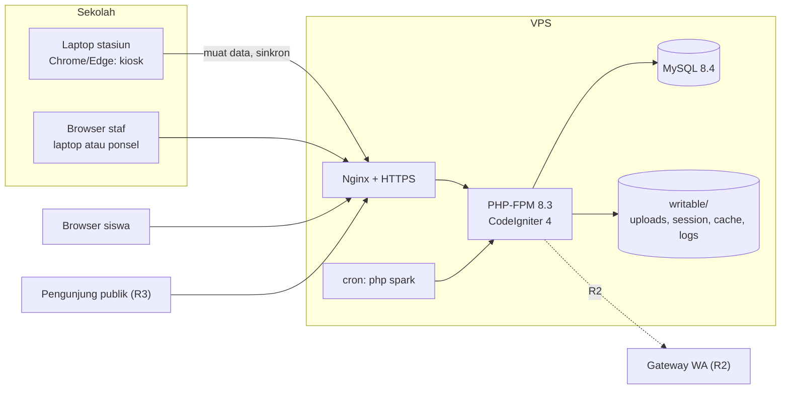
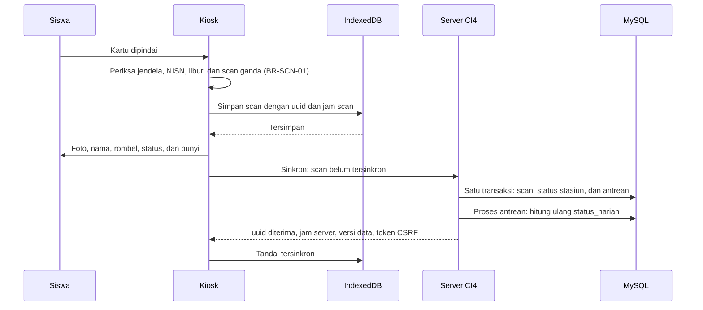

# Spensada — System Architecture

| Item | Nilai |
|---|---|
| Versi | 0.2 (draft, menunggu review) |
| Tanggal | 2026-10-04 |
| Sumber | Discovery Session 6 (System Architecture). Diperbarui dengan keputusan Session 7 (UI/UX & Design System, §2.4). |
| Bergantung pada | [00-project-overview.md](00-project-overview.md): label status, glosarium, risiko (`R-xx`), dan pertanyaan terbuka (`OQ-xx`). [01-product-requirements.md](01-product-requirements.md): requirement (`FR-*`, `NFR-*`) dan batasan (`C-*`). [02-user-roles-and-permissions.md](02-user-roles-and-permissions.md): hak akses (`HA-*`). [03-user-flow.md](03-user-flow.md): alur pengguna (`UF-*`). [04-feature-specification.md](04-feature-specification.md): fitur (`FS-*`) dan ketentuan umum (§4). [05-business-rules.md](05-business-rules.md): aturan bisnis (`BR-*`). [06-database-design.md](06-database-design.md): tabel dan aturan data (`DB-*`). [13-reporting-import-export.md](13-reporting-import-export.md): laporan, import, dan export. |
| Dokumen terkait | [08-ui-ux-design-system.md](08-ui-ux-design-system.md): tampilan, aset CSS, font, dan ikon. `09-page-and-route-specification.md` dan `10-api-specification.md` (Session 8), serta `12-security.md` (Session 9). Ketiganya belum dibuat. |

Dokumen ini menetapkan arsitektur sistem Spensada: hosting dan instalasi, library, struktur aplikasi CodeIgniter 4, arsitektur kiosk, mekanisme hitung ulang status, konkurensi, waktu, sesi dan login, pembaruan halaman, penyimpanan file, proses terjadwal, pengujian, serta panduan lokal dan production. Dokumen ini menjawab OQ-09.

Route dan bentuk API ditetapkan di Session 8, tampilan di `08` (Session 7), dan rincian keamanan di Session 9. Dokumen ini hanya menetapkan mekanisme yang dibutuhkan dokumen tersebut.

## 1. Cara membaca dokumen ini

- **ID.** Aturan arsitektur memakai ID `ARS-<NN>`. ID tidak pernah dinomori ulang. Aturan yang batal ditandai `DEPRECATED`.
- **Status.** Label status mengikuti `00`. Keputusan dari ronde diskusi Session 6 berstatus DECISION. Rincian teknis yang tidak dibahas di ronde berstatus RECOMMENDATION, dan menjadi arah kerja Session 7–11 serta implementasi sampai dikonfirmasi atau diganti.
- **Nama teknis.** Nama kelas, folder, filter, perintah CLI, dan penyimpanan browser di dokumen ini adalah usulan (RECOMMENDATION). Nama tabel dan kolom tetap mengikuti `06`. Route dan bentuk API ditetapkan di Session 8 (`09`, `10`).
- **Lokal dan production.** Langkah lokal (Windows, Laragon, Nginx) ada di §15, dan langkah production (VPS) ada di §16. Keduanya dipisah sesuai `00` §11 butir 11.
- **Nilai.** Angka yang dapat diubah tanpa mengubah kode disimpan sebagai parameter (ARS-17). Nilai di dokumen ini adalah nilai awal.
- **Contoh.** Contoh tanggal dan jam mengikuti `04` §1.

## 2. Keputusan Session 6

### 2.1 Keputusan arsitektur

| Topik | Keputusan | Rujukan | Status |
|---|---|---|---|
| Hosting production | VPS berbasis Linux dengan Nginx, PHP 8.3, dan MySQL 8.4. Web server serta versi PHP dan MySQL sama dengan lokal. | OQ-09, R-15, C-03, ARS-01, ARS-02 | DECISION |
| Instalasi framework | Composer appstarter. Framework dan library dipasang di `vendor/` lewat `composer.json` milik aplikasi. Folder `system/` dihapus dari repository, dan `vendor/` tidak di-commit. | R-18, C-06, ARS-07 | DECISION |
| Deploy | Di server, lewat SSH: kode diambil dari GitHub dengan git, lalu `composer install --no-dev` dan `php spark migrate` dijalankan. | ARS-08 | DECISION |
| `.gitignore` | Dibuat di PR Session 6, sebelum commit kode pertama. | R-18, ARS-09 | DECISION |
| Pembaca QR | zxing-wasm. File JavaScript dan WASM-nya disajikan dari server sendiri dan disimpan di cache kiosk. | R-04, NFR-16, ARS-10 | DECISION |
| Export PDF | mPDF. | `13` IE-12, ARS-10 | DECISION |
| Flyer PNG | Ditetapkan di Session 7: Canvas API tanpa library (§2.4). | R-19, `13` LP-08 | DECISION |
| Foto massal | Admin mengunggah satu file ZIP, atau beberapa file sekaligus. ZIP diekstrak di server. | FS-MD-08, `13` IM-13, ARS-54 | DECISION |
| Hitung ulang status | Antrean di database. Catatan antrean ditulis dalam transaksi yang sama dengan perubahan sumber, lalu diproses segera setelah commit di permintaan yang sama. Sisanya dilanjutkan permintaan berikutnya, cron, atau perintah CLI. | `06` §11.4, §16, ARS-35, ARS-36 | DECISION |
| Perubahan bersamaan | `updated_at` dipakai sebagai token versi, dan dibandingkan di klausa `WHERE` saat menyimpan. | DB-11, `04` §4.6, ARS-40 | DECISION |
| Sesi | Sesi CI4 disimpan sebagai file di `writable/session`. Status akun dan penggantian password diperiksa di setiap permintaan. Cron harian membersihkan file sesi lama. | `06` §5.4, ARS-47 | DECISION |
| Admin pertama | Dibuat lewat perintah CLI `spark`. Perintah serupa memulihkan akses bila satu-satunya admin lupa password. | `02` §3, UF-01, UF-21 E1, ARS-49 | DECISION |
| Login akun stasiun | Bertahan 90 hari sejak kontak terakhir. Login berakhir lebih awal bila admin mengganti kredensial atau menonaktifkan akun. | `02` §7.3, FS-AKN-04, ARS-30 | DECISION |
| Jam kiosk yang dibuka offline | Kiosk memakai selisih jam terakhir dan menampilkan peringatan sampai selisih diukur ulang. Jam laptop yang tampak mundur dilaporkan ke petugas. Server tetap menandai scan dengan jam tidak wajar. | BR-SCN-07, BR-SCN-08, R-05, ARS-28 | DECISION |
| Pembaruan halaman | Dashboard dan status stasiun meminta fragmen HTML setiap 30 detik. Polling berhenti saat tab tidak terlihat. | FS-LAP-01, FS-KIO-05, ARS-50 | DECISION |
| Nilai parameter | Paket nilai di §2.3. | `04` §14.2, ARS-33 | DECISION |
| Cron di R1 | Dipakai sebagai pelengkap, setiap menit dan setiap hari. Aplikasi tetap benar tanpa cron. | `06` §11.4, ARS-56 | DECISION |
| Uji logika kiosk | Kasus uji JSON dipakai bersama oleh PHPUnit dan test runner bawaan Node.js. Node.js hanya alat pengembangan, tanpa paket npm dan tanpa build. | NFR-15, ARS-59 | DECISION |

### 2.2 Tinjauan RECOMMENDATION Session 5

| Usulan | Rujukan | Hasil Session 6 |
|---|---|---|
| Periode aktif yang dibatalkan, yaitu ditutup karena salah input atau ditutup sebelum dimulai, tidak dihitung sebagai masa aktif. | `06` §6.6 aturan 4, BR-KAL-06, FS-MD-04 | Disetujui. (DECISION) |
| Tingkat rombel tidak dapat diubah setelah rombel memiliki penempatan siswa. | `06` §6.4, FS-MD-03 | Disetujui. (DECISION) |
| Lampiran bersama satu kelompok dispensasi massal paling banyak 3 file. | `06` §10.4, FS-IZN-03 | Disetujui. (DECISION) |
| Nama tabel `nilai_atribut_siswa` dan `wa_outbox`. | `06` §4.1 | Disetujui. (DECISION) |
| Rekap rapor semester menghitung semua hari sekolah siswa dalam semester, termasuk hari di rombel sebelumnya. | BR-REK-05, `13` IE-02, LP-03 | Disetujui. (DECISION) |

### 2.3 Nilai yang dipastikan

Tabel ini memuat nilai dari `04` §14.2 dan `05` §16 yang dijadwalkan di Session 6. Semuanya DECISION, dari ronde diskusi Session 6. Daftar lengkap parameter kiosk, termasuk nilai yang masih RECOMMENDATION, ada di ARS-33.

| Nilai | Ditetapkan | Fitur |
|---|---|---|
| Aturan jam dan libur yang dimuat kiosk | Hari ini dan 14 hari ke depan | FS-KIO-01 |
| Batas umur data kiosk | Peringatan bila data terakhir dimuat lebih dari 3 hari (72 jam) yang lalu. Kiosk tetap dapat dipakai. | FS-KIO-01 |
| Interval sinkron | Setiap 5 detik selama ada scan belum tersinkron | FS-KIO-03 |
| Ukuran kiriman | Paling banyak 100 scan per kiriman | FS-KIO-03 |
| Interval kontak berkala | 60 detik | FS-KIO-03 |
| Toleransi selisih jam laptop | 2 menit | FS-KIO-04, BR-SCN-08 |
| Batas tanpa kontak sebelum stasiun disorot | 10 menit | FS-KIO-05 |
| Jeda pengabaian NISN yang sama | 5 detik. Lama hasil scan tampil ditetapkan di Session 7 (`08` UI-41). | FS-KIO-02 |
| Interval pembaruan dashboard | 30 detik, juga untuk status stasiun | FS-LAP-01, FS-KIO-05 |
| Ukuran foto | Foto standar paling besar 600×800 px, dan foto kiosk 300×400 px, dalam JPEG. Foto kecil 120×160 px dan ukuran tampil ditetapkan di Session 7 (§2.4, `08` UI-23). | FS-MD-07, FS-KIO-01 |
| Masa berlaku login akun stasiun | 90 hari sejak kontak terakhir. Masa sesi staf dan siswa tetap ditetapkan di Session 9. | FS-AKN-01, FS-AKN-04 |

### 2.4 Keputusan Session 7

Keputusan Session 7 yang berdampak ke arsitektur. Rinciannya ada di `08` §2.

| Topik | Keputusan | Rujukan | Status |
|---|---|---|---|
| Flyer PNG | Canvas API tanpa library, canvas 1080×1350 px, dengan pratinjau dari canvas yang sama. | R-19, ARS-10, `08` UI-65 | DECISION |
| Tampilan | CSS sendiri dengan token, tanpa library dan tanpa build. Ikon dari subset Lucide dalam satu file SVG. | ARS-10, ARS-19, `08` UI-08, UI-20 | DECISION |
| Huruf | Plus Jakarta Sans, disalin ke server dan dipakai di aplikasi, flyer, dan PDF (mPDF). | ARS-10, ARS-22, `08` UI-13 | DECISION |
| Foto kecil | Ukuran ketiga 120×160 px untuk daftar. | ARS-51, ARS-53 | DECISION |
| QR kartu | chillerlan/php-qrcode 6 untuk kartu R3, yang dicetak sebagai PDF A4 berisi 10 kartu. | ARS-10, OQ-13, `08` UI-63 | DECISION |

## 3. Gambaran sistem

### 3.1 Komponen



| Komponen | Tugas | Rujukan |
|---|---|---|
| Kiosk | Halaman Vanilla JavaScript di laptop stasiun. Memuat data siswa dan aturan jam, membaca QR, memvalidasi scan secara lokal, menyimpan scan di IndexedDB, lalu sinkron. Tetap bekerja saat offline. | `00` §5, §6 |
| Panel staf/admin | Halaman server-rendered untuk akun staf. | `00` §5, `02` §8 |
| Portal siswa | Halaman server-rendered untuk akun siswa. | `00` §5, `02` §8 |
| Halaman publik | Halaman server-rendered tanpa login (R3). | FS-INF-03 |
| Aplikasi CodeIgniter 4 | Controller, service, model, filter, view, dan perintah CLI (§5). | NFR-15 |
| MySQL | Semua tabel di `06`. Zona waktu sesi `+07:00` (ARS-45). | `06` |
| `writable/` | File unggahan, sesi, cache, dan log, di luar `public/`. | DB-15 |
| Cron | Menjalankan `php spark` setiap menit dan setiap hari (§13). | ARS-56 |
| Gateway WA | Layanan pihak ketiga untuk R2 (OQ-10). | FR-WA-01 |

### 3.2 Alur data utama

1. Pagi hari, kiosk memuat data kiosk dari server (§6.4), lalu siswa memindai kartu. Scan disimpan di laptop lebih dulu (§6.2).
2. Kiosk mengirim scan ke server lewat sinkron (§6.7). Server menyimpan scan dan antrean hitung ulang dalam satu transaksi, lalu memproses antrean (§7).
3. Hitung ulang memperbarui `status_harian`. Dashboard dan halaman lain membaca salinan ini dengan aturan baca `06` §11.3. Bagian halaman yang berubah diperbarui setiap 30 detik (§11).
4. Tindakan staf, misalnya presensi manual, koreksi, dan izin, mengikuti pola yang sama: perubahan sumber, entri log, dan antrean ditulis dalam satu transaksi, lalu antrean diproses.

## 4. Hosting, instalasi, dan dependensi

### 4.1 Hosting production

| ID | Aturan | Status |
|---|---|---|
| ARS-01 | **VPS.** Production berjalan di VPS (OQ-09). VPS membutuhkan orang yang merawat server: pembaruan keamanan, firewall, backup, dan sertifikat HTTPS. Pengamanan server dirinci di Session 9. | DECISION |
| ARS-02 | **Perangkat lunak server.** Lihat tabel di bawah. Versi PHP dan MySQL sama dengan lokal (`00` §7.2), sehingga perilaku yang diuji di lokal sama dengan production. | DECISION (Nginx, PHP 8.3, MySQL 8.4); RECOMMENDATION (komponen lain) |
| ARS-03 | **Ekstensi PHP.** Lihat tabel di bawah. Perintah `aplikasi:cek` dan halaman pemeriksaan sistem memeriksa semuanya (ARS-57). | RECOMMENDATION |
| ARS-04 | **Pengaturan PHP, PHP-FPM, MySQL, dan Nginx.** Lihat tabel di bawah. Di production, pengaturan PHP ditulis untuk PHP-FPM (`/etc/php/8.3/fpm/`), bukan hanya untuk CLI. Batas unggah final ditetapkan bersama format dan ukuran file di Session 9. Jumlah proses dan batas waktu dipastikan lewat uji beban sebelum uji coba R1. | RECOMMENDATION |
| ARS-05 | **Kapasitas.** VPS awal 2 vCPU, RAM 2–4 GB, dan SSD paling kecil 40 GB. Data di `06` §15 kurang dari 1 GB per tahun, ditambah foto dan lampiran. | RECOMMENDATION |
| ARS-06 | **Backup.** Setiap hari, database di-dump dengan `mysqldump --single-transaction` dan `writable/uploads/` disalin ke lokasi di luar VPS. Dump juga dibuat sebelum setiap rilis (§16.2). File `.env` dicadangkan terpisah dan terenkripsi, karena kehilangan kunci enkripsi aplikasi membuat semua kiosk harus login ulang (ARS-30). Pemulihan diuji berkala. Retensi dan enkripsi backup ditetapkan di Session 9, karena backup memuat data anak (R-17). | RECOMMENDATION |

Perangkat lunak server (ARS-02):

| Komponen | Versi | Catatan |
|---|---|---|
| Sistem operasi | Linux server LTS, misalnya Ubuntu Server LTS | Pembaruan keamanan otomatis (Session 9). Zona waktu sistem diset `Asia/Jakarta` (ARS-46). |
| Web server | Nginx | Sama dengan lokal. Document root ke `public/` (R-15). |
| PHP | 8.3, lewat PHP-FPM | Sama dengan lokal. Lokal dan production naik bersama ke PHP 8.4 sebelum dukungan keamanan PHP 8.3 berakhir pada 31 Desember 2027. |
| Database | MySQL 8.4 LTS | Dipasang dari repository resmi MySQL bila versi bawaan sistem operasi berbeda. MariaDB tidak menjadi target, karena tidak diuji. |
| Composer | 2.x | Untuk deploy (ARS-08). |
| git | Bawaan sistem operasi | Mengambil kode dari GitHub (ARS-08). |
| Sertifikat HTTPS | Let's Encrypt lewat certbot, diperpanjang otomatis | R-01, NFR-06. |
| Sinkronisasi jam | NTP, misalnya systemd-timesyncd atau chrony | Jam server menjadi acuan jam kiosk (ARS-46). |

Ekstensi PHP (ARS-03):

| Ekstensi | Dipakai oleh |
|---|---|
| `intl`, `mbstring` | CodeIgniter 4. |
| `mysqli` (mysqlnd) | Driver database (C-01). |
| `openssl` | Koneksi HTTPS keluar dan enkripsi CI4. |
| `curl` | Koneksi ke gateway WA (R2). |
| `gd` | Memperkecil foto (ARS-53), PhpSpreadsheet, dan mPDF. |
| `exif` | Membaca orientasi foto (ARS-53). Di Laragon, ekstensi ini mati secara bawaan. |
| `zip` | Foto massal dalam ZIP (ARS-54) dan file XLSX. |
| `fileinfo` | Mendeteksi tipe file unggahan. |
| `dom`, `xml`, `xmlreader`, `xmlwriter`, `simplexml`, `libxml`, `iconv`, `ctype`, `filter`, `zlib` | PhpSpreadsheet. |
| `opcache` | Kinerja di production. |

Pengaturan PHP, PHP-FPM, MySQL, dan Nginx (ARS-04):

| Pengaturan | Nilai awal | Alasan |
|---|---|---|
| `memory_limit` | 256M | Import XLSX, PDF, dan pemrosesan foto (ARS-53). |
| `max_execution_time` | 60 detik untuk web; tanpa batas untuk CLI | Hitung ulang yang besar dilanjutkan cron (ARS-36). Di Linux, waktu menunggu database tidak dihitung, sehingga batas akhirnya `request_terminate_timeout`. |
| PHP-FPM `pm.max_children` | 20, disesuaikan dengan RAM (sekitar 40–60 MB per proses) | Bawaan PHP-FPM hanya 5 proses. Permintaan yang menunggu kunci (ARS-36) dapat menahan semua proses itu saat sinkron pagi. |
| PHP-FPM `request_terminate_timeout` | 120 detik | Menghentikan proses yang macet. Koneksinya ikut terputus, sehingga kunci bernama terlepas (ARS-42). |
| MySQL `max_connections` | Lebih besar dari `pm.max_children` ditambah cron | Setiap proses PHP memakai satu koneksi. |
| `upload_max_filesize`, `post_max_size`, dan Nginx `client_max_body_size` | 100M | Foto massal. Ketiganya disamakan. |
| `max_file_uploads` | 100 | Unggah beberapa foto sekaligus. Lebih dari itu memakai ZIP (ARS-54). |
| `date.timezone` | `Asia/Jakarta` | Pelengkap. Aplikasi tetap mengatur zona waktunya sendiri (ARS-44). |
| `opcache.enable` | 1 di production | Kinerja. |
| `display_errors` | Off di production | Rinciannya di Session 9. |
| Nginx `mime.types` | Memuat `application/wasm` untuk `.wasm` | Pembaca QR (ARS-10). Sudah ada sejak Nginx 1.21. Bila belum ada, baris itu ditambahkan ke `mime.types`, bukan lewat blok `types` di server block, karena blok itu menggantikan seluruh daftar tipe, termasuk `.js` dan `.css`. |

### 4.2 Instalasi framework dan deploy

| ID | Aturan | Status |
|---|---|---|
| ARS-07 | **Composer appstarter.** Repository dipindah ke struktur appstarter CodeIgniter 4.7. Framework dan library dipasang di `vendor/` lewat `composer.json` milik aplikasi, dan diperbarui dengan `composer update`. Folder `system/` dihapus dari repository, dan `vendor/` tidak di-commit. Migrasi dilakukan di commit pertama fase implementasi, dengan langkah di bawah tabel. `composer.lock` di-commit. | DECISION (appstarter, `system/` dihapus, `vendor/` tidak di-commit, dan pembaruan lewat Composer); RECOMMENDATION (waktu migrasi, `composer.lock`, dan langkah 1–5) |
| ARS-08 | **Deploy lewat git dan Composer.** Server mengambil kode dari GitHub, lalu menjalankan `composer install --no-dev` dan `php spark migrate`. Rilis production memakai tag git, sehingga dapat dikembalikan ke tag sebelumnya. File yang di-commit tidak pernah diubah di server, sehingga checkout selalu bersih. Karena itu `php spark optimize` tidak dipakai: perintah itu menulis ulang `app/Config/Optimize.php` yang di-commit. Cache konfigurasi CI4 tidak dipakai di R1, dan kinerja cukup dari opcache serta autoloader Composer yang dioptimalkan (ARS-07 langkah 1). Langkah lengkapnya di §16. | DECISION (git dan Composer di server); RECOMMENDATION (tag, urutan perintah, dan tanpa `spark optimize`) |
| ARS-09 | **`.gitignore`.** File `.gitignore` dibuat di PR Session 6, agar `.env`, isi `writable/`, `vendor/`, dan `CLAUDE.local.md` tidak ikut ter-push. Isinya mengikuti appstarter, ditambah `CLAUDE.local.md`, `.claude/settings.local.json`, `node_modules/`, dan file dump database (§4.3). | DECISION (dibuat di PR Session 6, beserta file yang dilindungi); RECOMMENDATION (isi lengkap) |

Langkah pindah ke appstarter (ARS-07):

1. Ganti `composer.json` di akar repository, yang saat ini milik framework, dengan `composer.json` aplikasi berdasarkan appstarter. Isinya:
   - `require`: `php` `^8.3` dan `codeigniter4/framework` `^4.7`. Library ditambahkan saat rilisnya dimulai (ARS-10);
   - `require-dev`: mengikuti appstarter;
   - `config.platform.php`: `8.3`, agar paket yang terpasang tetap cocok dengan PHP 8.3 walaupun laptop pengembang memakai versi lebih baru;
   - `config.optimize-autoloader`: `true`, agar setiap `composer install` membuat autoloader yang dioptimalkan.
2. Jalankan `composer install`, lalu commit `composer.lock`.
3. Hapus `system/` dari repository. Ubah `systemDirectory` di `app/Config/Paths.php` ke `vendor/codeigniter4/framework/system`.
4. Samakan `spark`, `public/index.php`, `preload.php`, `phpunit.dist.xml`, `env`, dan `tests/` dengan appstarter versi yang sama.
5. Ganti `README.md` dan `LICENSE` di akar, yang saat ini milik framework, dengan README proyek yang merujuk `docs/` dan lisensi yang diputuskan pemilik proyek.

Pembaruan framework berikutnya memakai `composer update codeigniter4/framework`. Pengembang membaca panduan upgrade CodeIgniter versi itu, menyesuaikan file di `app/Config` bila perlu, menjalankan uji, lalu commit `composer.lock`.

### 4.3 Isi `.gitignore`

File ini dibuat di PR Session 6 (ARS-09). Pola `writable/` mengikuti appstarter, sehingga `index.html` di setiap folder tetap di-commit. Folder `system/` belum diabaikan, karena masih di-commit sampai migrasi appstarter (ARS-07).

```gitignore
# Catatan lokal
CLAUDE.local.md
.claude/settings.local.json

# Environment: berisi password database dan kunci enkripsi aplikasi
.env
.env.*

# Isi runtime writable/
/writable/cache/*
!/writable/cache/index.html
/writable/logs/*
!/writable/logs/index.html
/writable/session/*
!/writable/session/index.html
/writable/uploads/*
!/writable/uploads/index.html
/writable/debugbar/*
!/writable/debugbar/index.html
php_errors.log

# Dump database: berisi data siswa (R-17)
*.sql
*.sql.gz

# Dependensi
/vendor/
node_modules/
composer.phar

# Pengujian
/phpunit.xml
/.phpunit.cache/
/.phpunit.result.cache
/tests/coverage*
/build/

# Editor dan sistem operasi
.idea/
.vscode/
*.iml
/nbproject/
*.sublime-project
*.sublime-workspace
.DS_Store
._*
Thumbs.db
ehthumbs.db
Desktop.ini
$RECYCLE.BIN/
*~
```

### 4.4 Library

| ID | Aturan | Status |
|---|---|---|
| ARS-10 | **Library.** Library yang dipakai hanya yang ada di tabel di bawah (NFR-16). Penambahan library baru dicatat di tabel ini beserta alasannya. | Lihat kolom Status di tabel |
| ARS-11 | **Tanpa CDN.** Semua aset browser, termasuk library pihak ketiga, disajikan dari server sendiri di `public/aset/`. Library JavaScript disalin per versi ke `public/aset/vendor/<library>/<versi>/` dan di-commit, tanpa npm dan tanpa build. Alasannya: kiosk harus berjalan offline (R-08), data siswa tidak dikirim ke pihak ketiga (R-17), dan kebijakan keamanan konten dapat dibuat ketat (Session 9). Pembaca QR membutuhkan `'wasm-unsafe-eval'` di `script-src` kebijakan itu. | RECOMMENDATION |

| Library | Versi | Lisensi | Kegunaan | Rilis | Cara pasang | Status |
|---|---|---|---|---|---|---|
| `codeigniter4/framework` | ^4.7 (saat ini 4.7.4) | MIT | Framework | R1 | Composer | CONFIRMED (stack); DECISION (Composer) |
| `phpoffice/phpspreadsheet` | ^5.10 | MIT | Membaca XLSX import (FS-MD-06, `13` IM-01, IM-02) dan membuat template import (R1); export XLSX (R2) | R1 | Composer | RECOMMENDATION |
| `mpdf/mpdf` | ^8.3 | GPL-2.0-only | Export PDF (`13` IE-10, IE-12) | R2 | Composer | DECISION |
| `zxing-wasm`, bagian reader | 3.1.4, dikunci | MIT | Membaca QR dari webcam di kiosk (R-04) | R1 | Disalin ke `public/aset/vendor/` dengan susunan folder `dist/` paket dan LICENSE-nya | DECISION |
| `chillerlan/php-qrcode` | ^6.0 (saat ini 6.0.1) | MIT atau Apache-2.0 | QR berisi NISN di kartu PDF (FS-KRT-01, `08` UI-63) | R3 | Composer | DECISION (Session 7) |
| Flyer PNG | — | — | Canvas API tanpa library (`08` §11) | R2 | — | DECISION (Session 7) |
| Plus Jakarta Sans | 2.071 | SIL OFL 1.1 | Huruf aplikasi, flyer, dan PDF (`08` UI-13 s.d. UI-15). WOFF2 untuk browser, TTF statis untuk mPDF. | R1 | WOFF2 disalin ke `public/aset/vendor/plus-jakarta-sans/2.071/`, TTF ke luar `public/` | DECISION (font); RECOMMENDATION (versi dan lokasi) |
| Lucide (ikon) | 1.52.0 | ISC | Subset ikon dalam satu sprite SVG (`08` UI-20) | R1 | Disalin ke `public/aset/ikon/` beserta LICENSE | DECISION (subset Lucide); RECOMMENDATION (versi dan lokasi) |
| `phpunit/phpunit`, `fakerphp/faker`, `mikey179/vfsstream` | Mengikuti appstarter | BSD-3-Clause, MIT, BSD-3-Clause | Pengujian dan data contoh (`require-dev`) | R1 | Composer | RECOMMENDATION |
| Node.js | LTS, versi 22.7 atau lebih baru | MIT | Uji modul JavaScript kiosk dengan `node --test`, tanpa paket npm (ARS-59). Versi 22.7 mengenali modul ES tanpa `package.json`. | R1 | Dipasang di laptop pengembang | DECISION |

Alasan dan alternatif (NFR-16):

- **PhpSpreadsheet.** Library PHP yang membaca dan menulis XLSX lengkap dengan format sel, sehingga NISN dapat ditulis sebagai teks (`13` IE-08). OpenSpout lebih hemat memori, tetapi versi terbarunya butuh PHP 8.4. Volume import, sekitar 1.000 baris, ringan bagi PhpSpreadsheet.
- **mPDF.** Dipilih di Session 6. Template PDF ditulis sebagai view HTML/CSS CI4, sehingga isinya mudah disamakan dengan layar. Lisensinya GPL-2.0-only. Bila aplikasi kelak didistribusikan ke pihak lain, kecocokan lisensi aplikasi dengan GPL perlu diperiksa.
- **zxing-wasm.** Port WebAssembly dari ZXing-C++, aktif dirawat, dan paling andal untuk kartu yang miring, buram, atau silau. Chrome dan Edge di Windows tidak memiliki `BarcodeDetector` (R-04). Secara bawaan, library ini memuat file WASM dari CDN. Kiosk wajib mengarahkannya ke file di server sendiri (ARS-11). File yang disalin: `es/reader/index.js`, `es/share.js` yang diimpornya lewat path relatif, dan `reader/zxing_reader.wasm`.
- **chillerlan/php-qrcode.** PHP murni, menghasilkan SVG tanpa GD, dan tidak butuh PHP 8.4. Alternatif `endroid/qr-code` versi terbaru butuh PHP 8.4.
- **Tanpa library.** Fungsi bawaan dipakai bila cukup: library Image CI4 (GD) untuk memperkecil foto, `ZipArchive` untuk ZIP, `fgetcsv` dan `fputcsv` untuk CSV, serta IndexedDB, Cache Storage, Service Worker, `crypto.randomUUID()`, dan `getUserMedia` di browser.

## 5. Struktur aplikasi CodeIgniter 4

### 5.1 Area, routing, dan filter

| ID | Aturan | Status |
|---|---|---|
| ARS-12 | **Area dan prefiks URL.** Setiap area memiliki prefiks URL dan kelompok route sendiri (tabel di bawah). Route setiap area ditulis di file terpisah yang didaftarkan di `Config\Routing::$routeFiles`. Auto routing tetap mati, sesuai bawaan CI4 4.7. Sebelum R3, alamat `/` mengarah ke halaman login (`02` §8). Daftar route rinci ditetapkan di Session 8 (`09`). | RECOMMENDATION |
| ARS-13 | **Filter.** Login, pemisahan area, dan hak diperiksa oleh filter CI4 (tabel di bawah). Filter area dipasang per kelompok route. Hak tingkat halaman dipasang per method controller dengan atribut `#[Filter(by: 'hak', having: ['HA-PRS-03'])]`, fitur CI4 4.7. Cakupan data diperiksa di service (ARS-15). Permintaan dari JavaScript dijawab dengan kode JSON, bukan pengalihan (butir di bawah tabel). | RECOMMENDATION |

| Area | Prefiks URL | Jenis akun | Filter kelompok | Namespace controller |
|---|---|---|---|---|
| Kiosk | `/kiosk` untuk halaman, `/kiosk/api/…` untuk JSON | Stasiun | `sesi`, `area:stasiun` | `App\Controllers\Kiosk` |
| Panel staf/admin | `/panel/…` | Staf | `sesi`, `area:staf`, `wajib-ganti` | `App\Controllers\Panel` |
| Portal siswa | `/portal/…` | Siswa | `sesi`, `area:siswa`, `wajib-ganti` | `App\Controllers\Portal` |
| Akun | `/login`, `/logout`, dan ganti password | Semua | `sesi` untuk logout dan ganti password | `App\Controllers\Akun` |
| Publik | `/` (R3), serta alamat logo sekolah | Tanpa login | — | `App\Controllers\Publik` |

| Filter | Tugas | Rujukan |
|---|---|---|
| `sesi` | Memastikan pengguna login, lalu memuat akun dari database di setiap permintaan (ARS-47). Untuk akun stasiun, membuat ulang sesi dari cookie login stasiun bila sesi CI4 sudah habis (ARS-30). | FS-AKN-01 butir 9, FS-AKN-02 butir 4 |
| `area:<jenis>` | Memastikan jenis akun sesuai area. Bila tidak, pengguna diarahkan ke halaman awal areanya. | `02` §4 butir 4, FS-AKN-01 E5 |
| `wajib-ganti` | Selama akun wajib mengganti password, hanya halaman ganti password dan logout yang terbuka. | `02` §2 butir 1 |
| `hak:<ID>` | Memeriksa bahwa salah satu role akun memiliki hak itu (ARS-15). | `04` §4.1 |
| `csrf` | Bawaan CI4, diaktifkan global di `Config\Filters::$globals['before']` untuk semua permintaan yang mengubah data. Kiosk mengirim token lewat header (ARS-29). | NFR-07 |
| Pembatasan login | Membatasi percobaan login per identitas dan per alamat IP. Rinciannya di Session 9. | NFR-08 |

Permintaan latar belakang (ARS-13):

1. Permintaan dari JavaScript, yaitu API kiosk dan polling fragmen, mengirim header `X-Requested-With: XMLHttpRequest`. API kiosk juga mengirim `Accept: application/json`.
2. Untuk permintaan seperti itu, filter `sesi`, `area`, `hak`, dan `csrf` tidak mengalihkan halaman. Filter menjawab status 401 atau 403 dengan kode JSON: `login_ulang`, `nonaktif`, `ditolak`, atau `csrf`.
3. Alasannya, CI4 di production menjawab kegagalan CSRF dengan pengalihan ke halaman sebelumnya (`Config\Security::$redirect`). `fetch` mengikuti pengalihan itu dan menerima halaman HTML, sehingga kiosk tidak tahu tokennya ditolak. Polling juga akan menyisipkan halaman login ke dashboard.
4. Header itu juga mencegah CI4 mencatat alamat fragmen sebagai halaman sebelumnya (`previous_url()`).

### 5.2 Lapisan kode

| ID | Aturan | Status |
|---|---|---|
| ARS-14 | **Lapisan kode.** Setiap lapisan memiliki tugas dan larangan di tabel di bawah. Nama kelas memakai istilah domain di glosarium (`00` §9), misalnya `HitungUlang` dan `PenentuStatus`. | RECOMMENDATION |
| ARS-15 | **Peta hak akses.** Role bersifat tetap (`02` §1), sehingga peta hak akses ditulis sebagai konfigurasi kode `app/Config/HakAkses.php`, bukan tabel. Setiap hak dicatat dengan ID-nya di `02` sebagai kunci, misalnya `HA-PRS-03`, dan berisi role serta cakupannya (Semua, Rombel, Hari ini, Sendiri, Rombelnya, Angka, atau Ya, `02` §5). Service `HakAkses` menjawab dua hal: apakah akun boleh melakukan hak itu untuk data tertentu, dan cakupan data untuk menyaring daftar dan laporan. Batas mundur (`04` §4.2) ikut diperiksa di service ini. | RECOMMENDATION |
| ARS-16 | **Satu tempat untuk setiap logika.** Logika yang menentukan presensi hanya ada di satu tempat di server (tabel di bawah). Kode lain memanggilnya, tidak menghitung sendiri. Hanya `HitungUlang` yang menulis `status_harian` (DB-12). Kolom hasil `scan` diisi pertama kali oleh `PenilaiScan` saat scan diterima, lalu dihitung ulang oleh `HitungUlang`. Semua halaman, laporan, dan file membaca status lewat `PembacaStatus` (`13` IE-01). | RECOMMENDATION |
| ARS-17 | **Parameter teknis.** Nilai teknis yang tidak diatur admin, misalnya toleransi selisih jam dan interval sinkron, disimpan di `app/Config/Spensada.php` dan dapat ditimpa lewat `.env` (`06` §6.1). Nilai yang diatur admin tetap di tabel `pengaturan`. Kiosk menerima parameternya dari server di data kiosk (ARS-23), sehingga perubahan nilai tidak memerlukan perubahan kode kiosk. | RECOMMENDATION |

| Lapisan | Folder | Tugas | Tidak boleh |
|---|---|---|---|
| Controller | `app/Controllers/<Area>/` | Membaca input, memanggil service, lalu mengembalikan view, fragmen, JSON, atau pengalihan. | Menulis query atau aturan bisnis. |
| Service | `app/Services/<Modul>/` | Aturan bisnis, transaksi, pemeriksaan cakupan, log, dan antrean hitung ulang. Akun pelaku diterima sebagai parameter. | Membaca request atau sesi secara langsung, dan mengambil jam sekarang selain lewat `Jam`. |
| Model | `app/Models/` | Satu Model CI4 per tabel di `06`, untuk query dan penyimpanan. | Aturan yang melibatkan tabel lain. |
| View | `app/Views/<area>/` | Tampilan server-rendered dengan layout per area. Fragmen yang diperbarui berkala adalah view tersendiri yang juga dipakai saat halaman pertama dimuat (ARS-50). | Query atau aturan bisnis. |
| Filter | `app/Filters/` | ARS-13. | Aturan bisnis selain hak dan area. |
| Perintah | `app/Commands/` | Perintah `spark` (§13). | Logika selain memanggil service. |
| Konfigurasi | `app/Config/` | Konfigurasi CI4, peta hak akses (ARS-15), dan parameter teknis (ARS-17). | — |

Role akun dibaca dari `akun_role` di setiap permintaan, dan role wali kelas diturunkan dari `rombel.wali_kelas_id` pada tahun ajaran aktif (`06` §5.1). Role tidak disimpan di sesi, sehingga perubahan role dan penugasan wali kelas langsung berlaku (`02` §4 butir 2). Uji otomatis memastikan setiap method controller panel dan portal memiliki atribut `hak`. (RECOMMENDATION)

Logika presensi dan tempatnya (ARS-16):

| Logika | Tempat di server | Dipakai oleh | Di kiosk |
|---|---|---|---|
| Aturan jam tanggal T dan hari sekolah bagi siswa (BR-KAL-05, `06` §7) | `Kalender` | Hitung ulang, data kiosk, validasi formulir, dan kepala dashboard | Data kiosk berisi hasilnya per tanggal (ARS-23). |
| Jendela scan, jenis presensi, serta Hadir, Terlambat, atau pulang lebih awal menurut jam (BR-JAM-03 s.d. BR-JAM-05) | `AturanJam` | `PenilaiScan`, `PenentuStatus` | Modul `aturan.js`, diuji dengan kasus uji yang sama (ARS-59). |
| Penilaian scan: tanda, dan nilai awal kolom hasil saat diterima (`06` §8.2) | `PenilaiScan` | Penerimaan sinkron dan hitung ulang | Pemeriksaan BR-SCN-01 di `aturan.js`. |
| Status, kejadian pulang, dan penanda (FS-PRS-05) | `PenentuStatus`, fungsi murni tanpa akses database | `HitungUlang` | Tidak ada. Kiosk hanya menampilkan status sementara (BR-JAM-11). |
| Penulisan `status_harian`, dan hitung ulang kolom hasil `scan` | `HitungUlang` | Pemrosesan antrean (§7) | — |
| Aturan baca status (`06` §11.3) | `PembacaStatus` | Dashboard, daftar presensi, riwayat, rekap, export, flyer, dan halaman publik | — |
| Hak dan cakupan | `HakAkses` | Filter `hak` dan service | — |
| Jam sekarang | `Jam`, memakai `Time::now()` CI4 | Semua service | Modul `jam.js` (ARS-27). |
| Log perubahan presensi | `LogPresensi` | Service yang mengubah data presensi | — |

Logika di kiosk adalah salinan yang disengaja untuk umpan balik offline. Server tetap yang menentukan (BR-JAM-11), dan kesamaan keduanya dijaga oleh kasus uji bersama (ARS-59).

### 5.3 Struktur folder

Struktur di bawah berlaku setelah migrasi appstarter (ARS-07). (RECOMMENDATION)

```text
app/
  Commands/              perintah spark (§13)
  Config/
    Routes/              route per area (ARS-12)
    HakAkses.php         peta hak akses (ARS-15)
    Spensada.php         parameter teknis (ARS-17)
  Controllers/
    Akun/  Kiosk/  Panel/  Portal/  Publik/
  Database/
    Migrations/          migration per tabel atau kelompok tabel (06)
    MySQLi/              driver turunan untuk zona waktu sesi (ARS-45)
    Seeds/
  Filters/
  Models/
  Services/
    Akun/  Berkas/  Izin/  Kalender/  Kiosk/  Laporan/  MasterData/  Presensi/  Sistem/
  Views/
    layout/  akun/  kiosk/  panel/  portal/  publik/
public/
  index.php
  sw-kiosk.js            Service Worker kiosk (ARS-22)
  kiosk-pemindai.js      Web Worker pembaca QR (ARS-22)
  aset/
    css/  js/            aset panel, portal, dan halaman publik
    kiosk/               modul JavaScript, CSS, bunyi, ikon, dan manifest kiosk
    vendor/zxing-wasm/3.1.4/
tests/
  kasus/                 kasus uji JSON bersama (ARS-59)
  js/                    uji modul kiosk dengan node --test
  unit/  database/
writable/
  cache/  logs/  session/  uploads/
```

### 5.4 Migration, seeder, dan tampilan

| ID | Aturan | Status |
|---|---|---|
| ARS-18 | **Migration dan seeder.** Migration mengikuti `06`: satu file per tabel, atau per tabel induk beserta anaknya, dengan urutan sesuai foreign key. Kolom turunan (DB-10) dan `CHECK` ditulis dengan SQL langsung. Setiap migration memiliki langkah `down`, agar rilis dapat dikembalikan (ARS-08). Migration tabel R2 ditulis saat R2 (`06` §14.1). Seeder `PengaturanAwal` mengisi kunci `pengaturan` dengan default di `06` §6.1 dan dijalankan di setiap instalasi. Seeder `DataContoh` mengisi data fiktif untuk lokal dan pengujian, dan menolak berjalan di production. | RECOMMENDATION |
| ARS-19 | **Tampilan dan JavaScript di luar kiosk.** Panel, portal, dan halaman publik memakai View Layouts CI4 per area. JavaScript ditulis sebagai modul ES kecil per halaman di `public/aset/js/`, tanpa framework dan tanpa build (C-01). Formulir tetap bekerja tanpa JavaScript, kecuali fitur yang memang membutuhkannya: pembaruan berkala (ARS-50), pratinjau unggahan, dan flyer (R2). Tampilan memakai CSS sendiri tanpa library dan tanpa build, dengan aturan di `08` (DECISION, Session 7). | RECOMMENDATION; DECISION (CSS sendiri, Session 7) |

## 6. Kiosk

Kiosk adalah satu-satunya bagian yang berjalan sebagai aplikasi client (`00` §5). Bagian ini menetapkan cara kerjanya di browser. Bentuk permintaan dan respons API dirinci di `10` (Session 8).

### 6.1 Komponen

| ID | Aturan | Status |
|---|---|---|
| ARS-20 | **Komponen kiosk.** Halaman kiosk dibuka lewat route CI4 dengan filter `sesi` dan `area:stasiun`, sehingga akun lain diarahkan ke areanya (AC-AKN-01-05). Isi halaman sama untuk semua stasiun dan tidak memuat data siswa, sehingga aman disimpan di cache Service Worker. Semua data dimuat lewat API JSON. Komponennya ada di tabel di bawah. | RECOMMENDATION |

| Komponen | Isi |
|---|---|
| Halaman `/kiosk` | Kerangka HTML, CSS, dan modul JavaScript. |
| `public/sw-kiosk.js` | Service Worker dengan cakupan `/kiosk` (ARS-22). |
| Manifest aplikasi | Agar kiosk dapat dipasang sebagai aplikasi di Chrome atau Edge (ARS-21). |
| `db.js` | Akses IndexedDB (ARS-21). |
| `data.js` | Memuat data kiosk dan foto (ARS-23). |
| `aturan.js` | Fungsi murni untuk jendela scan, jenis presensi, status sementara, dan hari sekolah bagi siswa (ARS-16). |
| `jam.js` | Jam terkoreksi (ARS-27). |
| `scan.js` | Kamera dan scanner USB (ARS-25, ARS-26). Gambar kamera dikirim ke worker pembaca QR. |
| `public/kiosk-pemindai.js` | Web Worker yang membaca QR dengan zxing-wasm. Berada di cakupan Service Worker (ARS-22). |
| `sinkron.js` | Sinkron dan kontak berkala (ARS-29). |
| `app.js` | Layar hasil scan, bunyi, bilah status, dan tindakan petugas. |
| zxing-wasm | File JavaScript dan WASM di `public/aset/vendor/zxing-wasm/3.1.4/`, dengan susunan folder `dist/` paket yang sama (ARS-10). |
| API `/kiosk/api/…` | Muat data, unduh foto, dan sinkron (Session 8). |



### 6.2 Penyimpanan browser

| ID | Aturan | Status |
|---|---|---|
| ARS-21 | **IndexedDB dan penyimpanan permanen.** Lihat butir di bawah tabel. | RECOMMENDATION |

1. Data kiosk dan scan disimpan di IndexedDB, dalam satu database `spensada-kiosk` dengan nomor versi skema (tabel di bawah). `localStorage` tidak dipakai untuk data, karena kapasitasnya kecil dan tidak transaksional.
2. Kiosk meminta penyimpanan permanen dengan `navigator.storage.persist()` (NFR-03). Chrome dan Edge tidak menampilkan dialog untuk permintaan ini, tetapi memutuskannya sendiri dari penilaian browser, misalnya apakah situs dipasang sebagai aplikasi. Karena itu, saat pemasangan stasiun (UF-06), admin memasang kiosk sebagai aplikasi di profil browser kiosk, lalu memastikan penyimpanan permanen aktif lewat bilah status kiosk. Bila tetap ditolak, kiosk menampilkan peringatan (FS-KIO-01 butir 9).
3. Kiosk memantau kuota dengan `navigator.storage.estimate()` dan memperingatkan petugas bila hampir penuh (FS-KIO-01 E5).
4. Data baru menggantikan data lama dalam satu transaksi IndexedDB, setelah seluruh data kiosk selesai diunduh dan diperiksa. Kegagalan di tengah jalan tidak merusak data lama (FS-KIO-01 butir 4).
5. Scan tersinkron dihapus setelah tanggalnya lewat. Scan belum tersinkron tidak pernah dihapus otomatis (FS-KIO-03 butir 7).
6. Kiosk hanya aktif di satu tab per profil browser, dengan Web Locks API. Tab kedua menampilkan pesan, agar scan tidak tercatat dari dua tab.
7. Penulisan scan memakai transaksi IndexedDB dengan `durability: 'strict'`, sehingga scan sudah tertulis ke disk saat transaksi selesai (`complete`). Bawaan Chrome dan Edge adalah `relaxed`, yang dapat kehilangan scan terakhir bila listrik padam. Hasil scan tampil setelah transaksi selesai (FS-KIO-02 butir 7).

| Penyimpanan | Kunci | Isi |
|---|---|---|
| `meta` | Nama butir | Versi format dan versi data, waktu data dimuat, akun stasiun, identitas sekolah, parameter (ARS-17), selisih jam terakhir, serta waktu kontak dan scan terakhir. |
| `siswa` | NISN | ID siswa, nama, rombel, tingkat, dan versi foto. |
| `foto` | ID siswa | Foto kiosk (Blob JPEG) dan versinya. |
| `aturan` | Tanggal | Hari sekolah, aturan jam, sumbernya, dan keterangan, untuk hari ini dan 14 hari ke depan. |
| `libur` | ID libur | Rentang tanggal, cakupan, dan keterangan. |
| `pola` | Hari | Pola mingguan untuk tanggal di luar rentang yang dimuat (FS-KIO-01 butir 7). |
| `scan` | uuid | Catatan scan (FS-KIO-02 butir 6), akun stasiun pencatat, dan status sinkron: belum, tersinkron, atau galat. Index tanggal, NISN, dan jenis untuk pemeriksaan scan ganda. |

### 6.3 Service Worker

| ID | Aturan | Status |
|---|---|---|
| ARS-22 | **Service Worker.** Lihat butir di bawah tabel. | RECOMMENDATION |

1. `public/sw-kiosk.js` didaftarkan dengan cakupan `/kiosk`, sehingga hanya halaman kiosk yang dikendalikan. Panel, portal, dan halaman publik tidak memakai Service Worker. Cakupan dicocokkan sebagai awalan alamat.
2. Web Worker pembaca QR dikendalikan Service Worker menurut alamat skripnya, bukan menurut halaman yang membukanya. Karena itu skripnya ditaruh di `public/kiosk-pemindai.js`, yang alamatnya diawali `/kiosk`. Folder fisik `public/kiosk/` tidak dibuat, karena Nginx akan melayani folder itu, dan route CI4 `/kiosk` tidak pernah tercapai.
3. Saat dipasang, Service Worker menyimpan kerangka halaman `/kiosk`, skrip worker, aset kiosk, file font dan sprite ikon (`08` UI-14, UI-20), dan file zxing-wasm (ARS-10) di satu cache yang namanya memuat versi aplikasi. Setiap file diambil dengan `{ cache: 'reload' }`, agar tidak berasal dari cache HTTP browser. Pemasangan gagal bila ada respons pengalihan atau respons selain 2xx, misalnya karena login sudah berakhir, lalu diulang saat kiosk dibuka berikutnya.
4. Navigasi ke `/kiosk`, termasuk `/kiosk/` dan `/kiosk?…`, dijawab dengan kerangka dari cache versi yang aktif, dengan kunci tetap `/kiosk`. Kerangka dari jaringan hanya dipakai bila cache belum ada. Dengan begitu kerangka dan asetnya selalu berasal dari versi yang sama, dan kiosk tetap terbuka tanpa internet (R-08, FR-KIO-09).
5. Aset kiosk, skrip worker, dan file zxing-wasm juga diambil dari cache versi yang aktif. Alamat aset tidak perlu memuat versi, karena setiap versi memiliki cache sendiri. Cara ini juga cocok dengan impor relatif antarmodul, yang tidak membawa query versi.
6. API `/kiosk/api/…` selalu lewat jaringan dan tidak disimpan Service Worker. Data kiosk tersimpan di IndexedDB. Karena kerangka diambil dari cache, status login diketahui dari jawaban API (ARS-13): jawaban `login_ulang` membuka halaman login (ARS-31), dan jawaban `ditolak` membuka halaman awal area akun yang sedang login (AC-AKN-01-05). Logout dari kiosk lebih dulu mengosongkan penanda login di `meta`, sehingga kerangka dari cache tidak menampilkan data setelah logout.
7. Browser memeriksa `sw-kiosk.js` setiap kali kiosk dibuka, dan kiosk memintanya lagi setiap jam dengan `registration.update()`. Versi baru dipasang di latar belakang, lalu menunggu. Kiosk memberi tahu petugas bila versi baru siap. Tombol "Muat versi baru" mengaktifkan versi itu dengan `skipWaiting()`, lalu memuat ulang halaman, selama tidak ada scan yang sedang disimpan. Versi baru juga aktif bila semua jendela kiosk ditutup lalu dibuka lagi. Memuat ulang halaman saja tidak cukup.

### 6.4 Data kiosk dan ID scan

| ID | Aturan | Status |
|---|---|---|
| ARS-23 | **Data kiosk dan versinya.** Isinya di tabel di bawah. `versi_format` adalah angka yang naik bila struktur data kiosk berubah secara tidak kompatibel. Kiosk dengan kode lama menolak format yang lebih baru dan meminta petugas membuka ulang kiosk. `versi_data` berisi 40 karakter heksadesimal, yaitu hash SHA-1 dari isi data kiosk tanpa waktu dibangun (`06` §8.1). Respons sinkron memuat versi data terbaru. Bila berbeda dengan milik kiosk, kiosk memuat ulang data di latar belakang (FS-KIO-01 butir 1). | RECOMMENDATION |
| ARS-24 | **ID unik scan.** Kiosk membuat ID scan dengan `crypto.randomUUID()`, yaitu UUID versi 4 berupa 36 karakter huruf kecil dengan tanda hubung, sesuai `scan.uuid` (`06` §8.2, DB-16). Server menolak ID dengan format lain sebagai scan rusak (FS-KIO-04 E3). Bentuk API dirinci di `10`. | RECOMMENDATION |

| Bagian | Isi | Sumber (`06` §13) |
|---|---|---|
| Versi | `versi_format`, `versi_data`, dan waktu data dibangun | — |
| Sekolah | Nama sekolah dan versi logo | `pengaturan` |
| Parameter | Nilai di ARS-33 | `Config\Spensada` |
| Siswa | Siswa yang aktif dan ditempatkan di rombel pada hari ini: ID, NISN, nama, rombel, tingkat, dan versi foto | `siswa`, `masa_aktif`, `penempatan`, `rombel` |
| Aturan | Untuk hari ini dan 14 hari ke depan: hari sekolah, aturan jam, dan sumbernya | `pola_mingguan`, `pola_mingguan_hari`, `jadwal_khusus`, `jadwal_hari_ini`, `semester` |
| Libur | Libur yang mencakup rentang itu, beserta cakupannya | `libur`, `libur_cakupan` |
| Pola | Pola mingguan yang berlaku pada akhir rentang, untuk tanggal di luar rentang | `pola_mingguan`, `pola_mingguan_hari` |

Data kiosk tidak memuat nomor WA, izin, riwayat, atau siswa nonaktif (FS-KIO-01 butir 3). Isinya sama untuk semua stasiun pada tanggal yang sama. Respons muat data menambahkan jam server dalam milidetik (ARS-27) dan nama akun stasiun di luar data kiosk, sehingga keduanya tidak ikut di-cache dan di-hash.

Server menyimpan data kiosk yang sudah dibangun di cache CI4 paling lama 60 detik, dengan kunci yang memuat tanggal hari ini dan `versi_format`. Dengan begitu perubahan data, misalnya siswa baru atau jadwal hari ini yang diubah, sampai ke kiosk dalam sekitar satu menit, tanpa penanda perubahan di setiap jalur penyimpanan. (RECOMMENDATION)

Foto diunduh terpisah per siswa dengan `fetch(..., { cache: 'no-store' })`, hanya bila versi fotonya berbeda dengan yang tersimpan, paling banyak 4 unduhan bersamaan. Foto hanya disimpan di IndexedDB, bukan di cache browser (ARS-52). Versi foto diambil dari `siswa.foto_diganti_at`. Siswa yang fotonya belum terunduh tampil dengan gambar pengganti (FS-MD-07 E3). (RECOMMENDATION)

### 6.5 Input scan

| ID | Aturan | Status |
|---|---|---|
| ARS-25 | **Kamera.** Kamera dibuka dengan `getUserMedia` di halaman HTTPS (R-01), dengan resolusi 640×480 atau 1280×720. Frame dibaca beberapa kali per detik dan didekode zxing-wasm di Web Worker `public/kiosk-pemindai.js` (ARS-22), sehingga layar tidak tersendat. Hanya format QR yang dicari. Isi QR dibersihkan dari spasi dan akhir baris, lalu harus tepat 10 digit (FS-KIO-02). NISN yang sama diabaikan selama 5 detik setelah hasil tampil (AC-KIO-02-06). Hasil tampil setelah transaksi IndexedDB untuk scan itu selesai (ARS-21 butir 7, FS-KIO-02 butir 7). Resolusi final dan target 1 detik (NFR-01) diuji di laptop sekolah sebelum uji coba R1. | DECISION (zxing-wasm, jeda 5 detik); RECOMMENDATION (rincian) |
| ARS-26 | **Scanner USB.** Scanner USB bekerja sebagai keyboard (FR-KIO-03). Kiosk mendengarkan penekanan tombol di seluruh halaman tanpa kolom isian. Masukan dianggap berasal dari scanner bila berisi paling sedikit 4 karakter, diakhiri Enter, dan jeda antartombolnya paling lama 50 milidetik. Ketikan manusia lebih lambat, sehingga diabaikan. Isi masukan scanner lalu diperiksa sama seperti hasil kamera: bila bukan tepat 10 digit, kiosk menampilkan "QR tidak dikenali" (FS-KIO-02 E1, AC-KIO-02-12). Penekanan tombol saat kolom isian aktif, misalnya PIN petugas, tidak diproses sebagai scan. Scanner diatur memakai akhiran Enter. Angka 50 milidetik dipastikan saat uji dengan scanner yang dipakai sekolah. | RECOMMENDATION |

### 6.6 Jam kiosk

| ID | Aturan | Status |
|---|---|---|
| ARS-27 | **Jam terkoreksi.** Lihat langkah di bawah tabel. Cara ini menjawab BR-SCN-07: kiosk tetap memakai jam yang benar bila jam Windows berubah saat kiosk berjalan. | RECOMMENDATION |
| ARS-28 | **Kiosk dibuka tanpa internet.** Bila kiosk dibuka offline sehingga selisih jam belum diukur hari itu, kiosk tetap menerima scan dengan jam laptop ditambah selisih terakhir yang tersimpan. Kiosk menampilkan peringatan "jam belum dicek hari ini" sampai pengukuran berhasil. Bila jam terkoreksi lebih awal dari scan terakhir atau kontak terakhir yang tersimpan, kiosk meminta petugas memeriksa jam laptop. Scan tetap diterima. Saat scan terkirim, server menandai scan yang selisih jamnya tidak wajar (ARS-27 langkah 6 dan 7, BR-SCN-08). | DECISION (selisih terakhir, peringatan, laporan jam mundur, dan penandaan di server); RECOMMENDATION (cara penandaan) |

Langkah ARS-27:

1. **Selisih.** Setiap respons API memuat jam server saat permintaan diterima (t2) dan saat respons dikirim (t3), dalam milidetik. Kiosk mencatat jam laptop saat mengirim (t1), dan menghitung saat menerima (t4) dari t1 ditambah waktu yang berlalu menurut `performance.now()`. Selisih = ((t2 − t1) + (t3 − t4)) / 2, dan waktu tempuh bersih = (t4 − t1) − (t3 − t2). Cara ini tidak terpengaruh lamanya server bekerja, misalnya saat memproses antrean. Dari beberapa pengukuran terakhir, kiosk memakai pengukuran dengan waktu tempuh bersih terpendek.
2. **Jangkar.** Setelah selisih diukur, jam kiosk dihitung dari jangkar: jam server saat pengukuran ditambah waktu yang berlalu menurut `performance.now()`. `performance.now()` tidak terpengaruh perubahan jam Windows.
3. **Deteksi perubahan jam.** Setiap detik, kiosk membandingkan jam dari jangkar dengan jam laptop ditambah selisih.
   - Bila keduanya berbeda lebih dari 2 detik tanpa jeda timer yang panjang, jam Windows diubah. Kiosk tetap memakai jam dari jangkar, memperbarui selisih, dan menampilkan "jam laptop berubah" kepada petugas.
   - Bila ada jeda timer yang panjang, misalnya laptop tidur, kiosk memakai jam laptop ditambah selisih terakhir sampai pengukuran berikutnya.
4. **WIB.** Jam diubah ke WIB dengan menambah 7 jam pada waktu UTC, tanpa memakai zona waktu Windows (BR-SCN-07). Tanggal scan adalah tanggal WIB dari jam terkoreksi.
5. **Catatan scan.** Setiap scan menyimpan jam scan (jam terkoreksi), jam laptop asli, dan selisih yang dipakai dalam detik (`06` §8.2).
6. **Penandaan di server.** Setiap kiriman sinkron, termasuk kontak berkala, membawa jam laptop saat kiriman dibuat. Server menghitung selisih saat itu, yaitu jam server saat kiriman diterima dikurangi jam laptop itu, lalu menyimpannya di `status_stasiun.selisih_jam_detik`. Scan yang selisihnya (`scan.selisih_detik`) berbeda lebih dari 2 menit dari selisih itu diberi `tanda_selisih_berubah` (BR-SCN-08). Dengan cara ini, scan dari kiosk yang dibuka offline setelah jam laptop diubah tetap ditandai saat terkirim (ARS-28).
7. **Keterbatasan.** Bila jam laptop sudah dibetulkan sebelum scan terkirim, perubahan itu tidak terdeteksi server. Sebaliknya, scan yang dicatat sebelum jam Windows diubah, tetapi baru terkirim setelahnya, ikut ditandai walaupun jamnya benar. Keduanya jarang terjadi, dan scan bertanda tetap dipakai sampai ditinjau (BR-SCN-08).

### 6.7 Sinkron dan kontak

| ID | Aturan | Status |
|---|---|---|
| ARS-29 | **Sinkron dan kontak berkala.** Lihat butir di bawah tabel. | DECISION (interval dan ukuran kiriman); RECOMMENDATION (mekanisme) |

1. Satu jenis permintaan melayani dua hal: mengirim scan belum tersinkron, paling banyak 100 per kiriman, dan melaporkan keadaan kiosk, yaitu jumlah scan belum tersinkron, jam laptop saat kiriman dibuat (ARS-27 langkah 6), dan versi data. Kiriman tanpa scan adalah kontak berkala (FS-KIO-03 butir 2).
2. Selama ada scan belum tersinkron, kiosk mengirim setiap 5 detik. Bila tidak ada, kiosk tetap menghubungi server setiap 60 detik.
3. Hanya satu permintaan sinkron yang berjalan pada satu waktu. Bila gagal, kiosk mencoba lagi dengan jeda 5, 10, 20, 40, lalu 60 detik, dan langsung mencoba saat browser kembali online (FS-KIO-03 butir 6).
4. Respons memuat ID scan yang diterima, termasuk yang sudah diterima sebelumnya, ID yang ditolak beserta alasannya, jam server, versi data, status dan nama akun stasiun, serta token CSRF untuk permintaan berikutnya (FS-KIO-04 butir 8).
5. Kiosk mengirim token CSRF lewat header `X-CSRF-TOKEN`, bersama header permintaan latar belakang (ARS-13). Bila token ditolak, server menjawab 403 berkode `csrf` beserta token baru, lalu kiosk mengulang kiriman dengan token itu. Dengan konfigurasi saat ini, token CSRF berlaku 2 jam (`Config\Security::$expires`), sehingga penolakan ini biasa terjadi pada kiriman pertama setelah kiosk lama tidak dipakai. Pengaturan CSRF final, termasuk `regenerate` dan masa berlaku token, ditetapkan di Session 9.
6. Dalam satu transaksi, server menyimpan scan dengan `INSERT ... ON DUPLICATE KEY UPDATE id = id` berdasarkan `uuid` (DB-16), mengisi penilaian dan nilai awal kolom hasil (ARS-16), memperbarui `status_stasiun`, dan menulis antrean hitung ulang. Scan dengan NISN tidak dikenal disimpan dengan `hasil = ditolak` dan tidak menulis antrean (FS-KIO-04 E4). Setelah commit, server memproses antrean (§7). Penerimaan scan tidak bergantung pada berhasilnya hitung ulang.
7. `INSERT IGNORE` tidak dipakai, karena juga mengubah galat lain menjadi peringatan, misalnya foreign key yang tidak cocok atau nilai NULL, sehingga scan dapat hilang diam-diam. Scan yang dibalas "diterima" ditentukan dengan membaca `uuid` yang tersimpan setelah penyimpanan, bukan dari jumlah baris yang berubah.

### 6.8 Akun stasiun dan laptop

| ID | Aturan | Status |
|---|---|---|
| ARS-30 | **Login stasiun 90 hari.** Lihat butir di bawah tabel. | DECISION (90 hari sejak kontak terakhir); RECOMMENDATION (mekanisme) |
| ARS-31 | **Akun nonaktif dan data lokal.** Server menjawab permintaan dari akun stasiun nonaktif dengan status "nonaktif". Kiosk lalu menghapus database IndexedDB beserta data siswa, foto, dan scan di dalamnya, menampilkan bahwa akun tidak aktif, dan menghentikan scan (FS-AKN-04 butir 4, AC-AKN-04-03). Bila login stasiun berakhir, yaitu cookie login kedaluwarsa atau tidak sah, kredensial diganti, atau petugas logout, server menjawab "login ulang". Kiosk meminta login, sedangkan data dan scan tetap tersimpan (FS-KIO-01 E2). Scan belum tersinkron hanya dikirim dengan akun stasiun yang mencatatnya. Bila akun stasiun lain login di laptop yang sama, kiosk menahan scan itu dan meminta petugas login kembali dengan akun semula. | RECOMMENDATION |
| ARS-32 | **Laptop stasiun.** Laptop stasiun memakai Chrome atau Edge terbaru (A-04) dengan profil browser khusus kiosk (R-07), akun Windows non-admin (R-05), sinkronisasi jam otomatis Windows, dan pengaturan daya yang mencegah laptop tidur selama jam sekolah. Kiosk dipasang sebagai aplikasi dari browser (ARS-21), lalu izin kamera diberikan. Langkah ini masuk ke UF-06. | RECOMMENDATION |

Butir ARS-30:

1. Saat akun stasiun login, server membuat sesi CI4 biasa dan cookie login stasiun. Cookie berisi ID akun, waktu kedaluwarsa, dan tanda tangan HMAC atas ID akun, waktu kedaluwarsa, dan cap kredensial akun. Cookie bersifat HttpOnly, Secure, dan `SameSite=Strict`, dengan `Path=/kiosk`, sehingga hanya dikirim ke halaman dan API kiosk. Kunci HMAC diturunkan dari kunci enkripsi aplikasi dengan `hash_hkdf()` dan konteks khusus cookie stasiun, agar satu kunci tidak dipakai untuk dua keperluan.
2. Cap kredensial diturunkan dari hash password akun, sehingga cookie langsung tidak berlaku saat admin mengganti kredensial (FS-AKN-04 butir 2). Cara ini tidak membutuhkan tabel baru.
3. Bila sesi CI4 habis, filter `sesi` membuat sesi baru dari cookie yang sah, selama akun masih aktif.
4. Masa berlaku cookie 90 hari. Masa itu diperpanjang paling banyak sekali sehari saat kiosk menghubungi server, sehingga stasiun yang dipakai rutin tidak pernah diminta login ulang, termasuk setelah libur semester.
5. Logout menghapus cookie dan sesi. Rincian keamanannya, termasuk PIN petugas untuk logout, ditetapkan di Session 9.

### 6.9 Parameter kiosk

| ID | Aturan | Status |
|---|---|---|
| ARS-33 | **Parameter kiosk.** Nilai di tabel di bawah disimpan di `Config\Spensada` dan dikirim ke kiosk di data kiosk (ARS-17). | Lihat kolom Status di tabel |

| Parameter | Nilai | Status |
|---|---|---|
| Aturan jam dan libur yang dimuat | Hari ini dan 14 hari ke depan | DECISION |
| Peringatan data lama | Data terakhir dimuat lebih dari 72 jam yang lalu | DECISION |
| Interval sinkron | 5 detik selama ada scan belum tersinkron | DECISION |
| Ukuran kiriman | Paling banyak 100 scan | DECISION |
| Kontak berkala | 60 detik | DECISION |
| Jeda coba ulang | 5, 10, 20, 40, lalu 60 detik | RECOMMENDATION |
| Toleransi selisih jam | 2 menit | DECISION |
| Jeda pengabaian NISN yang sama | 5 detik | DECISION |
| Jeda antartombol scanner USB | Paling lama 50 milidetik | RECOMMENDATION |
| Stasiun disorot di panel | Tanpa kontak lebih dari 10 menit selama jendela scan | DECISION |
| Foto kiosk | 300×400 px, JPEG | DECISION |
| Cache data kiosk di server | 60 detik | RECOMMENDATION |
| Login stasiun | 90 hari sejak kontak terakhir | DECISION |

## 7. Status harian: hitung ulang

Bagian ini menetapkan mekanisme yang diserahkan `06` §11.4 dan §16 ke Session 6. Tabel antreannya ada di `06` §11.5.

### 7.1 Komponen

| ID | Aturan | Status |
|---|---|---|
| ARS-34 | **Komponen hitung ulang.** Lihat butir di bawah tabel. | RECOMMENDATION |

1. **`PenentuStatus`** adalah fungsi murni. Masukannya semua sumber satu siswa pada satu tanggal: hari sekolah dan aturan jam, rombel, izin yang disetujui, koreksi aktif, scan beserta tinjauannya, presensi manual aktif, dan periode mode darurat. Keluarannya baris `status_harian` dan kolom hasil setiap scan. Fungsi ini tidak membaca database atau jam sekarang, sehingga mudah diuji (ARS-59).
2. **`HitungUlang`** memuat sumber, memanggil `PenentuStatus`, lalu menulis hasilnya.
   - Untuk satu siswa, sumber dimuat per siswa dan tanggal.
   - Untuk semua siswa pada satu tanggal, sumber dimuat sekaligus dengan beberapa query, lalu hasilnya ditulis per kelompok dengan `INSERT ... ON DUPLICATE KEY UPDATE`.
   - Baris dibuat, diperbarui, atau dihapus sesuai hari sekolah (`06` §11.1).
3. **`PembacaStatus`** menerapkan aturan baca `06` §11.3, dan menyiapkan nilai `:final_hari_ini` dan `:pulang_ditutup` untuk query laporan (`13` §3).

### 7.2 Antrean

| ID | Aturan | Status |
|---|---|---|
| ARS-35 | **Antrean hitung ulang.** Setiap perubahan sumber di `06` §11.4 menulis baris `antrean_hitung_ulang` dalam transaksi yang sama dengan perubahan itu. Karena ditulis dalam transaksi yang sama, setiap perubahan yang tersimpan pasti memiliki antreannya. Siswa dan tanggal di setiap baris mengikuti tabel di bawah. | DECISION (antrean dalam transaksi yang sama); RECOMMENDATION (siswa dan tanggal per perubahan) |
| ARS-36 | **Pemrosesan antrean.** Lihat butir di bawah tabel. | DECISION (diproses segera; dilanjutkan permintaan berikutnya, cron, atau CLI); RECOMMENDATION (rincian) |

| Perubahan sumber (`06` §11.4) | Siswa | Tanggal |
|---|---|---|
| Scan diterima atau ditinjau; presensi manual dicatat atau dibatalkan; koreksi disimpan, diganti, atau dihapus | Siswa itu | Tanggal itu |
| Izin disetujui, dibatalkan, atau dipersingkat, termasuk penolakan yang diubah menjadi persetujuan | Siswa itu | Rentang lama dan baru |
| Masa aktif atau penempatan berubah, termasuk lewat import dan penempatan massal | Siswa itu | Tanggal yang terdampak |
| Versi pola mingguan mulai berlaku hari ini, atau jadwal hari ini diubah atau dikembalikan | Semua | Hari ini |
| Mode darurat diaktifkan, diakhiri, atau berakhir otomatis | Semua | Tanggal mode darurat itu |
| Jadwal khusus atau libur berubah | Semua | Rentang lama dan baru |
| Tanggal semester berubah | Semua | Tanggal yang masuk atau keluar dari semester |

Rentang yang tidak bersambung ditulis sebagai beberapa baris antrean. Tanggal setelah hari ini tidak diproses, karena barisnya baru dibuat saat tanggal itu tiba (ARS-37, BR-STS-08). Scan dengan NISN tidak dikenal tidak menulis antrean, karena tidak memiliki siswa (ARS-29 butir 6). Untuk libur per tingkat atau rombel, `06` §11.4 cukup menghitung ulang siswa dalam cakupan lama dan baru. Antrean memakai semua siswa, yang mencakup keduanya, agar aturannya lebih sederhana. Hasil bagi siswa di luar cakupan tidak berubah.

Butir ARS-36:

1. Antrean diproses segera setelah transaksi commit, di permintaan yang sama, sehingga halaman berikutnya sudah menampilkan status baru.
2. Pemrosesan berjalan satu per satu untuk seluruh aplikasi, memakai kunci bernama `spensada:status` (ARS-42). Setiap putaran memakai transaksi baru: antrean dibaca lebih dulu dengan `SELECT` biasa, lalu sumber dibaca dalam snapshot yang sama, tanpa `FOR UPDATE`. Yang ditandai selesai hanya ID antrean yang dibaca itu (`WHERE id IN (…)`), tidak pernah lewat pasangan siswa dan tanggal, `id <= …`, atau `selesai_at IS NULL`. Alasannya, ID antrean dibuat saat baris ditulis, bukan saat commit, sehingga antrean yang commit belakangan dapat memiliki ID lebih kecil. Karena putaran berjalan berurutan dan setiap putaran memakai snapshot yang lebih baru, hasil hitungan yang lebih lama tidak pernah menimpa hasil yang lebih baru.
3. Pemegang kunci memproses antreannya sendiri lebih dulu, lalu antrean lain yang menunggu, dalam batas waktu di tabel di bawah. Sebelum menunggu kunci, permintaan menyelesaikan penulisan sesi, misalnya pesan berhasil, lalu menutup sesi (ARS-48). Setelah melepas kunci, pemegang memeriksa antrean sekali lagi, dan mencoba mengambil kunci lagi tanpa menunggu bila masih ada antrean. Antrean yang tetap belum terambil diproses paling lambat oleh permintaan baca berikutnya atau cron setiap menit.
4. Antrean yang menunggu digabung lebih dulu, sehingga setiap pasangan siswa dan tanggal hanya dihitung sekali. Antrean untuk semua siswa dihitung per tanggal dengan cara kelompok (ARS-34).
5. Sisa antrean dilanjutkan permintaan berikutnya yang membaca status, cron setiap menit (ARS-56), atau perintah CLI. Cron dan CLI memproses antrean besar per potongan sekitar 10 detik, dan melepas kunci di antara potongan. Halaman yang menampilkan tanggal dengan antrean tersisa memberi tanda "sedang diperbarui".
6. Antrean yang gagal dicoba lagi dengan jeda bertingkat yang dihitung dari `updated_at` dan `percobaan`, yaitu 1, 5, 15, lalu 60 menit. Galat sementara, seperti lock wait timeout, deadlock, atau koneksi terputus, tidak dihitung sebagai percobaan. Bila hitung ulang semua siswa pada satu tanggal gagal, pemrosesan diulang per siswa, dan hanya siswa yang gagal ditulis sebagai antrean baru. Setelah 5 kali gagal, antrean ditandai gagal, dicatat di log aplikasi, dan ditampilkan sebagai peringatan bagi admin. Perintah `status:antrean` mencobanya lagi setelah penyebabnya diperbaiki.
7. Baris antrean yang sudah selesai dihapus tugas harian setelah 7 hari. Antrean adalah data teknis, bukan data presensi (DB-13).

Batas waktu pemrosesan antrean (butir 3). Angkanya parameter teknis (ARS-17) yang dipastikan lewat uji beban sebelum uji coba R1.

| Pemroses | Menunggu kunci | Batas pemrosesan |
|---|---|---|
| Sinkron kiosk | Tidak menunggu | 2 detik |
| Permintaan staf yang mengubah data | Paling lama 5 detik | 10 detik |
| Pembacaan status (ARS-37) | Paling lama 5 detik | 10 detik |
| Cron dan perintah CLI | Paling lama 30 detik | 10 detik per potongan |

### 7.3 Status terkini, mode darurat, dan perintah CLI

| ID | Aturan | Status |
|---|---|---|
| ARS-37 | **Pastikan status terkini.** `PembacaStatus` menjalankan tiga langkah di bawah kunci `spensada:status` sebelum status dibaca. Cron setiap menit menjalankan langkah yang sama (ARS-56). Bila tidak ada pekerjaan, langkah ini hanya beberapa query ringan. Permintaan baca menunggu kunci paling lama 5 detik. Bila kunci belum didapat, status dibaca apa adanya, dan halaman memberi tanda "sedang diperbarui". (1) Menutup mode darurat yang masih terbuka setelah pukul 23.59 pada tanggalnya (ARS-38). (2) Membuat baris `status_harian` untuk setiap tanggal setelah `pengaturan.status_dibangun_sampai` sampai hari ini (`06` §11.4). Setiap tanggal dibuat dalam transaksi sendiri bersama pembaruan `status_dibangun_sampai`. Bila `status_dibangun_sampai` masih kosong, pembuatan dimulai dari hari ini, sehingga aplikasi yang mulai dipakai di tengah tahun ajaran tidak membuat Alpa untuk tanggal sebelumnya. Nilai awalnya saat go-live ditetapkan bersama prosedur go-live di Session 10. (3) Memproses sisa antrean (ARS-36). Di permintaan web, langkah 2 dan 3 bersama-sama mengikuti batas waktu di tabel ARS-36. | RECOMMENDATION |
| ARS-38 | **Mode darurat berakhir otomatis.** Aturan baca menganggap mode darurat tidak aktif sejak pukul 23.59.00 pada tanggalnya, walaupun barisnya belum ditutup (`06` §9.3, BR-DRT-05). Penutupan barisnya ditulis oleh cron mulai pukul 23.59, atau oleh langkah ARS-37 yang berjalan lebih dulu: `selesai_at` diisi pukul 23.59.00, `berakhir_otomatis = 1`, pelaku kosong, entri log `darurat_diakhiri`, dan antrean tanggal itu. Aktivasi mode darurat baru juga menutup periode lama yang masih terbuka lebih dulu, karena hanya satu periode yang boleh aktif (DB-10). | RECOMMENDATION |
| ARS-39 | **Bangun ulang dan periksa.** Perintah `php spark status:bangun --mulai=<tanggal> --selesai=<tanggal>` menghitung ulang `status_harian` dan kolom hasil `scan` untuk rentang itu, lewat antrean dan pemrosesan yang sama. Pilihan `--siswa=<id>` membatasi ke satu siswa. Pilihan `--periksa` hanya membandingkan salinan dengan hasil hitungan baru, lalu melaporkan perbedaannya tanpa menulis. Mode periksa dipakai di pengujian dan setelah perubahan kode penentuan status (`06` §11.4). | RECOMMENDATION |

## 8. Konkurensi dan transaksi

| ID | Aturan | Status |
|---|---|---|
| ARS-40 | **Token versi.** Formulir pengubah data membawa nilai `updated_at` saat formulir dibuka. Penyimpanan memakai `UPDATE ... WHERE id = ? AND updated_at = ?`. Bila tidak ada baris yang cocok, penyimpanan ditolak, lalu sistem menampilkan data terbaru beserta pengubah dan waktunya (`04` §4.6, DB-11). Koneksi MySQLi memakai `foundRows = true`, agar jumlah baris yang cocok terbaca benar walaupun nilainya tidak berubah. Tabel anak (`pola_mingguan_hari`, `libur_cakupan`) hanya diubah bersama induknya, dan `updated_at` induknya selalu diperbarui, sehingga token induk mencakup anaknya. Dua penyimpanan pada detik yang sama tidak terbedakan. Risiko ini diterima, karena formulir diisi manusia. Penulisan oleh sistem, misalnya `akun.login_terakhir_at`, memakai Query Builder tanpa mengubah `updated_at`, agar tidak menimbulkan konflik palsu. Induk disentuh dengan menulis `updated_at` secara eksplisit, karena `Model::update()` tanpa data menimbulkan galat. | DECISION (token `updated_at`); RECOMMENDATION (rincian) |
| ARS-41 | **Penjaga keadaan.** Perubahan yang bergantung pada keadaan data memeriksa keadaan itu di klausa `WHERE` atau dengan kunci unik, bukan dengan token versi (tabel di bawah). Bila penjaga gagal, sistem menampilkan keputusan yang sudah ada beserta pelakunya. | RECOMMENDATION |
| ARS-42 | **Kunci bernama.** Pemeriksaan yang melibatkan banyak baris dan tidak dapat ditegakkan kunci unik memakai kunci bernama MySQL (`GET_LOCK`). Kunci diambil sebelum transaksi dan dilepas setelah commit. Bila koneksi terputus, MySQL melepas kunci itu sendiri. Nama kunci berlaku untuk seluruh server MySQL, sehingga nama selalu diawali nama database, misalnya `spensada:status` di database `spensada` dan `spensada_test:status` di database uji. Satu koneksi dapat mengambil kunci yang sama berulang kali, dan setiap pengambilan harus dilepas, sehingga helper kunci mencatat kunci yang sedang dipegang. Koneksi persisten (`pConnect`) tidak dipakai, agar kunci tidak terbawa ke permintaan lain. Daftar kunci ada di tabel di bawah. Pemeriksaan per siswa, yaitu masa aktif, penempatan, dan izin, tetap mengunci baris `siswa` dengan `SELECT ... FOR UPDATE` (`06` §16). | RECOMMENDATION |
| ARS-43 | **Transaksi.** Satu tindakan pengguna adalah satu transaksi, berisi perubahan data, entri log, dan antrean hitung ulang (`06` §16). Urutan penguncian selalu sama: kunci bernama lebih dulu, lalu baris `siswa` dengan ID menaik, agar tidak terjadi deadlock. Koneksi MySQLi memakai mode strict (`strictOn = true`), sehingga data yang tidak valid ditolak, bukan dipotong diam-diam. File unggahan ditulis ke lokasi akhirnya dengan nama acak sebelum commit. Bila transaksi gagal, file itu dihapus. File lama yang diganti dihapus setelah commit. File yang tertinggal tanpa rujukan, misalnya karena proses berhenti di antara penulisan file dan commit, dihapus tugas harian setelah 24 jam (ARS-56). | RECOMMENDATION |

| Perubahan | Penjaga (ARS-41) |
|---|---|
| Verifikasi pengajuan izin | Status masih `menunggu` (BR-IZN-08, UF-18 E1). |
| Penggantian dan penghapusan koreksi | Koreksi yang sama masih aktif (`berakhir_at` kosong). |
| Pembatalan presensi manual | `dibatalkan_at` masih kosong. |
| Tinjauan scan | Kunci unik `scan_tinjauan.scan_id` (FS-KIO-06 E2). |
| Aktivasi mode darurat | Kunci unik `mode_darurat.aktif_kunci` (DB-10). |

| Kunci bernama | Melindungi |
|---|---|
| `spensada:kalender` | Pola mingguan, jadwal khusus, jadwal hari ini, dan libur, termasuk pemeriksaan tumpang tindih jadwal khusus (`06` §16). |
| `spensada:tahun_ajaran` | Tahun ajaran dan semester, termasuk pemeriksaan tumpang tindih rentang (`06` §16). |
| `spensada:admin` | Perubahan role dan status akun admin, agar selalu ada admin aktif (`02` §4 butir 6). |
| `spensada:status` | Pembuatan baris dan hitung ulang `status_harian` (ARS-36, ARS-37). |
| `spensada:tugas_menit` | Satu putaran `tugas:menit` pada satu waktu (ARS-56). |
| `spensada:tugas_harian` | Satu putaran `tugas:harian` pada satu waktu (ARS-56). |

## 9. Waktu

| ID | Aturan | Status |
|---|---|---|
| ARS-44 | **Zona waktu aplikasi.** `appTimezone` di `app/Config/App.php` diubah dari `UTC` menjadi `Asia/Jakarta` (R-11, BR-JAM-12). Jam sekarang selalu diambil dari PHP lewat service `Jam`, yang memakai `Time::now()` CI4, sehingga pengujian dapat membekukan waktu dengan `Time::setTestNow()`. Query tidak memakai `NOW()`, `CURDATE()`, atau `CURRENT_TIMESTAMP`. Tanggal dan jam dikirim dari PHP sebagai parameter. | DECISION (WIB, OQ-05); RECOMMENDATION (cara) |
| ARS-45 | **Koneksi MySQL.** Setiap koneksi menjalankan `SET time_zone = '+07:00'` dan `SET NAMES utf8mb4 COLLATE utf8mb4_general_ci` segera setelah tersambung (DB-04, DB-05). CI4 hanya memanggil `set_charset()`, sehingga tanpa perintah kedua, collation koneksi menjadi bawaan MySQL 8.4 (`utf8mb4_0900_ai_ci`). Caranya lewat driver turunan di `app/Database/MySQLi/`, dengan konfigurasi di butir di bawah tabel. Zona waktu sesi ini pengaman tambahan, karena aplikasi tidak memakai fungsi waktu MySQL (ARS-44). Perintah `aplikasi:cek` memeriksa zona waktu PHP dan MySQL, collation koneksi, dan `sql_mode`. | RECOMMENDATION |
| ARS-46 | **Jam server.** Jam server disinkronkan dengan NTP (ARS-02), karena menjadi acuan selisih jam kiosk (BR-SCN-07) dan semua waktu di database. Zona waktu sistem operasi server diset `Asia/Jakarta`, agar jadwal cron dan log sistem memakai WIB. Aplikasi sendiri tidak bergantung pada pengaturan ini. | RECOMMENDATION |

Butir ARS-45:

1. Folder `app/Database/MySQLi/` berisi enam kelas turunan dari driver MySQLi CI4: `Connection`, `Builder`, `Result`, `PreparedQuery`, `Forge`, dan `Utils`. CI4 mencari kelas-kelas itu di namespace driver, sehingga driver yang hanya berisi `Connection` gagal saat Query Builder dipakai.
2. Hanya `Connection` yang berisi kode. Method `connect()` memanggil `parent::connect()`, lalu menjalankan dua perintah di ARS-45. Method `getPlatform()` mengembalikan `MySQLi`, agar kode CI4 yang memeriksa platform tetap mengenali driver ini.
3. Di `app/Config/Database.php`, group `default` dan `tests` memakai `DBDriver` `App\Database\MySQLi`, `strictOn = true`, dan `foundRows = true` (ARS-40, ARS-43). Nilai bawaan `strictOn = false` bukan hanya tidak menyalakan mode strict, tetapi juga membuang `STRICT_TRANS_TABLES` dari `sql_mode` bawaan MySQL.
4. Group `tests` bawaan CI4 memakai SQLite di memori dengan prefiks tabel `db_`. Group ini diganti ke MySQL 8.4, database `spensada_test`, tanpa prefiks, karena SQL langsung untuk kolom turunan, `CHECK`, dan `GET_LOCK` tidak memakai prefiks (ARS-58).
5. Di `.env`, nama driver ditulis tanpa tanda kutip, misalnya `database.default.DBDriver = App\Database\MySQLi`. Bila ditulis dalam tanda kutip dengan garis miring terbalik tunggal, tanda kutipnya ikut terbaca dan driver tidak ditemukan.

## 10. Sesi, login, dan akun awal

| ID | Aturan | Status |
|---|---|---|
| ARS-47 | **Sesi file.** Sesi CI4 memakai `FileHandler` di `writable/session` (`06` §5.4). Sesi hanya menyimpan ID akun, jenis akun, waktu login, dan cap kredensial (ARS-30). Filter `sesi` memuat akun di setiap permintaan, lalu memeriksa butir di bawah tabel. File sesi yang lebih tua dari masa berlaku sesi dihapus tugas harian (ARS-56). Masa berlaku sesi staf dan siswa, regenerasi ID sesi, dan pembatasan percobaan login ditetapkan di Session 9. | DECISION (file, pemeriksaan per permintaan, pembersihan oleh cron); RECOMMENDATION (rincian) |
| ARS-48 | **Penguncian sesi.** `FileHandler` mengunci file sesi selama permintaan berjalan, sehingga permintaan bersamaan dari satu browser saling menunggu. Permintaan yang hanya membaca sesi, yaitu API kiosk, fragmen polling, dan unduhan foto, menutup sesi dengan `session()->close()` segera setelah identitas dibaca. Permintaan yang memproses antrean hitung ulang juga menutup sesi lebih dulu (ARS-36 butir 3). Begitu juga permintaan panjang, yaitu import, export, laporan, dan pemrosesan foto massal, setelah pesan untuk halaman berikutnya ditulis. `FileHandler` menunggu kunci file tanpa batas waktu, sehingga satu permintaan panjang dapat menahan semua tab lain milik pengguna yang sama. | RECOMMENDATION |
| ARS-49 | **Admin pertama dan pemulihan.** Admin pertama dibuat dengan `php spark admin:pertama`, dan akses admin dipulihkan dengan `php spark admin:pulihkan <username>` (butir di bawah tabel). Keduanya hanya dapat dijalankan dari terminal server, dan dicatat di `log_aktivitas` dengan pelaku kosong. | DECISION (CLI); RECOMMENDATION (rincian) |

Pemeriksaan filter `sesi` (ARS-47):

1. Akun yang tidak aktif ditolak (`02` §2 butir 5, FS-AKN-01 butir 9).
2. Sesi yang cap kredensialnya berbeda dengan cap dari hash password di database ditolak. Penggantian password sendiri, reset password, dan penggantian kredensial stasiun mengubah hash password, sehingga capnya berubah dan sesi lain berakhir. Sesi tempat password diganti menyimpan cap baru, sehingga tetap berjalan (FS-AKN-02 butir 4). Cara ini tidak bergantung pada ketelitian detik `akun.password_diganti_at`, yang hanya mencatat waktu penggantian.
3. Role dimuat dari `akun_role` dan `rombel` (ARS-15).

Perintah ARS-49:

1. `admin:pertama` menanyakan nama dan username, membuat akun staf dengan role Admin, membuat password acak yang ditampilkan sekali, dan mewajibkan penggantian password saat login pertama. `akun_role.diberikan_oleh` dibiarkan kosong (`06` §5.2). Perintah ini menolak berjalan bila sudah ada admin aktif.
2. `admin:pulihkan` membuat password acak baru untuk akun admin yang aktif, mewajibkan penggantiannya, dan mengakhiri sesinya. Perintah ini dipakai bila satu-satunya admin lupa password (UF-21 E1).

## 11. Pembaruan halaman

| ID | Aturan | Status |
|---|---|---|
| ARS-50 | **Polling fragmen HTML.** Bagian halaman yang diperbarui berkala, yaitu tabel dan peringatan dashboard hari ini serta daftar status stasiun, adalah view fragmen tersendiri. View yang sama dipakai saat halaman pertama dimuat. Modul JavaScript kecil meminta fragmen itu setiap 30 detik dengan `fetch`, lalu menggantinya di tempat beserta waktu "diperbarui pukul". Polling berhenti saat tab tidak terlihat, dan langsung berjalan lagi saat tab terlihat. Permintaan polling mengirim header permintaan latar belakang (ARS-13), sehingga sesi yang berakhir dijawab 401, bukan halaman login. Polling lalu berhenti, dan halaman menampilkan pesan. Tanpa JavaScript, halaman tetap dapat dimuat ulang manual. Route fragmen memakai filter dan hak yang sama dengan halamannya. | DECISION (polling fragmen setiap 30 detik); RECOMMENDATION (rincian) |

Server-Sent Events dan WebSocket tidak dipakai, karena setiap koneksi terbuka menahan satu proses PHP-FPM.

## 12. File unggahan

| ID | Aturan | Status |
|---|---|---|
| ARS-51 | **Lokasi dan nama file.** Semua file disimpan di `writable/uploads/` (DB-15) dengan nama acak 32 karakter heksadesimal, di folder pada tabel di bawah. | RECOMMENDATION |
| ARS-52 | **Penyajian file.** File hanya disajikan lewat controller setelah hak diperiksa (`04` §4.9, R-17). Foto disajikan bagi pemegang hak lihat profil siswa (`HA-MD-05`) dan bagi akun stasiun. Lampiran disajikan bagi pemegang `HA-IZN-05`. Tipe file ditentukan server dengan `finfo` saat diunggah, dan dibatasi daftar format yang diizinkan (Session 9). Lampiran dikirim sebagai unduhan (`Content-Disposition: attachment`), kecuali gambar dan PDF yang boleh tampil di browser. Respons memakai tipe yang tersimpan, `X-Content-Type-Options: nosniff`, `Content-Security-Policy: sandbox`, dan `Cache-Control: no-store`. Dengan begitu, file tidak dapat menjalankan skrip dari domain aplikasi, dan foto serta lampiran tidak tertinggal di cache browser perangkat bersama atau laptop stasiun (R-07, R-17). Logo disajikan tanpa login dan boleh disimpan di cache (`04` §4.9 butir 2). Pencatatan pembukaan lampiran mengikuti OQ-17. | RECOMMENDATION |
| ARS-53 | **Foto.** Foto diproses di server dengan library Image CI4 (GD), dengan urutan di bawah tabel. Hasilnya muat dalam 600×800 px untuk foto standar, 300×400 px untuk foto kiosk, dan 120×160 px untuk foto kecil, tanpa dipotong, dalam JPEG. Penyimpanan ulang membuang metadata EXIF, termasuk lokasi. File asli tidak disimpan. Foto lama dihapus setelah penggantian tersimpan, dan penggantiannya dicatat di log data siswa (FR-MD-09). Ukuran tampil ada di `08` UI-23, dan format serta ukuran unggahan di Session 9. | DECISION (ukuran; foto kecil, Session 7); RECOMMENDATION (rincian) |
| ARS-54 | **Foto massal.** Admin mengunggah satu file ZIP, atau beberapa file gambar sekaligus (FS-MD-08). Rincian pemeriksaannya di butir di bawah tabel. | DECISION (ZIP dan beberapa file); RECOMMENDATION (rincian) |
| ARS-55 | **File sementara.** Import siswa, import penempatan, dan foto massal memakai dua langkah: pratinjau, lalu konfirmasi (FS-MD-06, FS-MD-08, `13` IM-11). File yang diunggah disimpan di `tmp/<token>/` bersama hasil pratinjaunya, dan token itu dibawa formulir konfirmasi. Folder dihapus setelah konfirmasi atau pembatalan. Sisa folder yang lebih tua dari 24 jam dihapus tugas harian (ARS-56). | RECOMMENDATION |

| Folder | Isi |
|---|---|
| `foto/` | Foto standar siswa. `siswa.foto_file` menyimpan path relatifnya. |
| `foto/kiosk/` | Foto kiosk, dengan nama file yang sama dengan foto standar. |
| `foto/kecil/` | Foto kecil 120×160 px untuk daftar, dengan nama file yang sama dengan foto standar (Session 7, `08` UI-22). |
| `lampiran/<tahun>/<bulan>/` | Lampiran izin (`06` §10.4). |
| `logo/` | Logo sekolah. |
| `tmp/<token>/` | File import dan foto massal di antara pratinjau dan konfirmasi (ARS-55). |

Urutan pemrosesan foto (ARS-53):

1. Ukuran gambar diperiksa dengan `getimagesize()` sebelum gambar dimuat. Gambar di atas batas piksel ditolak dengan pesan agar diperkecil dulu. Usulan batasnya 24 megapiksel, karena GD memakai sekitar 4 byte per piksel dan rotasi membuat salinan kedua. Di Windows, memori GD dihitung ke `memory_limit` (ARS-04).
2. Foto diputar sesuai orientasi EXIF dengan `reorient()`, lalu disimpan ke file sementara dan dimuat ulang dengan `withFile()`. Langkah simpan dan muat ulang ini wajib. Di CI4 4.7.4, `reorient()` yang langsung diikuti `resize()` menghasilkan ukuran salah dan area hitam untuk foto potret dari ponsel (orientasi EXIF 5–8). `reorient()` membutuhkan ekstensi `exif` (ARS-03).
3. Gambar dengan transparansi, misalnya PNG, diberi latar putih dengan `flatten(255, 255, 255)`.
4. Foto diperkecil dengan `resize(lebar, tinggi, true)` hanya bila lebih besar dari ukuran tujuan, agar foto kecil tidak diperbesar.
5. Hasil diubah ke JPEG dengan `convert(IMAGETYPE_JPEG)`, lalu disimpan dengan kualitas 85. Tanpa `convert()`, CI4 menyimpan format asal walaupun nama file berakhiran `.jpg`.
6. Foto kiosk dan foto kecil dibuat dari foto standar hasil langkah 5.

Pemeriksaan foto massal (ARS-54):

1. ZIP dibuka dengan `ZipArchive`. Hanya nama file yang dipakai, dan folder di dalam ZIP diabaikan (`13` IM-13). Isi ZIP tidak pernah diekstrak memakai path di dalamnya.
2. Entri folder, file tersembunyi, dan file sistem seperti isi `__MACOSX/` dan `Thumbs.db` dilewati.
3. Batas awal satu ZIP: ukuran file mengikuti batas unggah (ARS-04), paling banyak 2.000 file, dan total isi setelah diekstrak paling besar 500 MB untuk mencegah ZIP bom. Dengan batas unggah 100 MB, satu ZIP memuat sekitar 300 foto berukuran 300 KB, tetapi hanya sekitar 25 foto ponsel berukuran penuh. Panduan admin meminta foto diperkecil dulu, atau dibagi ke beberapa ZIP. Batas final ditetapkan di Session 9.
4. Setiap file diperiksa sebagai gambar dengan membaca isinya, bukan hanya dari ekstensinya.
5. Unggahan beberapa file dibatasi `max_file_uploads` (ARS-04). Untuk lebih banyak file, admin memakai ZIP.
6. Konfirmasi diproses bertahap, 20 foto per permintaan, karena satu foto 12 megapiksel butuh sekitar 0,4 detik untuk kedua ukuran. Halaman progres meminta potongan berikutnya sampai selesai. Tanpa JavaScript, admin menekan "Lanjutkan". Foto yang sudah diproses dicatat di `tmp/<token>/`, sehingga tidak diproses ulang bila halaman dibuka lagi.

## 13. Proses terjadwal dan perintah CLI

| ID | Aturan | Status |
|---|---|---|
| ARS-56 | **Cron di R1.** Cron di VPS menjalankan dua perintah (tabel di bawah). Aplikasi tetap benar tanpa cron, karena langkah ARS-37 juga berjalan sebelum status dibaca. Setiap perintah memakai kunci bernamanya sendiri (ARS-42), sehingga perintah yang sama tidak berjalan ganda bila putaran sebelumnya belum selesai. Kedua perintah boleh berjalan bersamaan. Waktu terakhir cron berjalan disimpan di `pengaturan.cron_terakhir_at`, bukan di cache, agar tidak hilang saat cache dibersihkan (§16.2). Dashboard admin menampilkan peringatan bila cron tidak berjalan lebih dari 5 menit. | DECISION (cron sebagai pelengkap, setiap menit dan setiap hari); RECOMMENDATION (isi dan peringatan) |
| ARS-57 | **Perintah aplikasi.** Perintah `spark` milik aplikasi ada di tabel kedua di bawah. Perintah bawaan CI4 yang dipakai: `migrate`, `migrate:status`, `migrate:rollback`, `db:seed`, `db:create`, `key:generate`, `cache:clear`, dan `routes`. Perintah `phpini:check` tidak dipakai, karena memeriksa `php.ini` milik CLI dan menyarankan `date.timezone = UTC`. Hasil `aplikasi:cek` juga ditampilkan di halaman pemeriksaan sistem untuk admin. Halaman itu berjalan di PHP-FPM, sehingga memeriksa pengaturan yang benar-benar dipakai web, misalnya batas unggah, `memory_limit`, ekstensi, dan opcache. Halamannya dirinci di Session 8. | RECOMMENDATION |

| Jadwal | Perintah | Isi |
|---|---|---|
| Setiap menit | `php spark tugas:menit` | Langkah ARS-37: menutup mode darurat yang melewati pukul 23.59, membuat baris status tanggal baru, dan memproses sisa antrean. Di R2 juga membuat dan mengirim pesan WA (FR-WA-06, NFR-05). |
| Setiap hari pukul 01.30 WIB | `php spark tugas:harian` | Menghapus file sesi lama, folder `tmp/` yang lebih tua dari 24 jam, file di `foto/` dan `lampiran/` yang tidak dirujuk database dan lebih tua dari 24 jam (ARS-43), serta antrean selesai yang lebih tua dari 7 hari. Log aplikasi lama dihapus sesuai kebijakan Session 9. |

| Perintah | Kegunaan | Rujukan |
|---|---|---|
| `admin:pertama` | Membuat admin pertama. | ARS-49 |
| `admin:pulihkan` | Memulihkan password admin. | ARS-49, UF-21 E1 |
| `status:bangun` | Membangun ulang atau memeriksa `status_harian` untuk rentang tanggal. | ARS-39 |
| `status:antrean` | Memproses antrean yang menunggu, dan mencoba lagi antrean yang gagal. | ARS-36 |
| `tugas:menit`, `tugas:harian` | Tugas cron. | ARS-56 |
| `aplikasi:cek` | Memeriksa versi PHP dan MySQL, ekstensi termasuk `exif`, zona waktu PHP dan MySQL, collation koneksi dan `sql_mode` (ARS-45), hak tulis `writable/`, `baseURL` HTTPS, dan waktu terakhir cron berjalan. | ARS-03, ARS-45 |

## 14. Pengujian

| ID | Aturan | Status |
|---|---|---|
| ARS-58 | **Uji PHP.** Pengujian memakai PHPUnit dengan alat uji CI4. Service berisi aturan, yaitu `AturanJam`, `Kalender`, `PenentuStatus`, `PenilaiScan`, dan `HakAkses`, diuji per unit. Alur yang menyentuh database diuji terhadap database uji MySQL 8.4 tersendiri, bukan SQLite, karena desain memakai fitur khusus MySQL seperti kolom turunan, `GET_LOCK`, dan `ON DUPLICATE KEY UPDATE`. Group `tests` di `app/Config/Database.php` diubah ke MySQL (ARS-45 butir 4). Acceptance criteria di `04` menjadi dasar kasus uji. | RECOMMENDATION |
| ARS-59 | **Kasus uji bersama.** Kasus uji aturan jam, jendela scan, hari sekolah, dan penentuan status disimpan sebagai berkas JSON di `tests/kasus/`. Sumbernya contoh di `05` §6 dan §13, serta acceptance criteria di `04`. Berkas yang sama dijalankan oleh PHPUnit dan oleh `node --test` untuk modul `aturan.js` kiosk, sehingga kiosk dan server memberi hasil yang sama untuk kasus yang sama. Node.js hanya alat pengembangan: tanpa paket npm, tanpa build, dan tidak dipasang di production. | DECISION (kasus uji JSON bersama untuk PHPUnit dan `node --test`, serta Node.js hanya alat pengembangan); RECOMMENDATION (folder, sumber kasus, dan pembagian berkas) |

Perilaku kiosk di browser, yaitu kamera, scanner USB, offline, Service Worker, dan perubahan jam Windows, diuji manual mengikuti acceptance criteria FS-KIO-01 s.d. FS-KIO-03 di laptop sekolah sebelum uji coba R1 (OQ-08). (RECOMMENDATION)

## 15. Panduan lokal (Windows, Laragon, Nginx)

Status: RECOMMENDATION. Panduan ini berlaku setelah migrasi appstarter (ARS-07), dan dilengkapi di fase implementasi pertama.

### 15.1 Prasyarat

| Perangkat | Versi | Catatan |
|---|---|---|
| Laragon | Dengan Nginx | `00` §7.2. |
| PHP | 8.3, rilis patch terbaru (di laptop pengembang saat ini 8.3.28) | Ekstensi ARS-03 diaktifkan lewat menu Laragon, termasuk `exif`. |
| MySQL | 8.4, rilis patch terbaru (di laptop pengembang saat ini 8.4.3) | |
| Composer | 2.x | Tersedia di Laragon. |
| Git | Terbaru | |
| Node.js | LTS, versi 22.7 atau lebih baru | Hanya untuk uji modul kiosk (ARS-59). |
| Chrome atau Edge | Terbaru | Kiosk dan panel. |

### 15.2 Langkah

1. Clone repository ke `C:\laragon\www\spensada`. Virtual host otomatis Laragon memakai nama folder, sehingga alamatnya `spensada.test` dengan document root `public/` (`00` §7.3).
2. Aktifkan SSL untuk Nginx di menu Laragon, lalu tambahkan sertifikat Laragon ke penyimpanan sertifikat tepercaya Windows. Sertifikat harus tepercaya, karena webcam membutuhkan HTTPS (R-01), dan Service Worker tidak dapat didaftarkan di halaman yang sertifikatnya bermasalah.
3. Jalankan `composer install`.
4. Salin `env` menjadi `.env`, lalu isi:
   - `CI_ENVIRONMENT = development`;
   - `app.baseURL = 'https://spensada.test/'`;
   - koneksi database `database.default.*` dan `database.tests.*`, termasuk `DBDriver` dari ARS-45 yang ditulis tanpa tanda kutip;
   - kunci enkripsi aplikasi dari `php spark key:generate`.
5. Buat database `spensada` dan `spensada_test` dengan `utf8mb4` dan `utf8mb4_general_ci` (DB-04), misalnya dengan `php spark db:create spensada` atau HeidiSQL dari Laragon.
6. Jalankan `php spark migrate` dan `php spark db:seed PengaturanAwal`. Bila perlu data contoh, jalankan juga `php spark db:seed DataContoh`.
7. Jalankan `php spark admin:pertama`, lalu `php spark aplikasi:cek`.
8. Samakan batas unggah PHP dan Nginx dengan ARS-04 lewat menu Laragon. Bawaan PHP hanya menerima 2 MB per file dan 20 file per unggahan.
9. Buka `https://spensada.test/login`.
10. Cron tidak wajib di lokal. Bila perlu, jalankan `php spark tugas:menit` secara manual. Langkah ARS-37 tetap berjalan setiap kali status dibaca.

### 15.3 Menguji kiosk di lokal

- Buat akun stasiun di panel, lalu buka `https://spensada.test/kiosk` di profil Chrome terpisah dan login dengan akun itu. Pasang kiosk sebagai aplikasi agar penyimpanan permanen aktif (ARS-21).
- Uji offline lewat DevTools, tab Network, dengan pilihan "Disable cache" dan "Offline" sekaligus, agar cache HTTP browser tidak menutupi file yang tidak tersimpan di Cache Storage. Tutup semua jendela kiosk, lalu buka lagi untuk menguji Service Worker (AC-KIO-01-02).
- Isi IndexedDB dan Service Worker dapat diperiksa di DevTools, tab Application.
- Uji perubahan jam dengan mengubah jam Windows saat kiosk berjalan, lalu periksa jam kiosk dan tanda scan di server (ARS-27, BR-SCN-08). Langkah ini membutuhkan akun Windows admin di laptop pengembang.
- Kamera dan scanner USB diuji dengan perangkat yang akan dipakai sekolah.

### 15.4 Menjalankan uji

- `composer test` menjalankan PHPUnit. Pengujian memakai group database `tests`, yang menunjuk `spensada_test` (ARS-45).
- `node --test "tests/js/**/*.test.js"` menjalankan uji modul kiosk. Node.js 22 tidak menerima nama folder sebagai argumen `--test`.

## 16. Langkah production (VPS)

Status: RECOMMENDATION. Pengamanan server ditetapkan di Session 9, dan jadwal go-live di Session 10.

Server memakai dua user sistem:

| User | Tugas | Hak |
|---|---|---|
| `deploy` | Menjalankan git dan Composer. | Pemilik semua file kode dan `.env`. File kode dapat dibaca user lain. |
| `spensada` | User aplikasi. Menjalankan pool PHP-FPM, cron, dan semua perintah `php spark`, misalnya `sudo -u spensada php spark migrate`. | Pemilik `writable/`. Dapat membaca `.env` lewat grupnya, tetapi tidak dapat mengubah file kode. |

Dengan pembagian ini, file di `writable/`, termasuk log, cache, dan sesi, selalu dibuat user yang sama, dan kode tidak dapat diubah lewat aplikasi.

### 16.1 Penyiapan pertama

1. Siapkan VPS sesuai ARS-02 s.d. ARS-05: sistem operasi, Nginx, PHP 8.3-FPM beserta ekstensinya, MySQL 8.4, Composer, git, certbot, dan NTP. Akses SSH memakai kunci, bukan password (Session 9).
2. Set zona waktu sistem ke `Asia/Jakarta` (ARS-46).
3. Buat user `deploy` dan `spensada`, lalu buat pool PHP-FPM yang berjalan sebagai `spensada`, dengan pengaturan ARS-04.
4. Buat database `spensada` (`utf8mb4`) dan user MySQL khusus aplikasi yang hanya berhak atas database itu.
5. Sebagai `deploy`, clone repository ke `/var/www/spensada` memakai deploy key GitHub yang hanya dapat membaca, checkout tag rilis (ARS-08), lalu jalankan `composer install --no-dev`.
6. Buat `.env` production: `CI_ENVIRONMENT = production`, `app.baseURL` dengan domain HTTPS, koneksi database termasuk `DBDriver` dari ARS-45, dan kunci enkripsi aplikasi dari `php spark key:generate --show`. Pengaturan cookie dan HTTPS mengikuti Session 9.
7. Atur hak file: `.env` milik `deploy` dengan grup `spensada` dan mode `640`, serta `writable/` beserta isinya milik `spensada`.
8. Atur server block Nginx:
   - document root `/var/www/spensada/public`;
   - permintaan yang bukan file diteruskan ke `index.php`;
   - file tersembunyi ditolak, kecuali `/.well-known/acme-challenge/` untuk perpanjangan sertifikat;
   - `client_max_body_size` sesuai ARS-04, dan `mime.types` yang memuat `application/wasm` (ARS-04);
   - HTTP dialihkan ke HTTPS.
9. Pasang sertifikat Let's Encrypt dengan certbot.
10. Sebagai `spensada`, jalankan `php spark migrate`, `php spark db:seed PengaturanAwal`, `php spark admin:pertama`, dan `php spark aplikasi:cek`. Setelah login sebagai admin, buka halaman pemeriksaan sistem untuk memeriksa pengaturan PHP-FPM (ARS-57).
11. Pasang cron di crontab user `spensada` (ARS-56), dan cron backup (ARS-06). Contoh, dengan zona waktu server WIB:

```text
* * * * *  cd /var/www/spensada && php spark tugas:menit  >> /dev/null 2>&1
30 1 * * * cd /var/www/spensada && php spark tugas:harian >> /dev/null 2>&1
```

### 16.2 Rilis berikutnya

1. Buat tag rilis di GitHub setelah semua uji lulus.
2. Buat dump database dengan `mysqldump --single-transaction`. Langkah `down()` migration tidak dapat mengembalikan data yang dihapus atau diubah. Perubahan struktur di MySQL juga langsung tersimpan tanpa transaksi, sehingga migration yang gagal di tengah jalan dapat meninggalkan sebagian perubahan.
3. Sebagai `deploy`, pastikan `git status` bersih, lalu jalankan `git fetch --tags`, `git checkout <tag>`, dan `composer install --no-dev`.
4. Sebagai `spensada`, jalankan `php spark migrate:status`, `php spark migrate`, dan `php spark cache:clear`. Cache dibersihkan agar data kiosk dan isi cache lain dibangun ulang dengan kode baru.
5. Muat ulang PHP-FPM agar opcache memakai kode baru.
6. Jalankan `php spark aplikasi:cek` dan buka halaman pemeriksaan sistem, lalu periksa halaman login, dashboard, dan satu kiosk.
7. Bila rilis bermasalah dan ada migration baru, jalankan `php spark migrate:rollback` sebagai `spensada`, selagi kode rilis itu masih terpasang. Perintah ini mengembalikan batch migration terakhir, yaitu batch rilis itu, dan meminta konfirmasi di production. Bila `down()` tidak cukup, pulihkan database dari dump langkah 2. Setelah itu ulangi langkah 3 dan 4 dengan tag sebelumnya, tanpa `php spark migrate`, lalu muat ulang PHP-FPM.

Kiosk memasang versi baru di latar belakang. Versi itu aktif setelah petugas menekan "Muat versi baru", atau setelah semua jendela kiosk ditutup (ARS-22).

## 17. Traceability

### 17.1 Risiko → arsitektur

| Risiko | Penanganan |
|---|---|
| R-01 | HTTPS di lokal dan production: ARS-02, §15.2 langkah 2, dan §16.1 langkah 9. |
| R-03 | Pembacaan QR di Web Worker, scanner USB, dan sinkron yang tidak membatasi jumlah stasiun: ARS-25, ARS-26, ARS-29. |
| R-04 | zxing-wasm: ARS-10, ARS-25. |
| R-05 | Jam kiosk: ARS-27, ARS-28, ARS-32. |
| R-06 | IndexedDB, penyimpanan permanen, penghitung belum tersinkron, dan sinkron otomatis: ARS-21, ARS-29, ARS-31. |
| R-07 | Data kiosk minimal, penghapusan data lokal, dan file tanpa cache browser: ARS-23, ARS-31, ARS-32, ARS-52. Rinciannya di Session 9. |
| R-08 | Service Worker: ARS-22. |
| R-09 | ID unik dan `ON DUPLICATE KEY UPDATE`: ARS-24, ARS-29. |
| R-10 | Login stasiun, CSRF, dan validasi server: ARS-13, ARS-29, ARS-30. Rinciannya di Session 9. |
| R-11 | Zona waktu: ARS-44 s.d. ARS-46. |
| R-13 | Antrean hitung ulang: ARS-35 s.d. ARS-37. |
| R-15 | VPS: ARS-01, ARS-02. |
| R-16 | Cron setiap menit sudah tersedia untuk outbox WA di R2: ARS-56. |
| R-17 | File di luar `public/` yang disajikan setelah hak diperiksa: ARS-51, ARS-52. Backup: ARS-06. |
| R-18 | Composer appstarter dan `.gitignore`: ARS-07, ARS-09. |
| R-19 | Canvas API tanpa library (§2.4, `08` UI-65). |
| R-20 | Hitung ulang per tanggal secara kelompok, dan index di `06` §15: ARS-34. |

### 17.2 Kebutuhan non-fungsional → arsitektur

| NFR | Arsitektur |
|---|---|
| NFR-01 | ARS-25 |
| NFR-02 | Jumlah stasiun mengikuti OQ-08. Arsitektur tidak membatasi jumlah stasiun (ARS-29, ARS-36). |
| NFR-03 | ARS-21, ARS-29 |
| NFR-04 | ARS-24, ARS-29 |
| NFR-05 | Pesan WA dikirim cron, terpisah dari penerimaan scan (ARS-56, R2). |
| NFR-06 | ARS-02, §15, §16 |
| NFR-07 | ARS-13, ARS-15, ARS-29 |
| NFR-08 | ARS-13 (rincian di Session 9) |
| NFR-09 | ARS-27, ARS-28, ARS-44 s.d. ARS-46 |
| NFR-10 | ARS-11, ARS-23, ARS-51, ARS-52 |
| NFR-11 | ARS-19, ARS-32 |
| NFR-12 | ARS-05, ARS-34 |
| NFR-15 | ARS-12 s.d. ARS-19, ARS-58, ARS-59 |
| NFR-16 | ARS-10, ARS-11 |

NFR-13 menunggu provider WA (OQ-10), dan NFR-14 ditangani di `06`.

### 17.3 Fitur → arsitektur

| Fitur atau ketentuan | Arsitektur |
|---|---|
| FS-AKN-01 | ARS-13, ARS-47, ARS-48 |
| FS-AKN-02 | ARS-47 |
| FS-AKN-03 | ARS-49 |
| FS-AKN-04 | ARS-30, ARS-31 |
| FS-MD-06 | ARS-10, ARS-55 |
| FS-MD-07 | ARS-51 s.d. ARS-53 |
| FS-MD-08 | ARS-53 s.d. ARS-55 |
| FS-KIO-01 | ARS-20 s.d. ARS-23, ARS-33 |
| FS-KIO-02 | ARS-24 s.d. ARS-28 |
| FS-KIO-03 | ARS-29 |
| FS-KIO-04 | ARS-29, ARS-35, ARS-36 |
| FS-KIO-05 | ARS-33, ARS-50 |
| FS-KIO-06 | ARS-41 |
| FS-PRS-05 | ARS-34 s.d. ARS-39 |
| FS-PRS-08 | ARS-38 |
| FS-IZN-01 s.d. FS-IZN-03 | ARS-43, ARS-51, ARS-52 |
| FS-IZN-06 | ARS-52 |
| FS-LAP-01 | ARS-50 |
| `04` §4.5 (hitung ulang) | ARS-35 s.d. ARS-37 |
| `04` §4.6 (perubahan bersamaan) | ARS-40, ARS-41 |
| `06` §16 (integritas dan transaksi) | ARS-40 s.d. ARS-43 |

## 18. Perubahan pada dokumen lain

Perubahan karena keputusan Session 6:

| Dokumen | Versi | Perubahan |
|---|---|---|
| `00-project-overview.md` | 0.6 | OQ-09 terjawab. R-01, R-04 s.d. R-06, R-08, R-11, R-13, R-15, R-18, dan R-19 diperbarui. Stack (§7.1), environment (§7.2), dan kondisi repository (§7.3) diperbarui. Glosarium ditambah: data kiosk, selisih jam, antrean hitung ulang, dan sesi login. Peta dokumen memuat `07` sebagai draft, dan progres sesi diperbarui. |
| `01-product-requirements.md` | 0.6 | C-03 (VPS) dan C-06 (Composer appstarter) menjadi DECISION. NFR-03, NFR-09, dan NFR-16 diperbarui, dan daftar library memuat zxing-wasm dan mPDF, dengan flyer ditunda ke Session 7. OQ-09 dihapus dari §8 karena terjawab. Traceability (§9) merujuk `07`. |
| `02-user-roles-and-permissions.md` | 0.5 | Keputusan Session 6 ditambahkan di §1. Detail login akun stasiun (§2, §7.3) dan pembuatan admin pertama (§3) diperbarui. |
| `03-user-flow.md` | 0.5 | UF-01 (admin pertama), UF-06 langkah 2 dan 4 (penyiapan laptop dan pemasangan kiosk), UF-09 E1 (batas umur data), UF-09 E3 (login berakhir), UF-15 langkah 5 (pembaruan dashboard), dan UF-21 E1 (pemulihan admin) diperbarui. UF-09 E5 (akun stasiun dinonaktifkan) ditambahkan. |
| `04-feature-specification.md` | 0.3 | §2.5 (keputusan Session 6) ditambahkan. §4.5 dan §4.6 merujuk mekanisme di dokumen ini. Nilai parameter FS-AKN-01, FS-AKN-04, FS-MD-07, FS-KIO-01 s.d. FS-KIO-05, dan FS-LAP-01 ditetapkan, dan FS-MD-08 memuat usulan batas unggah serta pemrosesan foto bertahap. Masa berlaku akun stasiun disebut masa login, bukan sesi. Selisih jam diukur server dari jam laptop di setiap kiriman (FS-KIO-03, FS-KIO-04). FS-AKN-03, FS-MD-03, FS-MD-04, FS-IZN-03, pengantar §7, §11, §13, §14.1, dan §14.2 diperbarui. |
| `05-business-rules.md` | 0.4 | §2.5 (keputusan Session 6) ditambahkan. BR-KAL-06 dan BR-REK-05 menjadi DECISION sepenuhnya. BR-SCN-07 merujuk mekanisme jam kiosk di dokumen ini, toleransi 2 menit di BR-SCN-08 ditetapkan, dan keadaan kedua BR-SCN-08 memakai selisih yang diukur server. §1, §14, §15, dan §16 diperbarui. |
| `06-database-design.md` | 0.2 | §2.4 (keputusan Session 6) dan §11.5 (`antrean_hitung_ulang`) ditambahkan, sehingga tabel R1 menjadi 32. DB-11 menjadi DECISION. Kepala dokumen, §1, DB-03, §4.1, §4.2, §5.4, §6.1 (termasuk kunci `cron_terakhir_at`), §8.1, §8.2, §9.3, §11.4, §13, §16, §17.2, §18, dan §19 diperbarui. Usulan di §4.1, §6.4, §6.6, dan §10.4 menjadi DECISION. |
| `13-reporting-import-export.md` | 0.2 | IE-02 dan LP-03 (pengecualian rekap rapor) menjadi DECISION. IE-12 memuat mPDF dan Composer. IM-13 dan §8 memuat dukungan ZIP dan ukuran foto. §2, termasuk judulnya, dan §9 diperbarui. |

File `.gitignore` di akar repository juga dibuat di Session 6 (ARS-09).

## 19. Pertanyaan terbuka dan nilai yang dipastikan nanti

Session 6 menjawab OQ-09, dan tidak menambah OQ baru. Hal yang dijadwalkan di Session 7 sudah ditetapkan di `08` §2.

| Hal | Rujukan | Dipastikan di |
|---|---|---|
| Route dan bentuk API, termasuk sinkron kiosk | ARS-12, ARS-23, ARS-29 | Session 8 |
| Pengaturan CSRF, cookie, header keamanan termasuk kebijakan keamanan konten, PIN petugas, masa sesi staf dan siswa, serta pembatasan percobaan login | ARS-11, ARS-13, ARS-29, ARS-30, ARS-47 | Session 9 |
| Format dan ukuran file unggahan, batas piksel foto, serta batas ZIP | ARS-04, ARS-53, ARS-54 | Session 9 |
| Pengamanan server, serta retensi backup dan log | ARS-01, ARS-06, ARS-56 | Session 9 |
| Tempat kredensial gateway WA | `06` §6.1 | Session 9, sebelum R2 (OQ-10) |
| Nilai awal `status_dibangun_sampai` saat go-live | ARS-37 | Session 10 |
| Lisensi proyek di `LICENSE` dan README, termasuk kecocokan dengan lisensi mPDF | ARS-07 langkah 5, ARS-10 | Pemilik proyek, sebelum migrasi appstarter |
| Contoh kartu OSIS lama untuk desain kartu rinci | ARS-10, OQ-13 | Sekolah, sebelum R3 |
| Resolusi kamera, jeda antartombol scanner, dan target 1 detik di laptop sekolah | ARS-25, ARS-26 | Uji di laptop sekolah, sebelum uji coba R1 (OQ-08) |
| Jumlah proses PHP-FPM dan batas waktu pemrosesan antrean | ARS-04, ARS-36 | Uji beban sebelum uji coba R1 |
| Jumlah stasiun | NFR-02 | Sebelum uji coba R1 (OQ-08) |

## Riwayat perubahan

| Versi | Tanggal | Perubahan |
|---|---|---|
| 0.1 | 2026-10-04 | Draft awal dari Session 6: keputusan arsitektur, hosting dan instalasi, library, struktur aplikasi, kiosk, hitung ulang lewat antrean, konkurensi, waktu, sesi, pembaruan halaman, file unggahan, cron dan perintah CLI, pengujian, panduan lokal dan production, serta traceability. OQ-09 terjawab. |
| 0.2 | 2026-10-04 | Keputusan Session 7 (§2.4, `08`). ARS-10 (flyer dengan Canvas API, chillerlan/php-qrcode, Plus Jakarta Sans, dan Lucide), ARS-19, ARS-22, ARS-51, ARS-53 (foto kecil), §2.1, §2.3, §17.1, dan §19 diperbarui. |
