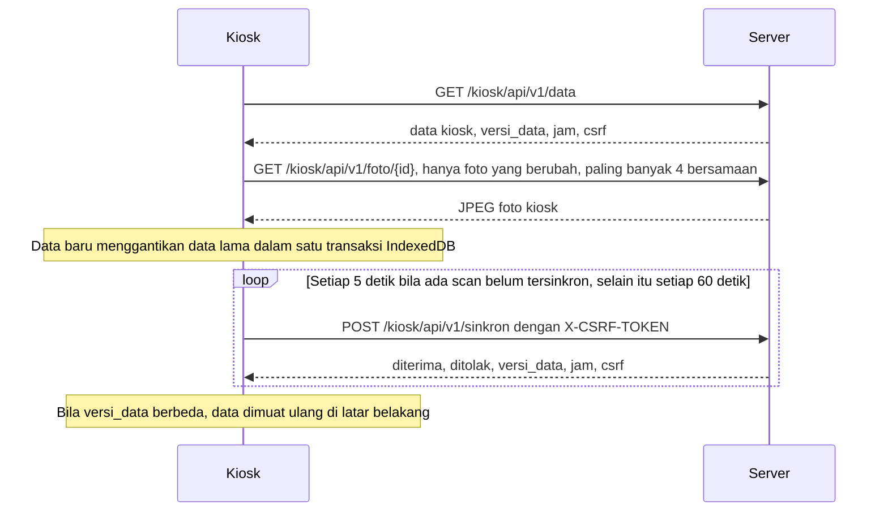

# Spensada — API Specification

| Item | Nilai |
|---|---|
| Versi | 0.1 (draft, menunggu review) |
| Tanggal | 2026-10-05 |
| Sumber | Discovery Session 8 (Routes / Pages / API) |
| Bergantung pada | [00-project-overview.md](00-project-overview.md): label status, glosarium, dan risiko (`R-xx`). [02-user-roles-and-permissions.md](02-user-roles-and-permissions.md): hak akses (`HA-*`). [04-feature-specification.md](04-feature-specification.md): fitur kiosk (`FS-KIO-*`) dan fitur yang memakai bantuan formulir. [05-business-rules.md](05-business-rules.md): aturan scan dan jam (`BR-*`). [06-database-design.md](06-database-design.md): tabel `scan`, `status_stasiun`, dan kode nilai. [07-system-architecture.md](07-system-architecture.md): kiosk, jam, sinkron, sesi, dan filter (`ARS-*`). [09-page-and-route-specification.md](09-page-and-route-specification.md): route, halaman, dan konvensi (`RT-*`). |
| Dokumen terkait | [08-ui-ux-design-system.md](08-ui-ux-design-system.md): teks dan keadaan kiosk. `11-validation-and-error-handling.md` dan `12-security.md` (Session 9), keduanya belum dibuat. |

Dokumen ini menetapkan API Spensada: API kiosk untuk memuat data, mengunduh foto, sinkron, dan logout; fragmen HTML yang diperbarui berkala; serta bantuan formulir di panel dan portal. Untuk setiap endpoint, dokumen ini menetapkan alamat, permintaan, jawaban, kode galat, dan efeknya di server. Dokumen ini juga menetapkan aturan bersama: format, CSRF, jam server, cache, sesi, batas ukuran, dan versi.

Dokumen ini menyelesaikan bentuk API yang diserahkan `04` §7 dan `07` (ARS-23, ARS-24, ARS-29) ke Session 8. Route halaman dan konvensi alamat ada di `09`.

## 1. Cara membaca dokumen ini

- **ID.**
  - Aturan API memakai `API-<NN>`.
  - Endpoint memakai `EP-<MODUL>-<NN>`, dengan kode modul dari `01` §2.
  - ID tidak pernah dinomori ulang. Butir yang batal ditandai `DEPRECATED`.
- **Status.** Label status mengikuti `00`. Keputusan dari ronde diskusi Session 8 berstatus DECISION (§2, rinciannya di `09` §2.1). Bentuk permintaan dan jawaban berstatus RECOMMENDATION, dan menjadi arah kerja implementasi sampai dikonfirmasi atau diganti.
- **Nama isian.** Isian JSON memakai `snake_case` dan nama teknis `06`, misalnya `rombel`, bukan label layar "Kelas".
- **Tipe.** `string`, `int`, `bool`, `array`, `object`, dan `null`. "ms" berarti bilangan bulat milidetik sejak epoch Unix (API-05).
- **Contoh.** Contoh memakai `04` §1: hari ini Selasa, 13 Oktober 2026. Nilai ms di contoh dihitung dari jam WIB yang disebut di sampingnya. Contoh JSON dipendekkan dengan komentar `…` di luar blok kode.

## 2. Keputusan Session 8

Keputusan Session 8 yang berdampak ke API. Daftar lengkapnya ada di `09` §2.1.

| Topik | Keputusan | Rujukan | Status |
|---|---|---|---|
| Versi API kiosk | Versi di alamat: `/kiosk/api/v1/…`. Perubahan yang tidak kompatibel memakai versi baru, dan versi lama tetap dilayani sampai semua stasiun memakai kode baru. | API-10 | DECISION |
| Laporan keadaan kiosk | Kiosk melaporkan versi kodenya dan keadaan penyimpanan permanen di setiap sinkron, untuk ditampilkan di status stasiun. | EP-KIO-03, `09` HAL-KIO-02 | DECISION |
| Pencarian siswa | Hasil pencarian tampil langsung saat mengetik bila JavaScript aktif, lewat fragmen pencarian. | EP-MD-01, `09` RT-14 | DECISION |
| Metode HTTP | Gaya REST di halaman panel dan portal (`09` RT-05). API kiosk hanya memakai GET dan POST. | API-01 | DECISION (gaya REST); RECOMMENDATION (GET dan POST untuk kiosk) |

## 3. Ruang lingkup dan daftar endpoint

Spensada tidak menyediakan API umum untuk aplikasi lain atau aplikasi ponsel. Sesuai stack (`00` §7.1, C-01), API hanya dibuat seperlunya, dalam tiga jenis:

1. **API kiosk.** JSON untuk kiosk, satu-satunya bagian yang berjalan sebagai aplikasi client (`00` §5).
2. **Fragmen.** Potongan HTML untuk bagian halaman yang diperbarui tanpa memuat ulang halaman (`07` ARS-50).
3. **Bantuan formulir.** Pencarian, pratinjau, dan proses bertahap yang dipanggil JavaScript halaman. Halamannya tetap bekerja tanpa JavaScript (`08` UI-04).

| ID | Metode | Alamat | Jawaban | Hak | Fitur | Rilis |
|---|---|---|---|---|---|---|
| EP-KIO-01 | GET | `/kiosk/api/v1/data` | JSON | `HA-KIO-01` | FS-KIO-01 | R1 |
| EP-KIO-02 | GET | `/kiosk/api/v1/foto/{id}` | JPEG | `HA-KIO-01` | FS-KIO-01 | R1 |
| EP-KIO-03 | POST | `/kiosk/api/v1/sinkron` | JSON | `HA-KIO-01` | FS-KIO-03, FS-KIO-04 | R1 |
| EP-KIO-04 | POST | `/kiosk/api/v1/logout` | JSON | `HA-KIO-01` | FS-KIO-01 butir 8 | R1 |
| EP-KIO-05 | GET | `/panel/stasiun/fragmen` | Fragmen | `HA-KIO-02`, `HA-AKN-03` | FS-KIO-05 | R1 |
| EP-LAP-01 | GET | `/panel/dashboard/fragmen` | Fragmen | `HA-LAP-01` | FS-LAP-01 | R1 |
| EP-MD-01 | GET | `/panel/siswa/cari` | Fragmen | `HA-MD-05`, `HA-PRS-03`, `HA-IZN-02`, `HA-LAP-04` | `09` RT-14 | R1 |
| EP-MD-02 | POST | `/panel/siswa/foto-massal/{token}/proses` | JSON | `HA-MD-08` | FS-MD-08 | R1 |
| EP-PRS-01 | GET | `/panel/presensi-manual/pratinjau` | Fragmen | `HA-PRS-03` | FS-PRS-06 | R1 |
| EP-IZN-01 | GET | `/portal/izin/hari-sekolah` | Fragmen | `HA-IZN-01` | FS-IZN-01 | R1 |
| EP-LAP-02 | GET | `/panel/laporan/flyer/data` | JSON | `HA-LAP-06` | FS-LAP-06 | R2 |

Kolom Hak mengikuti `09` §1: beberapa ID yang dipisah koma berarti cukup salah satu.

## 4. Aturan umum

### 4.1 Permintaan dan jawaban

| ID | Aturan | Status |
|---|---|---|
| API-01 | **Metode dan jenis isi.** API kiosk hanya memakai GET dan POST. Badan permintaan POST kiosk berupa JSON dengan `Content-Type: application/json`. Jawaban JSON memakai `Content-Type: application/json; charset=UTF-8`, dan fragmen memakai `text/html; charset=UTF-8`. Bantuan formulir yang mengubah data, yaitu EP-MD-02, dikirim sebagai POST tanpa badan. | RECOMMENDATION |
| API-02 | **Header permintaan latar belakang.** Semua permintaan dari JavaScript mengirim `X-Requested-With: XMLHttpRequest` (`07` ARS-13). Permintaan ke endpoint JSON juga mengirim `Accept: application/json`, dan permintaan fragmen mengirim `Accept: text/html`. Dengan header ini, filter menjawab dengan kode JSON, bukan pengalihan, dan CI4 tidak mencatat alamat itu sebagai halaman sebelumnya. | RECOMMENDATION |
| API-03 | **Kode galat.** Jawaban galat dari aplikasi memakai badan `{"kode": "…", "pesan": "…"}`, dengan kode di tabel di bawah. `pesan` adalah keterangan singkat untuk log dan pengembang. Kiosk dan halaman menampilkan teks sendiri (`08` §7.4, UI-28). Badan galat dapat memuat isian tambahan, misalnya `csrf`. | RECOMMENDATION |

Kode galat (API-03):

| Kode | Status | Arti | Tindakan klien |
|---|---|---|---|
| `login_ulang` | 401 | Tidak ada login yang sah: sesi dan cookie login stasiun tidak ada, kedaluwarsa, atau tidak sah, misalnya karena kredensial diganti (`07` ARS-30). | Kiosk menampilkan layar login stasiun berakhir dan menyimpan data serta scan (ARS-31). Halaman panel dan portal menghentikan polling dan menampilkan "Sesi berakhir" (`08` UI-28). |
| `nonaktif` | 403 | Akun yang login berstatus nonaktif. Kode ini hanya dikirim bila `akun.status` bernilai `nonaktif`, karena kiosk menghapus data lokal saat menerimanya. | Kiosk menghapus database IndexedDB dan menampilkan bahwa akun dinonaktifkan (ARS-31). Halaman panel dan portal dimuat ulang, sehingga pengguna sampai di halaman login. |
| `ditolak` | 403 | Jenis akun atau hak tidak sesuai, atau data di luar cakupan. | Kiosk membuka `/login`, yang mengalihkan pengguna yang sudah login ke halaman awalnya (`09` RT-18 butir 4). Halaman menampilkan pesan di luar hak (`08` UI-56). |
| `csrf` | 403 | Token CSRF tidak ada atau tidak cocok. Badan memuat token baru di isian `csrf` (API-04). | Ulang permintaan sekali dengan token baru. |
| `permintaan_rusak` | 400 | Badan bukan JSON yang sah, atau isian tingkat atas tidak ada atau salah tipe. Untuk fragmen, parameter wajib tidak ada atau tidak valid. | Tidak diulang otomatis. Kiosk mencatatnya sebagai galat kode. |
| `tidak_ditemukan` | 404 | Alamat, data, atau berkas tidak ada. | Kiosk memakai gambar pengganti untuk foto (`08` UI-24). |
| `sedang_diproses` | 409 | Proses yang sama sedang berjalan di permintaan lain, misalnya potongan foto massal. | Tunggu 2 detik, lalu ulang. |
| `versi_usang` | 410 | Versi API di alamat sudah tidak dilayani (API-10). | Kiosk meminta petugas menutup semua jendela kiosk lalu membukanya lagi, agar versi kode baru aktif (ARS-22 butir 7). |
| `terlalu_besar` | 413 | Kiriman melebihi batas (API-09). | Kirim ulang dalam potongan yang lebih kecil. |
| `terlalu_sering` | 429 | Pembatasan laju (Session 9). Jawaban memuat header `Retry-After`. | Tunggu sesuai `Retry-After`. |
| `galat_server` | 500 | Galat yang tidak tertangani di server. | Ulang dengan jeda bertingkat (ARS-29 butir 3). |

Jawaban 401 memuat header `WWW-Authenticate: Spensada` sesuai RFC 9110, karena login tidak memakai skema HTTP standar. Filter `csrf` global berjalan sebelum filter kelompok `sesi`, `area`, dan `hak` (`07` ARS-13). Karena itu, permintaan tulis dengan token CSRF yang kedaluwarsa dari pengguna yang loginnya juga berakhir lebih dulu dijawab 403 `csrf`. Klien mengulang dengan token baru (API-04 butir 4), lalu menerima 401 `login_ulang`. Klien wajib menangani urutan itu.

Jawaban 502, 503, dan 504 dari Nginx, putus koneksi, waktu habis, dan jawaban yang bukan JSON diperlakukan sama dengan `galat_server`. Jawaban 413 dari Nginx diperlakukan sama dengan `terlalu_besar`. Agar galat yang tidak tertangani di API tetap berbentuk JSON dengan kode, handler pengecualian aplikasi (`Config\Exceptions::handler()`) membuat badan `galat_server` untuk alamat `/kiosk/api/…`. Bawaan CI4 di production untuk permintaan yang tidak menerima `text/html` hanya mengirim status, tanpa kode atau keterangan galat.

### 4.2 Keamanan permintaan dan waktu

| ID | Aturan | Status |
|---|---|---|
| API-04 | **CSRF.** Lihat butir di bawah tabel. | RECOMMENDATION |
| API-05 | **Format waktu.** Lihat butir di bawah tabel. | RECOMMENDATION |
| API-06 | **Jam server di setiap jawaban kiosk.** Setiap jawaban JSON 2xx dari API kiosk memuat `jam`, berisi `diterima` (t2) dan `dikirim` (t3) dalam ms (`07` ARS-27 langkah 1). `diterima` diambil dari `$_SERVER['REQUEST_TIME_FLOAT']`, yaitu saat PHP mulai menangani permintaan. `dikirim` dihitung tepat sebelum badan jawaban dibuat. Jawaban galat tidak perlu memuat `jam`, dan kiosk tidak mengukur selisih dari jawaban galat. | RECOMMENDATION |

Butir API-04:

1. Semua permintaan selain GET membawa token CSRF di header `X-CSRF-TOKEN`, sesuai `Config\Security::$headerName` (`07` ARS-29 butir 5).
2. Jawaban JSON EP-KIO-01, EP-KIO-03, dan EP-MD-02 memuat isian `csrf` berisi `header` dan `token`. Klien selalu memakai token dari jawaban terakhir, karena token dapat diganti setiap kali dipakai (`Config\Security::$regenerate`).
3. Halaman panel dan portal menulis token dan nama headernya di elemen `<meta>`, untuk dibaca modul JavaScript halaman.
4. Bila token ditolak, server menjawab 403 `csrf` dengan token baru. Klien mengulang permintaan sekali. Bila ditolak lagi, klien melaporkan galat.
5. Filter CSRF bawaan CI4 di production mengalihkan permintaan yang gagal, dan melempar pengecualian untuk permintaan dengan `X-Requested-With`. Karena itu filter CSRF aplikasi menjawab permintaan latar belakang dengan kode `csrf` di atas (`07` ARS-13).
6. Masa berlaku token, regenerasi, dan nama isiannya ditetapkan di Session 9.

Butir API-05:

1. Waktu kejadian, yaitu jam scan, jam laptop, jam server, dan waktu data dimuat, dikirim sebagai ms sejak epoch Unix, tanpa zona waktu. Server mengubahnya ke `DATETIME` WIB (`06` DB-05) dengan membuang pecahan detik.
2. Kiosk juga membuang pecahan detik sebelum membandingkan jam scan dengan aturan jam. Dengan begitu, pukul 07.00.59,999 tetap Hadir bila batas terlambat 07.00, sama dengan perhitungan server (BR-JAM-04).
3. Tanggal ditulis `YYYY-MM-DD` menurut WIB.
4. Jam aturan ditulis `HH:MM` WIB, karena detik aturan jam selalu `00` (`06` §4.3).
5. Selisih jam ditulis dalam detik, sebagai bilangan bulat bertanda.

### 4.3 Cache, sesi, ukuran, dan versi

| ID | Aturan | Status |
|---|---|---|
| API-07 | **Cache dan kompresi.** Semua jawaban API dan fragmen memakai `Cache-Control: no-store`. Service Worker tidak menyimpan jawaban API (`07` ARS-22 butir 6). Nginx mengompresi JSON dengan gzip, sehingga `gzip_types` harus memuat `application/json`; bawaan Nginx hanya mengompresi `text/html`. Data kiosk untuk ±1.000 siswa berukuran sekitar 120 KB sebelum kompresi. | RECOMMENDATION |
| API-08 | **Sesi.** EP-KIO-01, EP-KIO-02, fragmen, dan pencarian hanya membaca sesi, sehingga menutup sesi segera setelah identitas dibaca (`07` ARS-48). Sinkron menutup sesi setelah transaksinya selesai dan sebelum memproses antrean hitung ulang (ARS-36 butir 3). Logout (EP-KIO-04) mengakhiri sesi. Perpanjangan cookie login stasiun (ARS-30 butir 4) ditulis filter `sesi` sebelum sesi ditutup. Token CSRF disimpan di cookie (`Config\Security::$csrfProtection = 'cookie'`), sehingga regenerasinya tidak membutuhkan sesi yang terbuka. Bila Session 9 memindahkan token ke sesi, sesi ditutup setelah token diganti. | RECOMMENDATION |
| API-09 | **Batas ukuran.** Satu kiriman sinkron memuat paling banyak 100 scan (`07` §2.3) dan berukuran paling besar 256 KB. Kiriman yang melebihinya dijawab 413 `terlalu_besar`. Parameter `cari` pencarian paling panjang 50 karakter. | RECOMMENDATION |
| API-10 | **Versi.** Lihat butir di bawah tabel. | DECISION (versi di alamat, versi baru untuk perubahan yang tidak kompatibel, dan versi lama tetap dilayani, Session 8); RECOMMENDATION (butir 2, 4, 5, dan 6) |
| API-11 | **Idempotensi dan urutan.** Lihat butir di bawah tabel. | RECOMMENDATION |
| API-12 | **Uji kontrak.** Contoh JSON di dokumen ini disimpan sebagai berkas uji di `tests/kasus/api/`. Berkas itu dipakai uji PHPUnit untuk controller API, dan uji `node --test` untuk modul `data.js` dan `sinkron.js` kiosk (`07` ARS-59). Perubahan bentuk API memperbarui dokumen ini lebih dulu, lalu berkas uji. | RECOMMENDATION |

Butir API-10:

1. API kiosk memakai versi di alamat. Versi pertama adalah `v1`, dengan controller di namespace `App\Controllers\Kiosk\Api\V1`.
2. Di dalam satu versi, perubahan hanya boleh menambah: isian baru yang opsional di permintaan, dan isian baru di jawaban. Klien mengabaikan isian yang tidak dikenalnya. Server tidak menghapus isian atau mengubah artinya di dalam satu versi.
3. Perubahan yang tidak kompatibel memakai versi baru, misalnya `v2` di namespace `Kiosk\Api\V2`. Server melayani kedua versi sampai semua stasiun aktif melaporkan versi kode kiosk yang memakai versi baru (`status_stasiun.versi_kiosk`, `09` HAL-KIO-02). Setelah itu, versi lama dijawab 410 `versi_usang`.
4. `versi_format` di data kiosk (`07` ARS-23) adalah versi struktur data yang disimpan kiosk di IndexedDB. Di `v1`, nilainya 1. Perubahan yang menaikkan `versi_format` selalu memakai versi alamat baru.
5. Versi kode kiosk (`versi_kiosk`) sama dengan versi di nama cache Service Worker (ARS-22 butir 3), dan dikirim di setiap sinkron (EP-KIO-03).
6. Fragmen dan bantuan formulir tidak memiliki versi, karena selalu dirilis bersama halaman yang memanggilnya. Halaman yang masih terbuka dari rilis lama memakai kode baru setelah dimuat ulang.

Butir API-11:

1. Sinkron bersifat idempotent berdasarkan `uuid` scan (BR-SCN-05, `06` DB-16). Kiriman ulang selalu aman.
2. Kiosk menjalankan paling banyak satu sinkron pada satu waktu (ARS-29 butir 3), dan mengirim scan berurutan dari jam scan yang paling awal.
3. Logout aman diulang. Jawaban 401 `login_ulang` atas logout berarti kiosk sudah tidak login.
4. Proses foto massal aman diulang, karena foto yang sudah diproses dicatat di `tmp/<token>/` (ARS-54 butir 6).

## 5. API kiosk v1

### 5.1 Alur



### 5.2 Ketentuan bersama

1. Route kiosk memakai filter kelompok `sesi` dan `area:stasiun`, dan setiap method memakai atribut hak `HA-KIO-01` (`09` RT-01, RT-02).
2. Filter `sesi` membuat ulang sesi dari cookie login stasiun bila sesi CI4 sudah habis, dan memperpanjang cookie itu paling banyak sekali sehari (`07` ARS-30).
3. Setiap permintaan EP-KIO-01 dan EP-KIO-03 memperbarui `status_stasiun.kontak_terakhir_at`. Unduhan foto dan logout tidak memperbaruinya, agar unduhan ratusan foto tidak menulis database ratusan kali.
4. Kiosk menolak jawaban data dengan `versi_format` yang lebih baru dari yang dikenalnya, dan meminta petugas membuka ulang kiosk (ARS-23).

Keadaan khusus dan perilaku kiosk:

| Keadaan | Jawaban | Perilaku kiosk |
|---|---|---|
| Login stasiun berakhir | 401 `login_ulang` | Layar "Login stasiun berakhir" (`08` UI-43). Data dan scan tetap tersimpan. Tombol login membuka `/login`. |
| Akun stasiun dinonaktifkan | 403 `nonaktif` | Database `spensada-kiosk` dihapus, lalu layar "Akun stasiun ini dinonaktifkan" (UI-43, ARS-31). |
| Akun yang login bukan akun stasiun | 403 `ditolak` | Membuka `/login`, yang mengalihkan ke halaman awal akun itu (`09` RT-18 butir 4, AC-AKN-01-05). |
| Token CSRF ditolak | 403 `csrf` | Mengulang permintaan sekali dengan token baru. |
| Versi API tidak dilayani | 410 `versi_usang` | Pita "Kiosk perlu diperbarui. Tutup semua jendela kiosk, lalu buka lagi." Scan tetap berjalan. |
| Galat server atau jaringan | 5xx, putus koneksi, waktu habis | Indikator koneksi berubah. Sinkron dicoba lagi dengan jeda 5, 10, 20, 40, lalu 60 detik (ARS-29 butir 3). |
| Data di jawaban rusak | JSON tidak sah, atau isian wajib tidak ada. `versi_format` yang lebih baru mengikuti §5.2 butir 4. | Data lama tetap dipakai, dengan pita "Gagal memuat data" (`08` UI-44). |

### EP-KIO-01 — Muat data kiosk

| Item | Isi |
|---|---|
| Alamat | `GET /kiosk/api/v1/data` |
| Fitur | FS-KIO-01, `07` ARS-23 |
| Permintaan | Tanpa parameter. Header API-02. |
| Jawaban | 200 JSON (tabel di bawah). Galat: 401, 403, 410, 429, 500 (API-03). |
| Efek di server | Memperbarui `kontak_terakhir_at`. Data yang dibangun disimpan di cache CI4 selama 60 detik (ARS-23). Waktu data dimuat tidak ditulis di sini, tetapi dilaporkan kiosk lewat EP-KIO-03 setelah data tersimpan. |

Isian tingkat atas:

| Isian | Tipe | Isi | Masuk hash |
|---|---|---|---|
| `versi_format` | int | Versi struktur data. Di `v1` bernilai 1 (API-10). | Ya |
| `versi_data` | string | 40 karakter heksadesimal: SHA-1 dari isi data (butir di bawah tabel). | — |
| `dibangun_at` | int (ms) | Waktu data dibangun. | Tidak |
| `sekolah` | object | `nama` (string atau null) dan `versi_logo` (string atau null): nama file logo tanpa ekstensi, yaitu 32 karakter heksadesimal yang berganti setiap logo diganti (`07` ARS-51). Null bila belum ada logo. | Ya |
| `parameter` | object | Parameter kiosk (tabel parameter). | Ya |
| `siswa` | array | Siswa aktif dan ditempatkan di rombel pada hari ini, urut NISN. | Ya |
| `aturan` | array | Hari ini dan 14 hari ke depan, urut tanggal. | Ya |
| `libur` | array | Libur yang mencakup sebagian rentang aturan, urut `id`. | Ya |
| `pola` | object atau null | Pola mingguan yang berlaku pada tanggal terakhir rentang. Null bila belum ada pola mingguan. | Ya |
| `stasiun` | object | `id`, `nama`, `username`, dan `status` akun stasiun yang login. | Tidak |
| `jam` | object | `diterima` dan `dikirim` (API-06). | Tidak |
| `csrf` | object | `header` dan `token` (API-04). | Tidak |

`versi_data` dihitung dari string JSON objek berisi `versi_format`, `sekolah`, `parameter`, `siswa`, `aturan`, `libur`, dan `pola`, dengan urutan isian dan urutan array seperti tabel di atas. String itu dibuat dengan `json_encode()` memakai `JSON_UNESCAPED_UNICODE | JSON_UNESCAPED_SLASHES`. Dengan begitu, data yang sama selalu menghasilkan versi yang sama.

Isi `siswa`:

| Isian | Tipe | Isi |
|---|---|---|
| `id` | int | `siswa.id`, dipakai untuk unduhan foto. |
| `nisn` | string | 10 digit. |
| `nama` | string | Nama lengkap. |
| `rombel_id` | int | Rombel pada hari ini. |
| `rombel` | string | Nama rombel, misalnya "7A". Kiosk menampilkannya sebagai "Kelas 7A" (`08` UI-51). |
| `tingkat` | int | 7, 8, atau 9. |
| `versi_foto` | int (ms) atau null | `siswa.foto_diganti_at`. Null bila siswa tidak memiliki foto. |

Isi `aturan`:

| Isian | Tipe | Isi |
|---|---|---|
| `tanggal` | string | `YYYY-MM-DD`. |
| `hari_sekolah` | bool | Hari sekolah menurut semester, pola mingguan, dan jadwal (BR-KAL-05 syarat 1 dan 2). Libur dan syarat per siswa diperiksa kiosk dengan `libur` dan `siswa`. |
| `sumber` | string | `jadwal_hari_ini`, `jadwal_khusus`, `pola_mingguan`, `di_luar_semester`, atau `belum_diatur`. |
| `keterangan` | string atau null | Keterangan jadwal khusus. Null untuk sumber lain. |
| `jam` | object atau null | Tujuh isian aturan jam (tabel `jam`). Null bila bukan hari sekolah. |

Sumber ditentukan berurutan: `di_luar_semester` bila tanggal di luar semua semester, termasuk bila belum ada tahun ajaran aktif (FS-MD-02 E1); `jadwal_hari_ini`, `jadwal_khusus`, atau `pola_mingguan` sesuai urutan aturan jam (`06` §7); dan `belum_diatur` bila tidak ada pola mingguan yang berlaku. Untuk `belum_diatur`, kiosk menampilkan "Aturan jam belum diatur. Hubungi admin." (FS-KIO-01 E6, `08` UI-43).

Isi `jam`, dengan nama dari kolom `06` §4.3 tanpa awalan `jam_`:

| Isian | Tipe | Contoh |
|---|---|---|
| `buka_masuk` | string | `"06:00"` |
| `masuk` | string | `"07:00"` |
| `toleransi_menit` | int | `0` |
| `tutup_masuk` | string | `"08:00"` |
| `buka_pulang` | string | `"12:00"` |
| `pulang` | string | `"13:00"` |
| `tutup_pulang` | string | `"17:00"` |

Isi `libur`:

| Isian | Tipe | Isi |
|---|---|---|
| `id` | int | `libur.id` |
| `mulai`, `selesai` | string | Rentang tanggal. |
| `keterangan` | string | Tampil di kiosk (FS-KIO-02 E6, E7). |
| `cakupan` | string | `semua`, `tingkat`, atau `rombel`. |
| `tingkat` | array of int | Tingkat yang diliburkan. Kosong bila cakupan bukan `tingkat`. |
| `rombel_id` | array of int | Rombel yang diliburkan. Kosong bila cakupan bukan `rombel`. |

Isi `pola`: `berlaku_mulai` (string) dan `hari`, berupa array tujuh objek `{hari, hari_sekolah, jam}` dengan `hari` 1 (Senin) sampai 7 (Minggu). Kiosk memakai `pola` untuk tanggal di luar rentang `aturan`, disertai peringatan (FS-KIO-01 butir 7). Server tetap menilai ulang scan itu dengan aturan lengkap (FS-KIO-04).

Isi `parameter` (`07` ARS-33):

| Isian | Nilai awal | Arti |
|---|---|---|
| `muat_hari` | 14 | Jumlah hari ke depan di `aturan`. |
| `batas_umur_data_jam` | 72 | Peringatan data lama. |
| `interval_sinkron_detik` | 5 | Interval sinkron selama ada scan belum tersinkron. |
| `ukuran_kiriman` | 100 | Scan per kiriman. |
| `interval_kontak_detik` | 60 | Kontak berkala. |
| `jeda_coba_ulang_detik` | `[5, 10, 20, 40, 60]` | Jeda coba ulang. |
| `toleransi_selisih_detik` | 120 | Toleransi selisih jam. |
| `jeda_nisn_sama_detik` | 5 | Jeda pengabaian NISN yang sama. |
| `jeda_antartombol_ms` | 50 | Jeda antartombol scanner USB. |
| `lama_tampil_detik` | `{"tercatat": 3, "ganda": 3, "ditolak": 6}` | Lama hasil scan tampil (`08` UI-41). |
| `unduhan_foto_bersamaan` | 4 | Unduhan foto bersamaan (`07` §6.4). |

Parameter ARS-33 yang hanya dipakai server, yaitu batas sorotan stasiun, ukuran foto kiosk, cache data kiosk, dan masa login stasiun, tidak dikirim.

Contoh jawaban, dengan satu siswa, dua tanggal aturan, dan tanpa libur. Data dibangun pukul 06.04.31 WIB, masih dalam masa cache 60 detik, dan permintaan diterima pukul 06.05.00,120 WIB:

```json
{
  "versi_format": 1,
  "versi_data": "8f2b6c1d9e0a4b7c3d5e6f708192a3b4c5d6e7f8",
  "dibangun_at": 1791846271000,
  "sekolah": { "nama": "SMP Negeri 1 Contoh", "versi_logo": "3f9a1c7e5b2d4f6a8c0e1b3d5f7a9c2e" },
  "parameter": {
    "muat_hari": 14,
    "batas_umur_data_jam": 72,
    "interval_sinkron_detik": 5,
    "ukuran_kiriman": 100,
    "interval_kontak_detik": 60,
    "jeda_coba_ulang_detik": [5, 10, 20, 40, 60],
    "toleransi_selisih_detik": 120,
    "jeda_nisn_sama_detik": 5,
    "jeda_antartombol_ms": 50,
    "lama_tampil_detik": { "tercatat": 3, "ganda": 3, "ditolak": 6 },
    "unduhan_foto_bersamaan": 4
  },
  "siswa": [
    {
      "id": 412,
      "nisn": "0012345678",
      "nama": "Budi Santoso",
      "rombel_id": 12,
      "rombel": "7A",
      "tingkat": 7,
      "versi_foto": 1790823600000
    }
  ],
  "aturan": [
    {
      "tanggal": "2026-10-13",
      "hari_sekolah": true,
      "sumber": "pola_mingguan",
      "keterangan": null,
      "jam": {
        "buka_masuk": "06:00", "masuk": "07:00", "toleransi_menit": 0, "tutup_masuk": "08:00",
        "buka_pulang": "12:00", "pulang": "13:00", "tutup_pulang": "17:00"
      }
    },
    {
      "tanggal": "2026-10-18",
      "hari_sekolah": false,
      "sumber": "pola_mingguan",
      "keterangan": null,
      "jam": null
    }
  ],
  "libur": [],
  "pola": {
    "berlaku_mulai": "2026-07-13",
    "hari": [
      { "hari": 1, "hari_sekolah": true, "jam": { "buka_masuk": "06:00", "masuk": "06:45", "toleransi_menit": 0, "tutup_masuk": "08:00", "buka_pulang": "12:00", "pulang": "13:00", "tutup_pulang": "17:00" } },
      { "hari": 7, "hari_sekolah": false, "jam": null }
    ]
  },
  "stasiun": { "id": 5, "nama": "Gerbang 1", "username": "gerbang1", "status": "aktif" },
  "jam": { "diterima": 1791846300120, "dikirim": 1791846300165 },
  "csrf": { "header": "X-CSRF-TOKEN", "token": "9c1f4e2a7b3d5c8e0f6a1b2c3d4e5f60" }
}
```

Di contoh, `aturan` dan `pola.hari` dipendekkan. Jawaban sebenarnya memuat 15 tanggal aturan dan 7 hari pola.

Logo sekolah diunduh kiosk dari `GET /logo?v=<versi_logo>` (`09` §13) setiap kali `versi_logo` berubah, lalu disimpan di penyimpanan `meta` IndexedDB (`07` ARS-21), sehingga tetap tampil saat offline.

### EP-KIO-02 — Unduh foto

| Item | Isi |
|---|---|
| Alamat | `GET /kiosk/api/v1/foto/{id}`, dengan `{id}` = `siswa.id`. Parameter `v` berisi `versi_foto` boleh ditambahkan untuk penelusuran log, dan tidak dipakai server. |
| Fitur | FS-KIO-01, `07` §6.4 |
| Jawaban | 200 `image/jpeg` berisi foto kiosk 300×400 px (`07` ARS-53), dengan header ARS-52: `Cache-Control: no-store`, `X-Content-Type-Options: nosniff`, dan `Content-Security-Policy: sandbox`. |
| Galat | 404 `tidak_ditemukan` bila siswa tidak termasuk data kiosk hari ini, yaitu tidak aktif atau tidak ditempatkan di rombel, atau tidak memiliki foto. Selain itu 401, 403, 410, dan 500. |
| Efek di server | Tidak ada. Sesi ditutup segera (API-08). |

Kiosk mengunduh foto hanya bila `versi_foto` berbeda dengan yang tersimpan, paling banyak 4 bersamaan, dengan `fetch(…, { cache: 'no-store' })`. Foto disimpan sebagai Blob di penyimpanan `foto` IndexedDB (ARS-21). Siswa yang fotonya belum terunduh tampil dengan gambar pengganti (FS-MD-07 E3).

### EP-KIO-03 — Sinkron dan kontak berkala

| Item | Isi |
|---|---|
| Alamat | `POST /kiosk/api/v1/sinkron` |
| Fitur | FS-KIO-03, FS-KIO-04, `07` ARS-27, ARS-29 |
| Permintaan | JSON (tabel di bawah), dengan header API-02 dan `X-CSRF-TOKEN`. Kiriman tanpa scan adalah kontak berkala (ARS-29 butir 1). |
| Jawaban | 200 JSON, termasuk bila sebagian scan ditolak. Galat: 400, 401, 403, 410, 413, 429, 500 (API-03). |
| Efek di server | Menyimpan scan, memperbarui `status_stasiun`, dan menulis antrean hitung ulang dalam satu transaksi, lalu memproses antrean (butir di bawah tabel). |

Isian permintaan:

| Isian | Tipe | Isi |
|---|---|---|
| `jam_laptop` | int (ms) | Jam laptop asli saat kiriman dibuat (ARS-27 langkah 6). |
| `versi_kiosk` | string | Versi kode kiosk, misalnya `"1.0.0"` (API-10). |
| `versi_data` | string atau null | Versi data yang sedang dipakai. Null bila data belum pernah dimuat. |
| `data_dimuat_at` | int (ms) atau null | Jam terkoreksi saat data itu selesai dimuat dan tersimpan. |
| `belum_sinkron` | int | Jumlah scan belum tersinkron di laptop saat kiriman dibuat, termasuk scan di kiriman ini, tanpa scan galat. |
| `scan_galat` | int | Jumlah scan galat di laptop saat kiriman dibuat (FS-KIO-03 E4). |
| `penyimpanan_permanen` | bool atau null | Hasil `navigator.storage.persisted()`. Null bila tidak dapat diperiksa. |
| `scan` | array | 0 sampai 100 scan, berurutan dari jam scan yang paling awal. |

Semua isian tingkat atas wajib ada. Isian yang tidak ada atau salah tipe membuat seluruh kiriman ditolak dengan 400 `permintaan_rusak`.

Isi setiap scan, dengan kolom `scan` tujuannya (`06` §8.2):

| Isian | Tipe | Kolom `scan` | Isi |
|---|---|---|---|
| `uuid` | string | `uuid` | UUID versi 4, 36 karakter huruf kecil (ARS-24). |
| `akun_id` | int | `stasiun_id` | Akun stasiun yang mencatat scan (ARS-31). |
| `nisn` | string | `nisn` | 10 digit seperti dibaca kiosk. |
| `jenis` | string | `jenis_kiosk` | `masuk` atau `pulang` menurut kiosk. |
| `status` | string | `status_kiosk` | `hadir` atau `terlambat` untuk masuk; `pulang` atau `pulang_awal` untuk pulang. |
| `jam_scan` | int (ms) | `jam_scan` | Jam terkoreksi (BR-SCN-07). |
| `jam_laptop` | int (ms) | `jam_laptop` | Jam laptop asli saat scan. |
| `selisih_detik` | int | `selisih_detik` | Selisih jam yang dipakai kiosk. |

Scan yang tidak valid ditolak satu per satu, dan scan lain tetap diproses (FS-KIO-04 E3). Alasan penolakan:

| Alasan | Keadaan |
|---|---|
| `uuid_tidak_valid` | Bukan UUID versi 4 huruf kecil sepanjang 36 karakter. |
| `akun_berbeda` | `akun_id` bukan akun stasiun yang login (ARS-31). |
| `nisn_tidak_valid` | Bukan tepat 10 digit. |
| `jenis_tidak_valid` | Bukan `masuk` atau `pulang`. |
| `status_tidak_valid` | Bukan salah satu status untuk jenisnya. |
| `jam_tidak_valid` | `jam_scan` atau `jam_laptop` bukan bilangan bulat, atau berada di luar rentang jam server dikurangi 400 hari sampai jam server ditambah 2 hari. |
| `selisih_tidak_valid` | Bukan bilangan bulat, atau nilai mutlaknya lebih dari 400 hari dalam detik. |

Scan dengan NISN yang tidak dikenal server bukan scan rusak. Scan itu disimpan dengan `hasil = ditolak` dan dijawab sebagai diterima (FS-KIO-04 E4). Jam scan yang terlalu maju tetap diterima dan ditandai (BR-SCN-08).

Langkah di server:

1. Memeriksa isian tingkat atas, lalu setiap scan.
2. Mengukur selisih jam stasiun: `diterima` (t2) dikurangi `jam_laptop` kiriman, dibulatkan ke detik (ARS-27 langkah 6). Penilaian scan di langkah 3 memakai selisih ini.
3. Dalam satu transaksi (ARS-29 butir 6):
   1. menyimpan scan yang valid dengan `INSERT … ON DUPLICATE KEY UPDATE id = id` berdasarkan `uuid`, lalu mengisi penilaian dan nilai awal kolom hasil untuk scan baru (`PenilaiScan`, ARS-16);
   2. memperbarui `status_stasiun` (tabel di bawah);
   3. menulis antrean hitung ulang untuk scan baru dengan siswa yang dikenal.
4. Setelah commit, membaca `uuid` yang tersimpan untuk mengisi `diterima` (ARS-29 butir 7).
5. Menutup sesi, lalu memproses antrean paling lama 2 detik tanpa menunggu kunci (ARS-36).
6. Mengirim jawaban.

Pembaruan `status_stasiun`:

| Kolom | Nilai |
|---|---|
| `kontak_terakhir_at` | Waktu kiriman diterima. |
| `sinkron_terakhir_at` | Waktu kiriman diterima, hanya bila kiriman memuat scan dan paling sedikit satu scan diterima. |
| `belum_sinkron` | `belum_sinkron` kiriman dikurangi jumlah `diterima` dan jumlah `ditolak`, paling kecil 0. |
| `belum_sinkron_dilaporkan_at` | Waktu kiriman diterima. |
| `scan_galat` | `scan_galat` kiriman ditambah jumlah `ditolak`. |
| `selisih_jam_detik`, `selisih_diukur_at` | Selisih dari langkah 2, dan waktu kiriman diterima. |
| `data_dimuat_at`, `versi_data`, `versi_kiosk`, `penyimpanan_permanen` | Dari kiriman. |

Isian jawaban:

| Isian | Tipe | Isi |
|---|---|---|
| `diterima` | array of string | `uuid` scan yang tersimpan di server, termasuk yang sudah tersimpan sebelumnya (ARS-29 butir 4). |
| `ditolak` | array of object | `{ "uuid": …, "alasan": … }` untuk setiap scan yang ditolak. |
| `versi_data` | string | Versi data kiosk terbaru di server. |
| `stasiun` | object | Sama dengan EP-KIO-01. |
| `jam` | object | API-06. |
| `csrf` | object | API-04. |

Setelah jawaban diterima, kiosk menandai scan di `diterima` sebagai tersinkron, menandai scan di `ditolak` sebagai galat, menyimpan token CSRF baru, dan memperbarui selisih jam (ARS-27). Bila `versi_data` berbeda dengan miliknya, kiosk memuat ulang data di latar belakang (FS-KIO-01 butir 1). Scan galat tidak dikirim ulang otomatis, kecuali sekali setiap kali versi kode kiosk berubah, karena penyebabnya biasanya galat kode yang sudah diperbaiki. Selama dikirim ulang, scan itu kembali dihitung sebagai belum tersinkron.

Contoh permintaan pukul 07.05.35 WIB dari laptop yang jamnya 3 detik terlambat, berisi dua scan baru dan satu scan rusak:

```json
{
  "jam_laptop": 1791849932010,
  "versi_kiosk": "1.0.0",
  "versi_data": "8f2b6c1d9e0a4b7c3d5e6f708192a3b4c5d6e7f8",
  "data_dimuat_at": 1791846303000,
  "belum_sinkron": 3,
  "scan_galat": 0,
  "penyimpanan_permanen": true,
  "scan": [
    {
      "uuid": "3f1c2a9e-7b4d-4c1a-9e2f-8a6b5c4d3e21",
      "akun_id": 5,
      "nisn": "0012345678",
      "jenis": "masuk",
      "status": "hadir",
      "jam_scan": 1791849130430,
      "jam_laptop": 1791849127430,
      "selisih_detik": 3
    },
    {
      "uuid": "b7e4d2c1-0a9f-4e3d-8c2b-1f0e9d8c7b6a",
      "akun_id": 5,
      "nisn": "0023456789",
      "jenis": "masuk",
      "status": "terlambat",
      "jam_scan": 1791849931220,
      "jam_laptop": 1791849928220,
      "selisih_detik": 3
    },
    {
      "uuid": "c9d8e7f6-5a4b-4c3d-a2e1-f0a9b8c7d6e5",
      "akun_id": 5,
      "nisn": "12345678",
      "jenis": "masuk",
      "status": "terlambat",
      "jam_scan": 1791849931220,
      "jam_laptop": 1791849928220,
      "selisih_detik": 3
    }
  ]
}
```

Jawabannya. Data di server sudah berubah, misalnya karena ada siswa baru, sehingga kiosk memuat ulang data:

```json
{
  "diterima": [
    "3f1c2a9e-7b4d-4c1a-9e2f-8a6b5c4d3e21",
    "b7e4d2c1-0a9f-4e3d-8c2b-1f0e9d8c7b6a"
  ],
  "ditolak": [
    { "uuid": "c9d8e7f6-5a4b-4c3d-a2e1-f0a9b8c7d6e5", "alasan": "nisn_tidak_valid" }
  ],
  "versi_data": "1a2b3c4d5e6f708192a3b4c5d6e7f8091a2b3c4d",
  "stasiun": { "id": 5, "nama": "Gerbang 1", "username": "gerbang1", "status": "aktif" },
  "jam": { "diterima": 1791849935070, "dikirim": 1791849935112 },
  "csrf": { "header": "X-CSRF-TOKEN", "token": "a0b1c2d3e4f5a6b7c8d9e0f1a2b3c4d5" }
}
```

Dari contoh ini, server menyimpan `belum_sinkron` = 3 − 2 − 1 = 0 dan `scan_galat` = 0 + 1 = 1. Kiriman berikutnya melaporkan nilai yang sama. Selisih yang diukur server adalah 07.05.35,070 dikurangi 07.05.32,010, dibulatkan menjadi 3 detik.

### EP-KIO-04 — Logout kiosk

| Item | Isi |
|---|---|
| Alamat | `POST /kiosk/api/v1/logout` |
| Fitur | FS-KIO-01 butir 8, FS-AKN-01 butir 8, `07` ARS-30 butir 5 |
| Permintaan | Badan `{}`, dengan header API-02 dan `X-CSRF-TOKEN`. |
| Jawaban | 200 `{ "keluar": true, "jam": … }`. Galat: 401 berarti sudah tidak login (API-11), selain itu 403, 410, 429, dan 500. |
| Efek di server | Mengakhiri sesi dengan `session()->destroy()`, yang menghapus cookie sesi dengan jalur cookie aplikasi (`Config\Cookie::$path`, `/`). Cookie login stasiun dihapus dengan `Set-Cookie` berjalur sama dengan saat dibuat (`Path=/kiosk`) dan `Max-Age=0`. |

Sebelum memanggil endpoint ini, kiosk meminta konfirmasi petugas, termasuk PIN bila ditetapkan di Session 9 (`08` UI-48), lalu mengosongkan penanda login di `meta` IndexedDB (ARS-22 butir 6). Setelah jawaban diterima, kiosk membuka `/login`. Scan yang belum tersinkron tetap tersimpan, dan dikirim setelah akun stasiun yang sama login kembali (FS-KIO-01 butir 8).

## 6. Fragmen dan bantuan formulir

### 6.1 Ketentuan bersama

1. Fragmen adalah potongan HTML tanpa layout, dibuat dari view komponen yang sama dengan halamannya (`08` UI-75, `07` ARS-50). Hak dan cakupannya sama dengan halamannya (`09` RT-15).
2. JavaScript mengganti isi wadah hanya bila jawaban berstatus 200 dan berjenis `text/html`. Selain itu isi lama dibiarkan, dan halaman mengikuti API-03 dan `08` UI-28: sesi berakhir untuk 401, halaman dimuat ulang untuk 403 `nonaktif`, pesan di luar hak untuk 403 `ditolak`, dan gagal memperbarui untuk keadaan lain.
3. Fragmen berkala diminta setiap 30 detik, dan berhenti saat tab tidak terlihat (ARS-50).
4. Bantuan formulir yang dipicu ketikan dikirim 300 milidetik setelah ketikan terakhir. Permintaan sebelumnya yang belum selesai dibatalkan dengan `AbortController`.
5. Parameter wajib yang tidak ada atau tidak valid dijawab 400 `permintaan_rusak`.

### EP-LAP-01 — Fragmen dashboard

| Item | Isi |
|---|---|
| Alamat | `GET /panel/dashboard/fragmen` |
| Halaman | `09` HAL-LAP-01 |
| Jawaban | Bagian dashboard yang berubah: tahap sesi, tanda mode darurat, aturan jam hari ini, peringatan sesuai hak, ubin ringkasan, tabel per kelas, dan teks "Diperbarui 07.32". |
| Catatan | Status dibaca lewat `PembacaStatus`, yang dapat menunggu kunci paling lama 5 detik (ARS-37). Bila kunci belum didapat, fragmen memuat tanda "Sedang diperbarui" (ARS-36 butir 5). |

### EP-KIO-05 — Fragmen status stasiun

| Item | Isi |
|---|---|
| Alamat | `GET /panel/stasiun/fragmen` |
| Halaman | `09` HAL-KIO-02 |
| Jawaban | Tabel status stasiun beserta sorotan dan teks "Diperbarui 07.32". Kolom kelola akun hanya tampil bagi pemegang `HA-AKN-03`. |

### EP-MD-01 — Cari siswa

| Item | Isi |
|---|---|
| Alamat | `GET /panel/siswa/cari` |
| Halaman | `09` RT-14, dipakai HAL-MD-04, HAL-PRS-07, HAL-IZN-08, HAL-IZN-09, dan HAL-LAP-06 |
| Parameter | Tabel di bawah. |
| Jawaban | Daftar paling banyak 20 siswa: foto kecil, nama, NISN, kelas, status siswa, dan tautan atau kotak centang sesuai `untuk`. Bila hasil lebih dari 20, daftar menyebut jumlahnya dan meminta pencarian dipersempit. Bila kosong: "Tidak ada siswa yang cocok." |
| Galat | 403 `ditolak` bila pengguna tidak memegang hak untuk `untuk`. 400 `permintaan_rusak` bila `cari` atau `untuk` tidak valid. |

| Parameter | Wajib | Isi |
|---|---|---|
| `cari` | Ya | 2–50 karakter. Namanya sama dengan parameter pencarian tanpa JavaScript (`09` RT-14 butir 2). Dicocokkan dengan bagian nama, atau awal NISN bila berisi angka saja. |
| `untuk` | Ya | Tujuan dan hak pencarian (tabel di bawah). |
| `tanggal` | Tidak | Dibawa ke tautan presensi manual dan input izin. |
| `kembali` | Tidak | Dibawa ke tautan (`09` RT-10). |
| `siswa[]` | Tidak | Untuk `dispensasi`: siswa yang sudah dipilih. Siswa itu tampil tercentang. |

| `untuk` | Hak dan cakupan | Siswa yang dicari | Hasil per siswa |
|---|---|---|---|
| `profil` | `HA-MD-05` | Semua status, dengan tanda nonaktif | Tautan ke `/panel/siswa/{id}` |
| `presensi_manual` | `HA-PRS-03` | Aktif pada hari ini | Tautan ke `/panel/presensi-manual?siswa={id}` |
| `izin` | `HA-IZN-02` | Aktif pada hari ini | Tautan ke `/panel/izin/tambah?siswa={id}` |
| `dispensasi` | `HA-IZN-02` | Aktif pada hari ini | Kotak centang `siswa[]` |
| `riwayat` | `HA-LAP-04` | Semua status, dengan tanda nonaktif | Tautan ke `/panel/siswa/{id}/kehadiran` |

Cakupan mengikuti hak tujuan pencarian, sehingga siswa di luar cakupan tidak muncul (`04` §4.1 butir 3). Hasil memuat data profil siswa (`HA-MD-05`). Setiap pemegang hak tujuan juga memegang `HA-MD-05` dengan cakupan yang sama atau lebih luas (`02` §6), sehingga hasil tidak pernah memuat siswa di luar cakupan `HA-MD-05`. Pencarian untuk tanggal lampau yang memerlukan siswa nonaktif dilakukan dari riwayat atau daftar presensi kelas tanggal itu.

### EP-PRS-01 — Pratinjau presensi manual

| Item | Isi |
|---|---|
| Alamat | `GET /panel/presensi-manual/pratinjau?siswa=&tanggal=&jenis=&jam=` |
| Halaman | `09` HAL-PRS-07, `08` UI-34 |
| Jawaban | Hasil yang akan tercatat menurut aturan jam tanggal itu (BR-KOR-01), misalnya "Akan tercatat: Terlambat" atau "Akan tercatat: pulang lebih awal", beserta peringatan FS-PRS-06 butir 3 dan keadaan yang akan menolak penyimpanan (E1 s.d. E4). Tidak ada data yang disimpan. |
| Catatan | Isi sama dengan hasil tombol "Periksa" tanpa JavaScript (`09` RT-07). |

### EP-IZN-01 — Hari sekolah terdampak

| Item | Isi |
|---|---|
| Alamat | `GET /portal/izin/hari-sekolah?mulai=&selesai=` |
| Halaman | `09` HAL-IZN-02 |
| Jawaban | Hari sekolah siswa itu dalam rentang, misalnya "2 hari sekolah: Senin 12 dan Selasa 13 Oktober" (FS-IZN-01 butir 1). Paling banyak 7 tanggal disebut satu per satu. Lebih dari itu, fragmen menyebut jumlah dan rentangnya. Fragmen juga memuat keadaan yang akan menolak pengajuan: di luar batas mundur (E1), bentrok (E2), tanpa hari sekolah (E3), dan di luar tahun ajaran aktif (E4). |
| Catatan | Hanya untuk data siswa yang login. |

### EP-MD-02 — Proses foto massal

| Item | Isi |
|---|---|
| Alamat | `POST /panel/siswa/foto-massal/{token}/proses` |
| Halaman | `09` HAL-MD-15, `07` ARS-54 butir 6 |
| Permintaan | Tanpa badan, dengan header API-02 dan `X-CSRF-TOKEN`. |
| Jawaban | 200 JSON (contoh di bawah). Tanpa header permintaan latar belakang, jawabannya 303 ke halaman token (`09` RT-15). |
| Galat | 404 `tidak_ditemukan` bila token tidak ada atau milik akun lain. Token yang sudah selesai dijawab 200 dengan `selesai: true` dan ringkasan terakhir, agar permintaan ulang aman (API-11 butir 4). 409 `sedang_diproses` bila potongan lain untuk token yang sama sedang berjalan. |
| Efek di server | Memproses paling banyak 20 foto berikutnya, lalu mencatat hasilnya di `tmp/<token>/`. Sesi ditutup sebelum foto diproses (`09` RT-17). |

```json
{
  "diproses": 40,
  "total": 212,
  "berhasil": 39,
  "gagal": 1,
  "selesai": false,
  "csrf": { "header": "X-CSRF-TOKEN", "token": "a0b1c2d3e4f5a6b7c8d9e0f1a2b3c4d5" }
}
```

Isian `diproses`, `berhasil`, dan `gagal` adalah jumlah kumulatif sejak awal, dan `total` adalah jumlah foto di token itu. Modul halaman memanggil endpoint ini berulang sampai `selesai` bernilai `true`, lalu memuat ulang halaman token untuk menampilkan ringkasan.

### EP-LAP-02 — Data flyer (R2)

Kerangka. Dirinci menjelang R2 bersama FS-LAP-06.

| Item | Isi |
|---|---|
| Alamat | `GET /panel/laporan/flyer/data?cakupan=&kelas=&tanggal=`, dengan `cakupan` bernilai `sekolah` atau `kelas` |
| Halaman | `09` HAL-LAP-10, `08` UI-65 s.d. UI-67 |
| Jawaban | JSON berisi identitas sekolah dan versi logo, tanggal, cakupan, tanda final dan waktu dibuat (`13` IE-03), jumlah siswa yang memiliki hari sekolah, jumlah per status termasuk belum hadir, persentase kehadiran (`13` IE-04), dan untuk cakupan sekolah, persentase per tingkat. |
| Catatan | Angka dibaca dengan aturan baca yang sama dengan laporan (`13` IE-01). Jawaban tidak memuat nama, foto, NISN, atau data individu siswa lain (`13` LP-08). |

## 7. Traceability

### 7.1 Fitur dan arsitektur → API

| Fitur atau aturan | API |
|---|---|
| FS-KIO-01 | EP-KIO-01, EP-KIO-02, EP-KIO-04 |
| FS-KIO-02 | Tidak memanggil API. Scan dicatat di IndexedDB lalu dikirim lewat EP-KIO-03. |
| FS-KIO-03, FS-KIO-04 | EP-KIO-03 |
| FS-KIO-05 | EP-KIO-03 (laporan keadaan), EP-KIO-05 |
| FS-MD-08 | EP-MD-02 |
| FS-PRS-06 | EP-MD-01, EP-PRS-01 |
| FS-IZN-01 | EP-IZN-01 |
| FS-IZN-02, FS-IZN-03 | EP-MD-01 |
| FS-LAP-01 | EP-LAP-01 |
| FS-LAP-04 | EP-MD-01 |
| FS-LAP-06 (R2) | EP-LAP-02 |
| `07` ARS-13 | API-02, API-03, API-04 |
| `07` ARS-23 | EP-KIO-01 |
| `07` ARS-24 | EP-KIO-03 |
| `07` ARS-27 | API-05, API-06, EP-KIO-03 |
| `07` ARS-29 | EP-KIO-03, API-09, API-11 |
| `07` ARS-30, ARS-31 | §5.2, EP-KIO-03 (`akun_berbeda`), EP-KIO-04 |
| `07` ARS-33 | EP-KIO-01 (`parameter`) |
| `07` ARS-48 | API-08 |
| `07` ARS-50 | §6.1, EP-LAP-01, EP-KIO-05 |

### 7.2 Risiko → API

| Risiko | API |
|---|---|
| R-05 | API-05, API-06, EP-KIO-03 (selisih jam) |
| R-06 | EP-KIO-03 (`penyimpanan_permanen`, `belum_sinkron`, `scan_galat`) |
| R-07 | EP-KIO-01 (data minimal), EP-KIO-02 (`no-store`), kode `nonaktif` |
| R-09 | API-11, EP-KIO-03 |
| R-10 | API-03, API-04, §5.2, EP-KIO-03 (`akun_berbeda`) |

## 8. Perubahan pada dokumen lain

Perubahan karena keputusan Session 8, termasuk yang ditulis di dokumen ini, dicatat di `09` §16.

## 9. Pertanyaan terbuka dan nilai yang dipastikan nanti

Session 8 tidak menjawab dan tidak menambah OQ.

| Hal | Rujukan | Dipastikan di |
|---|---|---|
| Masa berlaku token CSRF, regenerasi, dan nama isiannya | API-04 | Session 9 |
| Pembatasan laju API kiosk dan halaman login | API-03 (`terlalu_sering`) | Session 9 |
| PIN petugas sebelum logout kiosk | EP-KIO-04 | Session 9 |
| Penanganan scan galat yang tetap ditolak setelah dikirim ulang, termasuk saat data lokal akan dihapus | EP-KIO-03 | Session 9 |
| Batas ukuran badan sinkron dan batas waktu pemrosesan antrean | API-09, ARS-36 | Uji beban sebelum uji coba R1 |
| Rincian data flyer | EP-LAP-02 | Menjelang R2 |

## Riwayat perubahan

| Versi | Tanggal | Perubahan |
|---|---|---|
| 0.1 | 2026-10-05 | Draft awal dari Session 8: ruang lingkup API, aturan umum `API-01` s.d. `API-12` (format, header, kode galat, CSRF, waktu, jam server, cache, sesi, ukuran, versi, idempotensi, dan uji kontrak), API kiosk v1 (EP-KIO-01 s.d. EP-KIO-04) beserta contoh JSON, fragmen dan bantuan formulir (EP-KIO-05, EP-LAP-01, EP-MD-01, EP-MD-02, EP-PRS-01, EP-IZN-01), kerangka data flyer R2 (EP-LAP-02), dan traceability. |
