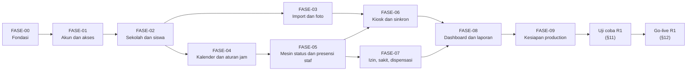

# Spensada — Development Roadmap

| Item | Nilai |
|---|---|
| Versi | 0.2 (draft, menunggu review) |
| Tanggal | 2026-10-10 |
| Sumber | Discovery Session 10 (Development Roadmap). Diperbarui dengan keputusan pemilik proyek 2026-10-10 (§2.4) dan Session 11 (`15`). |
| Bergantung pada | [00-project-overview.md](00-project-overview.md): rilis (§6.1), risiko (`R-xx`), dan pertanyaan terbuka (`OQ-xx`). [01-product-requirements.md](01-product-requirements.md): requirement, batasan (`C-*`), dan kriteria keberhasilan v1 (§6). [04-feature-specification.md](04-feature-specification.md): fitur (`FS-*`) dan acceptance criteria (`AC-*`). [06-database-design.md](06-database-design.md): tabel. [07-system-architecture.md](07-system-architecture.md): aturan arsitektur (`ARS-*`), panduan lokal (§15), dan langkah production (§16). [09-page-and-route-specification.md](09-page-and-route-specification.md): halaman (`HAL-*`). [12-security.md](12-security.md): ketentuan keamanan (`SEC-*`). |
| Dokumen terkait | [03-user-flow.md](03-user-flow.md): penyiapan awal (UF-01) dan stasiun (UF-06). [10-api-specification.md](10-api-specification.md): endpoint (`EP-*`). [11-validation-and-error-handling.md](11-validation-and-error-handling.md): pengujian validasi dan galat. [13-reporting-import-export.md](13-reporting-import-export.md): laporan dan import. [15-implementation-phases.md](15-implementation-phases.md) (Session 11): rincian kerja setiap fase. |

Dokumen ini menetapkan roadmap pengembangan Spensada: urutan fase implementasi R1 beserta isi dan syarat selesainya, urutan pembuatan halaman, cara kerja implementasi, pengujian, persiapan sekolah, uji coba R1, prosedur go-live, masa stabilisasi, serta arah R2 dan R3.

Dokumen ini menyelesaikan hal yang diserahkan dokumen lain ke Session 10: rencana uji coba (`03` UF-01 butir 11), nilai awal `status_dibangun_sampai` dan jadwal go-live (`07` ARS-37, §16), tempat backup dan pemegang kunci privat serta daftar periksa keamanan production (`12` SEC-75, SEC-82), dan urutan pembuatan halaman (`09` §17). Rincian tugas per fase ditulis di `15` (Session 11).

## 1. Cara membaca dokumen ini

- **ID.**
  - Ketentuan roadmap memakai `RM-<NN>`.
  - Fase implementasi memakai `FASE-<NN>`, mulai dari `FASE-00`.
  - Butir uji coba R1 memakai `UC-<NN>`, dan langkah go-live memakai `GL-<NN>`.
  - ID tidak pernah dinomori ulang. Butir yang batal ditandai `DEPRECATED`.
- **Status.** Label status mengikuti `00`. Keputusan dari ronde diskusi Session 10 berstatus DECISION (§2.1). Isi fase, perkiraan waktu, dan rincian prosedur berstatus RECOMMENDATION, dan menjadi arah kerja Session 11 serta implementasi sampai dikonfirmasi atau diganti.
- **Perkiraan waktu.** Dihitung dalam minggu kerja untuk satu AI implementer dan satu pengembang peninjau (§2.1). Perkiraan ini bukan janji tanggal. Tanggal go-live ditentukan oleh kriteria lulus uji coba (§11.3), bukan oleh kalender.
- **Hari H.** Tanggal go-live R1, yaitu hari sekolah pertama ketika sistem menjadi satu-satunya pencatatan kehadiran. "H−3" berarti tiga hari kalender sebelum hari H.
- **Istilah.** Uji coba R1 di dokumen lain berarti tahap di §11: uji teknis di server production sebelum data asli diisi. Butir yang dijadwalkan "sebelum uji coba R1" di dokumen lain diselesaikan paling lambat di tahap itu.

## 2. Keputusan Session 10

### 2.1 Keputusan roadmap

| Topik | Keputusan | Rujukan | Status |
|---|---|---|---|
| Waktu go-live R1 | Tanpa tanggal tetap. R1 go-live segera setelah uji coba R1 lulus, walaupun di tengah semester. | RM-01, §11.3, §12 | DECISION |
| Bentuk go-live R1 | Sekaligus. Semua fitur R1, termasuk akun siswa, slip akun, dan portal siswa, dipakai sejak hari H. | RM-02, §12 | DECISION |
| Bentuk uji coba | Langsung semua siswa tanpa masa paralel. Setelah uji teknis lulus, sistem langsung menggantikan kertas, Excel, dan WhatsApp untuk pencatatan kehadiran (A-05). | §11, §12 | DECISION |
| Pelaksana | AI implementer (Claude Code) menulis kode per fase, langkah demi langkah, dari dokumen fase `15`. Satu pengembang meninjau PR, menguji di Laragon dan di laptop sekolah, dan mengelola server production. | RM-05, §8 | DECISION |
| Server uji | Tidak ada server uji terpisah. Uji teknis dijalankan di server production sebelum data asli diisi, lalu database production dibangun ulang. Uji beban dijalankan di lokal, dan diulang singkat di production sebelum data asli diisi. | RM-09, UC-01 s.d. UC-12, GL-01 | DECISION |
| CI | Tanpa CI otomatis. Pengembang menjalankan `composer test` dan `node --test` di Laragon sebelum menggabung setiap PR. | RM-07 | DECISION |
| Ukuran PR | Satu PR per fitur (`FS-*`), atau beberapa fitur kecil yang saling terkait, dengan acceptance criteria fitur itu sebagai daftar periksa. Diganti keputusan pemilik 2026-10-10: satu branch dan satu PR per fase (§2.4). | RM-06 | DEPRECATED |
| Cadangan dua minggu pertama | Pemeriksaan harian: setiap wali kelas memeriksa daftar presensi kelasnya setiap hari sekolah selama 2 minggu pertama setelah go-live, lalu membetulkan yang salah lewat koreksi, presensi manual, atau izin. | GL-14, §13 | DECISION |

### 2.2 Temuan yang ditetapkan tanpa ronde diskusi

Penyusunan roadmap menemukan kebutuhan berikut. Semuanya berstatus RECOMMENDATION, dan perubahannya di dokumen lain tercatat di §17.

| Temuan | Penetapan | Rujukan |
|---|---|---|
| Hitung ulang per siswa membuat baris `status_harian` untuk tanggal yang terdampak tanpa melihat `status_dibangun_sampai` (`06` §11.4 butir 4). Siswa yang diimport sebelum hari H, atau dengan tanggal mulai aktif di masa lalu, dapat menjadi Alpa untuk hari sebelum go-live, misalnya setelah datanya diubah atau saat gladi bersih. | Kunci baru `pengaturan.status_mulai` menyimpan tanggal pertama yang memiliki status. `HitungUlang` tidak membuat baris untuk tanggal sebelumnya, dan antrean untuk tanggal itu dilewati. Perintah baru `status:mulai` mengisi `status_mulai` dengan hari H dan `status_dibangun_sampai` dengan H−1 (GL-08). Kosong berarti tanpa batas bawah, sama dengan perilaku sebelumnya. | GL-08, `06` §6.1, §11.4, `07` ARS-37, ARS-57 |
| Tanpa server uji, `12` SEC-75 butir 5 dan SEC-82 tidak memiliki tempat menguji pemulihan backup dan pemindaian keamanan. | Pemulihan backup diuji ke database sementara `spensada_pulih` di server yang sama, yang dihapus setelah pengujian. Pemindaian dasar OWASP ZAP dijalankan terhadap production sebelum data asli diisi. | UC-09, UC-10, `12` SEC-75, SEC-82 |
| Seeder `DataContoh` menolak berjalan di production (`07` ARS-18), sehingga uji teknis di production tidak dapat memakai seeder. | Data uji di production dibuat lewat fitur aplikasi: import file siswa fiktif, foto massal fiktif, dan kartu uji berisi NISN fiktif. Cara ini sekaligus menguji import dan foto massal di production. | UC-02 |
| Tanpa masa paralel, laptop stasiun dan data siswa asli baru dipakai bersama pada hari H. | Hari sekolah terakhir sebelum H, dan hari sebelumnya, dipakai untuk memuat data asli beserta foto ke kiosk dan gladi bersih dengan beberapa rombel, tanpa membuat status (GL-10, GL-11). Tanggal sebelum `status_mulai` menampilkan keterangan dan menolak input presensi (`04` §4.10). | GL-10, GL-11 |
| Go-live di tengah semester membuat rekap rapor semester (LP-03, R2) untuk semester itu hanya mencakup hari sejak H. | Hari sebelum H tetap berasal dari catatan lama sekolah. Hal ini disampaikan ke wali kelas saat pelatihan (§10). | §13, `13` LP-03 |

### 2.3 Hal dari dokumen lain yang ditetapkan di sini

| Hal | Dari | Ditetapkan di |
|---|---|---|
| Rencana uji coba sebelum dipakai penuh | `03` UF-01 butir 11 | §11 |
| Nilai awal `status_dibangun_sampai` saat go-live | `07` ARS-37, §19 | GL-08 |
| Jadwal go-live | `07` §16 | RM-01, §12 |
| Tempat penyimpanan backup dan pemegang kunci privat | `07` §19, `12` SEC-75, §21 | GL-04 (prosedur); OQ-19 (pilihan sekolah) |
| Daftar periksa keamanan production | `12` SEC-82, §21 | UC-10 |
| Urutan pembuatan halaman dalam fase implementasi | `09` §17 | §7 |
| Waktu migrasi ke Composer appstarter | `01` C-06, `07` ARS-07 | FASE-00 |

### 2.4 Keputusan pemilik proyek setelah Session 10

Keputusan berikut diberikan pemilik proyek pada 2026-10-10, dan menggantikan bagian dokumen yang bertentangan.

| Topik | Keputusan | Rujukan | Status |
|---|---|---|---|
| Ukuran PR | Satu branch dan satu PR per fase implementasi, dengan commit kecil per langkah. `main` satu-satunya branch jangka panjang. Menggantikan satu PR per fitur (§2.1). | RM-06, RM-11, RM-13 | DECISION |
| Server production | Windows dengan Laragon, Nginx, PHP 8.3, dan MySQL 8.4, menggantikan VPS Linux. Langkahnya di `07` §16. | `07` ARS-01, §16, `12` §16 | DECISION |
| Tampilan | Bootstrap 5 yang disajikan dari server sendiri, ditambah satu file CSS aplikasi dengan token `08`. | `08` UI-08, UI-71, UI-73 | DECISION |

## 3. Prinsip roadmap

| ID | Ketentuan | Status |
|---|---|---|
| RM-01 | **Go-live ditentukan kriteria.** R1 go-live segera setelah semua kriteria lulus uji coba di §11.3 terpenuhi dan masukan sekolah di §4 lengkap. Hari H dipilih pada hari Senin atau hari sekolah pertama setelah libur, bukan pada pekan ujian, dan paling sedikit 5 hari kerja setelah uji coba lulus untuk pembangunan ulang database dan pemuatan data asli (§12). | DECISION (tanpa tanggal tetap); RECOMMENDATION (pemilihan hari H) |
| RM-02 | **Satu go-live untuk seluruh R1.** Semua fitur R1 di `04` §3 selesai dan lulus acceptance criteria-nya sebelum uji coba. Tidak ada fitur R1 yang ditunda ke sesudah go-live. | DECISION |
| RM-03 | **Fondasi dan logika inti lebih dulu.** Urutan fase mengikuti ketergantungan data (§5): akun, master data, kalender, mesin status, kiosk, izin, lalu laporan. Bagian yang paling berisiko, yaitu pembacaan QR di laptop sekolah, dicoba sejak awal lewat purwarupa (FASE-01 butir terakhir), sebelum kiosk dibangun penuh di FASE-06. | RECOMMENDATION |
| RM-04 | **Dokumentasi sebagai sumber.** Setiap fitur dibangun dari `04`, `06`, `07`, `08`, `09`, `10`, `11`, dan `12` sesuai `00` §11. Bila implementasi menemukan celah atau pertentangan, dokumen diperbarui lebih dulu dalam PR yang sama atau PR dokumen tersendiri (`00` §11 butir 9 dan 10). | RECOMMENDATION |
| RM-05 | **Definisi selesai.** Satu fitur selesai bila: (1) semua acceptance criteria-nya di `04` lulus, sebagai uji otomatis bila dapat diotomatiskan dan sebagai uji manual tercatat bila tidak; (2) uji akses route barunya ada (`12` SEC-81); (3) teks layar dan pesan mengikuti `08` dan `11`; (4) `composer test` dan `node --test` lulus di Laragon; (5) PR ditinjau dan digabung oleh pengembang. | RECOMMENDATION |
| RM-06 | **Satu PR per fase.** Lihat §8. Sebelumnya satu PR per fitur (Session 10), diganti keputusan pemilik 2026-10-10 (§2.4). | DECISION |
| RM-07 | **Uji lokal sebelum digabung.** Tanpa CI, setiap PR memuat ringkasan hasil `composer test` dan `node --test "tests/js/**/*.test.js"` dari laptop pengembang. PR tidak digabung bila ada uji yang gagal. | DECISION (tanpa CI); RECOMMENDATION (ringkasan di PR) |
| RM-08 | **Tidak ada fitur di luar fase.** Fitur R2 dan R3 tidak dibangun sebelum R1 go-live, kecuali struktur yang memang disiapkan R1 untuk R2 (`04` §11). | RECOMMENDATION |
| RM-09 | **Data asli hanya di production.** Laptop pengembang dan production sebelum GL-01 hanya berisi data buatan (`12` SEC-79). Data asli siswa baru masuk ke production setelah pembangunan ulang database (GL-01). | RECOMMENDATION |
| RM-10 | **Rilis bertag.** Setiap pemasangan ke production memakai tag git (`07` ARS-08). Selama pengembangan R1, akhir setiap fase ditandai tag `r1-fase-<NN>` di `main`, tanpa dipasang ke production. Rilis kandidat yang dipasang ke production untuk uji coba memakai `r1.0.0-rc.<n>`, go-live memakai `r1.0.0`, dan perbaikan sesudahnya `r1.0.<n>`. | RECOMMENDATION |

## 4. Kondisi awal dan masukan yang dibutuhkan

Kondisi repository saat ini ada di `00` §7.3: belum ada kode aplikasi, dan framework masih dipasang tanpa Composer.

Masukan berikut berasal dari sekolah atau pemilik proyek. Kolom "Paling lambat" menyebut tahap yang tertahan bila masukan belum ada. (RECOMMENDATION)

| Masukan | Dari | Paling lambat | Rujukan |
|---|---|---|---|
| Lisensi proyek untuk `LICENSE` dan README | Pemilik proyek | Awal FASE-00 | `07` ARS-07 langkah 5, ARS-10 |
| Contoh foto, contoh file data siswa, dan contoh kartu OSIS untuk menguji pembacaan QR | Sekolah | Purwarupa kiosk di FASE-01 | RM-03 |
| Satu laptop yang akan dipakai sebagai stasiun, beserta webcam dan scanner USB bila ada | Sekolah | Purwarupa kiosk di FASE-01 | `07` ARS-25, ARS-26 |
| Server Windows production, nama domain, dan jawaban OQ-20 (lokasi server, klien ACME, cara menjalankan layanan) | Pemilik proyek | Awal FASE-09 | `07` ARS-01, ARS-05, §16.1, §16.4 |
| Jumlah stasiun dan laptopnya (OQ-08) | Sekolah | Awal uji coba (§11) | NFR-02 |
| Tempat backup di luar server dan dua pemegang kunci privat (OQ-19) | Sekolah dan pengelola server | Awal uji coba (§11) | `12` SEC-75 |
| Kebijakan data sekolah dan teks pemberitahuan privasi (OQ-18) | Sekolah | Awal uji coba (§11) | `12` SEC-66, SEC-68 |
| Daftar akun staf beserta role-nya, dan wali kelas setiap rombel | Sekolah | GL-05 | UF-04 |
| File data siswa asli sesuai template import, dan foto siswa dengan nama file diawali NISN | Sekolah | GL-07 | `13` IM-01, IM-03 |
| Pola mingguan, jadwal khusus, dan libur sampai akhir semester | Sekolah | GL-06 | UF-01 langkah 3 |

## 5. Gambaran fase

Fase berjalan berurutan, karena satu AI implementer dan satu peninjau mengerjakan satu fitur dalam satu waktu. Persiapan sekolah (§10) berjalan sejajar.

| Fase | Isi singkat | Fitur | Perkiraan |
|---|---|---|---|
| FASE-00 | Appstarter, konfigurasi, filter, tampilan dasar, alat uji | — | 1–2 minggu |
| FASE-01 | Login, password, akun staf, log aktivitas, pemeriksaan sistem, purwarupa kiosk | FS-AKN-01 s.d. FS-AKN-03 | 1–2 minggu |
| FASE-02 | Identitas sekolah, tahun ajaran, rombel, siswa, penempatan, atribut, akun siswa | FS-MD-01 s.d. FS-MD-05, FS-MD-09, FS-AKN-05 | 2–3 minggu |
| FASE-03 | Import siswa, import penempatan, foto | FS-MD-06 s.d. FS-MD-08 | 1–2 minggu |
| FASE-04 | Pola mingguan, jadwal khusus, libur, batas mundur, `Kalender`, `AturanJam` | FS-PRS-01 s.d. FS-PRS-03, FS-PRS-10 | 1–2 minggu |
| FASE-05 | Status harian, antrean, cron, presensi manual, koreksi, mode darurat, jadwal hari ini, log presensi | FS-PRS-04 s.d. FS-PRS-09, FS-PRS-11 | 2–3 minggu |
| FASE-06 | Akun stasiun, kiosk offline, sinkron, status stasiun, scan bertanda | FS-AKN-04, FS-KIO-01 s.d. FS-KIO-06 | 3–4 minggu |
| FASE-07 | Pengajuan, input, dispensasi massal, verifikasi, ubah keputusan, lampiran | FS-IZN-01 s.d. FS-IZN-06 | 2 minggu |
| FASE-08 | Dashboard, daftar presensi rombel, rekap, riwayat | FS-LAP-01 s.d. FS-LAP-04 | 1–2 minggu |
| FASE-09 | Uji keamanan menyeluruh, uji beban lokal, panduan pengguna, penyiapan server Windows | — | 1–2 minggu |
| Uji coba R1 | Uji teknis di production dengan data buatan (§11) | — | 1–2 minggu |
| Go-live R1 | Pembangunan ulang database, data asli, hari H (§12) | — | ±1 minggu sampai H |

Jumlahnya sekitar 17–27 minggu sejak FASE-00 dimulai sampai hari H. Perkiraan ini ditinjau ulang setiap akhir fase (RM-05), dan perubahannya dicatat di riwayat dokumen ini. (RECOMMENDATION)

## 6. Fase R1

Setiap fase ditutup bila semua fitur di dalamnya memenuhi RM-05, ditambah syarat selesai fase di bawah. Rincian tugas, file, dan urutan langkah setiap fase ditulis di `15`. (RECOMMENDATION)

### FASE-00 — Fondasi

**Isi:**

1. Pindah ke Composer appstarter dengan langkah `07` ARS-07, di commit pertama fase ini (C-06). `README.md` dan `LICENSE` diganti setelah lisensi diputuskan (§4).
2. Konfigurasi dasar: `appTimezone` `Asia/Jakarta` (ARS-44), driver turunan MySQLi dan group `tests` MySQL (ARS-45), `strictOn` dan `foundRows` (ARS-40, ARS-43), `Config\Spensada` (ARS-17), `Config\Session` dan `Config\Cookie` (`12` SEC-13, SEC-33), serta konfigurasi CSRF (`12` SEC-28).
3. Service `Jam` (ARS-44), helper kunci bernama (ARS-42), dan pola transaksi (ARS-43).
4. Filter `area`, `hak`, `csrf`, `invalidchars`, dan `keamanan` (ARS-13), beserta kerangka `sesi` dan `wajib-ganti` yang dilengkapi di FASE-01 bersama tabel `akun` (`15` §2.2), dengan peta hak akses `Config\HakAkses` untuk semua `HA-*` R1 (ARS-15).
5. Penanganan galat dan halaman galat (`11` §6, GAL-13), log aplikasi (`11` §7), serta bahasa validasi `app/Language/id/Validation.php` (`11` VAL-06).
6. Layout panel, portal, dan halaman bersama, CSS dengan token, font, dan sprite ikon (`08` §4, §6, §13).
7. Migration tabel `pengaturan`, seeder `PengaturanAwal` dan kerangka `DataContoh` (ARS-18), serta perintah `aplikasi:cek` (ARS-57).
8. Alat uji: PHPUnit dengan database `spensada_test` (ARS-58), `node --test` dengan folder `tests/kasus/` dan `tests/js/` (ARS-59), uji akses otomatis dari daftar route (`12` SEC-81), dan uji bahwa setiap method controller panel dan portal memiliki atribut `hak` (`07` §5.2).
9. Panduan lokal `07` §15 diperiksa ulang dengan Laragon.

**Syarat selesai:** `https://spensada.test/login` tampil dengan layout `08`, `aplikasi:cek` lulus di Laragon, dan `composer test` serta `node --test` berjalan.

### FASE-01 — Akun dan akses

**Fitur:** FS-AKN-01, FS-AKN-02, FS-AKN-03.

**Isi lain:** migration `akun`, `akun_role`, `log_aktivitas`, dan `percobaan_login` (`06` §5); perintah `admin:pertama` dan `admin:pulihkan` (ARS-49); halaman log aktivitas (HAL-AKN-09, `12` SEC-62) dan pemeriksaan sistem (HAL-AKN-07), yang bagian cron, antrean, dan awal status-nya ditambahkan di FASE-05; daftar password umum (`12` SEC-04).

**Purwarupa kiosk.** Sejajar dengan fase ini, pengembang mencoba halaman sementara yang membuka webcam dan membaca QR kartu OSIS dengan zxing-wasm di Web Worker (ARS-25), di laptop yang akan dipakai sekolah. Yang dicatat: resolusi kamera, waktu baca per kartu, kartu yang sulit terbaca, dan scanner USB bila ada (ARS-26). Hasilnya menjadi masukan FASE-06. Purwarupa tidak digabung ke `main`. (RECOMMENDATION, RM-03)

**Syarat selesai:** admin pertama dibuat lewat CLI, login dan pembatasan login berjalan, akun staf dan role dapat dikelola, dan hasil purwarupa tercatat. Bila waktu baca di laptop sekolah jauh di atas 1 detik (NFR-01), alternatifnya dibahas sebelum FASE-06.

### FASE-02 — Sekolah dan siswa

**Fitur:** FS-MD-01, FS-MD-02, FS-MD-03, FS-MD-04, FS-MD-05 (tanpa import penempatan), FS-MD-09, dan FS-AKN-05. FS-MD-05 baru selesai menurut RM-05 di FASE-03.

**Isi lain:** migration master data (`06` §6) dan `log_data_siswa` (`06` §12.2); penyajian logo dan foto lewat controller (ARS-52); akun siswa terbentuk otomatis, slip akun, dan reset password siswa (HAL-AKN-05, HAL-AKN-06); halaman akun di portal (HAL-AKN-08).

**Syarat selesai:** admin dapat menyiapkan satu tahun ajaran lengkap dengan rombel, wali kelas, dan siswa, lalu mencetak slip akun. Siswa dapat login ke portal dan mengganti password.

### FASE-03 — Import dan foto

**Fitur:** FS-MD-06, FS-MD-07, FS-MD-08, serta import penempatan (FS-MD-05 butir 6, `13` IM-02).

**Isi lain:** PhpSpreadsheet (ARS-10), file sementara dan pratinjau (ARS-55), pemrosesan foto tiga ukuran (ARS-53), foto massal ZIP dan bertahap (ARS-54), dan template import (`13` IM-01).

**Syarat selesai:** import 1.000 siswa fiktif dan foto massalnya berhasil di Laragon dalam batas `12` SEC-49, dengan laporan baris gagal sesuai `11` §5.7 dan §5.8.

### FASE-04 — Kalender dan aturan jam

**Fitur:** FS-PRS-01, FS-PRS-02, FS-PRS-03, FS-PRS-10.

**Isi lain:** migration kalender (`06` §7), `antrean_hitung_ulang`, dan `log_presensi`; service `LogPresensi` dan penulisan antrean, yang juga disambungkan ke perubahan semester, masa aktif, dan penempatan dari FASE-02 dan FASE-03 (`15` §2.2); service `Kalender` dan `AturanJam` (ARS-16); kasus uji JSON bersama dari `05` §4, §6, dan §13 (ARS-59), yang juga dipakai modul `aturan.js` di FASE-06. Pemrosesan antrean baru dibuat di FASE-05.

**Syarat selesai:** aturan jam tanggal mana pun dan hari sekolah bagi setiap siswa dapat dihitung, dengan kasus uji bersama lulus di PHPUnit.

### FASE-05 — Mesin status dan presensi staf

**Fitur:** FS-PRS-05, FS-PRS-04, FS-PRS-06, FS-PRS-07, FS-PRS-08, FS-PRS-09, FS-PRS-11.

**Isi lain:** migration `status_harian`, `presensi_manual`, `koreksi_status`, dan `mode_darurat`; komponen `PenentuStatus`, `HitungUlang`, dan `PembacaStatus` (ARS-34); pemrosesan antrean (ARS-36, ARS-37); mode darurat berakhir otomatis (ARS-38); perintah `status:bangun`, `status:antrean`, `status:mulai`, `tugas:menit`, dan `tugas:harian` (ARS-39, ARS-56, ARS-57); batas bawah `status_mulai` (§2.2). Migration `scan`, `scan_tinjauan`, `izin_kelompok`, `izin`, `izin_riwayat`, dan `lampiran` ditulis di fase ini, karena `PenentuStatus` membaca scan dan izin yang disetujui, dan `status_harian.izin_id` merujuk `izin` (DB-08, ARS-18). Scan dan izin uji diisi lewat `DataContoh` sampai kiosk dan fitur izin ada.

**Syarat selesai:** kasus uji penentuan status di `tests/kasus/` lulus, termasuk kasus izin dengan data dari `DataContoh`; AC-PRS-05-* yang tidak memerlukan halaman izin atau daftar presensi lulus, dan sisanya diuji ulang di akhir FASE-07 dan FASE-08; hitung ulang berjalan untuk semua pemicu di `06` §11.4, dan `status:bangun --periksa` tidak menemukan perbedaan pada data contoh.

### FASE-06 — Kiosk dan sinkron

**Fitur:** FS-AKN-04, FS-KIO-01, FS-KIO-02, FS-KIO-03, FS-KIO-04, FS-KIO-05, FS-KIO-06.

**Isi lain:** halaman kiosk dan modulnya (ARS-20), IndexedDB (ARS-21), Service Worker (ARS-22), data kiosk dan foto (ARS-23, EP-KIO-01, EP-KIO-02), jam terkoreksi (ARS-27, ARS-28), sinkron dan kontak (ARS-29, EP-KIO-03), login stasiun 90 hari dan satu login aktif (ARS-30, ARS-31), PIN petugas dan logout kiosk (`12` SEC-21, SEC-22, EP-KIO-04), pembatasan laju API kiosk (`12` SEC-54), `PenilaiScan`, status stasiun dan fragmennya (HAL-KIO-02, EP-KIO-05), dan tinjauan scan bertanda (HAL-KIO-03).

**Syarat selesai:** AC-01 dan AC-02 di `01` §7 lulus di laptop sekolah, uji manual kiosk di `07` §14 dan §15.3 tercatat, dan kasus uji bersama lulus di PHPUnit dan `node --test`.

### FASE-07 — Izin, sakit, dan dispensasi

**Fitur:** FS-IZN-01 s.d. FS-IZN-06.

**Isi lain:** service dan halaman di atas tabel izin yang dibuat di FASE-05 (`06` §10); penyajian dan catatan akses lampiran (`12` SEC-52, SEC-60); hari sekolah terdampak (EP-IZN-01); portal izin siswa (HAL-IZN-01 s.d. HAL-IZN-03).

**Syarat selesai:** AC-03 di `01` §7 dan AC-PRS-05-* yang memerlukan izin lulus, dan izin yang disetujui atau diubah keputusannya langsung tercermin di status harian.

### FASE-08 — Dashboard dan laporan

**Fitur:** FS-LAP-01 s.d. FS-LAP-04.

**Isi lain:** fragmen dashboard dan polling 30 detik (ARS-50, EP-LAP-01), peringatan admin untuk cron dan antrean gagal (FS-LAP-01), "Kelas saya" (HAL-LAP-03), dan riwayat di portal (HAL-LAP-07).

**Syarat selesai:** semua fitur R1 di `04` §3 memenuhi RM-05, semua AC-PRS-05-* lulus, dan kriteria keberhasilan v1 butir 1 s.d. 5 (`01` §6) dapat diperagakan di Laragon dengan data contoh.

### FASE-09 — Kesiapan production

**Isi:**

1. Uji keamanan menyeluruh `12` SEC-81 terhadap semua route di `php spark routes`, dan tinjauan diff keamanan seluruh R1.
2. Uji beban lokal (§9.2), lalu jumlah proses php-cgi, batas waktu antrean, dan batas laju API ditetapkan sementara (ARS-04, ARS-36, `12` SEC-54).
3. Panduan pengguna singkat untuk admin, wali kelas, guru piket, petugas stasiun, dan siswa, berdasarkan alur di `03` (§10).
4. Skrip dan contoh konfigurasi production di `deploy/windows/` (`07` §16.3), lalu penyiapan server Windows sesuai `07` §16.1, termasuk tugas terjadwal dan backup terenkripsi (ARS-06, `12` SEC-75), dan pemasangan tag rilis kandidat `r1.0.0-rc.<n>` (RM-10).

**Syarat selesai:** production terpasang dengan `CI_ENVIRONMENT = production`, `aplikasi:cek` lulus di server, dan belum ada data asli di dalamnya (RM-09).

## 7. Urutan pembuatan halaman

Halaman dibuat di fase fiturnya (`09` §15.1). Di dalam satu fase, halaman dibuat mengikuti urutan alur di `03`: halaman yang menyiapkan data lebih dulu, lalu halaman yang memakainya. (RECOMMENDATION)

| Fase | Halaman, berurutan |
|---|---|
| FASE-00 | Halaman galat (`09` RT-19, `11` GAL-13) dan kerangka layout area |
| FASE-01 | HAL-AKN-01, HAL-AKN-02, HAL-AKN-03, HAL-AKN-04, HAL-AKN-09, HAL-AKN-07 |
| FASE-02 | HAL-MD-01, HAL-MD-02, HAL-MD-03, HAL-MD-16, HAL-MD-04, HAL-MD-05, HAL-MD-06, HAL-MD-07, HAL-MD-08, HAL-MD-10, HAL-MD-11, HAL-MD-12, HAL-MD-17, HAL-AKN-05, HAL-AKN-06, HAL-AKN-08 |
| FASE-03 | HAL-MD-14, HAL-MD-13, HAL-MD-09, HAL-MD-15 |
| FASE-04 | HAL-PRS-01, HAL-PRS-02, HAL-PRS-03, HAL-PRS-09 |
| FASE-05 | HAL-PRS-07, HAL-PRS-08, HAL-PRS-04, HAL-PRS-05, HAL-PRS-06, HAL-PRS-10 |
| FASE-06 | HAL-KIO-02 (akun stasiun dan PIN petugas lebih dulu), HAL-KIO-01, HAL-KIO-03 |
| FASE-07 | HAL-IZN-08, HAL-IZN-05, HAL-IZN-06, HAL-IZN-01, HAL-IZN-02, HAL-IZN-03, HAL-IZN-04, HAL-IZN-07, HAL-IZN-09 |
| FASE-08 | HAL-LAP-01, HAL-LAP-02, HAL-LAP-03, HAL-LAP-04, HAL-LAP-05, HAL-LAP-06, HAL-LAP-07 |

Daftar presensi rombel (HAL-LAP-04) dan riwayat siswa (HAL-LAP-06) berada di FASE-08, tetapi tombol koreksi dan presensi manual di halaman itu memakai service dari FASE-05. Selama FASE-05 sampai FASE-07, tindakan itu diuji lewat halaman HAL-PRS-07 dan HAL-PRS-08.

## 8. Cara kerja implementasi

| ID | Ketentuan | Status |
|---|---|---|
| RM-11 | **Branch dan PR.** `main` adalah satu-satunya branch jangka panjang. Setiap fase dikerjakan di satu branch dari `main` terbaru, bernama `fase-<NN>-<slug>`, misalnya `fase-02-sekolah-siswa`, lalu digabung lewat satu PR dan branch-nya dihapus. Di dalam branch, pekerjaan dibagi menjadi commit kecil berurutan sesuai langkah di `15`, satu perubahan logis per commit, dan setiap commit meninggalkan uji lulus. Judul PR memuat ID fase, misalnya "FASE-05 Mesin status dan presensi staf". Isi PR memuat fitur dan acceptance criteria fase itu beserta cara ujinya (otomatis atau manual), ringkasan hasil uji lokal (RM-07), dan dokumen yang ikut diubah. Perubahan yang hanya menyentuh dokumen memakai branch `docs/<slug>`. | DECISION (satu branch dan satu PR per fase, keputusan pemilik 2026-10-10); RECOMMENDATION (nama branch dan isi PR) |
| RM-12 | **Peninjauan.** Karena satu PR memuat satu fase, pengembang meninjau per kelompok commit fitur, sesuai urutan langkah di `15`. Pengembang membaca diff, menjalankan uji di Laragon, mencoba fitur di browser, dan memeriksa bahwa tidak ada logika presensi di luar tempatnya (`07` ARS-16). PR yang mengubah migration yang sudah dipasang di production ditolak. Perubahan struktur memakai migration baru. | RECOMMENDATION |
| RM-13 | **Fitur yang besar.** Fitur yang besar, misalnya FS-PRS-05 dan FS-KIO-02, dibagi menjadi beberapa langkah berurutan di dokumen fase `15`, masing-masing berisi satu atau beberapa commit kecil. Setiap commit tetap meninggalkan uji lulus, sehingga branch fase dapat ditinjau dan diuji di tengah jalan. | RECOMMENDATION |
| RM-14 | **Dokumentasi.** Perubahan perilaku yang berbeda dari dokumen ditulis dulu di dokumen terkait, dengan riwayat perubahan dan label status (RM-04). | RECOMMENDATION |
| RM-15 | **Laporan fase.** Di akhir setiap fase, pengembang mencatat di `15`: fitur yang selesai, perkiraan yang meleset, dan masalah yang ditemukan. Perkiraan fase berikutnya disesuaikan. | RECOMMENDATION |

## 9. Pengujian

### 9.1 Tingkat pengujian

| Tingkat | Isi | Kapan | Rujukan |
|---|---|---|---|
| Unit | `AturanJam`, `Kalender`, `PenentuStatus`, `PenilaiScan`, `HakAkses`, aturan validasi | Setiap PR | `07` ARS-58, `11` VAL-32 |
| Kasus bersama | Berkas JSON yang dijalankan PHPUnit dan `node --test` | Setiap PR di FASE-04 dan sesudahnya | `07` ARS-59 |
| Database | Alur yang menyentuh MySQL `spensada_test`, termasuk transaksi, kunci bernama, dan antrean | Setiap PR | `07` ARS-58, `11` GAL-23 |
| Akses dan keamanan | Setiap route ditolak tanpa login, oleh jenis akun yang salah, dan di luar cakupan; CSRF; file berbahaya | Setiap PR yang menambah route; menyeluruh di FASE-09 | `12` SEC-81 |
| Manual di browser | Kiosk: kamera, scanner USB, offline, Service Worker, perubahan jam Windows | FASE-06, diulang di uji coba | `07` §14, §15.3 |
| Beban | §9.2 | FASE-09 di lokal, diulang di uji coba | `07` ARS-04, ARS-36 |

### 9.2 Uji beban

Skenario yang diuji, di lokal pada FASE-09 lalu singkat di production pada uji coba (UC-07). (RECOMMENDATION)

1. **Sinkron pagi.** 1.000 siswa scan masuk dalam 30 menit dari 4 stasiun, ditambah kontak berkala setiap 60 detik per stasiun. Skrip pengirim memakai bentuk kiriman EP-KIO-03, dengan UUID dan jam scan buatan. Yang diukur: waktu jawab sinkron, panjang antrean hitung ulang, dan waktu sampai dashboard menampilkan angka terbaru.
2. **Polling dashboard.** 40 staf membuka dashboard bersamaan dengan polling 30 detik, selama skenario 1 berjalan.
3. **Login pagi.** 100 login staf dan siswa dalam 5 menit, untuk memeriksa waktu bcrypt (`12` SEC-02) dan kunci bernama login (`12` SEC-10).
4. **Hitung ulang besar.** Jadwal khusus untuk satu minggu lampau diubah, sehingga semua siswa dihitung ulang untuk 6 tanggal. Yang diukur: waktu habis antrean lewat cron.
5. **Import dan foto massal.** Import 2.000 baris dan foto massal 100 MB, untuk memeriksa `memory_limit` dan batas waktu (ARS-04).

Hasil uji beban menetapkan nilai yang dijadwalkan "uji beban sebelum uji coba R1" di `07` §19, `10` §9, `11` §11, `12` §21, dan `13` §9. Nilai itu dicatat di dokumen asalnya.

## 10. Persiapan sekolah

Berjalan sejajar dengan fase implementasi. Penanggung jawab di sekolah ditunjuk kepala sekolah. (RECOMMENDATION)

| Kegiatan | Kapan | Rujukan |
|---|---|---|
| Menyerahkan contoh kartu, contoh data, dan satu laptop stasiun untuk purwarupa | FASE-01 | §4 |
| Merapikan data siswa ke template import, dengan NISN sebagai teks dan nomor WA bila ada | Mulai FASE-03, setelah template tersedia | `13` IM-01, R-12 |
| Merapikan foto siswa dengan nama file diawali NISN | Mulai FASE-03 | `13` IM-03, OQ-12 |
| Menetapkan jumlah stasiun, menyiapkan laptop, webcam, scanner, stopkontak, dan jaringan di gerbang | Sebelum uji coba | OQ-08, `07` ARS-32 |
| Menyusun kebijakan data dan teks pemberitahuan privasi | Sebelum uji coba | OQ-18, `12` SEC-68 |
| Menetapkan tempat backup dan dua pemegang kunci privat | Sebelum uji coba | OQ-19, `12` SEC-75 |
| Pelatihan admin dan guru piket, dengan panduan FASE-09 | Uji coba | §11 |
| Pelatihan wali kelas: slip akun, daftar presensi kelas, koreksi, izin, dan pemeriksaan harian | H−5 s.d. H−1 | GL-12, GL-14 |
| Pengumuman ke siswa dan orang tua/wali: cara scan, portal siswa, dan pemberitahuan privasi | H−5 s.d. H−1 | GL-13 |

## 11. Uji coba R1

Uji coba adalah uji teknis di server production sebelum data asli diisi (DECISION, Session 10). Semua siswa mulai memakai sistem pada hari H tanpa masa paralel, sehingga uji coba harus membuktikan bahwa sistem siap menanggung pencatatan resmi sejak hari pertama.

### 11.1 Persiapan

- FASE-09 selesai, dan tag rilis kandidat terpasang di production.
- Masukan sekolah yang paling lambat "awal uji coba" di §4 sudah ada.
- Data uji dibuat lewat aplikasi: satu tahun ajaran dan semester fiktif yang mencakup tanggal uji, rombel fiktif, file import berisi 1.000 siswa fiktif dengan NISN fiktif, dan foto massal fiktif (§2.2).
- Kartu uji dicetak dari daftar NISN fiktif sebagai QR berisi 10 digit polos (C-04), sekitar 50 kartu.

### 11.2 Butir uji

| ID | Butir | Lulus bila | Rujukan |
|---|---|---|---|
| UC-01 | **Pemeriksaan server.** `aplikasi:cek`, halaman pemeriksaan sistem, waktu bcrypt di server, pengaturan `php-web.ini`, dan restart server tanpa login: MySQL, Nginx, php-cgi, dan tugas terjadwal berjalan sendiri (`07` §16.3). | Semua butir lulus, dan bcrypt 100–300 ms. | `07` ARS-57, `12` SEC-02 |
| UC-02 | **Penyiapan dengan data uji.** Admin menjalankan UF-01 langkah 1–9 dengan data uji, termasuk import dan foto massal. | Selesai tanpa bantuan pengembang di luar panduan. | UF-01 |
| UC-03 | **Pemasangan stasiun.** Semua laptop stasiun dipasang dengan UF-06, termasuk penyimpanan permanen dan PIN petugas. | Semua stasiun melapor di status stasiun dengan penyimpanan permanen aktif. | UF-06, `07` ARS-21 |
| UC-04 | **Kiosk di gerbang.** Uji manual kiosk `07` §15.3 di laptop sekolah, di lokasi gerbang, dengan kartu uji dan scanner USB. | AC-KIO-01-* s.d. AC-KIO-03-* lulus, dan umpan balik paling lama 1 detik (NFR-01). | FS-KIO-01 s.d. FS-KIO-03 |
| UC-05 | **Kecepatan antrean.** Petugas dan relawan memindai kartu uji berulang di semua stasiun selama 15 menit, seperti antrean pagi. | Laju per stasiun cukup untuk 1.000 siswa dalam jendela masuk dengan jumlah stasiun OQ-08. | R-03, NFR-02 |
| UC-06 | **Gangguan.** Internet gerbang diputus 30 menit selama scan, laptop di-restart saat offline, lalu tersambung lagi. | AC-01 dan AC-02 lulus, tanpa scan hilang atau ganda. | `01` §7 |
| UC-07 | **Uji beban singkat.** Skenario §9.2 butir 1–3 dijalankan terhadap production, di luar jam sekolah. | Waktu jawab dan habis antrean dalam batas yang ditetapkan di FASE-09. | §9.2 |
| UC-08 | **Satu hari penuh.** Satu hari dengan aturan jam asli: scan masuk, presensi manual, koreksi, izin, penutupan sesi, scan pulang, dan dashboard. | Rekap hari itu sama dengan hitungan manual pengembang. | `03` §3 |
| UC-09 | **Pemulihan backup.** Backup terenkripsi malam sebelumnya dipulihkan ke database sementara `spensada_pulih` di server yang sama, dibandingkan jumlah barisnya, lalu database itu dihapus. Kunci privat tidak pernah disalin ke server: dump didekripsi di komputer pemegang kunci dan dialirkan lewat SSH ke `mysql.exe` di server, misalnya `age -d -i kunci.txt dump.sql.tar.gz.age \| tar -xzO \| ssh <server> "C:\laragon\bin\mysql\<versi>\bin\mysql.exe --defaults-extra-file=<file opsi admin> spensada_pulih"`. Kredensial MySQL diambil dari file opsi, karena masukan perintah dipakai untuk dump. Database sementara dibuat dan dihapus dengan user MySQL administrator, karena `spensada_app` dan `spensada_migrasi` tidak berhak membuat database (`12` SEC-74). Dump dibuat tanpa `--databases`, sehingga tidak memuat `CREATE DATABASE` atau `USE spensada` yang akan menulis ke database production. | Pemulihan berhasil, dan hasilnya dicatat. | `12` SEC-75 |
| UC-10 | **Daftar periksa keamanan.** Header dan sertifikat dari luar dengan `curl -I`, cookie `Secure`, `display_errors` mati, port terbuka, akses SSH, dan pemindaian dasar OWASP ZAP terhadap production. | Tidak ada temuan tingkat tinggi yang belum diperbaiki. | `12` SEC-82 |
| UC-11 | **Mode darurat.** Gladi mode darurat dan presensi per kelas oleh guru piket. | UF-27 berjalan sesuai panduan. | FS-PRS-08, FS-PRS-09 |
| UC-12 | **Rilis ulang.** Satu rilis perbaikan dipasang dengan `07` §16.2, termasuk "Muat versi baru" di kiosk. | Kiosk memakai versi baru tanpa kehilangan scan. | `07` ARS-22 |

### 11.3 Kriteria lulus

Uji coba lulus bila: semua butir UC-01 s.d. UC-12 lulus; tidak ada galat yang membuat scan hilang, status salah, atau data terbuka bagi yang tidak berhak; masukan sekolah di §4 sampai GL-07 lengkap; dan kepala sekolah menyetujui hari H. Butir yang gagal diperbaiki lewat rilis perbaikan, lalu butir itu dan butir yang terdampak diulang. (RECOMMENDATION; go-live segera setelah lulus, DECISION)

## 12. Prosedur go-live R1

Langkah dari pembangunan ulang database sampai hari H, berurutan menurut kolom "Kapan". Setiap langkah dicentang dan dicatat waktunya di catatan go-live, bersama hasil UC-01 s.d. UC-12. (RECOMMENDATION)

| ID | Kapan | Langkah | Rujukan |
|---|---|---|---|
| GL-01 | Setelah uji coba lulus | **Pembangunan ulang.** Semua stasiun disinkronkan, lalu data lokalnya dihapus lewat menu petugas. Tag `r1.0.0` di-checkout lebih dulu (RM-10, `07` ARS-08). Database `spensada` dihapus dan dibuat ulang, `writable/uploads/`, sesi, dan cache dikosongkan, kunci enkripsi aplikasi dibuat baru, lalu `php spark migrate -g migrasi`, `db:seed PengaturanAwal`, `admin:pertama`, dan `aplikasi:cek` dijalankan. | `07` §16.1 langkah 10, `12` SEC-73, RM-09 |
| GL-02 | Setelah GL-01 | **Tag go-live dicatat.** Tag `r1.0.0` yang terpasang di GL-01 dicatat di catatan go-live beserta hasil `aplikasi:cek`. | `07` ARS-08, RM-10 |
| GL-03 | Setelah GL-01 | **Admin.** Admin sekolah login, mengganti password, mengisi identitas sekolah, dan mengatur PIN petugas. | FS-AKN-02, FS-MD-01, `12` SEC-21 |
| GL-04 | Sebelum data asli diisi | **Backup.** Backup yang dipasang di FASE-09 dan diuji di UC-09 diperiksa ulang: tujuan di luar server (OQ-19), kunci publik `age`, dan dua pemegang kunci privat di dua tempat terpisah. `.env` dicadangkan ulang karena kunci enkripsi aplikasi baru dibuat di GL-01 (`12` SEC-75 butir 4). | `07` ARS-06, `12` SEC-75 |
| GL-05 | H−7 s.d. H−3 | **Akun staf.** Akun staf dan role dibuat dari daftar sekolah, lalu password awal dibagikan langsung. | UF-04 |
| GL-06 | H−7 s.d. H−3 | **Kalender.** Tahun ajaran dan semester berjalan, pola mingguan, jadwal khusus, libur sampai akhir semester, dan batas mundur. Pola mingguan berlaku paling lambat pada hari gladi bersih (GL-11). | UF-01 langkah 2–3, BR-KAL-07 |
| GL-07 | H−7 s.d. H−3 | **Rombel dan siswa.** Rombel dan wali kelas dibuat, lalu siswa diimport dengan tanggal mulai aktif dan penempatan paling lambat hari GL-10, misalnya hari import. Bila tahun ajaran belum dimulai, bawaan import adalah tanggal mulai tahun ajaran (FS-MD-06), sehingga tanggal ini diisi manual. Siswa yang aktif sebelum H tidak menjadi Alpa karena `status_mulai` (GL-08). Foto diunggah lewat foto massal. | FS-MD-06, FS-MD-04, FS-MD-08 |
| GL-08 | Segera setelah GL-01, sebelum GL-07 | **Awal status.** `php spark status:mulai --tanggal=<H>` mengisi `pengaturan.status_mulai` dengan H dan `status_dibangun_sampai` dengan H−1. Perintah menolak berjalan bila `status_harian` sudah berisi baris, atau bila H sebelum hari ini. Selama `status_harian` masih kosong, perintah boleh dijalankan ulang bila hari H bergeser. Dengan begitu, status pertama dibuat untuk hari H, dan perubahan data atau scan sebelum H tidak membuat Alpa. | §2.2, `07` ARS-37, ARS-57, `06` §6.1, §11.4 |
| GL-09 | Hari H | **Slip akun.** Wali kelas mencetak slip akun rombelnya dan langsung membagikannya. Slip yang tidak terbagi dimusnahkan. | UF-05, `12` SEC-69 |
| GL-10 | Sehari sebelum GL-11 | **Stasiun.** Setiap laptop stasiun login dengan akun stasiunnya, memuat data asli beserta foto, dan dipasang di gerbang. Status stasiun menunjukkan semua stasiun melapor dengan versi kode terbaru. | UF-06, UF-09 |
| GL-11 | Hari sekolah terakhir sebelum H | **Gladi bersih.** Satu atau dua rombel memindai kartu aslinya untuk memastikan kartu terbaca, foto tampil, dan sinkron berjalan. Hari itu harus hari sekolah menurut kalender di aplikasi, karena kiosk menolak scan di luar hari sekolah (FS-KIO-02 E6). Scan itu tersimpan sebagai catatan scan, tetapi tidak membuat status, karena tanggalnya sebelum `status_mulai` (GL-08). Dashboard dan daftar presensi untuk tanggal itu menampilkan "Pencatatan kehadiran dimulai <H>" (`04` §4.10). | FS-KIO-02, GL-08 |
| GL-12 | H−5 s.d. H−1 | **Pelatihan.** Pelatihan singkat sesuai §10, dengan panduan pengguna. | §10 |
| GL-13 | H−5 s.d. H−1 | **Pengumuman.** Siswa dan orang tua/wali diberi tahu cara scan, portal siswa, dan pemberitahuan privasi (OQ-18). | `12` SEC-68 |
| GL-14 | H s.d. H+13 | **Hari H dan pemeriksaan harian.** Pengembang memantau status stasiun, antrean, log aplikasi, dan cron dari panel. Setiap hari sekolah, wali kelas memeriksa daftar presensi kelasnya dan membetulkan yang salah lewat koreksi, presensi manual, atau izin. Admin mencatat masalah untuk rilis perbaikan. | §2.1, FS-LAP-02, FS-KIO-05 |

Bila stasiun tidak dapat dipakai pada hari H, guru piket memakai mode darurat dan presensi per kelas (UF-27). Mode darurat menahan Alpa, sehingga pencatatan tetap dapat dilanjutkan tanpa kertas.

## 13. Setelah go-live

| ID | Ketentuan | Status |
|---|---|---|
| RM-16 | **Masa stabilisasi.** Dua minggu pertama setelah H (GL-14). Perbaikan yang menyangkut scan, status, atau akses dipasang secepatnya sebagai `r1.0.<n>`, di luar jendela scan bila mungkin. Perbaikan lain dikumpulkan dan dipasang mingguan. | RECOMMENDATION |
| RM-17 | **Ukuran keberhasilan.** Di akhir masa stabilisasi, kriteria keberhasilan v1 butir 1 s.d. 5 dan 7 (`01` §6) diperiksa dengan data nyata: jumlah scan galat, scan bertanda, koreksi per hari, antrean gagal, dan keluhan. Hasilnya menjadi dasar memulai R2. | RECOMMENDATION |
| RM-18 | **Rutin.** Setiap semester pemulihan backup diuji seperti UC-09 (`12` SEC-75). Sebelum setiap rilis, `composer audit` dijalankan (`12` SEC-76). Tahun ajaran baru mengikuti UF-08. | RECOMMENDATION |

Rekap untuk rentang yang dimulai sebelum H hanya berisi hari sejak H, karena hari sebelumnya tidak memiliki status (`06` §11.1). Hal ini juga berlaku untuk rekap rapor semester di R2 (§2.2).

## 14. R2 dan R3

Rincian fitur R2 dan R3 ditulis menjelang rilisnya (`04` §11), lalu dibagi menjadi fase dengan pola yang sama di `15`. (RECOMMENDATION)

| Rilis | Mulai setelah | Syarat | Urutan | Uji khusus |
|---|---|---|---|---|
| R2 | Masa stabilisasi R1 selesai (RM-17) | OQ-10 terjawab; rincian FS-LAP-05, FS-LAP-06, dan FS-WA-01 s.d. FS-WA-03 ditulis di `04`; halaman R2 di `09` §10–§11 dirinci | Export rekap dan rekap rapor (FS-LAP-05) lebih dulu, karena tidak bergantung pada provider; lalu flyer (FS-LAP-06); lalu notifikasi WA (FS-WA-01 s.d. FS-WA-03) | Volume outbox ±1.000 pesan per pagi (NFR-13), penahanan pesan "tidak hadir" (BR-WA-03), dan kegagalan gateway tidak memengaruhi presensi (NFR-05) |
| R3 | R2 go-live, atau lebih awal bila sekolah memintanya dan R2 tertahan OQ-10 | Contoh kartu lama dari sekolah (OQ-13); rincian FS-INF-01 s.d. FS-INF-03 dan FS-KRT-01 di `04` | Halaman publik dan pengumuman (FS-INF-02, FS-INF-03), jadwal pelajaran (FS-INF-01), lalu cetak kartu (FS-KRT-01) | Halaman publik tanpa data individu (AC-05), dan QR kartu terbaca kiosk (C-04) |

Go-live R2 dan R3 tidak membangun ulang database. Keduanya memakai prosedur rilis `07` §16.2, dengan uji khususnya dijalankan di production di luar jam sekolah sebelum fitur diaktifkan.

## 15. Risiko jadwal

| Risiko | Dampak | Penanganan |
|---|---|---|
| Pembacaan QR di laptop sekolah lambat atau sulit untuk kartu yang rusak (R-03, R-04) | Antrean pagi, NFR-01 | Purwarupa di FASE-01; scanner USB; jumlah stasiun ditambah (OQ-08). |
| Masukan sekolah terlambat (§4) | Uji coba atau go-live tertunda | Kolom "paling lambat" di §4 dipantau di setiap laporan fase (RM-15). |
| Go-live tanpa masa paralel | Galat hari pertama langsung menjadi data resmi | Uji coba yang ketat (§11.3), gladi bersih (GL-11), pemeriksaan harian wali kelas (GL-14), mode darurat, dan semua data dapat dibetulkan dengan jejak log. |
| Uji teknis dan uji beban tanpa server uji terpisah | Uji beban di lokal kurang mewakili server production; uji di production dapat mengganggu bila dilakukan setelah data asli ada | Uji beban singkat di production dijalankan sebelum GL-01 (UC-07). Setelah go-live, uji beban hanya di luar jam sekolah, dan uji pemulihan memakai database sementara (UC-09). |
| Tanpa CI, uji lupa dijalankan | Regresi masuk ke `main` | Ringkasan uji lokal wajib di setiap PR (RM-07), dan uji penuh diulang sebelum setiap tag (RM-10). |
| Fitur besar (FS-PRS-05, FS-KIO-02) melampaui perkiraan | Jadwal mundur | Dibagi menjadi beberapa langkah commit (RM-13), dan perkiraan ditinjau tiap akhir fase (RM-15). |
| Go-live di tengah semester | Rekap semester sebagian | Disampaikan saat pelatihan (§2.2, §13). |

## 16. Traceability

### 16.1 Fitur → fase

| Fitur | Fase |
|---|---|
| FS-AKN-01, FS-AKN-02, FS-AKN-03 | FASE-01 |
| FS-AKN-04 | FASE-06 |
| FS-AKN-05 | FASE-02 |
| FS-MD-01 s.d. FS-MD-05, FS-MD-09 | FASE-02 |
| FS-MD-06 s.d. FS-MD-08 | FASE-03 |
| FS-PRS-01 s.d. FS-PRS-03, FS-PRS-10 | FASE-04 |
| FS-PRS-04 s.d. FS-PRS-09, FS-PRS-11 | FASE-05 |
| FS-KIO-01 s.d. FS-KIO-06 | FASE-06 |
| FS-IZN-01 s.d. FS-IZN-06 | FASE-07 |
| FS-LAP-01 s.d. FS-LAP-04 | FASE-08 |
| FS-LAP-05, FS-LAP-06, FS-WA-01 s.d. FS-WA-03 | R2 (§14) |
| FS-INF-01 s.d. FS-INF-03, FS-KRT-01 | R3 (§14) |

### 16.2 Nilai yang dipastikan nanti → tahap

| Hal di dokumen lain | Tahap |
|---|---|
| Resolusi kamera, jeda antartombol scanner, dan target 1 detik (`07` ARS-25, ARS-26) | Purwarupa FASE-01, dipastikan di FASE-06 dan UC-04 |
| Ukuran huruf, resolusi kamera, dan volume bunyi di laptop sekolah (`08` §15) | FASE-06 dan UC-04 |
| Jumlah proses php-cgi, batas waktu antrean, batas laju API kiosk dan Nginx, batas ukuran badan sinkron, batas baris import (`07` §19, `10` §9, `11` §11, `12` §21, `13` §9) | FASE-09 (§9.2) dan UC-07 |
| Waktu hash bcrypt di server production (`12` §21) | UC-01 |
| Daftar password umum final (`12` SEC-04) | FASE-01 |
| Teks bantuan password dicoba dengan siswa (`11` §11) | GL-14 |
| Jumlah stasiun (OQ-08) | Sebelum uji coba (§4) |
| Kebijakan data sekolah dan teks pemberitahuan privasi (OQ-18) | Sebelum uji coba (§4) |
| Tempat backup dan pemegang kunci privat (OQ-19) | Sebelum uji coba (§4), dipasang di GL-04 |
| Lisensi proyek (`07` ARS-07 langkah 5) | Awal FASE-00 |

## 17. Perubahan pada dokumen lain

Perubahan karena keputusan Session 10:

| Dokumen | Versi | Perubahan |
|---|---|---|
| `00-project-overview.md` | 0.10 | Kepala dokumen memuat `14`. OQ-19 (tempat backup dan pemegang kunci privat) ditambahkan. Kondisi repository, peta dokumen, progres sesi, dan glosarium (uji coba R1, go-live R1, fase implementasi) diperbarui. |
| `01-product-requirements.md` | 0.10 | C-06 merujuk FASE-00. Kepala dokumen dan §9 merujuk `14`. |
| `03-user-flow.md` | 0.9 | UF-01 butir 11 merujuk uji coba dan go-live di `14`. Kepala dokumen diperbarui. |
| `04-feature-specification.md` | 0.7 | §1 (acceptance criteria) merujuk definisi selesai RM-05 dan fase di `14`. §4.10 baru: tanggal sebelum `status_mulai`. |
| `06-database-design.md` | 0.6 | Kunci baru `status_mulai` di `pengaturan` (§6.1). §11.4 memuat batas bawah `status_mulai` dan nilai awal saat go-live (GL-08). |
| `07-system-architecture.md` | 0.5 | ARS-06 (uji pemulihan ke database sementara), ARS-37 (nilai awal dan batas bawah `status_mulai`), ARS-57 (perintah `status:mulai`), pengantar §16, kepala dokumen, dan §19 diperbarui. |
| `09-page-and-route-specification.md` | 0.3 | HAL-AKN-07 menampilkan `status_mulai`. §17 merujuk urutan pembuatan halaman di `14` §7. |
| `12-security.md` | 0.2 | SEC-75 butir 5 (database pemulihan sementara), SEC-79 (data uji dari file import fiktif), SEC-82 (pemindaian terhadap production sebelum data asli), kepala dokumen, dan §21 (OQ-19) diperbarui. |

## 18. Pertanyaan terbuka dan nilai yang dipastikan nanti

Session 10 tidak menjawab OQ dan menambah OQ-19. Keputusan pemilik proyek 2026-10-10 menambah OQ-20.

| OQ | Pertanyaan | Dijawab di | Status |
|---|---|---|---|
| OQ-08 | Jumlah stasiun scan | Sebelum uji coba R1 (§4) | Sebagian (lokasi terjawab) |
| OQ-18 | Kebijakan data sekolah | Sebelum uji coba R1, oleh sekolah | Terbuka |
| OQ-19 | Tempat penyimpanan backup di luar server dan dua pemegang kunci privat (`12` SEC-75). Usulan: object storage yang kompatibel S3 dengan kunci akses tanpa hak hapus, dan kunci privat dipegang kepala sekolah serta pengelola server. | Sebelum uji coba R1, oleh sekolah dan pengelola server | Terbuka |
| OQ-20 | Lokasi server production Windows, klien ACME untuk sertifikat HTTPS, dan cara menjalankan layanan (`07` §16.4). | Awal FASE-09, oleh pemilik proyek | Terbuka |

| Hal | Rujukan | Dipastikan di |
|---|---|---|
| Perkiraan waktu setiap fase | §5 | Ditinjau di akhir setiap fase (RM-15) |
| Hari H | RM-01 | Setelah uji coba lulus (§11.3) |
| Nilai hasil uji beban | §9.2 | FASE-09 dan UC-07 |
| Rincian tugas dan urutan langkah setiap fase | §6, RM-13 | Ditetapkan di Session 11 (`15`) |

## Riwayat perubahan

| Versi | Tanggal | Perubahan |
|---|---|---|
| 0.1 | 2026-10-05 | Draft awal dari Session 10: keputusan Session 10, prinsip roadmap (`RM-01` s.d. `RM-18`), masukan sekolah, fase R1 (`FASE-00` s.d. `FASE-09`), urutan pembuatan halaman, cara kerja implementasi, pengujian dan uji beban, persiapan sekolah, uji coba R1 (`UC-01` s.d. `UC-12`), prosedur go-live (`GL-01` s.d. `GL-14`), masa stabilisasi, R2 dan R3, risiko jadwal, dan traceability. OQ-19 ditambahkan. |
| 0.2 | 2026-10-10 | Keputusan pemilik proyek 2026-10-10 (§2.4): satu branch dan satu PR per fase (RM-06, RM-11, RM-12, RM-13, §2.1, §15, §18). Server production Windows: §2.1 (pelaksana), §2.2, §4 (masukan dan OQ-20), §5, FASE-09, UC-01, UC-09, §15, §16.2, GL-04, dan §18 (OQ-20) diperbarui. Bootstrap 5 dicatat di §2.4. Session 11 (`15` §2.2): FASE-00 butir 4 (kerangka `sesi` dan `wajib-ganti`), FASE-04 (`antrean_hitung_ulang`, `log_presensi`, `LogPresensi`, dan penulisan antrean), dan FASE-05 diperbarui. |
